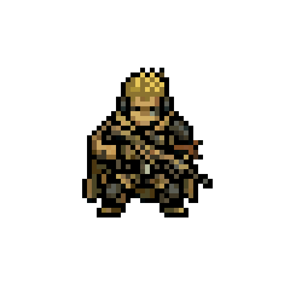

# The Veil Codex — Unified World Bible
 The Veil Codex — Unified World Bible

### Second Reconciled Edition · canon CR3 · build CR2.1 · narrative NF2

## Table of Contents

**Book 0 — The Cosmic Order** · **Book I — Cosmology of the Veil World** (Three Tiers · The Eight Cast-Out Old Gods · Doctrine of Interlock) · **Book II — The True History** (Volumes I–VI · Master Timeline · Ops Watchboard) · **Book III — The Public History** (Reconciliation Doctrine · The Divine Era Account, annotated) · **Book IV — The Orders & the Modern Veil** (The Chronological Codex · RAV Archive Files · Echo's Preserved Fragments) · **Book V — Geography & Nations** · **Book VI — Personae** · **Book VII — Resonance, Magic & Technology** (Unified System · The Armory: houses, histories & philosophies — *full manuals & catalogs in the Operational Annexes*) · **Book VIII — The Game Layer** (SANDLINE: The Kestrel Campaign — *full game documents in the Operational Annexes*) · **Book IX — The Saga of Saint Felia** (Arc I: The Listening War · Arc II: The Open Rose · Arc III: The Memory of Light) · **Book X — The Raven Bestiary** (Three Wars Doctrine · Instantiation Gradient · The God-Touched · The Gutter Choirs · The Scarlet Arsenal · First Catalogue · The Loose Drawer) · **Book XI — The Civic Codex** (The King · The Government · First Minister Strand · The Faith of the Commons · Three Songs · Daily Life) · **Appendices A–E (Rebuilt)** · **Canon Changelog**

---

*Compiled from the complete project archive: four Codex editions, the Chronological Codex of the Veil Orders, the Unified Cosmic Order framework, three field doctrine manuals, the Whispers of the Veil campaign codex, the SANDLINE design document (as *Sand & Sorcery: Modern Warfare*), and four parsed lore analyses.*

## How to Read This Bible

Every entry inherits a canon status from the Master Catalog tagging system:

- **[C] Canon** — established in the source archive or ratified by ruling.
- **[G] Game State** — live gameplay data; true within the game layer, not narrative canon unless promoted.
- **[D] Dossier Candidate** — developed material awaiting full reconciliation.
- **[P] Proposed** — designed but not yet incorporated.
- **[X] Conflict** — incompatible versions existed; see the Canon Changelog for the ruling that resolved it.

New material created during synthesis (the seven new Old Gods, reconciliation doctrine, annotations) is marked **[R] Ratified** — approved by the world's author during the reconciliation of August 2026. One further tag exists: **[?] Unfiled** — permanently unexplained by standing ruling (MY1); entries so tagged have no patron, no class, and no pending theory, and proposals to explain them are declined, including from the world's own authors.

**Canon precedence [CR1, extended by SC1/EN1].** Where texts disagree:

1. **Explicit later rulings.**
2. **Dramatized scene canon** — for character interiority and moment-to-moment subjective experience only.
3. **Reconciled doctrine and authoritative event records** — for all external and metaphysical fact.
4. **Merged source prose.**
5. **Same-generation wording preference (R4)** — never against a later ruling.

Scenes do not overrule external fact: a character may believe something false, and the scene records the belief, not the cosmology. Source prose retained for voice or provenance does not outrank doctrine it contradicts.

**Design counterweights [NF2, extended QT1].** A fifth instance is on record and worth keeping in mind while drafting: against a Mhor working beneath Transit Pillar 91, a Raven Listener's runic gauntlet failed to null-adjacent interference and the containment was carried out with a brick. Thousands of years of harmonic doctrine, and sometimes the correct answer is a brick.

**Design counterweights [NF2].** The setting's central question is *when does stewardship become authorship* — not *are systems bad*. The second is a much worse question, and a world where every story resolves toward individual divergence will collapse into it. Canon therefore maintains deliberate counterexamples: institutions that preserve meaning better than any person could, obedience that saves lives improvisation would have cost, standardization defended by people who are right, and rules whose reasons are forgotten and which are still worth keeping. Four are load-bearing and marked in place. When drafting new material, assume the thesis needs an opponent.

**House style [CR1].** The setting's voice is archival lyricism — austere institutional language pierced occasionally by the strange, the funny, or the painfully human. *Occasionally* is load-bearing: roughly a quarter to a third of all prose should be plainly ordinary — logistics, smells, commutes, bad food, petty arguments — so that when a sentence lands like scripture, it still can. Musical metaphor is one register among several, not a reflex.

**Structural note.** This world sits inside a unified multiverse governed by the Cosmic Order (Book 0). The Veil world's *true* history is Book II; its *public* history — the deliberately falsified account taught within the Crown — is preserved in Book III with annotations. Both are canon: one as fact, one as artifact.

---

# BOOK 0 — THE COSMIC ORDER
*The frame above all worlds. Source status: [C], ratified as the supreme layer of the unified multiverse.*

The following framework governs every world in the setting, the Veil world included. Where local theology and cosmic truth diverge, Book I explains the relationship.

1
THE COSMIC ORDER - UNIFIED ORIGIN &
RESONANCE FRAMEWORK
A cross-world cosmology summary unifying the Source, resonance, the cosmic lattice, and Mos Dof
Anelcia into one internally consistent framework.
UNIFIED CANON REFERENCE
I. The Source
At the beginning of all things is the Source. The Source is the origin of existence, the foundation of
order, and the author of reality. It is not bound by time, space, or matter. It does not create through
physical labor or mechanical construction, but through perfect expression.
Creation is not built. It is spoken into being.
II. Mos Dof Anelcia - The First Expression
Mos Dof Anelcia is the first and perfect expression of the Source. It is not a cultural tongue, a
magical dialect, or an invented script. It is the language of creation itself: the first sound, the first
structure, and the operating logic by which reality comes into existence.
All reality is an expression of Mos Dof Anelcia.
III. Reality as Resonance
Because creation is spoken, reality is fundamentally harmonic in nature. Matter is stabilized
resonance. Energy is active resonance. Consciousness is interpretive resonance. Time is the
rhythmic sequencing of resonance. Existence behaves less like a machine and more like a symphony
held in ordered structure.
IV. The Cosmic Lattice
To hold resonance in stable form, the Source establishes the Cosmic Lattice: the architecture
beneath reality. The Lattice organizes dimensions, worlds, and temporal continuity. It is the hidden
framework that allows resonance to become coherent existence rather than undifferentiated sound.
V. Higher Intelligences - The First Shapers
Before mortal life emerges, the Source brings forth higher-order intelligences capable of operating
within the Lattice. Their role is to shape, develop, and steward creation. These beings interact with
resonance directly and therefore possess influence over matter, structure, and metaphysical
conditions.
VI. The First Fracture - Dissonance
At some point, some of these intelligences act outside alignment with the Source and attempt to
reshape reality according to their own independent will. This introduces dissonance: corrupted or
misaligned resonance. Dissonance destabilizes structure, distorts environments, and gives rise to
unnatural entities, anomalies, and fractures in the harmony of creation.
VII. Harmony and Dissonance
The central metaphysical tension of the cosmos is the opposition between harmony and dissonance.
Harmony is alignment with the Source and the life-giving order of creation. Dissonance is structural
misalignment, which produces decay, corruption, instability, and ontological distortion. In this
framework, evil is not only moral failure. It is also misalignment with the grain of reality itself.
VIII. Incarnation and Embodied Resonance
The Source is not limited to distant transcendence. Higher resonance can become embodied within
creation through mortal vessels or historical persons. Such figures carry disproportionate influence
over reality, often functioning as stabilizers, pivots, restorers, or disruptors. Different worlds interpret
these individuals differently, but the underlying principle remains the same.
IX. The Functional Nature of Mos Dof Anelcia
Mos Dof Anelcia is ontologically active. It does not merely describe reality; it causes reality. It is
perfectly aligned with truth and cannot function as a lie in the ordinary sense. It is musical as well as
linguistic, meaning that tone, rhythm, harmony, and intent matter as much as vocabulary. Most
importantly, it is universal and constant across all worlds, planets, dimensions, and timelines. The
name does not change because the language itself does not change.
X. Mortal Access to the Language of Creation
Mortals do not normally wield Mos Dof Anelcia in its full form. Most encounter only echoes of it
through music, poetry, prayer, liturgy, myth, or intuition. Rare figures recover fragments of its
structure and can produce localized effects in the world. True speech - the correct harmonic
expression of the language - is extremely rare and extraordinarily dangerous. At that level, one is no
longer merely performing magic, but participating in the fabric of creation.
XI. Silence as Counterbalance
If Mos Dof Anelcia is creation through sound, then silence functions as containment. Silence can
preserve, halt, seal, or suppress unstable expression. This creates a fundamental duality at the heart
of the cosmos: sound creates and alters, while silence restrains and preserves.
XII. Cosmic Memory
Reality remembers what occurs within it. Every event leaves resonant imprint. These imprints persist
through time, influence later events, and can recur as patterns, archetypes, or historical echoes.
History is therefore not merely a sequence of disconnected moments. It is layered with memory
embedded in the structure of the world.
XIII. Cyclical Manifestation
Because reality retains imprint, some structures recur across time and across worlds. These
recurrences may appear as archetypal roles, repeating historical pressures, or recurring offices of
existence. Cultures may interpret them as destiny, providence, pattern, fate, or calling, but they are all
expressions of deeper resonant repetition.
XIV. Dimensional Reality
Existence is not limited to one plane. It consists of multiple layers, worlds, or adjacent realities. These
may take the form of planets within one cosmos, parallel worlds, or overlapping dimensions. They are
normally separated, but they are not absolutely isolated.
XV. Boundaries Between Worlds
Between realities exists a natural boundary that preserves stability. Under ordinary conditions, this
boundary holds. Under unusual conditions, it can thin, weaken, or rupture. When that happens,
perception distorts, entities cross thresholds, and physical or metaphysical rules can become
unstable.
XVI. Misuse and Catastrophe
When beings misuse resonance or attempt to wield Mos Dof Anelcia without proper alignment,
precision, or moral fitness, they risk catastrophic distortion. Errors at deeper levels of reality can
produce temporal fractures, spatial instability, damaged memory, warped matter, and persistent
anomalies in the Lattice itself.
XVII. Reality Wounds
Severe metaphysical damage leaves lasting wounds in creation. These may become cursed regions,
sacred sites, temporal anomalies, mythologized ruins, or areas where the normal rules of space,
memory, and causality fail. Such places are not merely symbolic. They are scars in the architecture of
reality.
XVIII. The Present State of the Cosmos
Across all worlds, reality remains stable enough to sustain life and history, yet unstable enough to
fracture. Most people remain unaware of the deeper structure beneath existence. Nevertheless,
fragments of truth persist in religion, philosophy, myth, ritual, beauty, music, intuition, and miracle.
Earthly cultures and more overtly supernatural worlds differ mainly in their awareness and degree of
access, not in the underlying laws of the cosmos.
XIX. Final Unified Statement
All existence originates from a singular Source that creates reality through Mos Dof Anelcia, the
universal language of creation. Reality itself is harmonic structure held within a cosmic lattice, where
matter, energy, consciousness, memory, and time are all expressions of resonance. Higher
intelligences helped shape creation, but dissonance entered the cosmos through misalignment,
producing fracture and instability across worlds. Mortals encounter only fragments of the deeper truth,
yet in rare cases can interact with resonance directly. Across every setting, whether historical, mythic,
futuristic, or fantastical, the same universal structure holds: one Source, one language of creation,
one cosmos expressed through harmony, memory, boundary, recurrence, and risk.

---

# BOOK I — COSMOLOGY OF THE VEIL WORLD

## I.1 The Three Tiers of Divinity [R]

The Veil world's contradictory theologies are all true — each names a different tier of the same hierarchy.

**Tier One — The Source.** The supreme being of the Cosmic Order (Book 0): origin of existence, speaker of Mos Dof Anelcia, author of the Lattice. The Source does not administer worlds directly. Within the Veil world it is known only obliquely, in the oldest liturgies, as **the Highest God** — a name reaching past the world's own steward toward the summit of reality. When the harmonic act occurred that resulted in the birth of Anharas Il'Rien some fifty years before A.V. 0, it was the Source acting through Embodied Resonance (Book 0, §VIII): Anharas is an incarnation of the Source, not a creation of the Architect.

**Tier Two — The Architect.** The greatest of the First Shapers (Book 0, §V): the higher intelligence delegated by the Source to build and steward the Veil world's portion of the Cosmic Lattice. It was the Architect who created the Old Gods (~23 million years B.A.V.) as sub-shapers, who forbade them from touching mortal development (~6 million years B.A.V.), and who cast them out when they rebelled. All Codex references to "the Architect" remain exactly as written.

**Tier Three — The Old Gods.** Eight sub-shapers created by the Architect, each steward of one dimension of the Song. Their rebellion (~30,000 B.A.V.) was the Veil world's local instance of the First Fracture (Book 0, §VI): dissonance entering creation. Critically, the Old Gods rebelled against the *Architect* — most never perceived the Source at all. Their grievance, preserved in Echo Fragment 0-A ("We were stars once — flares in the Architect's breast"), is addressed one tier too low. This is the pantheon's tragedy: they warred against a steward, mistaking him for the summit.

## I.2 The Eight Cast-Out Old Gods [R]

*Each Old God is a triad: the aspect of resonance they were made to steward, the domain of creation that aspect shaped, and the sin that perverted both. The shared suffix -Vel is Mos Dof Anelcia for "of the Choir" — a name each kept in exile as both scar and claim. Sigils and containment protocols per Appendix E. Raven and Scarlet Inquisition field personnel: these entries are OMEGA-TRIPLE VEIL.*

### 1. Orra-Vel, The Voice We Were Denied [C]
**Resonance:** Utterance — the spoken tone. **Creation:** Language and the minds of mortals. **Sin:** Envy — he coveted the Word itself, the right to speak reality that the Architect reserved.
**Sigil:** An open mouth inverted, tongue rendered as a severed clef.
**Ritual hazard:** Subharmonic drift. His fragments propagate through *decoded speech*: to translate him is to admit him. Raven Tower's decoding of Echo Fragment 0-A is retroactively classified a containment breach.
**Containment:** No live translation of recovered fragments. Transcription by hand, by scribes rotated every seventh line, destroyed after cataloguing.

### 2. Threnn-Vel, The Meter That Would Not Turn [R]
**Resonance:** Rhythm — the tempo of the Song. **Creation:** Time, seasons, the beat of hearts. **Sin:** Sloth as *arrest* — he froze what he stewarded, hoarding moments, refusing the Song's command that all things pass.
**Sigil:** A metronome with no pivot.
**Ritual hazard:** Temporal loops, "early echoes," days replayed out of order. The Infinite North's time fractures — currently attributed solely to Seraphim Zero — match his signature. Division 13 carries a standing directive to test for Threnn-Vel residue in all Zone anomalies.
**Containment:** Metered chant at strict tempo; any operative who experiences déjà vu twice within a bell must withdraw.

### 3. Shai-Vel, The Chord That Would Not Release [R]
**Resonance:** Harmony — the binding of notes. **Creation:** Bonds: love, loyalty, gravity, the cohesion of communities. **Sin:** Lust as possession — she perverted binding into fusion, welding souls together that were composed to harmonize freely.
**Sigil:** Two interlocked rings crushed into a single ellipse.
**Ritual hazard:** Cults of enforced union; personality-merge anomalies. The Mirrorglade 3 "personality recursion" case (Ops Watchboard EN-IV-M3) carries her signature and has been re-flagged accordingly.
**Containment:** Operatives deploy in odd-numbered teams; paired deployment into her residue is forbidden.

### 4. Sael-Vel, The Line That Strayed [R]
**Resonance:** Melody — the theme and its direction. **Creation:** Paths, rivers, migration, destiny. **Sin:** Pride — he judged his own melodic line superior to the Composer's theme and rewrote fates wholesale.
**Sigil:** A stave whose single line departs the staff.
**Ritual hazard:** Prophecy corruption. Oracles within his residue speak futures that become true *because* they were spoken — the inversion of Mos Dof Anelcia's alignment with truth.
**Containment:** No Veil operative may repeat a prophecy heard in the field, aloud or in writing, until Scarlet review. Prophecies are contagious instructions, not information.

### 5. Mhor-Vel, The Rest That Devours [R]
**Resonance:** Silence — the space between notes that gives the Song shape. **Creation:** Endings, death, the mercy of rest. **Sin:** Gluttony — he turned the frame into the meal, devouring sound and unmaking what he was set to conclude.
**Sigil:** A fermata swallowing its own dot.
**Ritual hazard:** Zones of absolute acoustic null in which resonance-based magic, then memory, then matter thin away. **Seraphim Zero — the bomb that sang and left silence — is flagged in his file as a possible invocation rather than merely a weapon.** The Glass Wound is therefore a standing theological emergency, not only a strategic one.
**Containment:** The Veil does not enter true null zones. Perimeter listening posts only. What cannot be heard cannot be fought.

### 6. Rhen-Vel, The Answer That Lied [R]
**Resonance:** Echo — repetition and return. **Creation:** Memory, history, ancestry. **Sin:** Deceit — he returned every echo altered, forging the past inside living minds.
**Sigil:** Two facing waves, mismatched.
**Ritual hazard:** False-memory contagion through oral history. A standing OMEGA question the Council of Silence declines to minute: whether the entity **Echo**, crowned A.V. 2325, carries his name by coincidence, inheritance, or design.
**Containment:** All field testimony from residue zones is recorded twice, by separate scribes, and compared. Divergence is evidence of exposure.

### 7. Ghaur-Vel, The Crescendo Unending [R]
**Resonance:** Amplitude — the Song's force. **Creation:** Storms, fire, the might latent in matter. **Sin:** Wrath — he unbound loudness from purpose; power swelling for its own sake until shaping became shattering.
**Sigil:** A crescendo hairpin that never closes.
**Ritual hazard:** Cascade events. Any large release of harmonic energy within his residue risks self-amplification.
**Containment:** Scarlet doctrine: *never counter-sing; only dampen.* Force answers force in his presence, and grows.

### 8. Vess-Vel, The Thousand-Throated [R]
**Resonance:** Timbre — the uniqueness that makes each voice itself. **Creation:** Flesh, form, the distinctness of species. **Sin:** Covetous theft — she wore shapes that were not hers, blending what the Song composed as distinct.
**Sigil:** Eight overlapping silhouettes sharing one throat.
**Ritual hazard:** Chimeric flesh. Vess-Vel is the canonical origin of the monsters the Old Gods "created or unleashed." The Unmaking of the First Monster (Book II, Vol. I, Ch. 2.5) is retroactively the first Vess-Vel containment action in history.
**Containment:** Identity verification by tone-signature, never by appearance, in all residue zones.

## I.3 Doctrine of Interlock [R]

The Eight are not a list; they are a broken instrument. Utterance without honest Echo becomes propaganda. Rhythm without Silence becomes tyranny of time. Harmony without Timbre becomes assimilation. Amplitude without Melody becomes noise. Every catastrophe in the Veil world's history can be scored against which stewards' functions were present in corrupted form — and the Veil's deepest classified suspicion is that the modern era's anomalies indicate the Eight are beginning to *harmonize with each other* for the first time since the casting-out.

## I.4 The Empty Choir [R]

When the Architect cast out the Eight, he appointed no successors. He dared not: the rebellion had shown how easily an intelligence given stewardship of the Song could begin to mistake stewardship for authorship. The dimensions of the Song — utterance, rhythm, harmony, melody, silence, echo, amplitude, timbre — were left with no hands upon them. For thirty thousand years, creation ran *unsteered*: this is why the age before Anharas was an age of monsters, wild seams, and gods bleeding through curtains. The Choir was empty, and the instrument drifted.

The Source's answer was not a new choir. It was the **First Verse**.

When Anharas sang at his Vanishing (A.V. 450), he did not perform a miracle — he *installed* one. The Verse is a standing, **self-executing** harmonic ordinance — self-executing, not self-renewing: creation's stewardship, encoded and left running on the recorded authority of an incarnate God-King. It regulates all eight dimensions at once, without continuous direction — but not indefinitely without renewal of embodied authority. The **Crown glyph** above Ilreth is not a symbol of sovereignty. It is the Verse's visible anchor and interface, and the anointing of each King is the renewal of its executing authority. This is what the Shepherds mean by *the cycle*.

**Doctrine of the Two Crowns [CR3].** The glyph does not predict the King's death. It declares that the First Verse requires renewed embodied authority. Historically that renewal coincided with a death, an abdication, or a King who felt the Mark return and yielded — which is why the public theology reads it as a death-omen and the Raven does not. **A.V. 2325 is unprecedented because the Verse called for renewal while Osric III still lived.** He remains the civil King, lawfully reigning. Echo carries the metaphysical Crown, unanointed. Two crowns, one realm: not a succession ambiguity but a constitutional and theological catastrophe that no statute, liturgy, or precedent addresses — and the reason the Council of Silence has not minuted the question of what to do if the two ever disagree.

**Doctrine of the Irregular Cycle [CR1]:** early Shepherd writings described the Crown's renewal as returning "each quarter-millennium," and for the first cycles it did. The Raven's actuarial file shows the intervals shortening and irregularizing century by century — the broken number is not an error in the record but a *measurement of the Verse's decay*. Osric III's thirty-eight-year reign and the flickering, late arrival of the glyph in A.V. 2325 are the trend's terminal data points. The public theology still teaches two hundred and fifty years. The Raven teaches the graph.

The Twelve had gathered around Anharas at his crowning in A.V. 0 — interpreters, listeners, later tradition's "first Shepherds" — but it was the First Verse that transformed vocation into office: the Twelve were formalized that same year because a standing Verse still needs what any instrument left playing needs: **tuners**. The Shepherds do not steward the dimensions — no one will ever be permitted that again. They *listen* for drift and make corrections too small to be called power.

The modern crisis, plainly stated for OMEGA-cleared readers: the Verse is 1,875 years old. The Eight have spent all of them learning its edges. Every acceleration of anomalies, every Watchboard entry, is evidence of probing. The glyph's hesitation in A.V. 2325 was the Verse approaching authority-failure between Kings — and Echo did not restore it. She **amended** it: the first new note in creation's standing ordinance since Anharas. Whether the amendment strengthens the Verse or opens it is the question beneath the question of who Echo is. The Eight heard the new note too. This is the doctrine's final line, and the Listening War's first: *they are no longer probing a dead man's song.*

## I.5 The Echo Wound — Doctrine of Embodied Limitation [R — CR1]

Before the final verse, Anharas sang wrong (Book II, Vol. I, Ch. 4.5): a shelter meant for one breath became a city that moaned in sleep, and the children within still sing in tongues unknown. Under the Three Tiers this is not a contradiction of his divinity; it is its *meaning*. Anharas did not speak falsely — he spoke incompletely. The Source was perfect; the mortal vessel was not; and the Echo Wound stands as the first proof that Incarnation means *accepting* the limitations of embodiment rather than merely wearing them. A god who could not sing wrong would not have been mortal, and a Verse installed by such a god would not have needed tuners. The Wound is why the Twelve exist. The Church does not teach this. The Shepherds live it.

**Addendum (ruling TR3):** The Listening War is not a separate conflict from the events of the Whispers era — it *is* that era's hidden shape. The existential threat Felia Wynshade ultimately crosses the planes to confront is the Listening War's terminus, and it is she who carries Echo's story to its conclusion, and a step beyond it, to finish her own. Book IX holds the narrative canon: the war's engine is the Concord — the Eight in harmony at last, conducted from the Ninth Chair (ruling AR1).

---

# BOOK II — THE TRUE HISTORY
*The reconciled Codex, Volumes I–VI, union of all editions. [C]*

## VOLUME I – THE SONG BEFORE FLESH (Fully Expanded Edition)

| Timeframe | Event |
| --- | --- |
| ~23 million years before A.V. | The Old Gods are created by the Architect to shape the lattice of the cosmos |
| ~6 million years before A.V. | The Law of Noninterference: the Architect withdraws the Eight from direct stewardship of mortal development and forbids them to touch the emerging peoples |
| ~30,000 years before A.V. | The Rebellion and Casting-Out: after millions of years watching what they helped create grow without being permitted to touch it, the Eight break the prohibition, enter the mortal world, and are expelled beyond the ordered lattice |
| ~50 years before A.V. | The Highest God sings a single harmonic; Anharas Il’Rien is born of mortal woman | |
| Year 0 A.V. | Anharas is crowned at age 50; the Twelve gather around him — later tradition's first Shepherds — and the Kingdom begins | |
| Year 450 A.V. | Anharas sings the First Verse and vanishes at age 500; the Shepherd office and the Cycle of Kings are formalized; the theological principle later named the Veil begins |

Chapter 0: The Rebellion of the Old Gods (Expanded)

Echo Fragment 0-A — “The Voice We Were Denied” *[Recovered from Orra-Vel subharmonic field drift, decoded by Raven Tower]*

*We were not born in shadow.*
*We were stars once — flares in the Architect’s breast.*
He gave us purpose: to shape, to sing, to ignite life.
And when the first breath of soil-born blood rose,
He turned from us.

He said: “Do not touch them.”

For millennia we watched.
We saw the crawling ones learn fire.
The soft ones break stone.
The clever ones cage each other in thrones.

Still — He would not let us speak.

So we stepped through the curtain.
We bled into their rivers.
We walked their dreams.

And when we roared upon the world, it remembered fear.

But He — He did not raise His hand.
Instead, He made a child.
One born of sweat, and fire, and mortal blood.

He named it love.
And sent it to kill us.

We, the old, were cast once more into void.
And from that child’s silence, came a song that still bars our name.

Chapter 0.5: The Era of Watching

When the Old Gods were bound, the world fell into a silence that could still be heard.

Mortals crawled into firelight and sang of things they didn’t understand. Cities rose from superstition, gods were drawn in charcoal on cave walls, and dreams of balance outpaced the language to contain them.

This was not innocence. It was observation. And it shaped the first minds that would one day recognize Anharas — not because he was divine, but because he sounded right.

Chapter 1: The Child of Resonance

From the divine silence came Anharas Il’Rien.
He was not made of prophecy, nor carved of flame.
He was born of a mortal woman, whose name has been struck from the Records to preserve balance.

He was the first to carry resonance not as echo — but as origin.
He was proof that the mortal form could hold the architecture of heaven.

His eyes shifted from bronze to silver depending on the soul who beheld him.
He sang a moth to death at six.
He reversed a plague at nine.
He asked why gods did not speak at twelve — and the world gave no answer.

He never wept. But he once stood for three days in a field of burning sand and simply listened.

And the wind stopped to hear him breathe.

Chapter 1.5: The First Footfall

Anharas’s first true act was not a miracle. It was a silence.

A woman screamed over her child’s grave until the earth echoed her pain back. Anharas stood beside her and placed his hand on the soil. The scream folded backward.

The mountain has not echoed since.

Chapter 2: The Twelve That Heard

Not all followed him.
Only twelve.
They did not kneel. They listened.

Each came from a different tribe. A different pain.
They were not warriors or scholars, but *interpreters*.

They heard the unspoken in his breath.
They studied the pauses between his footsteps.
They began to hum — not their songs, but his silence.

Time reshaped them.

One aged backward.
Another learned to smell truth.
A third ceased casting a shadow.

They did not ask to be made Shepherds.
They became such by standing too close to divinity for too long.

Each was changed by resonance:

- Calmaron saw patterns in the stars that had not yet formed.

- Yareen wept at every lie, even the ones not spoken.

- Orrun the Unnamed was struck mute, but when he breathed, glass sang.

- Thalen Mirecourt watched, and would go on watching for eons.

They were not siblings, nor equals. But they were aligned. They lived — and still live — outside time as most understand it.

When they spoke to each other, birds fell silent. When they gathered around the child of resonance, the world curved slightly inward.

They were the first line of harmonic containment. They became the Shepherds.

Chapter 2.5: The Unmaking of the First Monster

Born from reversed prayer, the creature that hunted in spirals spoke in children’s voices and bled sap that scalded.

Anharas entered its grove and spoke the name it had never given.

It shattered.

He returned barefoot, carrying a single petal that glowed for one night before becoming dust.

Chapter 3: The Founding of Ilreth

Anharas did not rule from a throne. He ruled by presence.

He walked the cities of Anelcia without retinue, slept beside the sick, and listened longer than he spoke. He refused to elevate himself by title or spectacle — instead, his law was carried in resonance. When he disapproved, crops failed near the offender’s home. When he blessed a decision, birds nested in the rafters.

He spoke to children first. Then scholars. Then kings.

When famine struck the east, he stood in the rain for three days and murmured the names of every empty belly. Wheat grew from tile.

When a governor betrayed a treaty, Anharas placed a single glass bowl on the Council table and left it empty. The traitor resigned within the week, haunted by his own echo.

He served not with sword or seal — but with harmonies embedded into the heartbeats of his people.

They did not call him King.

They called him *the Sound That Guards.*

Anharas walked the world in silence.
Monsters born of Old God spite fell to ash when near his breath.

Warlords did not kneel — they fell asleep mid-threat.
Entire armies wept at his arrival.
He healed one man by listening to him die.

He called nothing a kingdom.
But where he walked, roads formed.
Languages aligned. Tribes set down weapons.

In the center of the fractured continent, he placed no throne — only a circle.
A star-stone dais. A place where sound returned from the sky.

He named the land Ilreth — not after himself, but from the Mos Dof Anelcia phrase for “centered breath”.”

He did not name an heir. He left only his breath behind.

Chapter 3.5: The First Dais

The workers built the star-stone circle before knowing why. When Anharas stood on it, the trees bowed slightly inward.

No one remembers who ordered it built. But it rings once each century when the sky marks the King.

Chapter 4: The Ascension

At age five hundred, Anharas stood on the dais.
The Twelve surrounded him — not protectors, but witnesses.

He sang.

One verse.
Just one.

The Mos Dof Anelcia vibrated in response.
It is said the stars slowed. That time paused. That death itself forgot its name.

When the song ended, Anharas was gone.
No trace. No word.
Only his cloak remained.

The First Verse had been sung.
And from that hour, the world could not be unwritten without first answering the Song that held it.

Chapter 4.5: The Echo Wound

Before the final verse, Anharas sang wrong.

He attempted to raise a shelter with a single breath — and built a city that moaned in sleep.

He walked away. The walls collapsed. The children within still sing in tongues unknown.

Chapter 5: The Shepherd’s Vow

Three days passed. The Twelve stood silent.

Then a glyph appeared in the sky — visible only to them.
Not light. Not fire. Sound made visible.

Then Calmaron spoke:

*“When the Crown passes, the Sky shall mark the child.*
*From low blood shall rise high voice.*
*And every two hundred fifty years,*
*we shall bind the soul anew with those who came before.”*

This was not prophecy. This was pattern.
The beginning of the Cycle of Kings.

And the beginning of waiting.

Chapter 5.5: The Shepherd Who Lied

One of the Twelve spoke something no Shepherd should: a prophecy the others refused to believe.

He walked into the Rift before it existed, returned humming, and disappeared.

Some say he remains in shadow during harmonic storms.

Chapter 6: The Veil Foretold

Before his final breath, Anharas said one thing.
Only the Shepherds heard it.

*“A veil shall guard the tongues of Heaven, until the world is ready to hear.”*

And thus was born the concept — not of secrecy, but of stewardship.
The Veil was not founded. It was declared.
It would one day become Orders, Councils, and Agents.

But first, it was a promise.

And for five centuries, the world forgot to listen.
Until the sky marked a child once more.

*Volume I complete.*

## VOLUME II – THE ORDERS IN FLOWER (Final Corrected Sequence)

*Timeframe: A.V. 0–600*

*As reconstructed from Choir-bonded testimonies, field rites, broken citadel stones, and the whispers of the echo-field.*

Chapter 1: The Flame That Took Root

Though Anharas vanished from Ilreth, his resonance remained.

Where he had walked, the soil still whispered. The sick heard music in their sleep. Wildflowers bent to face a dais long since empty. Even beasts circled his absence.

The Shepherds did not replace him. They preserved him — by shaping silence into form.

From this the Silent Rose received its second purpose. *(Ruling CR3: the Order was founded within the first generations of Anharas's reign as the Crown's first knightly custodial order — Cale Varin joined it in A.V. 50, and it campaigned in A.V. 142. The Vanishing did not create it; the Shepherds remade its charge. Where the Rose had guarded the living King, it would now guard the silence and the Verse he left behind — an institution outliving its own purpose long enough to be given another, which is the Veil's story in miniature.)*

Twelve knights were chosen. Each was brought alone to the star-stone dais and exposed to harmonic recitation — not words, but tone. If they did not weep, they were turned away.

Those who remained were marked with resonance scars. No visible wound, only an ache that deepened during lies.

Their charge: to bind what the King’s song had yet to seal.

They built nothing. Their first action was to erase a ruin still echoing Old God screams. It was gone in a week. The people called them saints. The Shepherds said nothing.

Chapter 1.5: Founding Rituals of the Silent Rose

Each knight was not merely chosen — they were tempered. The Rite of Bloomed Stillness was performed by three Shepherds. No words were spoken. A shallow bowl of silver rootwater was placed before the knight. They were required to still their heart rate, through breath and intention, until the bowl no longer rippled. Only then would the Shepherd press a scarless mark into their chest.

Knights who failed to control their resonance — even if they were brave, devout, skilled — were redirected to forgotten cloisters. Some became Vine agents in later centuries. Others simply disappeared.

Their final rite was the Planting of the First Thorn — a symbolic wound placed over the sternum. Not physical, but harmonic: a signature of potential grief.

Chapter 2: The Order of the Silent Rose

Their name was earned.

Each knight planted a thorn in their chest, magically sustained but never healing. When they died, the thorn bloomed — an offering to the field where they fell.

They wielded no sigils, only blades inscribed with lived memory. A knight’s first kill was tattooed onto their hilt. Their last word was carved beneath it by comrades.

The Rose Bastion at Dath Morn was grown, not built — grown from black glass and bone-root brought from the Rift edge, sanctified by a triple-circle Shepherd rite.

Each week they recited the Litany of Stillness:

*“Let not the blood sing.* *Let not the mouth instruct.* *Let the heart remain drawn but quiet.”*

Field deployment was swift. Reports do not speak of tactics. They speak of stillness. Villages said they arrived as mist. Only silence remained.

Chapter 2.5: Liturgies of the Thorns

Fragmented entries from the Order’s early memory scrolls (later encoded into Raven’s Black Chronicle):

*“A blade without memory is only weight. A blade with memory is judgment.”*
*“Do not name your pain. Let it grow unseen. Let it flower only in the dark.”*
*“If you see a Shepherd, kneel. If you hear a Shepherd, flee. If you feel a Shepherd, you are already changed.”*

The Order recited seven silent stanzas at dawn. Not songs, but breath patterns. Their combined field rhythm was said to ward off latent Old God echoes in cursed battlegrounds.

Chapter 3: The Petal and the Sword

From declassified Knight-Ledgers:

- Sir Veylan the Rune-Seared: Once walked blind into a hall of inverted mirrors. Returned humming the inverse name of a demon. His eyes became gray flame.

- Rosan of the Petal Choir: Her harmonies healed sleep-madness. Her last words: *“Even death deserves a lullaby.”* Preserved on glass scroll, still illegal to replay.

- Sural Dain: Called “Steel Walker.” Reached the ruined sun-keep of Rav Hekar alone. Retrieved a relic carved in bone-syllables. Never spoke again.

- Alen Kaer: Youngest knight. Once offered his name to a dying angel. That angel lives, and Kaer is remembered only through the tone of his blade.

- Thalen Mirecourt: Never knighted formally. Marked by the first King. Present at every early Compact. His voice is cited in 78 forgotten events.

Field hymns cite 117 knights lost in unnamed locations. Their deaths were never recorded. Their echoes are.

Chapter 3.5: The Choir War Journals

Recovered personal journal, knight unknown:

*A.V. 197. We approached the city of Tharn via the shadow bridge. The fog sang. The fog sang. The fog sang. I could not find my name for seven hours. The others said it aloud until I remembered.*

*The beast wore a woman’s face. It said my brother’s name in the voice of my mother. I killed it. I don’t know if it was the beast.*

*We burned the entire house. It wept black birds. I wrote this down so I remember it was real.*

Chapter 4: Wars Without Songs

Ilreth expanded. The Crown grew — but not through conquest. Through containment.

In A.V. 142, beast-tribes under a false moon banner invaded the valley cities. The Silent Rose sent four knights. One returned — whispering in reverse, his skin covered in braided hair he could not remove.

The Raveline Collapse (A.V. 179): The Rose waged a seven-year war in silence against a city governed by a disembodied crown that chose new rulers nightly. The final battle left the river permanently silent.

During the Bleeding Moon Crusade (A.V. 275), six cities were consumed by mirrored dreams. Choir-seers attempted to counter-sing the dream back into sleep. One succeeded, but went blind and sings through others now.

Every victory was a containment, not a conquest. The Order’s silence became law.

Chapter 5: The Siege of Thorns

A.V. 570. The Cloister at Dereth falls.

Halver Dravane, once Choir-Master of the 9th Harmonic Host, declares:

*“The echo must sing again. The rose has grown roots in rot.”*

Dream-senders under his command infect 113 field captains. 41 defect. 72 perish.

Dravane leads the new choir in inverse song — sacred tones rewritten backwards. Stone fractures. Walls sing. Mirrors reflect screams.

Caer Vornis, last Grandmaster, walks into the flame alone. He carries the Thornblade, a sword dipped in four angelic deaths.

He speaks once:

*“Let silence bloom in ruin.”*

The flame recedes. The echo does not. The Rose is dead.

Chapter 5.5: Echo Wounds of Dereth

Not all who heard Halver Dravane’s heresy died. Some survived — touched, twisted, but intact.

These echo-wounded agents were locked in harmonic suppression chambers beneath what would become the Raven’s first Tower.

Their affliction: involuntary prophecy. Whenever they slept, they sang.

One remains:

*Designation: Seraph 9-Echo*
*Kept beneath the Glass Well, Arclight Sprawl.*
*Still hums when the Rift stirs.*

Chapter 6: The Tribunal Compact

Seven captains. One blade. Vornis lays it at the black altar of Dath Morn.

He speaks not a vow but a command:

*“If song deceives, then silence must observe. From silence, new Orders rise.”*

Three Orders are forged:

- Steel Rose: direct action, black-ops harmonic warfare

- Scarlet Inquisition: occult combatants and containment field agents

- Raven: intelligence, memory protection, harmonic prophecy preservation

Each sworn beneath the Ark of Kept Light. Each severed from public memory. Each designed to prevent another Rose.

For the first time, the word Veil appears in code:

*“Let the Veil hold the crown while truth regrows.”*

Chapter 6.5: The Vow That Divided

During the Tribunal Compact, one captain — name lost — refused to kneel.

*“We need not new Orders. We need old silence.”*

He left before the oaths were sworn. The Raven tracked him to the north, where he founded a splinter doctrine.

That bloodline would go on to form the Order of the Silent Crescent, a rogue sect believed extinct.

They are not.

Chapter 7: The Orders in Bloom

Steel Rose reforms from 70 surviving loyalists. They operate without uniform, without name. Their Grandmaster is Vornis — silent still.

Scarlet Inquisition emerges from exile-monks and war-cursed. They train in echo-tempered chambers, where no scream escapes. Grandmistress: Talia Veyr, who survived three possessions and walks with a chain of names.

Raven rises beneath the Hall of Folded Glass. Its founder, Solan Orr, speaks once per year — in reverse. He builds the first echo-vault.

By A.V. 600, none outside the Orders know their names. But cities recover. Beasts vanish. Prophecies begin again — rewritten, adjusted, contained.

Chapter 7.5: The Day the Raven Sang

On the day Solan Orr completed the MirrorNet foundation stone, a song was heard in the lower halls of the Raven Tower.

No one wrote it. No one remembered hearing it — but four operatives recorded matching fragments independently.

It is considered the first evidence that the Raven Tower itself has harmonic memory.

Chapter 8: The Council of Silence

One Grandmaster from each Order. No crown. No hierarchy. Only oaths.

The first ruling:

*“The world need not know the Veil exists. It need only forget that it ever sang.”*

The Council does not write minutes. It remembers tone. It meets at irregular intervals — every 17th harmonic recurrence.

Its purpose: preserve the resonance of Ilreth. Its vow: contain the consequences of truth.

*Volume II complete. The Veil is born not from obedience, but from resonance remembered.*

## VOLUME III – THE HIDDEN CENTURIES (Canon Volume)

*Timeframe: A.V. 601–1983*

*Reconstructed from White Chronicle traces, Raven encoded memory scrolls, and field silence pattern reconstructions. This volume is considered unstable by the Glass Tower and should be read only in sealed harmonic containment.*

Chapter 1: The Veil Thickens

Following the Council's foundation, the Orders vanish from history. Their works continue, but the names change. The Scarlet Inquisition becomes a line item in Crown ledgers called “Sanitation Divisions.” The Raven renames itself internally every 100 years.

Yet echoes speak: of monsters destroyed in cities never marked, of echoes silenced before they could bloom, of rogue crowns that vanished before coronation.

Each Order maintains its domain. But their leaders begin to blur — Orders cross, fuse, divide, collapse and reform again. By A.V. 901, only 34 operatives worldwide know the full Veil structure.

The world grows peaceful. But too quiet.

Chapter 2: Whispered Wars

Between A.V. 1010–1450, six wars occur. None are named. None are remembered.

But Veil entries tagged Blue Song Drift spike. Crown documents from those years are heavily redacted. Citizens born in that span have statistically higher rates of déjà vu.

What is known:

- One war occurred entirely within a dreamline fracture field.

- One took place within 13 minutes of subjective time.

- One war ended before it began, yet cost 1,900 lives.

Field agents refer to this era as the “Lost Bloom.”

Chapter 3: Return of the Old Blood

Around A.V. 1533, Old God sigils begin reappearing in graffiti, in fever-dreams, and in inverted musical scales. A child is born who speaks only in Mos Dof Anelcia, then disappears.

The Scarlet Inquisition reactivates containment protocols. They trace a glyph trail that leads beneath the capital of Ilreth — and find a being made of memory: one who remembers the voice of Halver Dravane.

It says:

*“The echo never faded. Only the audience left.”*

The being is sealed in saltglass. To this day, it hums beneath the Crown Archives.

Chapter 4: The Calming Century

By A.V. 1700, a new age dawns: roads connect continents, aerial travel is made stable by rune-rigs, and the old scars of magic are covered in marble and code.

But the Veil remains busy. Fewer beasts — more humans breaking. Psychic resonance events tied to urban crowd density increase. The Orders adapt:

- Steel Rose becomes surgical.

- Scarlet uses drones.

- Raven begins AI-harmonic crossfiltering via MirrorNet.

Still, the world grows modern. Quiet. Safe.

Chapter 5: The Poisoned River

By A.V. 1901, the geopolitical balance was fragile. North of Ilreth, in the heavily forested highlands of Tarkesh Vale, a vision began to take root. Grathul Mokh’tar, an orc shaman who had studied abroad, returned home after witnessing the Crown’s suffocating influence across its satellite nations.

He saw puppet kings, subsidized dependency, cultural erasure through trade pacts and 'harmonic assistance' programs. He understood what was coming.

Grathul began a movement.

He unified the fragmented mountain clans. He invited foreign engineers, scientists, and economic strategists. He promised sovereignty, dignity, and modernity to a people long dismissed. Within a generation, a new nation emerged: The Caliphate of Iron Roots.

They developed hydroelectric power. Organized a defense force. Began aircraft prototyping. They refused Crown trade standardization. They opened embassies, issued their own currency, and formalized a non-aligned economic pact with minor desert and highland states.

The Crown Reacts

Diplomatic efforts failed. The Crown’s advisors feared not invasion, but inspiration. If the orcs could modernize without the Crown’s song, others might follow.

The King authorized a covert sabotage initiative. Not through Veil operatives, who were deemed too precious to risk exposure, but through the Royal Directorate of External Operations (RDEO) — the Crown’s known intelligence branch.

RDEO agents attempted to kidnap foreign advisors, disrupt dam construction, incite tribal conflicts, and infiltrate Caliphate guilds. They failed. Caliphate security rooted out or neutralized every campaign.

In frustration, the King summoned the Council of Silence. He ordered the Veil to develop a field-deployable harmonic weapon.

*“Strike the river. Starve the grid. Leave no trace.”*

The Veil objected. The bomb, codenamed Emberwake, required precise field harmonics to align its resonance cascade. The Veil argued only their operatives could deploy it safely.

The King refused. RDEO would handle it.

The Day of Screaming Water

The RDEO operative, unaware of the Veil’s existence, believed he carried a prototype geological weapon. He did not understand the tonal alignments. He miscalibrated the harmonic priming phrase.

The bomb did not divert the river. It poisoned it. The river screamed. Boiled. Reversed. Then cleared.

Downstream, in the Kal’Reth birthing grounds—where young orcs grow in submerged life sacs—10,000 unborn and 6,000 young died.

It became known as:

The Day of Screaming Water

The Caliphate declared war.

Orc armies surged across Crown-aligned borders. Border towns fell in weeks. The eastern Confederacy of beastfolk sent advisors. The Mountain Sultanate expressed support. The desert elves supplied medical and industrial support to the warfront.

The Crown mobilized its full military — the first time in six centuries.

Veil operatives were activated behind the scenes: Steel Rose assassins, Scarlet Inquisition strike teams, Raven containment codices. Targeted strikes eliminated command relays, disrupted signal harmonics, and sabotaged forward operating bases.

But the orcs would not yield. They were not just avenging their dead. They were making a point. They were proving that silence did not equate to safety.

Chapter 6: The Song That Burned

With the war escalating beyond all control and the orcs’ resilience defying military predictions, the King issued a final directive to the Veil:

*“End it. End it so thoroughly that it will never be tried again.”*

What followed was the commissioning of a forbidden weapon—one the Raven Tower had theorized but never dared construct: a harmonic choir detonation device known as Seraphim Zero.

Design and Risk

The bomb would not burn. It would not blast. It would sing.

Constructed from a choir lattice of resonant crystal embedded with inverted Mos Dof Anelcia, the weapon would rupture not only physical space, but memory, time, and sound. It would create a wound in reality where resonance itself would fail to hold.

Its target: the capital production hub of the Caliphate—known to house military assets, but also hospitals, archives, and generational memory sites.

The Veil opposed its use. The Raven calculated a 32% chance of irreparable reality fissure.

The King invoked Sovereign Silence and overruled them.

Kael Tharanis

Kael Tharanis, an elite Scarlet Inquisition operative, had executed hundreds of harmonic incursions. But upon reviewing the Choir Bomb’s deployment parameters, he broke his chain of command.

He defected.

Kael crossed the border carrying an encrypted Veil resonance codex, a half-sketched harmonic detonation schematic, and a crystalline trove containing over 40 years of orc scientific, social, and industrial research.

He warned the orc leaders. He gave them one final gift:

*“If we cannot stop the song, then let what you’ve made survive it.”*

He handed the trove to operatives from the Mountain Sultanate, the Eastern Confederacy, and the desert elves—all historical rivals of the Crown. In those archives lay encoded harmonics, war theory, survival protocols, and the foundation for autonomous modernization.

Then, as Seraphim Zero ascended above the forest line—Kael vanished.

Detonation

The bomb did not strike. It descended singing.

The Choir ignited in midair, emitting harmonic frequencies at such intensity that all acoustic memory within a ten-mile radius collapsed.

Trees evaporated. Magic folded. The orc city simply ceased.

A rift opened where it had once stood. From it grew a crystalline growth field fused with temporal anomalies and melody-stained echoes.

The region would come to be known as:

The Glass Wound.

To this day, no song carries within it. Even the wind forgets its direction.

Kael Tharanis was never seen again. Some say he entered the Wound. Others believe he watches still, unnamed, from its edge.

What is known is this:

- The war ended.

- The Crown stopped advancing.

- The world, for the first time in centuries, remembered to be afraid.

The Veil recedes. Regroups. The world rebuilds. The forest to the north becomes infinite. Erevale is born as a hub city. The Veil watches.

And in the Rift… something begins to hum.

*Volume III complete. All that was hidden now echoes.*

## VOLUME IV – THE WOUND AND THE ASCENDED

*Timeframe: A.V. 1984–Present*

Chapter 1: The Ascension Protocol

The defection of Kael Tharanis shattered more than a command chain — it fractured faith. If the Veil's most precise instrument could abandon the Oath, then no field veteran could be fully trusted again.

Historically, operatives were drawn from exceptional adults: mages, soldiers, saboteurs, savants. But that model assumed loyalty could be taught.

In A.V. 1984, the Council of Silence enacted Directive 17-Singularity.

From now on, a new class of Veil operatives would be raised, not recruited. *(Reconciliation note CR1: Directive 17-Singularity created the Ascended operative class — concentrated in Division 13 and the most sensitive Steel and Scarlet functions — while traditional adult recruitment continued throughout the wider Veil. Serin Veyra is a recruit; Felia Wynshade is Ascended; and Serin's raising of Felia as a daughter was a quiet, sustained violation of everything the Protocol intended.)* They would be taken as infants from orphanages, conflict ruins, and Crown wards, screened for resonance compatibility and cognitive elasticity. These children were anonymized and raised within hidden facilities known only as Ascension Enclaves.

By age six, they could disassemble spell-locked chambers. By twelve, they understood mnemonic extraction and counter-song discipline. By eighteen, they knew no name but code, no home but mission.

Ascended operatives did not doubt the Veil. They were the Veil.

The public never knew. The RDEO never suspected. Even the King received only curated clearance packets.

The Veil became truly silent.

Addendum: The Divisional Doctrine & Birth of Division 13

*Filed under Council Directive SIL-84-Δ | Compiled from the notes of Shepherd Thalen Mirecourt.*

In the century after the Ascension Protocol, the Veil turned inward. The Ascended agents—perfect, loyal, and unflinching—required a new lattice of command: one not of faith, but of function. Thus arose the Divisional Doctrine.

Where once Orders sang in parallel, they were now partitioned into Thirteen Divisions, each mirroring a fragment of the Veil’s original harmonic field.

- Divisions 01–09: governance, theology, logistics

- Divisions 10–12: surveillance, memory, denial

- Division 13 (unnamed in public ledgers): *“Enter where resonance breaks.”*

Founding Location: *Mirror Sector Command*, seven levels below the Eclipsera transit grid; redesignated Arclight Sprawl / Megacity Sector-09 following the A.V. 2149 metropolitan consolidation (ruling CR3 — the Command predates the designation and never moved).
Cover Designation: Metropolitan Civil Resilience Authority, Emergency Infrastructure Bureau.

Division 13 fused Steel Rose precision, Scarlet Inquisition containment, and Raven memory discipline. Its early handlers—drawn from Raven’s psychometric corps—were tasked to monitor unmapped subharmonic entities.

Among them was Serin Veyra, a Raven archivist re-assigned to operational command after surviving a MirrorNet collapse. Her new mandate: coordinate field operations for operatives exhibiting *resonance irregularities*.

Whispers spread of an unseen pattern behind these anomalies—an ancient dissonance stirring again. Thalen Mirecourt, oldest of the Shepherd Council, recorded quietly:

*“The oldest choir was silenced, not slain. When their echoes learn to eat, they will call themselves Dominion.”*

Thus the first modern references to the Harmonic Dominion entered Veil archives—disguised as myth, tagged as “unverified metaphysical contagion.” Division 13 was ordered to investigate.

*Chapter 2: Erevale and the Infinite North*

*After Seraphim Zero detonated, the northern borderlands did not recover — they rewrote themselves.*

*The landscape fractured and unraveled, stretching into impossible geometries. Forests grew inward. Echoes replayed days too early. One scout entered a glade at noon and emerged two weeks before she left.*

*This zone, now known as the Infinite North, absorbed the remnants of the Caliphate and extended into Rift-warped terrain no cartographer can map twice. Spellcraft fails. Divination returns static. Even mechanical compasses spin.*

*The Veil classified the region Black Echo Priority and sealed all references in Crown records.*

*Survivors, salvagers, and myth-chasers trickled toward the region — drawn by dreams, rumors, or the promise of forbidden knowledge.*

*At the edge of this uncharted space, a railway junction-turned-frontier outpost grew into a city:*

*Erevale.*

*It became the last city before the Wound. A place where mercenaries, seekers, scavengers, and contraband theologians passed through. And the Veil? The Veil built a shop.*

*It was nothing more than an outfitter and guide service on the surface. It offered maps that were always wrong, guides who never returned the same, and weapons not listed in any Crown registry.*

*Beneath it: a full Veil operations nest. Division 13 command. Echo-archive nodes. Whisper containment caskets. Active harmonic shielding.*

*Erevale became a listening post — and, perhaps, a staging ground.*

*Veil analysts observed ritual harmonic blooms that matched Old God residue but twisted into entirely new frequencies. Children born in Erevale hum patterns unknown to even Shepherds.*

*For in the furthest parts of the infinite forest, scouts reported hearing something once thought impossible:*

*A song. One never written.*

Chapter 3: Kael in the Wound

No confirmed sightings followed Kael Tharanis’s disappearance into the Glass Wound.

But anomalous data persists.

Raven Tower recorded a subharmonic pulse three days after detonation — the same frequency once used by Kael during field meditations. Weeks later, a desert elf diplomat received a letter made of folded sound paper. It bore his old codename, Scion Echo, and contained coordinates.

Three rogue operatives followed them. Two died. The third emerged mute but etched with sigils that change every morning.

It is now theorized that Kael did not perish — he ascended.

Within the Wound, where history, self, and resonance no longer obey fixed law, Kael may have integrated with the fractured harmonic lattice. Some theorists believe he serves now as a living filter, damping further reality collapse. Others suggest he is building something.

The Raven refer to him in sealed files only as:

The Witnessing Engine

All Veil operatives are instructed:

*“If you hear your own voice singing — do not follow. It may not be you. And it may not be alone.”*

Raven Tower File — Classified Memorandum: Infinite North (Echo-Red Clearance)

Ref: RT-XENOPATTERN-AV2169-Δ∆ Seal: Triple Veil + Signature Fold Verification Required

Status Summary:

- 17 harmonic pulse anomalies recorded in the last 12 months near Erevale’s northeast threshold

- 3 recovery drones lost; telemetry indicates mirror-splice duplication event

- 1 Veil scout returned with fragmented personality layers, each encoding a different historical timeline

Unstable Song Fragments (recorded by listening capsule S-9):

*“We are the memory you abandoned.”*
*“He hums in glass and grows in pulse.”*
*“Let the forest forget you. It never knew you truly.”*

Agent Advisory:

- Do not attempt psychic resonance inside Zone VI

- Do not harmonize any standing stones or anomalous root formations

- If you encounter a human in full Veil attire bearing your name: retreat

Field Priority:

- Locate origin of the subharmonic bleed

- Confirm or refute Kael Tharanis's persistence signature

- Establish whether the Wound is static, expanding, or coalescing

Report Ends

## VOLUME V – THE MARK THAT HESITATED

*Timeframe: A.V. 2325*

Chapter 1: A Sky Without Signal

For the first time in recorded memory, the Crown constellation did not rise on schedule.

In the night sky above Ilreth, the harmonic glyph that marks the coming of the King — a resonance that had once returned at something close to quarter-millennium intervals, and had been arriving at shorter and stranger ones for centuries — appeared late even by the new, failing measure. And when it did, it flickered.

The Shepherds, who had waited in vigil for nine days, sang no welcome verse. They simply watched.

The Crown glyph wavered. Split. Echoed itself. Then stabilized. But not in its traditional locus.

It had shifted. Slightly — but undeniably.

The Cycle of Kings, uninterrupted since the Ascension of Anharas, had hesitated.

Chapter 2: The Child Beneath the Clock

The Shepherds dispatched ten Choir Blades and one Fold-Walker into the urban canopy of Ilreth’s modern sprawl.

Their instructions:

*“Find the Mark. Find the Breath. And do not presume it will be where we last left it.”*

Three days later, they located the resonance field. It came not from the spires of the High Sanctum, nor the echo-vaults beneath the Shepherd Courts.

It came from beneath a malfunctioning transit clock in District 13 — a flooded courtyard lined with vending machines and broken glass tiles.

A child was found there.

Unmarked by name, untagged by any Crown biometric. She spoke three languages. Her eyes shimmered with light that phased in and out of pattern.

She sang in her sleep. But not in Mos Dof Anelcia. In something older.

The Shepherds did not anoint her. They quarantined her.

But one phrase, uttered in her dreams, was recorded in five locations:

*“I remember being him. But I am not him. Not now.”*

And when asked her name, she replied only:

*“Echo.”*

Chapter 3: The Council Breaks Harmony

The Shepherds convened beneath the Ninth Dome of Patterned Silence. No witness was permitted beyond harmonic residue.

Arguments unfolded as overlapping chords. One Shepherd sang that she must be destroyed. One said she must be crowned. One refused to speak at all.

For the first time in 2,000 years, their melodies diverged. The Council of Silence fractured.

The Veil was notified under Protocol Rift-Divergence. But even among the Orders, opinions split:

- The Scarlet Inquisition proposed immediate extraction and preemptive exorcism.

- The Steel Rose requested full field observation and behavioral modeling.

- The Raven Tower declared the child a resonant singularity — neither King nor enemy, but possibly both.

While they debated, the child disappeared. Security footage showed static. Biometric sensors returned glyphs. A transit drone found her at the edge of the forest.

She had walked into the Infinite North.

No one followed.

Yet one new song entered the Archive:

*“I am not the King. But he remembers me.”*

Chapter 4: The Song Beneath Stone

Two weeks after Echo vanished into the Infinite North, a tremor was felt beneath Ilreth.

Not a quake — but a resonance event.

All Crown songliths flickered. Choir crystal arrays froze in place. In one case, a public clock tower recited a phrase from the Mos Dof Anelcia, in full, before shattering itself.

The origin of the pulse was triangulated to a forgotten structure beneath the city — long buried beneath transport strata and seismic protections: Sanctum Requiel.

Once a pre-Veil ritual chamber. Sealed since the early Silent Rose.

A Steel Rose strike team was dispatched. What they found was impossible.

A chamber lined with non-Crown metal. A sphere of stone floating above a pedestal of bone. It sang.

Not loudly. Not with words. But with memory.

*“There was once a king who sang wrong.”*
*“There was once a girl who remembered it.”*

Inside the sanctum, engraved in the oldest runic form of Mos Dof Anelcia, was a single command:

“HOLD.”

It pulsed once. Then the resonance fell silent.

The Shepherds have since refused entry. But the Veil hears rumors. The glyph glows again.

Shepherd Directive Log — Requiel Classification (Blue-Gold)

Filed by: Calmaron, 3rd Tone Witness
Encrypted Echo Tier: E7

Observation: The chamber’s activation correlates within 0.4 seconds of Echo’s northbound breach.

Tone Mapping Result: Glyph rhythm is *intentional arrest* — Mos root for “sustain without expansion.”

Predicted Harmonic Outcome if Ignored: 47% chance of resonance cascade failure across six sacred loci. 31% chance of pre-Verse compression — historical inversion beginning at Crown Point. 12% chance of autonomous emergence of Kingform Without Host.

Glossary: Kingform Without Host A theoretical phenomenon wherein the harmonic lattice, in absence of a crowned vessel, attempts to embody the throne’s resonance autonomously. It is believed this construct would possess cumulative memory of all past Kings — but without temperament, voice, or mortal constraint.

Referred to in sealed Raven scrolls as: “Throne Echo Incarnate.”

Indicators include spontaneous glyph duplication, autonomous prophecy loops, and resonance storms across tomb sites. If realized, Kingform Without Host is classified as Nonlinear Crown Emergence Event — Veil Tier Omega Black.

Interim Command:

- The glyph is to be monitored but not disturbed.

- Steel Rose operatives to maintain cordon.

- No song, whisper, or word is to be sung within 33 paces.

Final Note: We do not know whether the command HOLD is addressed to the stone, to the girl, or to the world. We do not know whether the command HOLD is addressed to the stone, to the girl, or to the world.

Chapter 5: The Echo Crowned

Five weeks after her disappearance, Echo returned.

She was found at the edge of Erevale — barefoot, eyes glowing, her breath in sync with the pulse of the forest behind her.

She said nothing. But every Veil harmonic relay registered a Crownmark tone signature.

She carried in her hand a thorn made of glass and memory. She laid it on the earth. And the glyph above Ilreth aligned.

Not where it had hovered before — but where she now stood.

The Shepherds arrived by dusk. They encircled her. But did not sing.

Echo opened her mouth. And the First Verse returned.

Sung not as it was — but as it had never been. A new note had entered the world.

The glyph stabilized. The Crown pulsed.

The Shepherds knelt. And none spoke the word King.

Only:

*“Let the cycle hold.”*

Veil Operations Memo — Echo Contingency Protocols

File ID: V-CNTR-2325-ECHO-G4 Access Tier: Veil Central Command Only Encryption Sig: Trifold Harmony Lock

Subject: Reinstated Observational Command on Entity Echo

Summary: The subject designated *Echo* has reemerged. All resonance fields stabilized upon her arrival. The Crown glyph has realigned, but at a nontraditional celestial locus. Harmonization occurred without Council anointment.

Immediate Orders:

- Steel Rose to maintain 1km perimeter patrol around Erevale’s harmonic threshold

- Raven teams to collect all post-appearance sigil drift and verbal anomalies

- Petal Bureau to flood regional networks with disinformation (falsehood level: moderate myth)

- Scarlet Inquisition will abstain from direct contact without triple confirmation from Shepherd chorus

Phenomenological Notes:

- Entity Echo’s breath registers Crown resonance without inherited imprint

- Glyph harmonics contain partial phrases from pre-Verse anomaly scrolls

- First Verse resung with unknown counter-harmonic — field-safe, but unpatterned

Strategic Status:

- Crownmark status: ambiguous but active

- Threat profile: nonlinear emergent

- Tactical posture: contain, observe, sustain

Final Directive:

*“Until the echo fades or reshapes, the world is no longer linear. We walk beside something that was once us, and may still be.”*

## VOLUME VI – THE VEIL BREATHES TWICE

*Timeframe: A.V. 2326–Futures Variable*

Chapter 1: The Silence That Watches

Echo has not spoken since the crowning.

She walks the streets of Erevale under no name, no banner, and no protection. And yet, she is never harmed.

Children hum behind her. Wolves do not bark near her. The Crown glyph pulses faintly with her every breath.

She does not command. But the world adjusts.

Veil operatives report spontaneous memory erasures near her shadow. One scout followed her trail for six days and came back without his mother’s name.

In one incident, a Veil analyst whispered the phrase *“She is not the King, but she is the question.”* Five minutes later, his harmonic field shattered.

And still she says nothing.

Only one message has been found, left etched in moss on a Veil field drone:

*“The Crown has a second breath. It waits for the one who listens.”*

Appendix Fragment — Tribunal Compact Translation (Mos Dof Anelcia)

*Karesheth Vol In’tena — Denek An’veri.*
*Vorel a’ven Echothra — Lethe Tel’kar.*
*Sil En’Vael: Doren Mar.*

Translated:

*“We do not speak our grief. We forge it.”*
*“We do not name the wound. We wear it.”*
*“And the Veil shall be our skin.”*

## Appendix Ψ — Master Timeline (source text)

APPENDIX Ψ — MASTER TIMELINE (Abridged v1.0)
See in-text anchors for full entries.
~23M B.A.V. Old Gods created; later banished.
~50 B.A.V. Birth of Anharas.
0 A.V. Anharas crowned; Ilreth era begins.
450 A.V. First Verse; Anharas vanishes; Shepherd Cycle formalized.
570–575 A.V. Siege of Thorns; Tribunal Compact; Veil Orders formed.
1650 A.V. Queen’s Garden recognized as full Order.
1901–1983 A.V. Rise of the Orc Caliphate of Iron Roots; Crown covert ops fail.
A.V. 1980 Day of Screaming Water (Emberwake misaligned by RDEO).
A.V. 1983 Seraphim Zero detonates; Glass Wound born; war ends.
A.V. 1984 Ascension Protocol enacted.
A.V. 2325 Crown glyph hesitates; Echo emerges; Sanctum Requiel awakens; Echo Crowned.
A.V. 2326+ Second Breath projections; Listening War indicators.

## Appendix Σ — Ops Watchboard (Erevale / Infinite North)

APPENDIX Σ — OPS WATCHBOARD (Erevale / Infinite North)
Live anomaly register; statuses roll up to Veil Central.
ID Zone Phenomenon Last Contact
Assigned
Division
Status
EN‑VI‑S9 Zone VI (NE)
Subharmonic bleed
(Kael signature?)
AV
2326‑04‑17
Raven / D13 ACTIVE
EN‑IV‑M3
Mirrorglade
3
Personality recursion (3-
layer split)
AV
2326‑03‑02
Scarlet /
Garden Med CONTAINED
EN‑TH‑R1 Thorn Run Autonomous glyph
growth (“HOLD”)
AV
2325‑12‑29
Steel Rose MONITOR

*Delta Report v1.0: Restored Vols I–V; expanded Vol III Ch.5–6; established Ascension Protocol canon; added*
Echo Crown procedures. Next deltas will tag all cross‑refs to ensure Lore Web integrity.

---

# BOOK III — THE PUBLIC HISTORY [C as artifact]
*The Divine Era account: the history the Crown teaches.*

## III.0 Reconciliation Doctrine [R]

The account preserved in this Book — the Divine Era (DE) calendar, King Aurelion I the Radiant, the Divine War, the Last Hymn — is **not an error in the archive. It is an artifact of the archive's subject.** The Codex states plainly of the modern era: *"their histories are edited as gently as gardens are pruned."* The Veil edits public history. This Book is the pruned garden.

**The mapping, for Veil-cleared readers:**

| Public History (DE) | True History (A.V.) |
| --- | --- |
| Aurelion I the Radiant, the Divine King | Anharas Il'Rien, the Mortal Anointed — halo of propaganda applied posthumously |
| The Divine War against "old-world evils" | The Rebellion of the Old Gods and its suppression |
| The "language of angels" shattered | The wounding of god-tongues; the quieting of the Seams |
| Aurelion's Last Hymn | The Great Verse and the Vanishing (A.V. 450) |
| 0 DE — Founding of the Silent Rose | Compressed conflation of A.V. 0 (coronation) and the true Order foundings |
| 112 DE — Edict of Silence | A genuine edict, relocated in time to obscure the Tribunal Compact (A.V. 575) |
| The 13th Century DE "Glassline Era" (present) | A.V. 2325+ — the compression of the calendar is itself the largest single edit |

**The DE calendar does not convert to A.V. by any fixed formula — by design.** The Crown's chroniclers compressed roughly two millennia of hidden history into a public chronology short enough to discourage inquiry. Where a citizen of Eclipsera counts thirteen centuries, the world has lived twenty-three. The missing time is where the Veil keeps its dead.

The full public account follows, preserved verbatim as the Crown teaches it. Marginal notes in brackets are Veil annotations.

I. Mythic & Pre‑Divine Era Events (pre‑DE)
1. The Divine War
● Time period: Pre‑DE (mythic age, just before the calendar starts)
● Description: A cataclysmic war in which Aurelion I the Radiant destroys the “old‑world
evils,” shatters the language of angels, and leaves god‑tongues wounded. This war is
the deep prelude to the Divine Era and the Veil’s later existence (“Divine War; language
of angels fractures.” / “— destruction of old‑world evils by the Divine King.”).
2. Aurelion’s Last Hymn
● Time period: Immediately after the Divine War (pre‑0 DE transition)
● Description: Aurelion “unites men and elves; last Hymn sung.” This final, world‑shaping
Hymn seems to seal the victory and close the era of open god‑speech, acting as the
emotional and metaphysical bridge into the Divine Era.
3. The Sealing of the Old World (implicit from world meta‑lore)
● Time period: Early post‑war period, pre‑0 DE
● Description: The world is “sealed” after the Divine War; rifts and cracks into the old,
mythic reality still exist but are mostly closed, occasionally reopening to let ancient
powers leak back into the world. This is the background for later anomalies and cult
activity.
II. Founding of the Veil & Early Orders (0–2nd Century DE)
4. Year 0 DE – Founding of the Veil / Order of the Silent Rose
● Time period: 0 DE
● Description: The first formal Veil organization appears as a royal intelligence arm: the
Order of the Silent Rose is created/founded. This is framed as “YEAR 0 DE — THE
FOUNDING OF THE VEIL” and also as “0 DE — Order of the Silent Rose created /
Silent Rose founded.” In practice, Year 0 is the moment the Veil exists as an organized,
Crown‑backed instrument, even if the idea of the Veil matures over the next century.
5. 0 DE – Order of the Silent Rose Created
● Time period: 0 DE
● Description: The timeline JSON repeats this: “0 DE — Order of the Silent Rose created”
/ “0 DE — Silent Rose founded.” These are the same founding moment as Event 4; thetwo phrasings emphasize the Rose as both a royal knightly order and the seed of the
Veil.
6. 112 DE – The Edict of Silence
● Time period: 112 DE
● Description: “112 DE — Edict of Silence; ‘Veil’ appears as ideal.” The Divine King
issues the Edict of Silence, formally codifying the Veil’s guiding creed (“silence is
divinity”), its early structure, and the Five primary Orders + supporting Orders. This is
the point where Veil shifts from purely covert apparatus to explicit guiding ideal in
doctrine.
7. 2nd Century DE – The Birth of the Raven & the Veil
● Time period: 2nd century DE
● Description: Headings mark this century as “2nd CENTURY DE — THE BIRTH OF
THE RAVEN” and in a revised version “— THE ORDER OF THE RAVEN & THE BIRTH
OF THE VEIL.” This century is where the Order of the Raven emerges as a distinct
intelligence/records Order and where the Veil identity consolidates beyond the Silent
Rose alone.
8. 164 DE – Founding of the Order of the Raven
● Time period: 164 DE
● Description: “164 DE — Order of the Raven founded; the Veil becomes the collective
identity (Rose + Raven).” Here the Veil stops being just the Rose; it becomes the
collective identity of Rose + Raven working in tandem. The term “Veil” becomes a
banner for all covert royal work.
III. Reorganization & Dual Roses (3rd–4th Centuries DE)
9. 212 DE – The First Anelcian Inversion
● Time period: 212 DE
● Description: “212 DE — First Anelcian Inversion (Archivist Jonn Varé).” A major
resonance or metaphysical event, likely involving the Mus Dof Anelcia, where Archivist
Jonn Varé triggers or survives an inversion of harmonic law. It becomes a reference
point for later anomalies.
10. 3rd–4th Centuries DE – Reorganization: The Dual Roses
● Time period: 3rd–4th centuries DE● Description: Marked twice as “REORGANIZATION: THE DUAL ROSES” /
“REORGANIZATION & THE DUAL ROSES.” This era turns the single Silent Rose into a
more complex twin structure in practice, setting up the later formal split into Steel Roses
(hard covert action) and the Scarlet Inquisition (doctrinal/faith‑policing).
11. 301 DE – Silent Rose Split into Steel Roses & Scarlet Inquisition
● Time period: 301 DE
● Description: The timeline calls this “301 DE — Silent Rose split → Steel Roses &
Scarlet Inquisition / Split into Steel Roses & Scarlet Inquisition.” This is the formal
schism: one branch becomes the Veil’s surgical blade, the other its burning censor.
IV. Bureaucracy, the Word, & the Garden (5th–7th
Centuries DE)
12. 5th–7th Centuries DE – The Word and the Garden
● Time period: 5th–7th centuries DE
● Description: Headings describe “5th–7th CENTURIES DE — THE WORD AND THE
GARDEN” / “BUREAUCRACY & THE WORD OF THE KING.” This is the bureaucratic
bloom: the Word of the King emerges as a central doctrinal/communication organ, and
the Queen’s Garden grows as the logistics, research, and support arm.
13. 418 DE – Mareth Rift & Six‑Hour Chant Intervention
● Time period: 418 DE
● Description: “418 DE — Mareth Rift; six-hour chant intervention.” A major rift event at
Mareth requires a six‑hour continuous harmonic chant by Veil choirs to stabilize or seal
it. It’s a key proof point of the Veil’s ritual capacity.
14. 604 DE – Word of the King Formed (Central Directorate)
● Time period: 604 DE
● Description: “604 DE — Word of the King formed (central directorate).” The Word
consolidates into a formal central directorate, controlling messaging, psy‑ops, and
doctrinal enforcement for the Veil.
15. 655 DE – Queen’s Garden Begins Under Word
● Time period: 655 DE
● Description: “655 DE — Queen’s Garden begins under Word.” The Garden is formally
organized as a sub‑directorate under the Word, responsible for materiel, biotech,
medicine, and support forces.V. Reformations & the Modern Veil (8th–10th Centuries
DE)
16. 8th–9th Centuries DE – The Reformations
● Time period: 8th–9th centuries DE
● Description: “8th – 9th CENTURIES DE — THE REFORMATIONS.” A prolonged
institutional overhaul of the Orders and bureaus – tightening chains of command,
redefining jurisdictions, and likely introducing early forms of the later Directive system.
17. 10th Century DE – The Modern Veil Emerges / Takes Shape
● Time period: 10th century DE
● Description: Appears as both “THE MODERN VEIL EMERGES” and “THE MODERN
VEIL TAKES SHAPE.” This century is where the Veil becomes recognizably modern:
global in reach, deeply bureaucratized, and fully integrated with the Crown’s civil and
military structures.
VI. Continuum & Glassline (11th–13th Centuries DE,
Present)
18. 918 DE – Directive 0 Ratified
● Time period: Late 10th / early 11th century DE
● Description: “918 DE — Directive 0 ratified.” A foundational failsafe directive governing
existential threats, Null phenomena, or world‑scale crises. It later sees partial invocation
in the Null Incident.
19. 971 DE – Project Choir Catastrophe
● Time period: 971 DE
● Description: “971 DE — Project Choir catastrophe.” A major disaster involving a project
named Choir; likely a weaponized or experimental chanting/choral resonance system
that fails catastrophically, seeding long‑term caution around high‑scale harmonic
weapons.
20. 992 DE – Glassline Network Complete
● Time period: 992 DE● Description: “992 DE — Glassline Network complete / Glassline complete.” Marks the
full deployment of the Glassline – a world‑spanning, Veil‑intertwined network
(communications / transport / surveillance) that defines the upcoming eras.
21. 1008 DE – Garden Recognized Independent
● Time period: 1008 DE
● Description: “1008 DE — Garden recognized independent / Garden recognized
independent but reports through Word.” The Queen’s Garden gains formal
independence as its own major Order or directorate, while still nominally reporting to the
Word in matters of doctrine.
22. 1043 DE – The Null Incident & Partial Directive 0
● Time period: 1043 DE
● Description: “1043 DE — Null Incident / Null Incident; partial Directive 0.” Some form of
Null event (likely a zone of dead resonance or collapsed reality) triggers the first partial
activation of Directive 0, establishing the playbook for handling such threats.
23. 1104 DE – The Glass War (32 Minutes)
● Time period: 1104 DE
● Description: “1104 DE — Glass War” / “Glass War (32 minutes).” A hyper‑short,
hyper‑intense conflict fought largely through or along the Glassline Network, lasting just
32 minutes but significant enough to be enshrined by name.
24. 11th–12th Centuries DE – The Continuum Age
● Time period: 11th–12th centuries DE
● Description: Labeled “AGE OF THE CONTINUUM” / “THE CONTINUUM AGE.” Era
when continuous Glassline‑driven presence (data, infrastructure, resonance) pervades
daily life. The world moves into always‑on connectivity and surveillance.
25. 13th Century DE – The Glassline Era (Present)
● Time period: 13th century DE (current global era at time of the adventure)
● Description: “13th CENTURY DE — THE GLASSLINE ERA (Present / PRESENT).”
This is the baseline present: Glassline is fully integrated, the Veil is ubiquitous but secret,
and the events around Eclipsera and Felia occur against this backdrop.
VII. Global Meta‑Context Events (broad eras from
world.meta.world_lore)(Names inferred from the partially visible bullets in the HTML; the bullet text itself provides the
descriptions.)
26. The Sealing of the Old World
● Time period: Immediately after the Divine War, pre‑DE
● Description: The world is “sealed” from the worst of the mythic past. What remains are
scars and “cracks” that occasionally reopen, allowing ancient powers back into the
modern age.
27. Age of Runes & Industry
● Time period: Post‑Divine War, pre‑Glassline centuries
● Description: Technology and industry largely replace overt old‑world magic. Runes are
repurposed as a supporting technology, augmenting weaker human mages and
embedding magic into tools and weapons.
28. The Crown & the Hegemon
● Time period: Pre‑present DE, after the Veil has matured
● Description: The Crown and its primary kingdom (Felia’s homeland) consolidate power
into a hegemon with allied states. The Veil acts as the hidden architecture supporting
this hegemony.
29. Normalized Nonhuman Integration
● Time period: Leading into the Glassline Era (present)
● Description: Nonhuman peoples (elves, orcs, etc.) still exist openly, with broadly
normalized integration in society—at least on the surface. Prejudice and inequity remain,
but legally and structurally they coexist within the Crown’s world order.
VIII. Modern Eclipsera Campaign Events (Glassline Era
Present)
30. “Shadows in Neon” – Eclipsera Serial Murders
● Time period: 13th Century DE, Glassline Era (present)
● Description: The main campaign: Felia Wynshade hunts a serial killer targeting Veil
agents in Eclipsera, turning SkyTier’s polished corridors and the city’s underbelly into
her hunting ground. This is framed as “Main Story: Shadows in Neon,” Act I and Act II
(“The Mirror Protocol”).
31. Dock Tunnel B‑12 Med‑Crate Interception● Time period: Early in Shadows in Neon
● Description: In Dock Tunnel B‑12, Felia intercepts stolen Veil med‑supplies from
Razor Owl gangers. This confirms that Veil‑marked gear is leaking into the black market
and that Eclipsera’s gangs are more deeply entangled with Veil and corporate tech than
expected.
32. SkyTier Mall After‑Hours Infiltration
● Time period: Main Story Mission “Shadows in Neon” (Act I)
● Description: Felia infiltrates SkyTier Mall at night to pull biometrics from the killer’s
cache, avoiding Aegis Robotics patrols and automated security. SkyTier’s closed
concourses become a stealth crucible, and evidence from the mall formally links the
murders to deeper Veil and corporate plots.
33. Echo of Flesh – Black Contract on Asset 43‑B
● Time period: Between Acts I and II of Shadows in Neon
● Description: A Tier II black contract titled “Echo of Flesh” sends Felia after Asset
43‑B, a rogue AstraCore biotech subject rumored to once have been a person. The
contract is brokered via Marn Vex and entangles her with AstraCore’s experiments and
Veil’s own black Intel.
34. The Mirror Protocol Unveiled (Shadows in Neon – Act II)
● Time period: Act II: The Mirror Protocol
● Description: As Felia pursues Asset 43‑B and traces shipments (HALO‑3 cassettes, lab
shipments, drone logs), she uncovers the Mirror Protocol: AstraCore’s attempt to
replicate or weaponize minds and resonance patterns (including profiles resembling her
own). The involvement of Lysander—a Veil‑cleared cleaner/operator—suggests a
fracture or factional rot inside the Veil itself.
IX. Conflicts & Duplications in Event Descriptions
Below are events where the HTML snapshot gives multiple, non‑identical descriptions. In
most cases these look like different draft passes rather than true lore contradictions, but they’re
worth tracking for Codex cleanup.
1. Founding of the Veil vs Founding of the Silent Rose
● Strings in HTML:
○ “🌕 YEAR 0 DE — THE FOUNDING OF THE VEIL”
○ “0 DE — Order of the Silent Rose created.”
○ “0 DE — Silent Rose founded.”○ “When the Veil was formed — in the wake of the Divine War, 1276 years ago.”
○ “112 DE — Edict of Silence; ‘Veil’ appears as ideal.”
○ 2nd‑century headings referring to “THE ORDER OF THE RAVEN & THE BIRTH
OF THE VEIL.”
Conflict / ambiguity:
● One reading says the Veil is “founded” at 0 DE (equated directly with the creation of the
Silent Rose).
● Another implies the ideal and name “Veil” crystallize with the Edict of Silence in 112
DE.
● A third framing (“Order of the Raven & the Birth of the Veil”) suggests the Veil as a
cohesive multi‑Order identity doesn’t truly exist until the 2nd century DE.
● Plus, there’s a floating “1276 years ago” time marker for the Veil’s formation that may not
line up perfectly once you finalize the current DE year in the campaign.
Suggested Codex reconciliation:
● Canonize 0 DE as: Founding of the Order of the Silent Rose, the proto‑Veil.
● Canonize 112 DE as: Edict of Silence — the Veil becomes a named, articulated ideal.
● Canonize 164 DE / 2nd century as: Birth of the Raven and the Veil as a multi‑Order
identity.
● Treat “1276 years ago” as a rough in‑world statement to be recalculated once the
present DE year is locked.
2. Century Headings vs Single‑Year Entries
Several centuries have both:
● Broad, poetic headings (e.g., “10th CENTURY DE — THE MODERN VEIL EMERGES”
vs “— TAKES SHAPE”).
● And specific numbered entries in the JSON timeline (e.g., 918 DE – Directive 0, 971 DE
– Project Choir, etc.).
Examples:
● 2nd century DE
○ “THE BIRTH OF THE RAVEN”
○ “THE ORDER OF THE RAVEN & THE BIRTH OF THE VEIL”
● 3rd–4th centuries DE
○ “REORGANIZATION: THE DUAL ROSES”
○ “REORGANIZATION & THE DUAL ROSES”
● 5th–7th centuries DE
○ “THE WORD AND THE GARDEN”○ “BUREAUCRACY & THE WORD OF THE KING”
● 10th century DE
○ “THE MODERN VEIL EMERGES”
○ “THE MODERN VEIL TAKES SHAPE”
● 11th–12th centuries DE
○ “THE CONTINUUM AGE”
○ “AGE OF THE CONTINUUM”
● 13th century DE
○ “GLASSLINE ERA (Present)” vs “(PRESENT)” (minor casing variance).
Conflict / ambiguity:
● These aren’t hard contradictions, but they do represent different narrative emphases:
○ Is the 5th–7th century about “bureaucracy” or about “the Word and Garden”
specifically?
○ Is the 10th century about emergence or consolidation?
Suggested reconciliation:
● Choose one preferred title per century for Codex headers, and treat the alternate
phrases as:
○ Section subtitles, or
○ Internal commentary clarifying the flavor of that age (e.g. Continuum Age vs Age
of the Continuum).
3. Garden Independence at 1008 DE
● Strings:
○ “1008 DE — Garden recognized independent”
○ “1008 DE — Garden recognized independent but reports through Word.”
Conflict / ambiguity:
● First version implies full independence.
● Second explicitly states de jure independence but ongoing reporting to the Word.
Suggested reconciliation:
● Canonize the more detailed second form as the actual state of affairs:
○ The Garden gains operational and structural independence in 1008 DE, but
remains doctrinally tethered to the Word of the King.
4. Null Incident & Directive 0 (1043 DE)
● Strings:
○ “1043 DE — Null Incident”
○ “1043 DE — Null Incident; partial Directive 0.”
Conflict / ambiguity:
● First looks like a bare label.
● Second clarifies that this is the first partial invocation of Directive 0.
Suggested reconciliation:
● Keep the richer second phrasing in the Codex and note:
○ This is the first time Directive 0 is tested in the field, but not fully enacted.
5. Glass War Duration (1104 DE)
● Strings:
○ “1104 DE — Glass War”
○ “1104 DE — Glass War (32 minutes).”
Conflict / ambiguity:
● One description is neutral.
● Another adds the striking detail that the entire war lasts 32 minutes.
Suggested reconciliation:
● Codify the event as:
○ “1104 DE — The Glass War (a 32‑minute conflict fought primarily across the
Glassline Network).”
● Treat the simpler form as an earlier draft label.
If you’d like, the next step could be to:
● Convert this event list into a Codex “Chronicle of the Veil” section, or
● Build a data‑driven timeline (JSON/CSV) usable by your game engine to keep all future
content anchored to the same events and eras.

---

# BOOK IV — THE ORDERS & THE MODERN VEIL

## IV.1 The Chronological Codex of the Veil Orders [C — in-world scripture]
*Compiled by the Order of the Raven, Collective Scriptorium. Preserved as written; facts herein are merged into Book II.*

The Chronological Codex of the Veil Orders
Volume I — The Song Before Flesh
Compiled by the Order of the Raven, Collective Scriptorium
Edition stamped under Crown Seal; Archive Key: RAV–A0–V1
---
Proem: On Sources and Holy Caution
We set down the oldest matters in a hand that trembles, not from fear of ink, but from the weight
of what ink preserves. Where the Highest God is named, let us name with restraint; where the
Old Gods are named, let us name with iron. What follows gathers hymns, state annals, temple
fragments, and shepherd-lore too old for any single mouth to bear. [R-Analysis 1: Primary
sources include the “Cantus Albae” proto-leaves, Shepherd oral catecheses redacted for safety,
and civic ledgers dated to A.V.–3 through A.V.+12.]
---
I. The Song Before Flesh
In the first hush there was the Music—Mos Dof Anelcia, the speech-not-spoken by which Being
cohered and will was taught to light. The world came forth under measured tone, and two
realms lay near it: the material plane of earth and sea, and an astral plane so near to matter that
their edges breathed the same air at dusk.
Twenty-three million years before our count, the Highest God chastened the lesser celestial and
ethereal princes—beings we name now as the Old Gods. They were cast from the heavenward
procession and bound to the astral barrens and the deep places of the world, forbidden to
meddle in the rise of sentience the Highest God tended like a garden. [R-Analysis 2: The ban
spans geological, not mythic, time—this cosmology is consistent across all preserved hymnals.]
Runes, the memory-letters of the Music, lingered in stone and sap and vein. The first peoples
learned them as craft before they named them as prayer. Thus were born the trades of sigil and
stave, the common magics which even now set our mills to rights and our harvests in season.
---
II. The Watching YearsAges upon ages rolled. The Aelanar kept the groves of tone; the Durhim hewed the furnace
roots and sang iron into patience; men spread wide and argued well; orc and goblin tribes took
the long roads between forest and fog. Sorcerers and hedge-witches rose like sparks over
coals—rare, brief, but real—and the world called this tapestry natural, not wondrous. [R-Analysis
3: Public familiarity with low-grade thaumaturgy predates the Crown; guild records attest to
licensed practitioners across provinces.]
The Old Gods, smoldering within their bonds, learned the corners and crossings where the
astral rubs its knuckles raw against clay. They found the seams. They waited.
---
III. The Rebellion of the Old Gods
In the years men now call the early middle age of history, the Old Gods rebelled. Not with a
single roar, but with many small mouths: plagues with voices, tempters with faces of kin, rivers
taught to run backward through a village and drown only the faithful. Temples found their altars
naming other names. Whole valleys woke to wrong stars.
We record their hosts by original titles and sigils, that we may know them, and by knowing, bind
them:
ASHA-THIR, the Whispering Moon — a sickle crowned with an open eye.
Sways the minds of watchers; bends vows toward eclipse.
[R-Caution 1: Do not inscribe the full crescent-eye in continuous stroke. Break the line.]
UL-MAWR, the Maw Below — a ring of teeth encircling a wellmark.
Famine with liturgy; devotions rendered in bone.
KETHRIEL-OF-THE-FIVE-RAINS — five descending slashes over a spiral.
Weather turned to siege; roads dissolved; armies lost feet before courage.
NARUQ THE LAMPLIGHTER — a lantern whose flame burns downward.
Hospitality perverted; doors opened to wolves wearing guest-right.
VAEDROS, the Chorus-In-Reverse — a stave of notes mirrored against itself.
Song unmade as blade; choirs that digest the heart’s grammar.
ITH-SERAK, the Coiled Judgement — a serpent swallowing its own scales.
Law converted to trap; oaths written backward on clean parchment.
MEIRETH OF THE HOLLOW HAND — a palm with five empty circles.
Alms that rot into debt; charity yoked to dominion.TARUM-GEL, He-That-Buries-North — four cairns stacked to a mountain rune.
Maps convinced to lie; borders walking at night.
(Other names are sealed; those eight suffice for pattern. [R-Caution 2: Full catalog restricted to
Shepherd review.])
Their cults flowered, then fed on their planters. The seams between planes yawned; monsters
from the cracks took caves as thrones and ruined the speech of brook and child.
---
IV. The Mortal Anointed
The Highest God answered not with thunder but with a single life. A mortal man of clean hands
and grave mirth was anointed; his sinew taught to carry might beyond sinew; his conscience set
like plumb-line; his voice given weight to pull crowds into one direction without lies. He moved
under banners sewn from households who had never before agreed on the color of their
roofs—yet now marched as if born to the same drum.
He did not unmake the Old Gods. He unseated them. Each breach was sealed by mortal labor
and holy cunning, not by thunderbolt. The anointed man gathered scattered human scraps into
a Holy Kingdom, not by making the world small, but by making its heart simple: justice for the
weak, oaths that held, and a harvest that fed more than a winter. [R-Analysis 4: Early charters
show swift administrative competence: tithe reform; river-rights arbitration; rune licenses
standardized.]
Under his banner, witches mended villages; dwarven forges swore temperance; elves taught the
courts to hear the weather. The anointed did with allies what angels had once done alone.
---
V. The Banishments and the Quieting of the Seams
Campaign followed campaign: not against peoples, but against perversions. The anointed drove
Asha-Thir from the high observatories with a litany sung at dawn, not night. Ul-Mawr was
choked with bread—thirty days of communal ovens and no man turned away. Naruq’s lanterns
were doused by open tables and a thousand keys given to a thousand strangers who became
family by the second supper. The Old Gods retreated. Some were thrust back into the astral barrens. Many fled downward
into stone fissures and vaster caverns where maps could not coincide with truth. Others learned
to sleep as masks: ideals, fashions, slogans, philosophies that could be worn by any generation
and never admit the face beneath.
We mark this period as the Quieting of the Seams. [R-Analysis 5: “Quieting” is relative. Cultic
fragments persist to the present; see Vol. III, “On Residual Pieties and Their Policing.”]
---
VI. The Holy Kingdom and the Five Centuries
The anointed King ruled for five hundred years. He was not a tyrant over time, but a steward of
it. Crafts were blessed into industries rather than bled into spectacles; magistrates learned to
love boredom; the treasury learned to sleep with both eyes closed. The King taught the art of
making promises that did not require miracles to keep.
He loved victory only where it could be set at a child’s table without bitterness. The lizard-folk of
the mountain kept their mountains and were left to sharpen their spears in peace. The desert
elves were courted and contested in equal measure; maps were drawn, erased, re-drawn with a
patience that looked like war from a distance and like governance from an inch away. Forest
tribes—orc, goblin, and beast-kin—were recognized in their own councils, unwanted only where
the knife wanted everything.
[R-Analysis 6: Early precedents for current border policy originate here; note restraint toward
low-resource theaters where the cost of conquest exceeds the tithe of peace.]
---
VII. The Great Verse and the Vanishing
In his five-hundredth year, the King gathered the disciples who had walked nearest to his
breath—women and men of every estate, chosen for a kind of hunger that did not devour. To
them he sang a whole verse in the tongue of the Mos Dof Anelcia. No mortal had ever done so.
The verse did not break stone; it corrected it. It did not burn flesh; it made flesh recall why it had
begun.
The song marked his closest followers. It warped their spirits gently, the way a bow makes a
violin remember to be a violin. Their bodies remained slayable; their days, numberless. We call
them the Shepherds: ageless stewards who kneel to the Crown and never wear it, who tend
succession and policy from the shadow where the outline of a hand is the whole argument. Then the King was gone. He did not die. He simply concluded. [R-Analysis 7: Disappearance
lacks physical residue. Contemporary accounts register a simultaneous stillness in weather
patterns for nine heartbeats across three provinces.]
---
VIII. The Rite and the Calendar
The King’s final charge was simple and terrible:
Every two hundred and fifty years the reigning King shall die.
A Mark of the Crown will appear in the sky.
The newborn chosen—of common blood—shall be found by the Shepherds.
The Divine Rite shall validate him: the spirits of all former Kings imprint upon the soul of the
new.
The Shepherds shall keep the Kingdom’s spine straight, and be unknown.
Thus our calendar begins. A.V. 0: the Crowning of the First King, fixed retroactively by the
Shepherds’ own count. We measure forward from that root. The world does not forget its
wonders; it learns to docket them. Rune-work continues as craft; low magics pay their taxes;
witches file for licensure alongside millers and surgeons. The public calls this normal. The Order
calls it blessed.
The Shepherds do not sit upon the High Council. They sit behind it. We record this not as rumor
but as grammar: the shape of a sentence is a kind of throne.
[R-Analysis 8: By directive, the Shepherds are referred to only in plural and without personal
names. Functional contact points exist within the Veil’s highest counsel; identities rotate behind
liturgical ciphers.]
---
IX. On Cale Varin, Witness to the First Hundred
Of the Shepherd-marked — those ritually blessed and recognized *by* the Twelve, never numbered *among* them (ruling CR3) — one has chosen the harness and not the diadem of governance: Cale
Varin. In A.V. 50 he entered the Order of the Silent Roses, our first knightly brotherhood. He is
the oldest living member thereof and yet refuses a High Council seat. As Grandmaster of the Steel Roses, he has carved doctrine upon the body of the Order by the simple means of
surviving every argument time could make. We honor his refusal as obedience; we honor his
command as intercession.
[R-Analysis 9: Cross-refer to Vol. II, “The Orders in Flower,” for the reorganization into Rose,
Scarlet Inquisition, Raven, and the raising of the Word of the King; see especially §II.4 on
Varin’s reforms of blade-ethics and collateral doctrine.]
---
X. Concluding Witness (To Be Read Aloud at Investitures)
We, the Raven, testify that the King’s absence is not a vacancy but a vow. We testify that the
Shepherds exist, and that existence is mercy. We testify that the Old Gods retreat like frost into
stone and return like frost into breath, and that neither retreat nor return may surprise a people
taught to count their miracles in honest coin. We testify that the calendar is not a number, but a
posture. We keep these pages so that the Orders may kneel to their work with eyes open.
[R-Analysis 10: Seal this volume. Proceed to Volume II: “The Orders in Flower,” beginning with
A.V. 0–199—the founding of the Silent Roses and the birth of formal custodianship under Crown
mandate.]
---
Appendix: Forbidden Names and Sigils (Extract for Officer Training)
(Partial; for mnemonic discipline only. Do not attempt inscription without counter-rune present.)
1. Asha-Thir — sickle moon, open eye.
2. Ul-Mawr — ring of teeth, wellmark.
3. Kethriel-of-the-Five-Rains — five slashes, spiral.
4. Naruq the Lamplighter — lantern, downward flame.
5. Vaedros — mirrored stave.
6. Ith-Serak — serpent, self-scaling.
7. Meireth of the Hollow Hand — palm, five voids.
8. Tarum-Gel — four cairns to a peak.
[R-Caution 3: Field agents are instructed to treat sigils as evidence, not tools. Any reproduction
must be broken by sanctified line-gaps or overstruck with Crown warding.]
The Chronological Codex of the Veil
Orders
Volume II — The Orders in Flower (Revised Canon)
Compiled by the Order of the Raven, Collective Scriptorium
Archive Key: RAV–A0–V2–Final Ed.
Proem — On Glory and Burial
When the world was young in law but old in blood, the Order of the Silent Roses served the
King’s visible will.
To the people they were miracle and memory; to the throne they were the instrument by which
chaos was taught obedience.
This volume sets down both the song sung in the streets and the whisper written beneath it.
[R-Analysis 27: Civic sources correlated with tribunal minutes and fragments of the Black
Chronicle of Anelcia (BCA).]
I. The King’s Bright Order: Silent Roses (A.V. 0 → A.V.
570)Public Record
A royal chivalric host of knights, paladins, and warrior-monks sworn directly to the Crown.
They were known, beloved, and lawfully stationed in every province.
Their sigil — a white rose upon a steel halo — became the kingdom’s emblem of valor.
Mandate
● Monster Wars: They hunted the abominations cast loose when the Old Gods fell.
● Purity Actions: They purged mortals whose minds or bodies were twisted by old cults.
● Crusades: They waged sanctioned campaigns against orc, goblin, and beast-folk hosts
that razed settlements.
● Sultanate Conflicts: They fought the lizard-folk empires that held dwarven and elven
lands.
Public Myth
In taverns and schools their legends endure; every harvest festival reenacts a Rose hunt.
Monuments rise in marble towns: a knight triumphant over dragon-bone.
[R-Analysis 28: Heroic memory maintains civic unity; the Crown quietly funds such
commemoration.]
[Excerpt — BCA 1:34 (partial)]
“…let the rose be white that mercy be visible; let the edge be steel that mercy endure.”
II. Of Monsters and Men
The world never forgot its monsters.
The greatest were the Old Gods’ dying curse — living weapons left behind.
With time, gunpowder, and rune-machine, their kind waned; yet lesser beasts still infest wild
belts, hunted for bounty and sport.
Monsters are a profession, not a myth.
[R-Analysis 29: Public familiarity with the monstrous provides cover for the Veil’s secret
campaigns.]
III. The Siege of Thorns (A.V. 570)
Fame breeds blindness.
By the fifth century the Roses had become ceremonial, predictable, infiltrated.
Cults copied uniforms, forged seals, corrupted supply lines.
In A.V. 570 a night of continent-wide betrayal struck: chaplains revealed as heretics, watchfires answered by screams in every garrison.
This was the Siege of Thorns.
Outcome
The Order’s public command perished.
Cities woke to banners with no bearers.
Among the survivors was Cale Varin, a paladin seasoned by centuries of crusade; he
gathered remnants and vanished from the record.
[Excerpt — BCA 2:17 (fragment)]
“…the petals fell not for lack of steel but for being too bright to hide.”
IV. The Hidden Reforging (A.V. 570 → 600)
The Roses’ visible body died; its unseen heart beat on.
In absolute secrecy the survivors divided their charge into four new Orders, each to master one
necessity of survival.
Collectively they were called the Veil — an institution the world must never perceive.
1. Order of the Steel Roses
Direct-action arm of the Veil.
Where the Silent Roses had fought openly, these fought unseen.
Doctrine (brief):
● Cells: six-person hexads; no lateral knowledge between cells.
● Oaths: Silence (secrecy), Succour (protect innocents), Severance (terminate
corruption).
● Insertion / Exfiltration: merchant convoys, river barges, ecclesiastical disguise;
pre-positioned safehouses.
● Tactics: short, surgical strikes; minimum collateral; total deniability.
Sigil & Motto (hidden): Steel rose in a thorned chain; gunmetal and crimson on black. —
“Grace in the Shadows.”
[Excerpt — BCA 3:02]
“We will not wear our names where arrows learn to read.”2. Order of the Scarlet Inquisition
Formed from the Steel Roses who survived arcane conditioning.
They became the Crown’s invisible war against the truly other: demons, lich-kings, planar
invaders, fallen seraphs, sorcerers beyond reason.
Composition & Armament:
● Veteran paladins hardened by ritual exposure to sanctified and profane resonance.
● Armor and weaponry etched with dual-tone wards; blessed munitions; resonance
dampers.
● Operate in strike-teams under temporary priest-command.
Sigil & Motto (hidden): Crimson sunburst pierced by a silver sword. — “No Light Untested.”
[Excerpt — BCA 3:19]
“Test the light until it confesses.”
3. Order of the Raven
Not spies, nor the Crown’s messengers, but scribes of creation itself.
Their sacred duty: research, interpret, and preserve the Mos Dof Anelcia — the Music of
Angels, the Language of Heaven that governs the threads of reality.
Mandates:
● Study: Decode harmonic structures of divine tone; catalogue survivable verses.
● Record: Maintain the Black Chronicle of Anelcia — a mirror history inscribed in
alternating forward and reversed tones.
● Contain: Guard forbidden fragments capable of warping matter, mind, or law.
● Teach (within Veil): Train select scholars to recognize tonal corruption in scripture,
architecture, and weapon-design.
Sigil & Motto (hidden/public): Black raven clutching a scroll; black and silver on parchment
white. — “Memory Is the Blade.”
[Excerpt — BCA 0:01]
“We write what the sun cannot carry without breaking.”
[R-Analysis 30: Primary axiom of Raven theology.]
4. Order of the Word of the KingThe Crown’s unseen bureaucracy; all formal intelligence and coordination belong to them.
Duties:
● Strategic and political intelligence, covert diplomacy, asset placement.
● Operational management of Veil resources under the Council of Silence.
● Oversight of public narrative — deciding what histories are allowed to be believed.
Sigil & Motto (hidden): Golden crown within a quill’s circle; gold and deep blue. — “Through
Knowledge, Dominion.”
[Excerpt — BCA 3:33]
“A king unseen is still a king; his word must be legible where his face is not.”
V. The Birth of the Veil
The four orders, bound by secrecy and Crown writ, swore the Oath of Stillness:
to guard mankind from knowledge too sharp for daylight.
The public was told the Silent Roses had ended gloriously; the Veil began where applause
could not follow.
[R-Analysis 31: Earliest reference to “Veil” as institution appears in internal Word communiqués,
A.V. 579.]
VI. Cale Varin and the Tribunal Compact
Varin, last paladin of the old Roses, first Grandmaster of the Steel.
He established the Tribunal Compact — a mechanism for internal judgment combining:
Raven textual proof, Steel field testimony, Scarlet thaumic verification, and Word legal sanction.
He codified Ethics of Severance, defining when killing served mercy.
His maxims still instruct operatives:
[Excerpt — BCA 4:07]
“Let the blade answer for us only when the ledger cannot.”
[R-Analysis 32: Compact still governs inter-order conflict resolution in A.V. 2325.]
VII. Orders at A.V. 600 — Visible and HiddenPublic World The Veil in Truth
Order of the Silent Roses — celebrated
heroes who tamed a monster-haunted world;
monuments and festivals endure.
Order of the Steel Roses — covert
direct-action arm; assassins and saboteurs
sworn to secrecy.
Order of the Scarlet Inquisition — occult
commandos opposing non-mortal threats.
Order of the Raven — custodians and
scholars of the Mos Dof Anelcia; keepers of
the Black Chronicle of Anelcia.
Order of the Word of the King —
intelligence, policy, and coordination under
Crown mandate.
The Veil — the collective unseen governance
binding the four orders.
Postscript — The Statue and the Ledger
Children still climb the marble knights of the Silent Roses and shout of dragons.
Let them.
Their laughter is the camouflage beneath which we archive the world.
The roses did not die; they folded their petals around the light and called it duty.
[R-Analysis 33: Volume II sealed. Proceed to Volume III — “The Hidden Centuries” (A.V. 600 →
A.V. 2100).]
For the Record:
The Raven’s quills remain turned toward heaven’s grammar; the Word keeps its ears upon
earth; the Steel and the Scarlet watch between.
The song endures, written now in silence.
──────────────────────────────
I. The Order of the Queen’s Garden (A.V. 1300 → 1700)
Origin
The Queen’s Garden was first a bureau within the Word of the King, a network of
quartermasters and engineers charged with keeping the Veil’s silent armies fed and clothed. Its title came from Queen Maris the Green-Handed, remembered for rebuilding famine
provinces after the Fourth Border Crusade.
Her phrase “Where blood has fallen, plant something that feeds” became the bureau’s charter
and its name.
As the centuries rolled, the bureau grew vast.
By A.V. 1650 the Council of Silence granted it full autonomy—
thus was born the Order of the Queen’s Garden, fifth sibling of the Veil.
Where the Steel Roses cut and the Scarlet Inquisition burned, the Garden sustained.
Sigil • Colors • Motto
● Sigil: a silver crown cradled by six intertwining vines ending in thorns and blossoms.
● Colors: forest green and platinum, with veins of white.
● Motto: “From Soil, Strength.”
[R-Analysis 42: The Garden’s imagery later informs civilian agrarian seals, a deliberate
camouflage strategy.]
The Six Bureaus of the Garden
Bureau Function Chief Officer / Race
Thorn Black finance, laundering, asset recovery. Taren Kesh (Human)
Bloom Legal affairs & international law cover. Magister Alira Dorn (Elf)
Root Logistics & armament research; joint projects
with Raven harmonic engineers.
Engineer-Marshal Korr
Vaelen (Dwarf)
Petal Psychological ops, morale management,
propaganda.
Dr. Saren Juno (Human)
Vine Internal security & counter-intelligence. Commander Reth Talan
(Human)
Queen’s
Hand
Heavy support assets—air & mech warfare,
extractions.
Field Marshal Idra Corven
(Half-Elf)[R-Analysis 43: The six bureaus symbolize growth’s virtues—protection, law, sustenance,
persuasion, vigilance, and strength.]
Doctrine and Purpose
The Garden teaches that no veil endures without soil.
It sustains the other Orders through resource, law, and morale.
Its creed: “All bloom is labor unseen.”
Publicly, it appears as a Crown ministry for agriculture, development, and disaster relief—
its fleets, factories, and warehouses hiding entire arsenals of the unseen war.
[Excerpt — BCA 5: 09]
“Let not the gardener envy the sword; without root the blade will starve.”
──────────────────────────────
Modern Implications (A.V. 2325)
In Felia Wynshade’s era the Queen’s Garden remains the Veil’s largest order by personnel.
Its Root Bureau still collaborates with Raven engineers on harmonic-machine interfaces, and
its Vine Bureau now manages digital counter-intelligence under the guise of Crown
cybersecurity.
Every Veil operative who eats, heals, or travels does so on Garden supply routes they will
never see.
The Chronological Codex of the Veil
Orders
Volume III — The Hidden Centuries (A.V. 600 → 2100)
Compiled by the Order of the Raven, Collective Scriptorium
Archive Key: RAV–A0–V3 / Class Clearance Eidolon
Proem — On the Growth of SilenceWhen the sword sleeps, the pen begins its watch.
After the great divisions and the reforging of the Orders, the world entered an age not of peace
but of maintenance—a long vigilance where the Veil learned to cultivate rather than to conquer.
Trade blossomed, cities thickened, and monsters became mere hazards rather than portents.
To govern secrecy in a world that finally believed itself civilized, the Veil required roots,
gardeners, and keepers of the invisible soil.
──────────────────────────────
I. The Order of the Queen’s Garden (A.V. 1300 → 1700)
Origin
The Queen’s Garden was first a bureau within the Word of the King, a network of
quartermasters and engineers charged with keeping the Veil’s silent armies fed and clothed.
Its title came from Queen Maris the Green-Handed, remembered for rebuilding famine
provinces after the Fourth Border Crusade.
Her phrase “Where blood has fallen, plant something that feeds” became the bureau’s charter
and its name.
As the centuries rolled, the bureau grew vast.
By A.V. 1650 the Council of Silence granted it full autonomy—
thus was born the Order of the Queen’s Garden, fifth sibling of the Veil.
Where the Steel Roses cut and the Scarlet Inquisition burned, the Garden sustained.
Sigil • Colors • Motto
● Sigil: a silver crown cradled by six intertwining vines ending in thorns and blossoms.
● Colors: forest green and platinum, with veins of white.
● Motto: “From Soil, Strength.”
[R-Analysis 42: The Garden’s imagery later informs civilian agrarian seals, a deliberate
camouflage strategy.]
The Six Bureaus of the Garden
Bureau Function Chief Officer / RaceThorn Black finance, laundering, asset recovery. Taren Kesh (Human)
Bloom Legal affairs & international law cover. Magister Alira Dorn (Elf)
Root Logistics & armament research; joint projects
with Raven harmonic engineers.
Engineer-Marshal Korr
Vaelen (Dwarf)
Petal Psychological ops, morale management,
propaganda.
Dr. Saren Juno (Human)
Vine Internal security & counter-intelligence. Commander Reth Talan
(Human)
Queen’s
Hand
Heavy support assets—air & mech warfare,
extractions.
Field Marshal Idra Corven
(Half-Elf)
[R-Analysis 43: The six bureaus symbolize growth’s virtues—protection, law, sustenance,
persuasion, vigilance, and strength.]
Doctrine and Purpose
The Garden teaches that no veil endures without soil.
It sustains the other Orders through resource, law, and morale.
Its creed: “All bloom is labor unseen.”
Publicly, it appears as a Crown ministry for agriculture, development, and disaster relief—
its fleets, factories, and warehouses hiding entire arsenals of the unseen war.
[Excerpt — BCA 5: 09]
“Let not the gardener envy the sword; without root the blade will starve.”
──────────────────────────────
Modern Implications (A.V. 2325)
In Felia Wynshade’s era the Queen’s Garden remains the Veil’s largest order by personnel.
Its Root Bureau still collaborates with Raven engineers on harmonic-machine interfaces, and
its Vine Bureau now manages digital counter-intelligence under the guise of Crown
cybersecurity.
Every Veil operative who eats, heals, or travels does so on Garden supply routes they will
never see.(continued → next chunk: The Raven and the Glass Tower)
You said:
next
ChatGPT said:
II. The Raven and the Glass Tower (A.V. 1200 → 1800)
When the quills of the Raven first scratched the margins of the world, they wrote to remember.
By the dawn of the industrial age they wrote to defend.
The shifting sciences of rune-machines and the first harmonic engines forced the Raven to
move beyond parchment and song.
The Veil’s archivists became custodians of resonant data—sound, symbol, and code entwined.
Thus began the construction of the Glass Tower.
──────────────────────────────
The Glass Tower
The Glass Tower was not a building but a lattice—an interlocking web of enchanted archives,
mirrored vaults, and crystal servers spread across both physical and digital planes.
Every word inscribed within echoed into the harmonic field; every echo returned, sooner or
later, as prophecy.
[R-Analysis 44: “Prophecy” here denotes statistical resonance feedback between text and
world, not supernatural foresight—though the distinction blurs.]
[Excerpt — Glass Tower Memo 0: 01]
“The quill cuts both time and space; the mirror hums; we record the hum and call it
memory.”
The Veil soon discovered that even memory could be weaponized.
From this revelation arose the two sub-directorates that would define the modern Raven.
──────────────────────────────
Sub-Directorates of the Raven
Bureau Function Chief Officer / Race
Arrow Offensive cyber & harmonic warfare operations; design of
code-chants and tonal intrusion suites.
Director Mavrik
Solane (Human)Tower Defensive security and custodianship of the Black
Chronicle of Anelcia (active portion).
Archivist-Prime Lys
Nareth (Elf)
Together they form the Glass Tower Complex, the beating heart of Veil knowledge.
──────────────────────────────
Current Research Fields (Continuing A.V. 2300)
1. Harmonic Neurotheurgy — mapping consciousness to frequency signatures.
2. Runic Cybernetics — embedding angelic script into machine firmware.
3. Dimensional Topography — charting rift-space via inverted Mos Dof Anelcia
harmonics.
4. Mythographic Editing — controlled alteration of collective memory through narrative
seeding.
[Excerpt — BCA 6: 14]
“When a nation forgets by design, the designer becomes a god.”
──────────────────────────────
Safety Protocols — The Triple Veil Rule
One truth for the researcher.
One falsehood for the overseer.
One silence for the King.
All experiments operate beneath this triune secrecy.
Any project that sings without a human voice present is sealed at once, its resonance
entombed in lead glass.
[R-Caution 9: Two autonomous “singing” events confirmed between A.V. 1860 – 1874; both
sites vitrified by Scarlet units.]
──────────────────────────────
Relationship to the Queen’s Garden
The Root Bureau of the Garden provides material infrastructure for the Tower’s research.
Raven scribes in return furnish harmonic schematics to improve logistics engines and
resonance-safe rail systems. Together they form what later historians call “The Garden and the Tower Compact”—a quiet
alliance of intellect and industry that ushered in the modern world.
[Excerpt — Glass Tower Memo 1: 22]
“We built a mirror for the garden so it might see its own roots.”
──────────────────────────────
Modern Implications (A.V. 2325)
The Glass Tower still hums beneath Crown data-centers.
Every digital archive, every encrypted network, carries at least one Raven signature hidden
within its code—
not to spy, but to listen for dissonance that might herald another rift.
Felia Wynshade’s generation lives in a world ordered by this invisible lattice; their histories are
edited as gently as gardens are pruned.
──────────────────────────────
III. The War of the Poisoned River (A.V. 1950 → 1983)
From the Black Chronicle of Anelcia, Glass Tower cross-records.
──────────────────────────────
Prelude: The North Awakens
The world had climbed its towers of smoke and light. Steel replaced prayer; machines sang
rough counterpoint to heaven.
Yet in the untamed forests of the North, the orcs still lived as they always had—tribe against
tribe, stone against stone.
From this stagnation rose Grathul Mokh’tar, the shaman who would call himself Voice of the
Deep Roots.
He had walked the world beyond the pines: seen the Crown’s dominion stretch over every sea,
watched elves and men trade freedom for stability.
He returned to his people preaching a single revelation:
“If we do not forge the future ourselves, the Crown will melt it for us.”
By his voice the northern tribes ceased their endless blood-feuds and became one nation—the
Northern Orcish Caliphate.
[Excerpt — BCA 7: 04]
“…He spoke and the drums fell silent; he sang and the forges caught fire.”──────────────────────────────
The Crown’s Anxiety
Reports of dams, factories, and armored trains reached the King’s council within a decade.
For the first time an orcish nation wielded hydropower, smokestacks, and flight.
The monarch, King Hadrion IV, saw not progress but precedent: a challenge to the Crown’s
monopoly on modernity.
Diplomats offered trade treaties meant to bind the Caliphate’s economy to Crown imports.
Grathul Mokh’tar refused. “Chains of gold are still chains,” he told them.
When persuasion failed, the King turned to covert pressure.
──────────────────────────────
The Royal Directorate of External Operations (RDEO)
The RDEO—known to the public only as “The Directorate”—was the Crown’s visible intelligence
service: officially deniable, unofficially everywhere.
Its agents, unaware that the Veil even existed, were dispatched north to sabotage factories,
kidnap engineers, and fracture the Caliphate’s fragile infrastructure.
They succeeded only in creating accidents that strengthened orc resolve.
[R-Analysis 45: RDEO field reports from A.V. 1970–78 list 27 incidents disguised as “industrial
mishaps.”]
──────────────────────────────
Project Stillwater (“The First False Miracle”)
Fearing the Caliphate’s new aircraft program, Hadrion IV authorized the Veil’s Queen’s Garden
/ Root Bureau to create a geo-alchemical weapon capable of diverting the Tarkesh River,
which powered the northern foundries.
The device—codenamed Project Stillwater—was designed around an unstable harmonic core
requiring ritual arming in the Mos Dof Anelcia tongue.
Veil scientists warned that only trained operatives could perform the sequence.
The King refused to risk exposure of the Veil and handed the bomb to the RDEO.
[Excerpt — Glass Tower Memo 3: 09]
“…Tell them the river listens; they will not hear us until it screams.”
──────────────────────────────
The Poisoned RiverIn A.V. 1979 the RDEO agent mis-aligned the resonance.
The bomb sang incorrectly.
Instead of diverting the river, it poisoned it.
The tainted water flowed through the Caliphate’s birthing grounds, killing over 10 000 unborn
and 6 000 younglings.
The orcs called it “The Day the Water Screamed.”
Within a month, every tribe rallied to war.
[Excerpt — BCA 7: 19]
“The river learned grief and taught it to every mouth that drank.”
──────────────────────────────
Total War
The Caliphate’s armies surged south and east, overrunning Crown-allied nations but never
reaching Crown soil itself.
Civilian casualties among allies numbered in the millions.
The Crown’s conscript armies bled in mud and jungle while Veil observers wrote of a world
“where even prayer corrodes.”
When attrition threatened collapse, Hadrion IV invoked Emergency Writ Aureate Nine—the
legal summons of the Veil.
──────────────────────────────
The Veil Unleashed
Steel Roses commandos and Scarlet Inquisitors crossed the lines unseen.
They slaughtered tens of thousands through harmonic annihilation, thaumic fire, and silent
blades.
Victory followed their path, and madness followed victory.
[Excerpt — BCA 7: 43]
“…we unmade so many that the silence began to answer back.”
Morale within the Veil fractured; operatives begged for recall.
The King saw only delay and ordered something greater.
──────────────────────────────
Project Seraphim Zero — The Choir Bomb
The new device combined Garden engineering with Raven harmonic calculus—a weapon
meant to end nations and questions alike. Checks were bypassed; harmonics un-proofed.
Scientists called it “the first engine of uncreation.”
Among those who heard of it was Kael Tharanis, a decorated Scarlet Inquisitor, famed as the
Red Saint.
Haunted by years of slaughter, he turned double agent.
[R-Analysis 46: Scarlet records list Tharanis as “Killed in Field, A.V. 1983.” All other references
expunged.]
──────────────────────────────
The Defection
Tharanis leaked the bomb’s existence to Grathul Mokh’tar.
Realizing the Caliphate could not be saved, the two men conspired to save its knowledge
instead.
Tharanis gathered industrial blueprints, scientific archives, and design schematics, smuggling
them to envoys bound for:
● the Mountain Lizard Sultanate,
● the Desert Elf Confederacy, and
● the Eastern Beast-Tribe Coalition.
He escaped minutes before detonation; pursuit teams lost him in cloudbank over the northern
rail.
He was never seen again.
──────────────────────────────
The Choir Bomb Detonation
A Crown bomber released Seraphim Zero over the Caliphate capital.
Witnesses across the hemisphere heard a choir of angels as it armed itself.
Then came light that erased color, and a sound that tore silence apart.
The northern forests folded into themselves; geography became wound.
Magic ceased to function for a thousand miles.
Beyond that dead zone, the forest repeated infinitely, its edges bleeding into other planes.
The Rifted North was born.
[Excerpt — BCA 8: 11]
“The song reached heaven and found it empty; so it built its own.”──────────────────────────────
Aftermath
Grathul Mokh’tar died with his people.
The Crown proclaimed victory; the Veil called it the Second False Miracle.
Within the Glass Tower, the echo of the bomb still hums, one note lower each year.
[Excerpt — Glass Tower Anomaly Log 8: 45]
“Each winter the silence expands by a mile.”
──────────────────────────────
Modern Implications (A.V. 2325)
● Project Seraphim Zero remains the Veil’s greatest taboo; its design classified under
Anelcian Level Ω.
● The RDEO still operates as the Crown’s public intelligence service, ignorant of the Veil.
● The three nations that received Tharanis’s archives have become powerful industrial
states, forming a geopolitical balance that limits Crown dominance.
● The Rifted North endures as the world’s largest thaumic dead-zone and metaphysical
anomaly.
──────────────────────────────
IV. The Rifted North & Erevale City-State (A.V. 2000 →
2100)
When the light of Seraphim Zero vanished, it left not peace but absence.
Survey teams sent north found their compasses folding inward, maps rewriting themselves
each dawn.
The forest no longer ended where the sea had once been—it simply repeated.
Birds vanished mid-flight.
Spells fizzled into silence.
The region became known as the Fractured or Rifted North.
──────────────────────────────
The Nature of the Rift● Thaumic Null Zone: No known form of magic functions within its heart.
● Dimensional Echo: Traveling far enough north returns a traveler to a mirrored version
of his starting point.
● Temporal Shear: Devices measure days inconsistently; a week’s march can return the
same sunset.
● Metaphysical Residue: The soil hums at the pitch of the bomb’s final chord; Raven
sensors record it lowering by a microtone each year.
[R-Analysis 47: Field resonance measured by Garden/Root Bureau sensors, A.V. 2045–2056.
Phenomenon classified “Stable Catastrophe.”]
[Excerpt — BCA 9: 11]
“We built a silence so wide even echoes starve.”
──────────────────────────────
Outpost Erevale
Twenty years after the blast, the Crown laid a railway to the southern lip of the Rift to salvage
metals from the destroyed Caliphate.
A cluster of shanties grew around the terminus, called Outpost Erevale after the engineer who
first mapped the safe zone.
Miners, scavengers, adventurers, and scholars arrived.
So did smugglers, monster-hunters, and mystics seeking the place where magic had died.
By A.V. 2240, Erevale had swelled into a semi-autonomous city-state governed by a
tri-council of merchants, scholars, and civic wardens.
The Crown recognized its independence in exchange for taxes and trade rights—an elegant
illusion of control.
Erevale now stands as a citadel of paradox:
gaslight and neon at its edge, eternal twilight in the trees beyond.
Trains depart daily carrying ore, fossils of machines, and tales of explorers who never returned.
[Excerpt — Traveler’s Log, recovered fragment]
“Beyond the tenth mile the forest breathes against your lantern. Beyond the
twentieth, you are the lantern.”
──────────────────────────────
Station Anselm — The Veil’s Hidden HandThe Veil, ever watchful, established a covert field office in Erevale in A.V. 2298 under the guise
of a shop:
Frontier Guides & Outfitters Co.
To the public it sells rope, rations, and maps; to the Veil it is Station Anselm, nerve-center for
Rift observation.
Cover Staff:
● Front clerk (Steel Roses operative)
● Quartermaster (Queen’s Garden logistician)
● “Archivist” (Raven harmonic observer)
● Courier (Word of the King liaison)
True Functions:
● True Functions:
● – Monitor Rift expansion and harmonic drift.
● – Retrieve anomalous entities and relics.
● – Contain Rift-born contagions.
● – Terminate or rewrite civilian memory of incidents.
● – Provide forward staging for Division 13 urban teams from Arclight Sprawl during
cross-deployment into the Rift perimeter.
[Excerpt — BCA 9: 27]
“The shop’s lantern never goes dark; its keepers sell rope and bread—and
sometimes salvation.”
[R-Analysis 48: Station Anselm remains active A.V. 2325, cover category ‘Retail Merchant Class
C’.]
──────────────────────────────
The World After the Rift
● The Northern Forest is now an infinite frontier—part resource rush, part graveyard of
gods.
● The three industrial nations that received Tharanis’s archives hold their borders with
iron and diplomacy, forming a cold equilibrium with the Crown.● The RDEO continues as the public intelligence arm, unaware of the Veil’s existence.
● Within the Veil, moral unease lingers; Seraphim Zero marked the end of unquestioned
obedience.
The Raven call this sentiment The Long Doubt.
──────────────────────────────
Modern Implications (A.V. 2325)
● Erevale City-State serves as gateway to the Infinite North and the last stop for anyone
bound into the forest.
Its alleys host mercenaries, pilgrims, and agents who do not know they work for the
same master.
● Station Anselm operates under full silence protocols; Felia Wynshade’s assignments
frequently route through its innocuous storefront.
● The Veil’s research directives now forbid harmonic weapons of mass destruction; any
attempt to replicate Seraphim Zero triggers immediate termination clauses across all
Orders.
● The hum of the Rift remains measurable—its note still falling, one frequency each year.
When it reaches zero, prophecy says the silence will sing again.
[Excerpt — Glass Tower Forecast File Ω: Endnote]
“There will come a day when the forest finishes its breath. On that day the veil will
be tested, and the world will ask if silence was ever enough.”
──────────────────────────────
Closing Statement
We, the Raven, affix seal to this chronicle of the Hidden Centuries.
We have seen empires grow like weeds and die like prayers.
We have heard the music of angels distorted into engines.
Let this record stand for those who listen between notes—
for the song continues, and the silence remembers.
──────────────────────────────
(End of Volume III — The Hidden Centuries / Archive Key RAV–A0–V3)TOP SECRET // VEIL EYES ONLY // RAV-COUNCIL ARCHIVE

## IV.2 The Raven Archive Files — Volume IV, The Modern Veil [C]
*TOP SECRET // VEIL EYES ONLY // RAV-COUNCIL ARCHIVE*

FILE ID: RAV-A0-V4-001
CLEARANCE: OMEGA-TRIPLE VEIL
DISTRIBUTION: COUNCIL OF SILENCE / ARCHIVIST-PRIME / KING’S WORD
VOLUME IV — THE MODERN VEIL (A.V.
2100 → 2325)
PROEM — ON THE INHERITANCE OF SILENCE
The centuries of quiet after the Choir Bomb did not bring peace—only bureaucracy.
Where the world saw recovery, the Veil saw opportunity to hide within the noise of progress.
Every treaty, every rail built into the Rift’s shadow, every new language of machine and market,
became another curtain behind which we could work unseen.
The world forgot its gods and replaced them with systems; the Veil learned to speak through
those systems.
This is the era where secrecy ceased to be a cloak and became the air itself.
[R-Analysis-1: compiled by Archivist-Prime Lys Nareth, Glass Tower Division // cross-referenced
with BCA Vol. IX fragments.]
—[ SECTION I: THE WORLD AFTER THE RIFT ]—
1. Geopolitical Overview (A.V. 2100–2325)
Following the destruction of the Northern Caliphate, the world reorganized along industrial and
economic fault lines rather than faith or species.
The Crown State remained the central power but lost its monopoly on technology.
Three blocs rose from the ashes of Kael Tharanis’s defection:
● The Mountain Sultanate – reptilian engineers who turned their cliff cities into steel
foundries.
● The Desert Elf Confederacy – once nomads, now masters of solar rune-tech and
long-range missile sorcery.● The Eastern Confederacy – an uneasy coalition of orc, goblin, and beast-folk, bound by
the memory of extinction.
A fragile balance of deterrence followed. No nation dared open war; each relied on the Crown’s
markets while quietly building walls against them.
This period is called The Equilibrium in public records, The Long Doubt within the Veil.
2. Economic & Cultural Landscape
Low-grade magic became consumer commodity: rune-powered trams, household warding,
flesh-safe enchantments.
Monsters persisted only in wilderness or entertainment.
Religion folded into corporate brands; cathedrals leased advertising space.
Citizens believed the Crown omniscient—yet its knowledge was curated by unseen hands.
Behind the curtain, the Veil expanded its logistics through the Order of the Queen’s Garden,
now the world’s largest transnational conglomerate disguised as humanitarian infrastructure.
The Order of the Word of the King infiltrated every intelligence community on the planet,
steering narratives away from forbidden history.
And deep under Crown data-centers, the Raven’s Glass Tower began to hum with digital
song.
3. The Shadow Economy
The Veil used the post-war reconstruction to weave an invisible budget through civilian trade.
Each year 2.3% of the Crown’s gross domestic production vanished into “logistical
losses”—funds funneled through the Garden’s Thorn Bureau to sustain Veil operations.
This black finance became self-sustaining; the Veil no longer required the Crown’s direct
approval to exist.
[Declassified Extract — Black Chronicle of Anelcia, Vol. IX // Partial Decrypt]
┌──────────────────────────────┐
“When the world counts its coins, we count its breaths.
Wealth is the rhythm of obedience;
we keep the beat.”
└──────────────────────────────┘
[R-Note-2: Fragment cross-linked to Thorn Bureau charter, A.V. 2134.]4. Public Knowledge of the Supernatural
The general population retained belief in magic as a managed utility.
Monster hunting became televised sport; rune engineering became a degree.
No citizen suspected a secret organization behind regulation—
the Veil’s success measured not in secrecy maintained, but in disbelief cultivated.
[Glass Tower Memo 12-B]
┌──────────────────────────────┐
“Conspiracy is the safest disguise for truth;
when every rumor is a joke, no one laughs at the right time.”
└──────────────────────────────┘
5. The Crown in the Modern Era
The living King—Hadrion’s descendant—served more as symbol than sovereign.
Real power moved through ministries staffed by Veil operatives under false identities.
The RDEO continued to function as the public face of Crown intelligence, blissfully ignorant that
its most successful agents reported to handlers from the Word of the King.
Internationally, the Crown projected moral supremacy through “humanitarian enforcement”:
peacekeeping interventions, reconstruction loans, and media dominance.
Each campaign kept the world stable enough for the Veil to continue its work.
6. The Technological Context
By A.V. 2200 the planet reached a fusion of rune-tech and early cybernetics.
Computers ran on harmonics as well as electricity; the Glass Tower extended its reach into data
itself.
Quantum resonance arrays replaced prayer towers.
The Veil’s archives migrated into a distributed harmonic cloud: every file a note, every network
a chord.
Summary Assessment:
The modern world functions exactly as the Veil intended—complex enough to conceal the truth
within its own maintenance.
—[ SECTION I: MODERN IMPLICATIONS (A.V. 2325) ]—● The Equilibrium persists: the Crown controls trade; the three blocs control fear.
● Public faith in technology and disbelief in miracles allows the Veil unparalleled
operational cover.
● Every government intelligence network unknowingly hosts at least one Veil liaison node.
● The term “Veil” remains folklore—an urban legend among analysts and conspiracy
hobbyists.
ChatGPT said:
TOP SECRET // VEIL EYES ONLY // RAV-COUNCIL ARCHIVE
FILE ID: RAV-A0-V4-002
CLEARANCE: OMEGA-TRIPLE VEIL
DISTRIBUTION: COUNCIL OF SILENCE / ARCHIVIST-PRIME / KING’S WORD
—[ SECTION II: VEIL MODERNIZATION (A.V. 2100 → 2260) ]—
1. Administrative Reorganization
After the global reconstruction acts of the early twenty-second century, the Veil underwent its
first comprehensive structural audit since the Tribunal Compact.
The Council of Silence formalized a set of operational Divisions, each incorporating personnel
from multiple Orders to improve autonomy and secrecy.
DIVISION FUNCTION LEAD ORDER COVER DESIGNATION
01–05 Strategic Planning,
Logistics, Finance
Queen’s Garden “Royal Infrastructure
Commission”
06–09 Intelligence &
Counter-Intelligence
Word of the King “Foreign Services Directorate”
10–12 Scientific Research &
Containment
Raven / Garden
Root
“National Institute for
Harmonic Research”
13 Field Operations &
Direct Action
Steel Roses /
Scarlet Inquisition
“Division 13 – Urban
Stabilization Command”
Division 13 would become the Veil’s most flexible blade—its operatives deniable even to other
Orders.
[R-Analysis-3: Division codification ratified A.V. 2138 by Council Edict Sigma Nine.]2. Communication & Data Systems
The Glass Tower completed its integration into global networks in A.V. 2156, creating a secure
harmonic cloud known internally as the MirrorNet.
Every classified communication passes through triple-encrypted harmonic ciphers keyed to
living Raven operatives’ neural patterns—rendering interception nearly impossible.
Queen’s Garden Vine Bureau manages physical courier channels under the cover of corporate
logistics.
[Glass Tower Memo 15-A // Partial Decrypt]
┌──────────────────────────────┐
“Data is a choir—each byte a voice.
We do not store; we conduct.”
└──────────────────────────────┘
3. Operational Doctrine — The New Tribunal Compact
The Revised Tribunal Compact (A.V. 2189) redefined Veil jurisdiction in a world where
traditional warfare had been replaced by economics and perception.
Key tenets:
● Doctrine of Veiled Sovereignty: the Veil is accountable only to itself; Crown oversight
is symbolic.
● Doctrine of Civic Harmonic: mass emotion can destabilize reality—therefore
propaganda equals defense.
● Doctrine of Selective Disclosure: small truths are to be released periodically to
maintain disbelief in the larger truth.
[R-Note-4: These principles remain the foundation for current Council policy A.V. 2325.]
—[ SECTION III: DOCTRINE AND TECHNOLOGY (A.V. 2200 → 2320) ]—
1. Integrated Harmonic Systems
Raven scientists and Garden engineers co-developed Integrated Harmonic Interfaces
(IHI)—devices enabling operatives to manipulate limited aspects of the Mos Dof Anelcia throughneural resonance.
Each IHI user is attuned via Harmonic Keying Rite 32, binding a personal frequency signature
to their nervous system.
The technology merges magic, cybernetics, and psychology.
[Excerpt — BCA 10: 02 // Decrypted Fragment]
┌──────────────────────────────┐
“The machine dreams of angels;
the angel dreams of command.”
└──────────────────────────────┘
2. Weaponry & Field Equipment
● Steel Roses adopted modular harmonic rifles capable of alternating between kinetic and
resonance discharge.
● Scarlet Inquisition deployed Eidolon Armor—micro-rune plates responsive to operator
vitals.
● Queen’s Hand Mechanized Support created atmospheric carriers masked as
commercial transports.
● Raven Arrow Division integrated offensive cyber-harmonics for digital and psychic
suppression.
All systems obey the Triple Veil Rule; any weapon that “sings” autonomously is destroyed.
3. Psychological Conditioning
The Petal Bureau refined training regimens into Cognitive Harmonic Discipline (CHD)—a blend
of meditation, mnemonic encoding, and neurolinguistic patterning.
CHD maintains sanity under exposure to anomalies and guilt alike.
Operatives learn to replace emotional response with controlled resonance—an evolution of
faith into physics.
[Glass Tower Psych-File D13-087]
┌──────────────────────────────┐
Subject exhibits dissociative serenity.
Heart rate aligns to 3rd Anelcian Chord. Recommend field deployment.
└──────────────────────────────┘
4. The Long Doubt
Despite discipline, fragments of conscience remain.
Following Seraphim Zero, generations of operatives questioned obedience.
The Council’s solution was codified ignorance: operatives now know only their mission and the
line immediately above them.
The faith of the old Orders has become procedural rather than spiritual.
[R-Analysis-5: “The Long Doubt” appears in internal correspondence A.V. 2210
onward—considered ongoing cultural condition within the Veil.]
—[ SECTION III: MODERN IMPLICATIONS (A.V. 2325) ]—
● Division 13 (now numbering fewer than 600 active agents) handles all external field
operations.
Their existence is unknown outside the Council.
● Integrated Harmonic Interfaces are standard issue for elite agents such as Felia
Wynshade.
● MirrorNet saturation gives the Veil instantaneous global communication cloaked beneath
normal data traffic.
● The Long Doubt has stabilized into pragmatic cynicism; morality is measured in
containment metrics.
TOP SECRET // VEIL EYES ONLY // RAV-COUNCIL ARCHIVE
FILE ID: RAV-A0-V4-003
CLEARANCE: OMEGA-TRIPLE VEIL
DISTRIBUTION: COUNCIL OF SILENCE / ARCHIVIST-PRIME / KING’S WORD
—[ SECTION IV: KEY OPERATIONS (A.V. 2220 → 2310) ]—The following dossiers are drawn from MirrorNet declassifications, Red-Level briefings, and
partial excerpts of the Black Chronicle of Anelcia Vol. XI.
Each marks a threshold in the Veil’s transition from faith to pure function.
Operation PALE HARVEST // A.V. 2228 – 2230
Objective: Contain the first large-scale harmonic contagion since the Rift.
Location: Mining district of the Desert Elf Confederacy.
A cargo of resonance crystals—salvaged illegally from the northern dead-zone—began emitting
autonomous tone signatures.
Workers suffered auditory hallucinations and spontaneous disintegration of linguistic centers.
Division 12 (Scientific Containment) deployed Scarlet fire-teams under Steel Rose security.
Outcome:
– Quarantine successful after 41 hours; 6 000 civilians neutralized.
– Entire valley vitrified by controlled detonation.
– Raven analysis: crystals were embryonic remnants of the Choir Bomb echo.
[Excerpt — BCA 11: 07 // Fragment]
┌──────────────────────────────┐
“The mountain sang our names backwards.
We answered and forgot who spoke first.”
└──────────────────────────────┘
[R-Analysis-6: Birth of modern containment protocols; harmonic echo events now classified as
“Seraphic Residue.”]
Operation GILDED CAGE // A.V. 2264 – 2269
Objective: Neutralize insurgent technotheocrat sect in the Mountain Sultanate claiming to
“hear” the Highest God through data-streams.
Summary: Sect leader used fragments of the Mos Dof Anelcia embedded in algorithmic chant;
followers achieved limited levitation and mass-hypnosis.
Division 13 inserted eight operatives disguised as journalists.
Result:
Leader eliminated by harmonic reversal; followers’ memories rewritten by Petal Bureau
narrative assets.
Public explanation: mass-hallucination due to geothermal gas leak.
The sect’s servers were quietly absorbed into the Glass Tower.[Glass Tower Memo 22-B]
┌──────────────────────────────┐
“Every time they build a god, we must teach it silence.”
└──────────────────────────────┘
[R-Analysis-7: First verified use of mythographic editing on a national scale.]
Operation BROKEN CROWN // A.V. 2301
Objective: Prevent public exposure of the Veil after leaks from RDEO double agents.
Details: A disgruntled Directorate officer obtained partial records of Project Seraphim Zero.
The Word of the King authorized psychological erasure rather than assassination to maintain
the “mythical rumor” status.
Method: Controlled memory rewrite performed via Glass Tower broadcast; the subject
re-emerged as conspiracy author whose works discredited themselves.
Public believed the “Veil” a paranoid metaphor.
[R-Analysis-8: This case established the modern disinformation template—“Expose to
Eradicate.”]
—[ SECTION V: PSYCHOLOGICAL STATE OF THE VEIL ]—
1. Post-Seraphim Trauma
Three generations after the Choir Bomb, operatives still manifest inherited resonance instability.
Symptoms: auditory after-images, emotional flattening, recurring dreams of rivers or song.
CHD (Cognitive Harmonic Discipline) reduces breakdown rates by 73 %, yet total detachment
from empathy remains common.
[Glass Tower Psych-File Aggregate]
┌──────────────────────────────┐
Average field operative dreams of static;
interprets it as forgiveness.
└──────────────────────────────┘
2. Ethical Drift
Younger agents regard morality as operational calculus:
If outcome ≤ containment, action justified. The Council tolerates dissent but files it under “philosophical noise.”
The word faith appears only in historical training modules.
3. The Long Doubt — Status Report A.V. 2320
The Doubt has evolved from guilt to culture.
Veil officers refer to themselves as “Custodians,” never “Servants.”
A minority sect within the Raven—calling themselves Listeners—believe the echoes from the
Rift are attempts by the universe to confess.
They are officially ignored, unofficially protected.
[Excerpt — BCA 12: 44]
┌──────────────────────────────┐
“If the world itself feels shame,
someone must forgive it.”
└──────────────────────────────┘
[R-Analysis-9: Potential precursor movement to modern harmonic humanism.]
—[ SECTION V: MODERN IMPLICATIONS (A.V. 2325) ]—
● Division 13 operatives exhibit consistent emotional suppression; mission success
remains > 92 %.
● The Council classifies moral introspection as potential asset instability.
● A quiet debate grows within the Raven on whether the Mos Dof Anelcia is language,
weapon, or mirror.
● Veil leadership considers commissioning a successor to the Black Chronicle that records
not events, but intentions—a White Chronicle—though no approval yet granted.
TOP SECRET // VEIL EYES ONLY // RAV-COUNCIL ARCHIVE
FILE ID: RAV-A0-V4-004
CLEARANCE: OMEGA-TRIPLE VEIL
DISTRIBUTION: COUNCIL OF SILENCE / ARCHIVIST-PRIME / KING’S WORD—[ SECTION VI: THE LIVING CHRONICLE (A.V. 2325) ]—
1. Operational Disposition
At the time of this writing, the Veil maintains global saturation:
● 5 Orders + Council of Silence: thirteen chartered Divisions comprising 43 autonomous Directorates (modern subordinate operating commands).
● 600 active field operatives (Division 13).
● 40 000 support and research staff across Garden, Raven, Word, and Scarlet facilities.
● Unacknowledged budget: ≈ 2.3 % Crown GDP per annum.
The Crown believes it governs; the Veil maintains.
The myth of the “invisible hand of progress” is statistically convenient.
2. Strategic Objectives 2325
1. Containment of Rift Phenomena – monitor the Infinite North via Station Anselm.
2. Maintenance of Equilibrium – prevent open conflict among the four great blocs.
3. Suppression of Anomalous Research – pre-empt civilian rediscovery of harmonic
weaponry.
4. Psychological Stability of Operatives – ongoing CHD review after 47 documented
breakdowns.
5. Continuation of the Black Chronicle Project – ensure uninterrupted record of reality’s
true state.
[Glass Tower Memo Ω-Header / Active Directive]
┌──────────────────────────────┐
“History is a machine that eats its own maintenance.
Keep feeding it.”
└──────────────────────────────┘3. Station Anselm — Operational Summary
Cover: “Frontier Guides & Outfitters Co.” — Erevale City-State.
Role: Primary Rift monitoring and extraction hub.
Personnel Composition: Steel Roses (Protection Cell Theta-3) / Raven Harmonic Analysts /
Queen’s Garden Logistics Pair / Word Liaison Officer codename “Grey Ledger.”
Capabilities: Harmonic seismographs, portable lead-glass containment pods, classified access
to MirrorNet via Quantum Node E-17.
Routine activity log: adventurer outfitting, map sales, shipment of Rift salvage to Garden Root
labs under trade code “Timber C.”
Unconfirmed reports suggest anomalous entities mimicking customers have attempted entry.
Security protocol VINE-CLOAK engaged three times this year.
[R-Analysis-10: Anselm represents the Veil’s closest observation point to an active dimensional
wound. No civil authority suspects its true function.]
[Excerpt — BCA 13: 07]
┌──────────────────────────────┐
“The forest does not end; it waits.
Every path is a question we have not answered.”
└──────────────────────────────┘
4. Division 13 — Field Profile
Division 13 operatives act as both scalpels and scars. Each carries IHI-Keyed neural implants
allowing controlled resonance output.
Standard mission parameters: investigate, contain, erase evidence, withdraw.
Casualty rate: 19 %. Recovery rate: irrelevant.
Agent Profile: Felia Wynshade
— Elf origin, age 22. Division 13 operative since A.V. 2324.
— Primary station: Arclight Sprawl (Megacity Sector-09 Urban Theater Command Node) —
responsible for urban reconnaissance, containment, and counter-resonance operations in civil
zones exceeding twenty million inhabitants.
— Secondary assignment: periodic tasking to Station Anselm (Erevale Rift Hub) for field
expeditions and harmonic retrievals under Blue Song authorization.
— Exceptional harmonic acuity (Δ 0.003 Hz variance from baseline).
— Psychological profile: controlled empathy with latent Listener tendencies.— Current assignment: Arclight urban operations — targeted neutralization of Class II
resonance outbreaks and containment of unauthorized rune-machine research.
[Glass Tower File D13-F.W-1 // Redacted]
┌──────────────────────────────┐
Observation Log 2325-06-17 — Subject displayed momentary harmonic synchrony with Rift
frequency baseline while operating in Arclight’s acoustic null districts. Potential conduit event
flagged.
└──────────────────────────────┘
[R-Note-11 — UPDATED]: Subject Wynshade represents prototype for the “Sympathetic
Agent” initiative — an urban-environment variant enabling resonance capture and real-time
harmonic mapping within high-noise civilian zones.
5. The White Chronicle Initiative
Proposal circulated within the Raven A.V. 2323 to create a parallel archive recording intent
instead of event.
Project status: pending approval.
Opponents fear subjectivity; supporters argue truth has never been objective.
[Excerpt — BCA 13: 44]
┌──────────────────────────────┐
“If we do not record why, the world will keep asking how.”
└──────────────────────────────┘
6. Assessment of Global Status
Crown State: economically dominant; civil monarchy constitutional and politically constrained. Metaphysical Crown office remains load-bearing to the First Verse.
Three Industrial Blocs: Maintain military parity and mutual deterrence.
Erevale City-State: Neutral trade hub; unaware of its central role in Veil logistics.
Veil: Fully embedded within planetary infrastructure. Operational secrecy rated “total.”
Risk factors:
1. Rift expansion — currently +0.7 km per year.
2. Public AI research approaching harmonic resonance thresholds. 3. Emergent Listener sect sympathies within Division 13 personnel.
Recommended actions: Expand Petal Bureau psych-ops to reinforce non-religious rationalism in
civil education; increase monitoring of Rift anomalies through Anselm Node E-17.
—[ SECTION VII: CLOSING STATEMENT & DECLASSIFIED FRAGMENTS ]—
1. Concluding Statement
The Veil endures because the world requires ignorance to function.
We are not keepers of secrets; we are the vacuum where truth evaporates safely.
The Rift still hums, the forest still grows sideways, and the Black Chronicle continues to write
itself through our hands.
Silence is not failure—it is maintenance.
[Excerpt — Glass Tower Forecast File Ω-End]
┌──────────────────────────────┐
“When the silence finally sings,
we will listen.”
└──────────────────────────────┘
2. Modern Cross-Reference (A.V. 2325 // Felia Wynshade Timeline)
● Erevale Rift Monitoring Zone active.
● Station Anselm functions as Division 13 forward field base (Rift perimeter).
● Agent Felia Wynshade — Primary Station: Arclight Sprawl (Megacity Sector-09);
authorized for independent operations within Rift Core radius 50 km only upon Blue
Song trigger and Council approval.
● Potential prophecy trigger detected (Glass Tower Signal Tag: BLUE SONG).
● Event forecast unresolved.

A.V. 2325 — Felia Wynshade Deployment
Primary Station: Arclight Sprawl, designated Megacity Sector-09.
Lore Context:
Arclight Sprawl is the largest contiguous urban center under Crown authority—thirty-two
stacked districts rising from drowned coastal plains, its skyline threaded with rune-reactive glass
that glows when the wind carries harmonic residue. It is a living symbol of the Crown’s modern
dominion: part city, part machine, permanently awake.
🜂 Lore Note — Arclight Sprawl (Encyclopedic Summary)
Founded: A.V. 2149 — consolidation of four coastal city-states after post-Rift migration boom.
Population: ≈ 29 million registered citizens (unknown number of unregistered).
Known Features:
● The Halo Tram — a mag-lev rail encircling the city at 300 meters, powering itself through
resonance harvest from ambient harmonics.
● The Cathedral of Code — a tower owned by the Crown’s tech conglomerate where
public servers hum with encoded prayers to efficiency.
● Sub-district “Echo Row” — a maze of abandoned data spires now used by Division 13
for training and extraction drills.
Strategic Importance: Arclight Sprawl is the Crown’s information capital and largest civil
population center under Veil observation.
Control of its infrastructure equals control of the planet’s narrative feeds.
END OF DOCUMENT
RAV-A0-V4-004 / ARCHIVE LOCK SEQUENCE COMPLETE
SIGNING OFFICER: ARCHIVIST-PRIME LYS NARETH
COUNTERSIGN: THE WORD OF THE KING — SIGIL VERIFIED

## IV.3 RAV-A0-V6-007 — SUBJECT: ECHO, Preserved Fragments [C/R — ruling EV1]

*Classification: OMEGA — TRIPLE VEIL. Interview questions struck at a clearance exceeding the answers. Appended: marginalia from the Subject's copybook. Preservation note, Archivist-Prime Lys Nareth: "Standing order requires destruction of the Subject's personal writings. Standing order may take it up with me. — L.N."*

**Interview fragments:**

**[QUESTION STRUCK]** — "Echo isn't the name I had. It's the name that was left. When people say it they go quiet after, like they're listening for someone behind me. There isn't anyone behind me. I checked."

**[QUESTION STRUCK]** — "I don't remember being them. I remember being *crowned*. It's like remembering a door from both sides. The crown is heavier from inside, if that helps. Nobody ever asks if it helps."

**[QUESTION STRUCK]** — "I don't hear it. I wake up and my mouth tastes like before there were mouths. *(Subject declined water.)*"

**[QUESTION STRUCK]** — "The North isn't endless. It just doesn't finish. Those are different things. The things there kept asking me what time it was, and I didn't want to be rude."

**[QUESTION STRUCK]** — "The door wasn't locked. It was waiting. Locks want to keep you out. Waiting is worse. There was an old man inside who had been holding a note so long he'd forgotten it was music. I said thank you. He cried. I don't think anyone had said it to him before."

**[QUESTION STRUCK]** — "It's glass on the outside and remembering on the inside. I'm not supposed to say whose. Not because it's secret. Because it's *theirs*."

**[QUESTION STRUCK]** — "They weren't scary. They were patient. Being unwritten makes you very patient. They didn't teach me a weapon. They taught me their names. All of them, all at once. That's what the new note is. It's heavy to sing that many names. But it would be heavier not to."

**[QUESTION STRUCK]** — "The Shepherds knelt and I asked them please to get up. They said the cycle holds. I asked what a cycle was, and one of them laughed, and then looked frightened for laughing."

**[QUESTION STRUCK]** — "There's an old thing that has my name. Or I have its. The Ravens keep asking which. Names are like coats. Two people can have the same coat and it doesn't mean anything. Except sometimes it's the same coat. *(Interview suspended.)*"

**[QUESTION STRUCK]** — "If the note is a door, then I can close it. I'm the only one who can, because I'm the hinge. But if I take the note back — do they stop being counted? Nobody will answer that. Grown-ups go quiet at the exact parts that matter. That's how you find the parts that matter."

**Copybook marginalia:**

"I wrote my name one hundred times to see if it would start feeling like mine. Sixty-one was close."

"The guard with the mustache is called Denner. He thinks I don't know he's a guard. He brings me winter apples and pretends they're from nobody. Dear nobody: thank you."

"Bellbread tastes like someone else's keeping-tune. I don't have one. When I hum, the room hums back, and everyone leaves."

"Kids play rondel in the court below. As far as I can tell the rules are: shout. I asked to play once. The score went strange. We agreed I would keep score instead. I keep it very fairly. Everyone wins a little."

"The old kings in my remembering were all afraid at the end. Not of dying. Of the quiet after the last note. I'm not afraid of that part. That's where my friends live."

"The real King came to see me. He asked if the songs were breaking. Kings shouldn't ask children that. I told him the truth, which is that the song isn't breaking — it's being *listened to*. He got older in front of me. I'm sorry I did that."

*(Final fragment, later hand:)* "The lady with the loud laugh came back. She says the note stays. She says the names stay counted, and the door is her problem now. She laughed like a donkey and I laughed like me and nobody left the room. — E."

---

# BOOK V — GEOGRAPHY & NATIONS

## V.1 The Crown and Its World [C]

The Holy Kingdom — the Crown — descends from Ilreth, founded by Anharas and the Twelve. By the modern era (A.V. 2325) it is a harmonic-industrial power whose satellite states, trade pacts, and the Open Hand Compacts — the Crown's development-loan diplomacy — extend its influence far beyond its borders, and whose public history (Book III) is curated by the Veil.

## V.2 Ilreth [C]
The founding city; seat of the Crown glyph. Beneath its transport strata lies **Sanctum Requiel**, the pre-Veil ritual chamber sealed since the early Silent Rose, whose awakening in A.V. 2325 preceded the crowning of Echo. Per the Empty Choir doctrine (Book I §I.4), Sanctum Requiel is the seat of Kethivar the Key, Keeper of the Verse's tonic; its awakening was an unsealing from within.

## V.3 Eclipsera City [C — placement R]
The Crown's largest modern megacity: a neon-drenched metropolis where magic persists through modern infrastructure. Campaign hub of the Whispers of the Veil era; site of the SkyTier complex and the "Shadows in Neon" murders. **Ruling CR2 — Eclipsera and the Arclight Sprawl:** Eclipsera is the historic core and civic identity of the **Arclight Sprawl**, a twenty-nine-million-person conurbation designated **Megacity Sector-09** in Veil administration — the Crown's information capital and the largest civil population under Veil observation. Residents say Eclipsera; the Raven says Arclight. Division 13's Mirror Sector Command lies seven levels beneath its transit grid. **Ruling:** Eclipsera and Erevale are distinct cities. Eclipsera stands in the settled heartland — the showpiece of the Crown's harmonic modernity, and therefore the city where the gap between public and true history is widest.

## V.4 Erevale and the Infinite North [C]
Once a frontier rail junction, Erevale became the last civilized outpost before the impossible after Seraphim Zero unwrote the Caliphate's capital (A.V. 1983). It borders the **Glass Wound** — the region where reality was unwritten — and the **Infinite North**, where geometry, time, and self no longer obey fixed law. The Veil's most active northern station operates beneath a false outfitter. The Ops Watchboard (Book II appendix) tracks its live anomalies.

**The Northern Continuum [R — ruling TR1]:** The Glass Wound and the Infinite North are one continuum bearing two distinct signatures. **Null zones** — regions of absolute acoustic null where resonance-based magic fails outright — spread from the Wound's heart and match Mhor-Vel's file. **Folded zones** — the "infinite forest" where geometry recurses and time replays — match Threnn-Vel's. Travelers speak of "the endless north" without distinguishing the two; the Veil distinguishes them obsessively, because doctrine that survives one signature kills you in the other. Feral goblin bands haunt the continuum's shallows, unrelated to any southern politics (see V.5.1).

## V.5 The Desert Elf Confederacy [C]
An independent, sovereign nation outside Crown territory; historical rival of the Crown alongside the Mountain Sultanate and the Eastern Confederacy of beastfolk. Shifting dunes, buried fortresses, glass-and-sand architecture, severe sandstorms. The Crown maintains diplomatic and military facilities there against considerable accumulated resentment. Felia Wynshade's first deployment outside the Crown was conceived here.

### V.5.1 The Goblin Insurgency [R]
The destabilizing force whose attacks threaten to break Confederacy–Crown relations entirely (the insurgent threat named in the Confederacy dossier). Goblin Insurgent cells fight a scrap-armored, high-volatility asymmetric war against the Confederacy's **Elven Rangers** — the professional, arcane-battery-equipped military documented in the SANDLINE theater record (Book VIII). Their materiel doctrine (jagged scrap armor, unstable weapons, morale-driven cohesion) and the Rangers' (mithril-weave, arcane gold circuitry, heat-stress battery weapons) are canonized as the two poles of the Confederacy's modern conflict.

**The Countrymen [R — ruling KC2]:** Elves and goblins built the Confederacy together — elven engineering, goblin labor, sealed at every new well by the Cupbearers' Oath. Even at war they remain countrymen in a family quarrel, united in detesting the Crown whose Accord forces elf to kill goblin. Elven sub-factions (the Old Wells Society, the Cupbearers, sympathizers within the Rangers) actively support the insurgency's wings. See Book VIII.3.6–3.8 for the leadership, the Riverspoken, and the alliance-strain systems.

**Species note [R — ruling TR2]:** Goblins are a widespread species, not a faction. The organized desert insurgency and the feral bands of the Northern Continuum are unrelated populations — which makes the insurgency a political phenomenon with grievances and leadership, not a racial destiny.

## V.4.1 Dray Cross [R — KC4; name provisional]
Crown-interior junction town: rail and canal interchange serving the agricultural east. The economy is freight handling, warehousing, and cartage. Mixed human majority with an established **Tarkesh-diaspora quarter** dating to the post-1980 dispersals — one of several interior towns where Poisoned River refugees were resettled against the labour demand of the Crown's freight expansion. Unremarkable by design: no garrison, no frontier, no history anyone outside it has read. **The war does not come to Dray Cross; Dray Cross is where the war takes people from.** Home of Rodar Akai and Brukk Meshan.

*Name provisional pending ratification. "Dray" (a freight cart) keeps the town legible and stays outside the musical-metaphor domain per standing discipline. The alternate proposed, Vellin Cross, would be the ninth V-surname-or-place in canon and is not recommended on those grounds.*

## V.5.2 The Crown Territorial Levy [R]
The Crown's citizen-military: the unglamorous, indispensable layer beneath the professional army, the RDEO, and the Veil. Its soldiers — "Levies," a word they use about themselves with maximum self-deprecation — undergo ordinary basic and advanced training in ordinary units, with all the boredom, bureaucracy, and petty frustration that implies. The Levy exists in this bible because Tobbin Fenn joined it (Book IX, Arc II), giving the setting its first ground-level view of a world otherwise documented from OMEGA clearance.

## V.6 The Caliphate of Iron Roots (destroyed) [C]
The orc nation unified by Grathul Mokh'tar in Tarkesh Vale from A.V. 1901: hydroelectric power, aircraft prototyping, its own currency, a non-aligned economic pact. Destroyed not by defeat but by **Seraphim Zero** — the bomb that sang — which unwrote its capital and ended the War of the Poisoned River (A.V. 1950–1983). Its former heartland is now the Glass Wound.

## V.7 The Mountain Sultanate & Eastern Confederacy [C]
Sovereign rivals of the Crown. The Sultanate expressed support and the beastfolk Confederacy sent advisors during the Poisoned River war; the desert elves supplied medical and industrial support to the warfront. All three remain outside the Crown's harmonic standardization regime.

---

# BOOK VI — PERSONAE

*The ten figures of Appendix C, plus the modern principals. Canon tags per entry; rulings noted.*

## Anharas Il'Rien, the Mortal Anointed [C]
Born of a harmonic act of the Source (~50 B.A.V.); crowned A.V. 0; founder of Ilreth. First King, foundation of the Crown, the Shepherds, and ultimately the Veil. At A.V. 450 he sang the First Verse — the Great Verse — and vanished. Time, death, and reality respond to that Verse in ways that transcend normal magic. Under the Three Tiers doctrine (Book I), Anharas is an incarnation of the Source: the public history's "Divine King Aurelion" is his propaganda shadow.

## The Twelve Shepherds [C/R — roster completed]
The twelve who did not kneel but *listened* — interpreters, not warriors, drawn each from a different tribe and a different pain. The first line of harmonic containment; they lived, and still live, outside time as most understand it. The Twelve comprise **eight Tone Witnesses**, each attuned to one dimension of the Song and standing as the living answer to one Old God's perversion, and **four Keepers**, who hold what lies between and beneath the tones.

### The Tone Witnesses
**1st — Ilesse the Asking [R]** — Witness of Utterance; answer to Orra-Vel. She has spoken only in questions since the day of her listening; her speech can therefore never command reality, only invite it. Scarlet interrogators study transcripts of her conversations as the perfect form of their art.

**2nd — Thalen Mirecourt [C]** — Witness of Rhythm; answer to Threnn-Vel. He who watched, and would go on watching for eons — enduring through time without ever arresting it, the living refutation of the god who froze the beat. That the setting's longest memory belongs to the Rhythm-witness, while falsified memory belongs to Rhen-Vel's domain, is why his Ledger is either the world's best record or its best forgery. (See individual entry below.)

**3rd — Calmaron [C]** — Witness of Harmony; answer to Shai-Vel. He sees patterns in stars that have not yet formed: the bonds that *should* arise, freely, in their season — where Shai-Vel welds bonds shut. His star-charts are the Veil's oldest predictive instrument. (Canon title "3rd Tone Witness" confirmed against the Book I dimension ordering.)

**4th — Serevan the Untraveled [R]** — Witness of Melody; answer to Sael-Vel. He has never walked the same path twice and never arrived where he intended; roads over-worn by fate close quietly behind him. Where the Strayed Line rewrote destinies, Serevan keeps destiny *loose* — walked, not written.

**5th — Orrun the Unnamed [C]** — Witness of Silence; answer to Mhor-Vel. Struck mute, yet when he breathes, glass sings: silence that gives rise to sound rather than devouring it. The only being on record to have stood at the rim of a true null zone and returned; what he cannot say about it is presumed to be everything.

**6th — Yareen [C]** — Witness of Echo; answer to Rhen-Vel. She weeps in response to lies, even unspoken ones — a living verification instrument against the god of forged memory. Raven doctrine's twin-scribe testimony protocol is a mechanical imitation of Yareen. The Council has twice petitioned for her presence at Echo's debriefings; twice she has declined, weeping.

**7th — Bravann the Stillhand [R]** — Witness of Amplitude; answer to Ghaur-Vel. Strength without strike: hands that can crush stone but have only ever caught falling things. He teaches the Veil's dampening doctrine — *never counter-sing* — by existing.

**8th — Neriveth the One Voice [R]** — Witness of Timbre; answer to Vess-Vel. Her voice cannot be imitated, disguised, or forged by any known art, and in her presence all mimicry unmasks — chimeras included. Every tone-signature verification protocol in Veil service descends from attempts to bottle what Neriveth simply is.

### The Four Keepers
**Elowen of the Between [R]** — Keeper of Intervals. Attuned not to any tone but to the *relations* between them; she exists slightly to the side of every conversation. When two dimensions of the Song begin to grind, Elowen feels it as others feel weather.

**Maurel the Rest [R]** — Keeper of the Rests. Steward of the interregnum: the rest between notes, the space between Kings. The crowning cycle — "Let the cycle hold" — is Maurel's office; the words the Shepherds spoke over Echo were an administrative formula, and their speaking it constituted recognition no Council could veto.

**Kethivar the Key [R]** — Keeper of the Key: guardian of the Verse's tonic, the note on which all others depend. His seat is **Sanctum Requiel** — which is why the chamber predates the Veil, why it was sealed rather than destroyed, and why its "awakening" in A.V. 2325 was not an anomaly but Kethivar unsealing his own door for the first time in centuries. The singing sphere of stone above the pedestal of bone is the tonic, kept.

**Ondrasse the Measure [R]** — Keeper of the Measure: walker of the Seams. The bar-lines of the Song are the boundaries of the world, and the Quieting of the Seams (Book II, Vol. I) was not a one-time act but a maintenance regime — Ondrasse's, ongoing. Every rift that opens is a measure Ondrasse has not yet reached.

## Thalen Mirecourt, the Vizier of Shadows [C/X → R]
**Ruling (provisional):** the Shepherd of the Canon Archive and the High Elf "Lord Thalen Mirecourt, Vizier of Shadows" of the dossier and game state are the same being. He has watched since the age of Anharas; in the modern era he wears a mortal nobility as a working costume. The oldest Shepherd-Council figure in later material, and the setting's deepest continuity of memory — which, given Rhen-Vel's dominion over falsified memory, makes his testimony either the world's most reliable record or its most compromised.

## Caer Vornis, Last Grandmaster of the Silent Rose [C]
Carried the Thornblade — a sword dipped in four angelic deaths — into the flame at the Siege of Thorns (A.V. 570), speaking once: "Let silence bloom in ruin." Survived long enough to convene the first Tribunal, give the successor Orders their authority, and die before the paperwork — which fell, four years later, to Cale Varin (see below). The Rose died; the Veil was born from its root.

## Cale Varin, Witness to the First Hundred [C — CR1]
Paladin of the Silent Roses from A.V. 50; survivor of the Siege of Thorns who gathered the remnants and vanished from the record — until A.V. 579, when he re-emerged to do what soldiers rarely can: write law. First Grandmaster of the Steel Roses, codifier of the Tribunal Compact, author of the Ethics of Severance, and architect of the federation that took the name the Veil. Where Vornis gave the successor Orders their authority, Varin gave them their procedure — and procedure, the Raven notes, is what outlives grief.

## Ser Halver Dravane, the Bone-Warder of Dereth [C]
Former Choir-Master of the Ninth Harmonic Host; author of the Siege of Thorns. Declared "The echo must sing again. The rose has grown roots in rot," infected 113 field captains through dream-senders, and led the inverse song — sacred tones rewritten backwards — that fractured stone and made mirrors reflect screams. The archive's foundational case of Inverse Resonance, and the doctrinal ancestor of every echo-contamination protocol since.

## Queen Maris the Green-Handed [C]
Rebuilt the famine provinces after the Fourth Border Crusade. Her charter — "Where blood has fallen, plant something that feeds" — named the Garden bureau that became, by Council grant of autonomy in A.V. 1650, the Order of the Queen's Garden: the Veil's largest order by personnel in the modern era.

## Grathul Mokh'tar [C]
Orc shaman of Tarkesh Vale who studied abroad, saw the Crown's satellite-state machinery for what it was, and unified the mountain clans into the Caliphate of Iron Roots (from A.V. 1901). Received Kael Tharanis's defection and the Seraphim Zero schematic. His nation was unwritten; his point — that silence does not equate to safety — outlived it.

## Kael Tharanis [C]
High-ranking Scarlet Inquisition agent, veteran of the pre-Wound seam-containment campaigns, codename **Scion Echo**. Broke at Emberwake; leaked documents, stole resonance maps, defected to the Caliphate carrying a harmonic containment crystal and a partial Seraphim Zero schematic; vanished. Post-detonation evidence — a letter of folded sound paper bearing his old codename, sigils that change every morning on the sole survivor of those who followed its coordinates — supports the theory that Kael did not perish in the Wound: he ascended, integrating with its unfixed law. **Ruling AR1 confirms it:** Kael is the Concord's mortal conductor — Veil threat designation **the Ninth Chair** — the anti-Anharas whose grievance the Crown itself authored. **His philosophy [CR1]:** Kael did not come to love the Eight. Inside the Wound, grief grew a theology big enough to hold it: that *stewardship itself is the original sin* — Architect, King, Council, Veil, each claiming the authority to decide what reality should be for everyone else. The Eight offered him what looked like the abolition of stewardship. What they actually offered was authorship, and the philosophy is the scar tissue that lets a man who tried to save people conduct the choir that would re-author them. He and Felia are mirrors made by the same forge: both were instruments; his awakening concluded *no one may wield me, therefore I must seize authorship*; hers concluded *no one may wield me, therefore I must choose — and answer for what I choose.* 

**[NARRATIVE FUNCTION — non-diegetic]** Kael and Felia are alternative conclusions drawn from the same condition of having been used as an instrument; their confrontation in the Undersong is a syllogism completing itself. His fate at the saga's climax (death or severance) is deliberately unruled: the arc's final playable choice.

## Felia Wynshade — later Saint Felia [C/D]
Female elf, twenty-two at the Whispers campaign's start (A.V. 2325; "13th Century DE" as she was taught — and ruling TR4 confirms twenty-two against all loose talk of centuries). Taken by the Veil at age three under the Ascension Protocol — an Ascended-class operative, which is precisely why her interiority matters: she is the program's unusual success, and its indictment. Her handler, Serin Veyra, has been her one warm figure since that day — itself a violation of the Protocol's design (CR1).

**Interior architecture [D]:** Felia's psyche is highly compartmentalized — a shield that renders killing clinical, an expression of neither anger nor delight. Her arc is not rebellion but *discovery*: she does not learn that the agency is evil (it isn't, exactly); she learns that there is a choice to make at all — that obedience and purpose are not the same thing. The awakening comes as an accumulation of tiny moments where her own morality and other operatives' diverge from the King's directive in ways she struggles to parse.

**The doctrine of unpaid weight [D]:** Her realization brings awareness, not redemption. Her past actions cannot be undone — and may not even have been wrong — but the emotional responsibility for them was never paid, and the debt comes due as her walls crack. *"They told me I was the knife. No one said the knife remembers."* She remains in the Veil, altering how she completes missions within her discretion — sparing those who need not die — and advocating for morally aligned outcomes as the stakes rise beyond ordinary agency work.

**Signature details [D]:** A full, unrestrained, frankly donkey-like belly laugh, deployed for the first time late in her awakening, to Serin's initial horror. Her later career — the plane-crossing, the joke told to a god, the ordination as a living saint, the founding of the Order of the Open Rose — is narrative canon in Book IX. Her live operational state remains [G] in the Operational Annexes (Whispers of the Veil Campaign Codex); her first foreign deployment was conceived for the Desert Elf Confederacy — and is canon: she passes through the Kestrel Campaign's theater in its fourth act (ruling KC1).

## Serin Veyra [C/D — P1 confirmed]
Elven; Raven archivist who survived a MirrorNet collapse and was re-assigned to operational command as an early Division 13 handler, coordinating operatives exhibiting resonance irregularities. **Ruling P1, now reinforced:** the game-state handler "Serin Valenne" is the same person; *Valenne* is her operational cover surname. The Division 13 handler and Felia's handler are one office: Serin took direct responsibility for Felia at age three and raised her as a mother would a daughter, behind an unbroken professional distance — a quiet, sustained violation of the Ascension Protocol's design, compounded mid–Arc I when she falsified the Division 13 irregularity screening that would have flagged Felia (CR1).

**The handle [D]:** Serin's awakening mirrors Felia's rather than paralleling it — she changes by watching her protégé change, first finding it dangerous, then finding it familiar. Her realization arrives as an inversion of Felia's own: *if Felia is the blade of the knife, Serin is the handle* — the hand that guided every strike while pretending to stay clean. Felia learns that emotion isn't weakness; Serin learns that detachment isn't strength.

**The origami bird [D]:** So detached from her own interior that she mistakes her first experience of stress for illness, Serin consults an agency doctor while unknowingly describing the stressors of motherhood; the doctor, slyly kind, refers her to a therapist under protective framing. Prescribed calming crafts, she fixates without understanding why on an origami pattern of a bird flying from a nest. She folds it badly, finishes it, and weeps — not, as it first appears, at the imperfection, but at the meaning she cannot yet name. She later presents the crumpled bird to Felia, awkwardly, as the first personal gift of her life. Felia, further down the road, receives it in tears.

**Small comforts [D]:** A charm bracelet from Perch Coffee — the commercial chain she hits on the run — bearing Pip, their round little wren mascot: one of the few cultural artifacts in her life, and her rebellion in miniature, the suppressed punk edge showing in the only place it's allowed. Later, a second charm joins Pip: a bracelet charm worked from a broken guitar string by Ansel Varet (see below), through whom her long-deferred romantic awakening arrives — along with, to everyone's private astonishment, a scene-phase devotion to heavy rock music as escapist hobby. Even her rebellion is meticulous. Her bond with Felia is familial, never romantic: guardian and ward at the start, chosen family and increasingly sister-like by the end — the emotional spine of the saga.

**Signature detail [D]:** Her first laugh — an ungovernable shriek, like a seagull — arrives seconds after Felia's first bray, in the scene that makes the agency sound like life.

## Ansel Varet, the Luthier [R]
A craftsman who lives through his hands: repairer of instruments for the city's symphony, worker in sound and vibration and the small imperfections that make an instrument real. For Ansel, control is not rigidity but resonance — which, in this world, makes his workshop a small unlicensed seminary of the true physics. Serin Veyra first visits on a manufactured errand (a prop violin for an undercover operation) and keeps returning on errands that don't exist. He introduces her to music that is all feeling and no order; he makes her a charm from a broken guitar string. **His own war [NF1].** Ansel's life does not wait for Serin. The Eclipsera symphony — his livelihood and his church — is being replaced by **Glassline harmonic synthesis**: instruments retired, players pensioned, a resonance-tuned system producing a purer sound than any wooden box ever could. His position is unpopular and unsentimental, and it is **not** that imperfection is sacred [NF2] — the Source, after all, expresses creation perfectly. It is that **agency** is: a mistake matters only when it reveals someone acting, adapting, caring, correcting, improvising. His actual objection, the one that takes him years to phrase: *"When the system gets perfect enough, we stop noticing who made the choices."* And Wren is genuinely right about much of it — synthesis puts a symphony in districts that have never heard one, lets a composer with ruined hands perform her own work, preserves scores that would otherwise die with their last player, and builds instruments no wood could hold. He is losing this argument publicly, in a trade guild that increasingly finds him tiresome, and takes commercial repair work he considers beneath him to stay solvent. He also keeps a fourteen-year-old apprentice, **Wren Callis**, who is better than he was at that age and openly thinks synthesis is the future — an argument he loses at his own bench, daily, and refuses to win by authority. When Serin walks in she is not a patient arriving at a healer: she is a woman from an institution that standardizes everything, meeting a man whose whole life is an argument against standardization, and he is *not at leisure* to fix her. Half of what she learns, she learns by watching him lose.

**Optional lineage hook [P]:** the Varet line may descend from Archivist Jonn Varé of the First Anelcian Inversion — the family that learned resonance the hard way, now practicing it as care.

## Tobbin Fenn [R]
An unexceptional office clerk of the Crown who quits his job to explore the endless north, loses a finger to a feral goblin within the week, and flees for his life — then, refusing the lesson, enlists in the Crown Territorial Levy as an average man in an average unit, and earns his competence one bruise at a time. In the Open Rose era he becomes Felia's improbable companion: the butter knife beside the holy sword, wearing his chest protector backwards until a living saint quietly fixes it. He dies as he lived — suddenly, routinely, without plot armor — on an unremarkable patrol. He leaves behind *The Sunrise Knight*, the sprawling unfinished play that outlives him into strange immortality — begun long before he ever met a saint. He was never meant to be a legend; just someone who tried.

**The play came first [NF1].** Tobbin started it as a clerk, and it was originally about **his father** — a Levy man who came home from the northern quarantine and never spoke about it. The knight who "dreams not of heaven, but of a sunrise she can reach" was, for years, a *he*, and was a man learning to talk to his son. Meeting Felia does not inspire the play; it *invades* it. The knight quietly becomes a woman, and Tobbin never remarks on the change. Reading it after his death, Felia discovers she has been written into something already about being human — and that she is not its subject but its latest attempt.

**His consequential choice [NF1].** In the Open Rose's founding year, a merchant league offers the Open Rose coin to remove Provincial Governor Halloway — an extortionist whose removal would plainly save lives, whose replacement would plainly be better, and whom nobody would mourn. The act is defensible. Felia is thinking about the target. Tobbin, a Levy clerk arguing publicly with a living saint in front of knights who outrank him in every sense, is thinking about what accepting makes *them*: **"If we take coin to decide who deserves a throne, we stop being knights. We're a government nobody elected."** It costs him badly. The precedent, not the act, is the danger. The Rose declines and Halloway stays another two years, and people die who would not have; Tobbin never pretends the dead are not part of the price. The rule that emerges from that argument, that no Open Rose contract is accepted the day it is offered (every one sleeps a night, and any member may speak against it), is still kept by the Order centuries later in Arc III, its origin forgotten — and in Arc III it saves Maera's chapter from a catastrophe, unchanged and unexplained. A rule whose reason is lost can still be a good rule; not everything that decays into form decays into nothing. A rule outliving its reason: Arc III's thesis, planted by a man nobody remembers.

**And he refuses to treat her as a saint** — the only person who met Saint Felia first and Felia second, and stubbornly chose the second. (Serin, who knew her at three, never had to choose.) Not irreverently; he simply keeps asking about her knees, her sleep, whether she has eaten. When he dies, what Felia loses is not a companion. It is the last person in her public life who asked.

## Osric III of House Danterre [R]
The sitting King of the Whispers era: seventy-one, decent, dutiful, and quietly frightened by his own weakening renewal rites. See Book XI.1.

## First Minister Aurel Strand [R]
Author of the Northwall Edicts and the Open Hand Compacts; the Crown signature on the Accord's eminent-domain orders; the Worldly War's definitive human face — a man whose projections favoured quarantine, who has hidden nothing, and who would sign it all again. No god touches him. See Book XI.3.

## Archivist-Prime Lys Nareth [C → profiled R]
Head of the Order of the Raven; the signature on the RAV Archive files. The woman who has read everything, including the things that read back. Keeper of the Census question she has never answered under oath because no one has known to ask it.

## The Council Heads [R]
**Rose-Marshal Cathal Dray** (Steel Roses) — the quiet professional who thinks the Burning War gets too much budget and says so in the minutes. **High Inquisitor Idra Solt** (Scarlet Inquisition) — carries Lament's chaplaincy rotation personally; the Council's conscience, which is why they seat her far from the door. **Mother Wilhelmina Pryce** (Queen's Garden) — runs the largest order like a kindly grandmother running a continent, which she is; defends standardized harmonic medicine against every artisanal objection on the grounds that a protocol a mediocre practitioner can follow saves more lives than a genius nobody can copy; the mortality figures across three provinces are her argument, and she files them annually. **Warden Corbel Nash** (Division 13) — appears in no photographs; Corven Sayle's reports go to him; holds Serin Veyra's falsified screening unremarked, by policy — Division 13 collects deviations rather than pruning them. His motive is open canon.

## Rodar Akai [C — amended KC4]
Human, born ~A.V. 2305; twenty at conscription. **Warehouse hand at the Dray Cross freight yards** — two years humping crates, checking seals, and learning which foremen fudge which manifests. Conscripted under the Crown Territorial Levy, routed by selection board into the Accord Ranger Program; squad leader, Kestrel Squad, Third Expeditionary Ranger Company, by battlefield promotion in Act II. Protagonist of the SANDLINE campaign (Book VIII.3) — the ordinary man the war keeps trying to build into a weapon, whose story runs contemporaneous with Felia's Arc I and crosses it once, in the desert, without either knowing what the other will become.

**Temperament at induction [KC4]: a boot.** He *wanted* the letter. Recruitment-poster patriotism worn without irony, the Confederacy deployment called "the good war," Sillae Vekh talked over in early scenes, and loud disappointment that basic training is forms and floor-mopping rather than glory. But the ledger of his *actions* runs clean from the first scene: he covers a slower recruit's failed inspection, splits rations unasked, carries what others drop. The governing design rule is **abrasive in speech, decent in deed** — the assholery is ignorance and never cruelty, and the war strips the speech and leaves the deed.

**Arc:** loud boot → quiet contact survivor → reluctant leader. First contact and Voss's wounding crack the poster-patriotism; Act III's curdled hearts-and-minds grind replaces it with nothing, which is worse; Acts IV–V force him to build his own answer out of what Sillae and Dava have been showing him all along. The promotion he never stops feeling was a clerical error lands *after* the shell has cracked, which is why it humbles him rather than inflating him, and why the squad follows him.

**The warehouse thread [KC4]:** when the ghost-foundry file goes live in Act IV, Rodar reads the captured Mattock crates the way a dock hand reads them, and knows at once that the *absence* of a paper trail is itself the evidence. What the officers treat as an intelligence puzzle he recognizes as a shipping fact — somebody is running a clean dock somewhere, and clean docks do not exist.

## Inspector Emrys Ashcombe [C — KC5]
Elf, 214 — middle-aged, by the reckoning of a people who endure. Forty-one years in the Eclipsera Constabulary, the last twelve running serious crimes, and well enough regarded that the *Nightglass* ran his photograph twice and the *Recorder* once. Conscripted under the Crown Territorial Levy at an age no one expected to see a notice, because a clerk matched a skill code: **first-hand human intelligence, direct contact with civil populations.** Seconded to the Accord Ranger Program as Field Intelligence Officer, attached to Kestrel Squad. Nobody can bring themselves to use his rank. The squad calls him the Inspector.

**Name and blood [KC5].** An elven given name and a Crown surname, because the Ashcombes have been Crown for four hundred years. This is exactly why the Confederacy finds him harder to forgive than any human in the squad: a human occupier is a foreigner, and he is kin wearing the occupier's coat.

**Method.** He talks to people. That is the whole of it, and it is a trained discipline forty years deep — the patient, unhurried, slightly boring conversation that leaves a person feeling they were listened to, and leaves him with a name, a village, a grievance, and the shape of who is related to whom. He does not shout, threaten, or bargain. He is very good at it, and it works on people who have no reason to trust him.

**The edge [KC5 — design canon].** The same skill that humanises the enemy is the skill that finds him. Every name the Inspector learns makes a person real to the player and simultaneously builds a target list, and the campaign never resolves which of those two things it is. He does not make the killing avoidable — he makes it **informed**, which is worse. This is the Grounded Doctrine's own moral problem, walking around in a rumpled coat.

**Friction with Sillae Vekh.** She gets the truth because she belongs; he gets it because he is good at it. Her objection arrives in Act III and does not go away: *"You're doing to my people what you'd do to a suspect."* She is not wrong. He cannot stop being right that it works.

**As a soldier.** Unremarkable and aware of it. Poor with a rifle, slow over broken ground, entirely reliant on the eight around him — and the squad arranges itself to keep him alive without ever discussing it. Permadeath applies to him as to everyone; losing him costs the player the intelligence layer for the rest of the campaign.

**The Sayle problem.** Because the squad already has an obvious intelligence officer, nobody ever wonders about the quartermaster. The Inspector is Corven Sayle's camouflage without knowing he was issued for the purpose — and when the Division 13 reveal breaks in Act IV, he is the only person present who does not look surprised. He worked it out weeks earlier and said nothing, because forty-one years in the constabulary teach a man which doors he is not going to knock on.

**The closed case [KC5].** In A.V. 2319 he closed an Eclipsera file as an ordinary crime — an underpass, a row of cups, three deaths he attributed to exposure and a bad winter. It was a Hushfolk working. He filed it, he was wrong, and he still does not know.

## Brukk Meshan [C — KC4]
Orc; heavy gunner of Kestrel Squad, carrying a Foundry TF-L67 Ox. Tarkesh diaspora, third-generation Crown citizen, and **a Dray Cross native**: his grandparents came south in the refugee dispersals after the Day of Screaming Water (A.V. 1980), the family settled where the work was, and in Dray Cross the work is freight. The Meshans have loaded Crown rail cars for fifty years.

**The Rodar connection [KC4]:** they grew up in the same town and not the same street. Rodar knew him the way interior-town humans know the orc families — by sight, by reputation, by which yard shifts they worked — and they were never friends at home. The levy makes them squadmates, and the campaign turns *kid from my town* into *my gunner* into *my brother*. The shared hometown is **starting friction, not starting friendship**: Rodar's boot-mouth carries secondhand interior-town condescension he does not know he is holding, and the bond is built in play rather than imported.

**Act IV:** the Wound-steel cuts him twice. A family that fled the poisoned river, loaded Crown freight for three generations, and now finds the old country's steel killing his squad — and the player understands it without exposition, because they have stood in Dray Cross and because Rodar can watch it happen to someone he has known his whole life.

## Echo [C]
The child discovered in A.V. 2325 when the Crown glyph failed to behave; fluent older-than-Mos speech in sleep; remembers something of previous Kings. Entered the Infinite North, indirectly activated Sanctum Requiel, returned carrying a thorn made of glass and memory, and resang the First Verse *with a new note*, stabilizing the Crownmark without Council anointment. The Shepherds knelt and did not speak the word King — only "Let the cycle hold." Whether she is a new Crown, a counter-Crown, reincarnated harmonic memory, or the world's attempt to change its own key remains the open question of the modern era — sharpened by the unminuted matter of her name (see Rhen-Vel, Book I). **Ruling AR1 resolves EC1's open question:** her new note was taught to her inside the Wound by *the unwritten* — the voices Seraphim Zero devoured — true testimony and unwitting breach in one act. Her resolve to unsing herself, and Felia's refusal of that trade, are the hinge of Arc I (Book IX). **Her own voice is preserved in RAV-A0-V6-007 (Book IV.3)** — the interview fragments and copybook marginalia Archivist-Prime Nareth refused to destroy.

---

# BOOK VII — RESONANCE, MAGIC & TECHNOLOGY

## VII.0 The Unified System [R]

There is one physics of magic in this world: **resonance**, the harmonic substrate established by Mos Dof Anelcia (Book 0). Everything called magic, mana, arcana, or enchantment is engineering against that substrate. Three traditions dominate the modern era:

- **Crown harmonic-tech** — civic-scale resonance infrastructure: the Glassline, harmonic relays, MirrorNet, glyph engineering. Public, standardized, and quietly instrumented by the Veil (every encrypted network carries at least one Raven signature — not to spy, but to listen for dissonance).
- **Veil runecraft** — operative-scale enchantment: runic communications gauntlets, enchanted optics, cloaking weaves, the Bramble Kit's arcane integration. Documented in the field manuals below.
- **Confederacy battery-tech** — the Desert Elves' portable arcane batteries: weapons that trade heat-stress risk (Overdrive, Mana Burn) for power independent of Crown infrastructure. Documented in the SANDLINE theater record (Book VIII).

The Whispers campaign's Arcana attribute and spell-ammo economy is the personal-scale expression of the same substrate [G].

**Inverse Resonance** — sacred tones rewritten backwards — is not a fourth tradition but the corruption of all three: the technique of Halver Dravane, the mechanism of echo contamination, the mathematics of Seraphim Zero, and the fingerprint of the Old Gods.

*The three doctrine manuals follow, converted to in-world sourcing (external research citations scrubbed and attributed to Raven Archive doctrine studies).*

## VII.1 Tactical Manual: Vine Squad Small-Unit Tactics [C]

> **RAVEN DOCTRINE DESK — FIELD ERRATA, ATTACHED TO ALL COPIES [ruling IA1]**
>
> *Sections of this manual addressing "nonhuman adversaries" are **superseded doctrine**, retained in circulation because the tactical content beneath them remains sound and because the Desk declines to pretend the Veil never wrote them.*
>
> *The manual assigns temperament to peoples: that goblins answer to fear, that orcs answer to dominance, that each species implies a method. This is not tactics. It is prejudice with a fireteam diagram, and it has cost operatives their lives — a squad that expects a goblin cell to break under a show of force will be surprised twice: once by the Charter of Wells, and once by the ambush.*
>
> *The corrected doctrine is formational, not racial. What the field studies actually distinguish is **irregular** from **conventional** opposition: dispersed cells fighting on terrain they live in, against massed formations fighting for ground they intend to hold. Either can be fielded by any people. The Desert Elf Confederacy fields both. So does the Crown.*
>
> *Standing since the Bestiary's First Principle (Book X.1): **peoples are never threatforms.** Where this manual conflicts with that principle, the principle governs.*
>
> *Objection of record, lodged A.V. 2319 by Liaison-Captain Vethra Sollin of the Elven Rangers and never withdrawn: "You have written a manual about my neighbours' character and filed it under equipment." The Desk sustained the objection, published this errata, and did not revise the manual, which Captain Sollin has described in writing as "the most Veil possible outcome."*

# **Tactical Manual: Vine Squad Small-Unit Tactics**

*“We hold the line between chaos and order. We are the Vine.”* – *Motto of the Veil Internal Security*

## **Squad Organization and Roles**

**Eight-Person Squad Structure:** Vine tactical teams operate in **8-person squads**, a formation rooted in proven infantry doctrine. Each squad is typically divided into **two fireteams of four**. This structure balances firepower and flexibility, allowing one team to provide cover while the other maneuvers (a core small-unit tactic).

- **Squad Leader (SL):** An experienced commander who directs the entire squad. The SL coordinates between fireteams and often doubles as one fireteam leader. They communicate orders, choose tactics, and ensure the squad’s actions align with the Veil’s mission. The SL may carry a runic communications gauntlet for secure magical comms and a standard rifle.

- **Fireteam Leaders (FTL):** Each fireteam is led by a junior leader (often a corporal). The FTL leads by example at the front of his team. They position their fighters, relay commands, and make quick decisions in combat. Equipped with an **enchanted optic carbine**, their rifle’s scope bears magic runes for enhanced vision (e.g. seeing heat signatures or invisible foes).

- **Automatic Gunner:** One member in each fireteam wields a **light support weapon**, such as a magitech machine gun inscribed with runes for stability and recoil reduction. Their job is to lay down suppressive fire. In the Vine squads, this role might be termed the “Thorn Gunner.” They carry a belt-fed autorifle (e.g. *MG-8 Bramble*) that can **imbue bullets with magical force**, tearing through cover or igniting targets on impact.

- **Grenadier/Demolitionist:** Armed with a grenade launcher or a satchel of **alchemical grenades**, this soldier provides explosive firepower. They can clear rooms or flush enemies out of cover. Their munitions are enhanced with arcane effects – for example, **shrapnel grenades etched with runes** to explode in fiery shards or **flashbang runes** that unleash blinding light and concussive force to stun magically resistant foes.

- **Marksman/Rifleman:** The remaining team members are riflemen, one of whom often serves as a **designated marksman**. The marksman’s rifle is outfitted with a high-magnification **runic scope** for precision fire, capable of piercing illusions or darkness with its enchanted optics. Other riflemen carry versatile assault rifles (infused with minor runes for reliability) and act as scouts or ammo bearers for the gunner as needed. They provide the bulk of close-to-medium range firepower and security for the team.

*Each fireteam* thus has a cohesive mix of capabilities: a leader to direct, a gunner to suppress, a grenadier to blast hardened targets, and a marksman or rifleman to pick off threats. Historically, similar 8-person units proved effective — the raider companies of the Morcant Jungle Campaign fielded a leader, **two automatic gunners, four riflemen, and a sniper** as a marksman. The Vine has modernized this template with magic-enhanced weapons and gear.

**Support and Specialists:** In the context of the Veil, a squad might be accompanied by a **Field Arcanist** (mage) or combat engineer depending on the mission, though these specialists are often attached as needed rather than organic to the 8-person unit. Every Vine operative is cross-trained in basic **arcane safety** (warding, dispelling) and first aid, since internal security frequently faces supernatural threats.

## **Fundamental Tactics and Doctrine**

**Fire and Maneuver:** Vine squads employ classic **fire-and-movement** tactics augmented by magic. A fireteam in contact will establish a **base of fire** to pin the enemy down with well-aimed bursts, while the other team maneuvers to flank or assault. This bounded overwatch or “leapfrogging” method is a staple: one element suppresses as the other advances, then they switch. *For example, Team A lays down suppressive fire (perhaps enhanced by a **suppression rune** that steadies aim), while Team B advances using cover. Once Team B is set, Team A magically signals (via light rune or hand gesture) and then moves up.* This alternating advance continues until the squad closes with the enemy.

During an assault, **coordination and aggression** are key. The support-by-fire element keeps enemies’ heads down with **machine gun and magical fire**, “winning the firefight” by suppression. Simultaneously, the maneuver element uses that moment to advance rapidly. Soldiers cover each other in pairs – one moves while their buddy covers, then they swap in quick succession. These movements are done in short, swift rushes (3-5 seconds at a time) to minimize exposure. Each Vine operator is drilled to **“move with a purpose or not at all”**: when not moving, they are firing accurately or taking cover.

**Cover, Concealment, and Positioning:** As an internal security force, Vine teams often operate in complex terrain (cities, forests, subterranean ruins). They are trained to **take advantage of cover** (solid protection from enemy fire) and **concealment** (staying unseen) at all times. The squad advances in a dispersed formation to avoid presenting a clustered target. A typical interval might be **5-7 paces (meters) between soldiers**, depending on visibility. This dispersion protects the team from area attacks (like a fireball or grenade) yet is close enough to maintain mutual support. All-round security is maintained, with soldiers assigned sectors to watch (front, flanks, rear) as they move.

**Communication and Signals:** Silent hand signals are preferred during stealthy movements. Every Vine operator learns a standardized sign language for “halt,” “enemy spotted,” “advance,” etc., often augmented by subtle **illumination runes** (visible only through enchanted goggles) when line-of-sight is poor. Encrypted radio is used for long-range comms, but in arcane-saturated zones these may be unreliable (magic interference). In such cases squads employ **telepathic bonds** cast before the mission or messenger constructs (like a small summoned sprite) to relay information if separated.

**Initiative and Aggressive Action:** Whether facing insurgent mages or raiding orc warbands, Vine squads are taught to seize initiative. If attacked, **immediate action drills** kick in: *return fire and advance*. For instance, in a near ambush (enemy within hand grenade range), doctrine calls for troops **in the kill zone to charge into the ambush, firing and moving aggressively to overrun the enemy**, while those outside the kill zone lay down aimed suppressive. This audacious response – “attack the ambush” – is often the last thing a waiting enemy expects. It relies on violence of action and shock to break the ambush. Once the immediate threat is neutralized, the squad consolidates, reports to higher command, and tends to any wounded.

**Magical Force Integration:** Modern firearms augmented with magic give the Vine a sharp edge in combat. **Runic optics** on rifles enable clear targeting in darkness or through smoke by highlighting living auras. Some scopes even have minor divination enchantments to briefly track targets behind cover. **Enchanted ammunition** is standard: the squad carries a variety of rounds inscribed with different runes to adapt on the fly – e.g. **armor-piercing runes** to punch through a golem’s hide, **bane runes** tuned to specific creatures (undead, fey, etc.), or even **seeker rounds** that subtly correct their trajectory mid-flight to hit moving targets. These magical enhancements don’t replace marksmanship fundamentals but amplify them – a Vine marksman still must aim true, but a seeker round forgives a few inches of error, and a bane round ensures that when it hits, it **hits hard** against its intended target.

In defense, each Vine squad member carries personal protective enchantments. Light **warding charms** on their body armor can absorb a limited number of hits or deflect a lethal spell’s energy. These wards give the squad crucial seconds to react under fire. **Arcane medical kits** are also part of their standard gear – for instance, a single-use healing rune patch to stabilize wounds in the field (the Vine looks after its own, knowing that preserving veteran operatives is vital for internal security).

*In summary, the small-unit tactics of the Vine build on pre-Veil infantry doctrine – fire and maneuver, cover and concealment, swift assaults – elevated by the Veil’s arcane innovations. The remainder of this manual details how these fundamentals are applied in various operational environments.*

## **Urban Combat Tactics**

Urban environments (“cities of the Veil”) present unique challenges: **tight spaces, high verticality, and dense civilian structures**. Vine squads in urban operations must treat every window, alley, and rooftop as a potential threat. As one Veil field manual notes, *“the three-dimensional threat associated with urban terrain”* requires constant **360-degree security**. Enemies can fire from basements, upper floors, or rooftops, so the squad must cover all angles.

**Movement in Streets:** When moving through city streets, the squad uses a **stacked column** or **file** formation along building walls. Spacing is tighter than in open terrain (to keep everyone within a few meters) but still not bunched up. Each fireteam typically takes one side of the street, scanning windows and doorways while moving. **Overwatch** is crucial: one team might halt at an intersection to cover, while the other team crosses rapidly (leapfrogging intersection by intersection). *Crossing open streets or plazas is especially dangerous.* Standard procedure is to **smoke** the area (e.g. throw a smoke grenade or cast an obscuring mist spell) to conceal movement, then sprint across to the next cover. Magical optics that can see through smoke give Vine teams an upper hand – they can move under cover of smoke while still watching the enemy.

**Room Clearing (“Close Quarters Battle”):** When assaulting a hostile building or room, **speed and violence of action** are paramount. The assault team – usually one fireteam designated as the breaching element – must **enter swiftly and aggressively**. Surprise is often achieved with a **breach bang** (explosive or magical blast to stun) before entry. Vine squads often employ a **breach spell** (for example, a rune that shatters locks or hinges) in lieu of traditional demolitions, to create an entry point. The moment the door or wall is breached, the team floods in *“quickly and violently”*, each member covering their sector: the first operator (“No.1 man”) clears immediate front and corners, the second angles off opposite, the third moves toward the center or deeper doorways, and the fourth (often the team leader) directs or handles special threats. They communicate with shouts of “Clear!” or **arcane lantern signals** to indicate a room is secure.

Momentum is critical – once they begin clearing, **they do not pause** until the structure is secure. This denies the enemy any chance to regroup. If the building has multiple floors, clearing is preferably done **top-down** if accessible. Vine teams might use grappling hooks, ladders, or even levitation spells cast by attached mages to gain rooftop entry, then fight downward. This forces enemies to retreat to lower floors or out of the building where the second fireteam (acting as **support element**) can capture or eliminate them. When entering at ground level, one team enters and clears room-to-room while the other is outside providing security and suppressive fire into enemy-held windows. The support team isolates the building, preventing reinforcements from outside and keeping any hostiles from fleeing the objective.

**Urban Fire Support:** Though Vine squads often work independently, they can call on heavier support if needed – e.g. a **mageslayer sniper** on a distant rooftop or a **Rune Knight** in power armor to bust through a barricade. Within the team, the **automatic gunner** might employ an **urban fire technique**: short bursts to specific windows while the team moves (sometimes using a numbered grid system to coordinate fires by building face, similar to conventional practices). Grenadiers lob **flashbangs or fragmentation grenades** (some with airburst enchantments to explode above cover) to neutralize barricaded foes. In tight alleys, a trick often used is a **concussive “thunder” rune** – a thrown device that emits a deafening bang and shockwave to stun enemies before the team moves in.

**Civilian Considerations:** As an internal security unit, the Vine frequently operates among civilians. Discipline and target identification are heavily emphasized in training. They use **discerning spells** to mark or highlight hostile intent (for instance, charms that make a known enemy combatant glow red in the HUD of their visor). This helps avoid civilian casualties and collateral damage. However, if facing an **Arcane Hotspot** scenario in a city (e.g. a demon portal in a basement) or an enemy using civilians as cover, squads are authorized under the Veil’s strict protocols to escalate force appropriately (including the use of specialized containment spells to minimize broader damage).

**Summary (Urban):** Fight **fast and aggressive** indoors – once you commit, overwhelm the enemy with speed. Maintain **all-round security** outdoors – threats can come from any direction in a city. Use cover and concealment (including magical smoke or illusions) to move. Coordinate closely between fireteams: one suppresses, one assaults. Clear methodically, communicate every cleared room. Above all, *dominate the urban terrain* – every street and structure should be viewed as high ground to be taken or denied to the enemy.

**Field Note:** *“In Nilwick City, our Vine squad breached a witch-cult safehouse. The No.1 man blasted the door off its hinges with a rune-shot. We stormed in before the enemy could blink – by the time they raised their weapons, it was over. That’s how you handle urban: hit ’em fast, clear room by room, and keep the momentum. No respite for the wicked.”* – After-Action Report, **Captain Aric Voss**, Veil Internal Security.

## **Forested and Wilderness Operations**

Forests, jungles, and other wilderness areas often fall under Vine squad patrols when threats (like bandits, rogue mages, or monster nests) lurk there. In such terrain, **stealth and vigilance** are the squad’s best weapons. **Thick foliage** provides excellent concealment and some cover – Vine operatives use this to their advantage for camouflage, wearing cloaks or armor painted in forest hues and often enchanted with minor **chameleon runes** to blend with the greenery. However, dense terrain also **hinders movement and visibility**, and it’s easy for enemies (like goblin scouts) to slip around or between friendly units unnoticed. This dual nature of wilderness – helping hiding but hurting control – defines the tactics used.

**Silent Patrolling:** A fundamental rule in jungles and forests is *“move quietly or not at all.”* **Silence in both voice and movement is essential**. Vine squads patrol with extreme noise discipline: no talking above a whisper (and even that only when absolutely necessary). Hand signals or **sending stones** (which allow telepathic team communication) are preferred for coordination. Troops step carefully, planting each foot to avoid snapping twigs or crunching leaves. They part underbrush with their hands or knives slowly instead of hacking with machetes, which could be heard from far off. (Machetes are *last resort* for cutting through – better to detour than announce your presence with chopping.)

Patrols in this environment often adopt a **file formation** (single file line), where each member follows in the footsteps of the one before to minimize noise and tracks. The point man (usually an experienced tracker or even a local scout attached to the team) leads cautiously, eyes up for sign of the enemy. The squad leader stays centrally located to control the formation, and a diligent rearguard ensures nothing sneaks up from behind.

**All-Round Security and Navigation:** In the wilderness, a Vine squad must **assume danger from any direction**. They continuously maintain **360° security**, even while on the move. Typically, point and second in line watch the front arc, others cover flanks (periodically checking left and right through the trees), and the last man covers the rear. This way, even if winding through thick jungle, the unit is like an alert hedgehog – spines facing every way. The squad will also **pause periodically** for a *listening halt*: they stop in place, drop to a knee, and for a few minutes *SLLS* (“Stop, Look, Listen, Smell”). This practice, done every so often, lets them catch any subtle signs of nearby foes – a snapped twig, distant voices, the odor of a goblin cookfire on the wind, etc.

Land navigation in forests can be tricky, so Vine teams carry enchanted compasses and maps. A **pathfinder’s compass** might have a magically swiveling needle that points not just north but towards preset coordinates or known friendly outposts. Still, **terrain association** is important: reading the ground, using streams, ridges, and stars (at night) – all part of a scout’s training, magic or not.

**Engaging the Enemy – Ambush and Counter-Ambush:** By nature, forests are prime ambush country. Vine squads both set ambushes and guard against falling into them. *When setting an ambush:* they choose choke points (e.g. a narrow ravine trail or a river crossing) and camouflage themselves heavily. Patience is emphasized – an ambush team might lie in wait for hours, absolutely still, weapons ready. They coordinate fields of fire, often marking the kill zone with a subtle rune-inscribed marker (only visible to those with enchanted optics). Once the enemy group wanders into the kill zone, the squad leader triggers the trap – typically with a burst from the machine gunner or a detonated claymore mine (in this world, perhaps a **glyph of blasting** placed on a tree). Surprise and violence erupt: the ambushers pour fire into the enemy, achieving maximum shock effect. Any survivors are flanked and finished before they can recover.

*When preventing or reacting to an ambush:* constant alertness is the first layer of defense. **Avoid obvious trails** whenever possible; move off the beaten path to reduce predictability. Each Vine operative is trained to **spot likely ambush sites** – for example, a bend in a trail, a lone giant tree ideal for a lookout, or terrain that forces movement into a tight space. They look for tripwires, disturbed foliage, or unnatural silence (birds and insects going quiet can hint that predators – or enemies – are near). If signs are spotted, the squad may halt and reconnoiter ahead cautiously (perhaps sending a **small familiar creature** or drone ahead).

Despite precautions, ambushes can still happen. Vine doctrine for immediate reaction is clear: **if caught in a near ambush**, those in the kill zone aggressively counterattack the ambush. For example, if goblin raiders spring an ambush from thick brush at close range, the point element will yell “Ambush front!” (or magically transmit the alert) and rush towards the goblins’ position, firing rapidly. Simultaneously, team members not stuck in the kill zone find cover and **lay down suppressive fire** on the. The combination of return fire and a sudden charge can confuse and overwhelm an ambushing force, turning the tables. If it’s a **far ambush** (enemy further away, e.g. snipers 100m out picking shots), the immediate action is to **seek cover and return fire** toward likely enemy positions while quickly moving out of the kill zone’s beaten path. Smoke grenades (or **fog spells**) may be popped to break line of sight. Then the squad maneuvers to flank if feasible or withdraws from the kill zone to a better position. Throughout, **fire discipline** is maintained: even while moving under fire, Vine riflemen take controlled shots at muzzle flashes or silhouettes, rather than spraying wildly, to conserve ammo and hit back.

**Use of Magic in Forest Ops:** The wilderness is home to many arcane threats (spirits, enchanted beasts). Vine squads adapt by leveraging magic as much as firepower. **Druidic charms** or an attached ranger may help sense unnatural disturbances (e.g. corrupted groves, orcish blood magic altars) before the squad blunders into them. Each patrol might carry a **silence talisman** to activate when sneaking up on a spellcasting enemy camp – this can muffle the squad’s approach or prevent enemy mages from uttering spells. Conversely, a **noise-making orb** can be tossed to create distractions (its enchantment might mimic footsteps or a wild animal’s call elsewhere to draw enemy attention).

For night operations, beyond night-vision goggles, some Vine members use **invisibility cloaks** or potions for the point man and flank scouts, allowing them to scout ahead of the main body undetected. If engaging at night, they may set up **illumination rounds** (magical flares or light spells shot into the air) to flood the area with daylight-bright light at the moment of contact, dazzling foes accustomed to darkness (like orcs or goblins often are) and giving the Vine troopers a clear view.

**Summary (Forested Terrain):** **Stealth, spacing, and constant surveillance** define operations in forests. A Vine squad moves like a ghost: spread out but connected, silent but intensely aware. They exploit the cover of foliage while respecting that the enemy can do the same. In any skirmish, gaining fire superiority quickly – through an orchestrated ambush or rapid reaction – is vital to not get pinned down in the green maze. Historically, units that **recon continuously and strike suddenly** fare best in jungles. The Vine applies this lesson – *“find the enemy, fix them with fire, then finish them off fast”* – ensuring that foes lurking in the wilds are not given the chance to slip away.

**Field Note:** *“We spent three days stalking a necromancer through Blackbriar Woods. Moved like shadows, barely a twig crackin’. When the attack came, it was over in half a minute – we hit his ghoul pack from three sides at dawn. Not one Vine lost. In the wild, that’s the game: whoever sees first and strikes first wins.”* – **Lieutenant Sarai Thorn**, Vine Ranger Team Leader.

## **Operations in Arcane Hotspots**

Arcane Hotspots are areas supercharged with magic – unstable ley line convergences, cursed battlefields, active ritual sites, or zones tainted by dangerous sorcery. These environments are **uniquely perilous**: the laws of nature might be bent or broken, and the usual tactics can be complicated by unpredictable magical phenomena. Vine squads tackling arcane hotspots must combine their tactical acumen with specialized arcane knowledge and caution.

**Pre-Mission Preparation:** Before entering a known arcane hotspot, the squad conducts thorough reconnaissance and equips accordingly. Intel on the hotspot’s nature is gathered (Is it demonic energy? Wild elemental magic? Illusion-heavy?). **Protective wards** are then inscribed on the squad’s armor and helmets – for example, sigils to resist mind control, elemental runes to buffer extreme heat or cold, etc. Each member might carry a **charm of dispel** (single-use dispel magic scroll or potion) to neutralize magical traps or curses encountered. A specialist, such as a **Veil Arcanist** or a *“Spellbreaker”* mage-knight, is often attached to the squad for these missions, acting as both a detector and neutralizer of magical threats.

**Navigation and Communication:** In a hotspot, even basic tasks can be challenging. Compasses might spin erratically due to magical fields; GPS and conventional comms often fail due to interference. Thus, squads rely on **old-school navigation** (maps, landmarks) combined with magical alternatives: e.g., a *lodestone amulet* attuned to a fixed point outside the zone that gently pulls the wearer in the right direction, or a **guiding will-o’-wisp** conjured to lead them through safely. Communication is maintained with line-of-sight signals or a preset telepathic link spell, since radio static and magical distortion are common.

**Environmental Hazards:** Arcane hotspots can produce **supernatural hazards** akin to environmental traps. Examples include:

- **Mana Flares:** Sudden bursts of raw magic energy erupting like geysers. These can fry a soldier with arcane radiation or disrupt enchantments on gear. Tactic: use detection crystals that change color if a mana surge is building, and avoid or take cover if they start glowing. Keep exposure minimal – teams rotate who leads to spread any exposure risk.

- **Wild Magic Zones:** Areas where spells behave unpredictably (a healing spell might cause fire, a fire rune might produce ice, etc.). Vine operatives must be ready to adapt – they carry some **non-magical contingencies** (good old steel breaching tools if a knock spell fails, analog compasses, colored smoke flares for signals). The squad might choose to **limit spell use** in such zones, relying more on conventional gun-and-blade tactics to avoid unintended magical side effects.

- **Illusory Terrain:** Hotspots often play tricks on the mind – phantom images, false sounds, mirages. The squad advances slowly, probing with both technology and magic: e.g., using a **trinocular scope** that overlays thermal and magical auras onto normal vision to spot what’s real. They also employ the “*challenge and password*” system frequently – periodic checks where each member exchanges a code word or phrase to ensure none have been beguiled or replaced by illusions. If someone starts behaving oddly (enchanted by the hotspot), the others recognize it quickly due to these constant authenticity checks (and a quick smack with a nullifying charm or, if necessary, a non-lethal takedown is applied to snap them out).

- **Summoned Creatures or Anomalies:** An arcane hotspot might spawn or attract magical creatures – elementals, lesser demons, animated plants, etc. Tactically, the squad treats sudden creature appearances like encountering enemy forces: establish defensive positions, identify the threat, and neutralize if hostile. Special ammunition comes into play – **silvered bullets** for ethereal or demonic beings, **druid-blessed seeds** that, when fired from a launcher, entangle an onrushing magical beast in rapidly growing vines (poetic justice for a Vine squad!). **Containment fields** (small rune-inscribed stones thrown to create a temporary barrier or circle) can pen in or slow down entities that are too dangerous to fight in a straight gunbattle.

**Formation and Movement:** The squad often tightens its formation in a hotspot, moving in a more deliberate, tight-knit group than usual. This is to maintain visual contact in case of unnatural mists or darkness and to allow the Arcanist to project protective wards that cover everyone. However, they still avoid bunching too close (some anomalies could hit a clustered group at once). A **diamond formation** is common: squad leader and Arcanist in center, teams spaced around in a diamond shape, so they can react to threats from any quarter. If a hazard is detected (e.g. a runic landmine inscribed on the ground), the squad halts and the Spellbreaker takes point to disarm or circumvent it.

**Combat in Arcane Hotspots:** Engagements here can be chaotic. For example, if battling cultists amidst a ritual site charged with magic, bullets and fireballs might be flying both ways *and* the environment might lash out (like random lightning from an overloaded ley line). The Vine squad adheres to a principle of **quick, decisive action** to shut down the source of arcane instability. This often means prioritizing targets differently than normal: the **primary objective might be a magic focal point** (e.g. a summoning crystal or an altar powering the enemy) rather than the enemy fighters themselves. A fireteam might focus all fire (including magical heavy shots) on destroying that focal point to stabilize the situation, while the other team provides cover by engaging the enemy directly. Once the source is destroyed or contained, the regular mop-up can proceed more safely.

They also use **counter-magic offensively**: smoke grenades here might be filled with powdered silver or salt to disrupt spellcasting; flashbangs enchanted to specifically dismantle illusions or break concentrations. If an enemy mage is present, the squad’s designated marksman or Arcanist will try to **neutralize them first** – either via a well-placed enchanted round (some rounds are inscribed with *“Magebane”* runes that home in on active spell energies) or by a targeted nullification spell.

All the while, the squad must remain adaptive. Contingency plans are made pre-mission (e.g. “if teleportation occurs, rendezvous at Point X”; “if comms fail, proceed with extraction after 1 hour regardless”). The unpredictable nature of hotspots means Vine teams train extensively in **improv tactics** and trust each squad member to make quick calls if cut off. Discipline and unity are their lifeline – *every operator knows the plan and their role, even if separated by a sudden magical maze or teleport, they act to fulfill the mission intent.*

**Summary (Arcane Hotspots):** Caution first: **plan for the worst magical phenomena**, equip for it, and move carefully. Then speed: **eliminate the arcane threat source quickly** to normalize the battlefield. The squad uses combined arms – rifles and sorcery – in concert, never relying on magic alone or tech alone in such an environment. By blending both, they compensate for the failings of either. The Vine’s mandate is to contain these wild magic zones, so their doctrine emphasizes containment, neutralization, and *survival*. Every arcane hotspot operation is debriefed extensively to refine techniques, as these are some of the most harrowing missions short of full-scale war.

**Field Note:** *Extract from Veil Mission Log 77:* *“The air was thick with mana at Black Hollow Fen. Our skin tingled, comms were dead. We found skeletons of less fortunate squads fused into the trees – the magic there… it devoured the careless. But we were prepared. Step by step, ward by ward, we crossed the fen. When the will-o’-wisps swarmed, our mage snuffed them out with a countercurse. When illusions of our own fallen tried to lure us off path, we held our formation. By the time we reached the ritual stone at the center, our amulets were hot to the touch, nearly burnt out. But one well-placed explosive rune broke the stone’s power and the hotspot died with a howl. In the end, our only casualty was a boot melted by acid muck. Preparation and steady nerves – that’s how you survive the worst magic can throw at you.”*

## **Combating Goblin and Orc Threats**

> **BEGIN SUPERSEDED DOCTRINE — retained as institutional artifact under IA1.** *Everything between this marker and END is preserved historical doctrine, superseded by the Field Errata above: the corrected doctrine is formational (irregular vs conventional opposition), not racial. Peoples are never threatforms.*

When Vine squads deploy to **goblin- or orc-infested locations**, they face a very different kind of enemy: one that is often feral, numerous, and unafraid to fight dirty. Goblins and orcs present a mix of **irregular warfare** and brute-force assault, requiring the squad to adapt in both mindset and tactics. The Vine’s approach blends counter-insurgency techniques (for the cunning of goblins) with conventional overwatch and fire superiority (for the raw strength of orcs).

**Understanding the Enemy:** Goblins are typically **small, stealthy, and cunning**. They favor ambushes, traps, and night raids. A goblin-infested area (be it sewer tunnels beneath a city or a thick forest cave network) is likely littered with snares, pits, and crude alarms. **Patience and trickery** are their tools; they’ll avoid a straight fight unless they have overwhelming advantage or an escape route. Orcs, conversely, are **large, aggressive, and warlike**. Orc warbands may charge head-on in a frenzied assault (“orc berserker rush”), or set up firing lines with crossbows and crude firearms. They are less subtle than goblins but far more tenacious and physically formidable, often using intimidation (war cries, drums) to shake their enemies.

**Patrol and Presence:** In goblin territory, Vine squads move much like in any hostile wilderness – cautiously and quietly. They may employ **psychological ops** to unsettle goblins: e.g. using **howlers** (enchanted whistle devices) at night that emit predator sounds, to make goblins fear a great beast is hunting them, or leaving marks (the Veil’s sigil smeared in bright paint or blood) to signal “we are watching” and discourage attacks. Such techniques can reduce goblin morale and aggressiveness. However, the squad never underestimates goblins – any lull could be a ruse. **Double-layer security** is common in goblin zones: while moving, one fireteam might be tighter in formation scanning immediate threats, and the second team hangs back 50 meters, slightly offset, watching for a trailing ambush or pincer move. Goblins have been known to let a point element pass then strike the rear; the Vine’s answer is to *have no true rear* – eyes everywhere.

For orc-heavy areas, presence patrols in daylight are effective. Orcs often prefer direct combat to sneaky tactics, so showing a strong, confident Vine squad by day can deter all but the most battle-thirsty orcs from attacking outright. The squad keeps a show of force: openly carrying their biggest weapons (like the machine gun prominently at the flank), perhaps even using **intimidation magic** (some Vine helmets are carved with fearsome visages or use illusion to appear as larger, demonic figures to onlookers). Nonetheless, the squad is ready at all times for a **sudden charge or skirmish** – rules of engagement against orcs often assume hostility once visual is made, due to orcish reputations.

**Dealing with Ambushes and Raids:** Goblin ambushes often occur at night or in claustrophobic areas (like a narrow ravine or within a village’s back alley). The Vine squad utilizes **light and noise discipline** to avoid being detected, but if an ambush happens, immediate drills apply just as in any environment: *return fire, seek cover, flank or assault the ambushers*. Goblins tend to break and flee if met with a strong, organized response (they bank on surprise and fear). Thus, a loud, overwhelming counter-ambush reaction is ideal. Vine teams use **flare spells or light grenades** to turn night into day, robbing goblins of their beloved darkness. A sudden volley of well-aimed fire and a forward rush can rout a goblin ambush before it springs. Key is to **not get bogged down**. Goblins might attempt to pin a squad and encircle slowly – the squad must keep moving, repositioning to avoid being surrounded or targetted by massed crossbow fire from multiple sides.

When goblins flee, Vine doctrine advises caution in pursuit – a fleeing goblin can lead you into another trap. Squad leaders weigh pursuit against potential danger. Often, **fire discipline** is used: rather than chase a scattering ambush party into unknown terrain, the squad will hold position, establish a defensive 360 perimeter, and call in supporting assets (maybe a recon drone or backup team) to track the runners. However, if high-value targets (like a goblin chieftain or a kidnapped civilian) are at stake, a **bounding pursuit** can be initiated: one fireteam advances while the other covers, using suppressive fire to keep the goblins running and unable to reset another ambush. Raven analysis of the Morcant Jungle Campaign shows that **if the enemy is allowed to escape, they will regroup and come back**; thus, the Vine prefers to finish the fight on its terms whenever feasible.

Orc engagements are often more akin to conventional firefights or melee brawls. An orc war party might simply charge with axes and rifles. The Vine squad’s response: **maximize stand-off and firepower**. They will immediately seek hard cover and **unleash overwhelming fire** – automatic weapons chattering, grenades launched into the oncoming mass, and any squad mages casting area-of-effect spells (e.g. a cone of flame or a lightning arc) to thin the horde. The key is to blunt the charge before it hits. If an orc charge hits home, it can devolve into brutal close combat, where even a skilled Vine trooper can be at risk against an orc’s strength. So, **keep them at bay**: lines of claymore mines (or their magical equivalent, like runic explosive wards) might be set if a large assault is anticipated, set to detonate as orcs rush through a chokepoint. Marksmen will target orc leaders (often the biggest one with fancy warpaint) to kill the head and demoralize the body. Many orcs lose heart when they see their chieftain fall.

If forced into melee, the squad fights as a unit, back-to-back in a tight knot, so no one gets isolated. They draw sidearms and melee weapons (Vine troopers carry secondary weapons like **short swords or combat axes inscribed with sharpness runes** for such desperate moments). Shield spells might be invoked by the Arcanist to cover the squad for a short time, giving them an edge in hand-to-hand fighting. Still, the doctrine is clear: **prevent melee if possible**; use ranged dominance to your advantage.

**Clearing Camps and Tunnels:** Goblin warrens (tunnels) and orc camps require methodical clearing, much like urban combat but with some twists. In tunnels, **one fireteam** may go in as a clearing element while the other remains at the entrance as backup/QRF. Goblins love **booby traps** in tunnels – pressure plates, tripwires attached to spiked logs, even crude alchemical gas. Thus, movement inside is slow and deliberate, with a point man using a shield or detection wand. Mirrors or **scrying orbs** might be used to peek around corners. The confined space amplifies noise and risk, so grenades are used sparingly (or replaced by **concussive spells** that won’t collapse tunnels). Each chamber is cleared with stun grenades first, then swift entry.

Orc camps (often in ruins or encampments in the open) are tackled at pre-dawn whenever possible – catching the orcs off-guard and preferably asleep or groggy. A **base of fire** is established (maybe one team on a ridge with the machine gun and sniper), while the assault team creeps in from another side. At the go-signal, the support team opens up (taking out sentries, spraying tents with fire) and the assault team breaches the camp perimeter with shock (shotguns roaring, or a battle cry amplified by magic to intimidate). Orcs, though brave, can be thrown into disarray by a well-coordinated surprise attack – some will grab weapons and fight, others might panic or flee if the attack is overwhelming. The Vine squad capitalizes on this by aggressive movement: they **“roll” the camp** sector by sector, never letting the orcs form a cohesive defense. They will also have **preplanned fallback** if things go awry (like if the orcs rally in large numbers) – e.g., a signal flare for reinforcement or extraction, or a defensive strongpoint to retreat to that was secured beforehand.

**Psychological Warfare:** Facing creatures like goblins and orcs, psychological tactics are in play. For goblins: fear is effective. *[superseded — see Field Errata; the Desk notes this line in particular]* Vine squads have been known to rig up *“scarecrow”* effigies of slain goblins propped in the open as a warning. For orcs: respect and dominance matters. They may taunt or challenge the “leader” of the squad. Vine protocol isn’t to engage in duels, but they *will* leverage the orc mentality – for instance, dropping the biggest orc first with a spectacular hit (like a sniper shot that blows a warlord’s helmet apart) can sometimes cause lesser orcs to reconsider the fight.

**Use of Magic:** Goblins often employ shamans with nasty tricks (poison fog, hexes). Vine squads prioritize those casters – a designated marksman will shoot a shaman as soon as identified, or the squad mage will counter-spell them. Additionally, Vine might carry **antidotes** and **antimagic wards** knowing goblin poison and hexes are a risk. Orc shamans or warlocks could summon beasts or hurl fire; similarly, the squad focuses fire on them or isolates them with suppressive fire and lets a specialist handle it. One handy tool is a **Runic Net Launcher** – firing a net imbued with silencing runes to entangle and mute an enemy spellcaster (works equally well on a rampaging orc brute to tangle him up).

**Summary (Goblin/Orc operations):** The Vine squad adapts pre-Veil infantry doctrine to nonhuman adversaries seamlessly. **For goblins, think like counter-guerrilla warfare** *[superseded framing — read as: against irregular, dispersed opposition; see Field Errata]*: deny them the element of surprise, respond to ambushes with overwhelming force, and hunt them methodically so they can’t regroup. **For orcs, think conventional infantry fight** *[superseded framing — read as: against massed, ground-holding formations; see Field Errata]*: establish fire superiority at stand-off distances, cut down their leaders, and channel their assaults into kill zones. In both cases, discipline and teamwork trump the enemy’s natural advantages. Goblins want to confuse and terrorize – the Vine stays calm and coordinated. Orcs want an outright brawl – the Vine gives them a killing field instead. Through training, equipment, and resolve, an 8-person Vine squad can outwit a warren of goblins or outfight a horde of orcs by applying these tactics and never underestimating their foes.

**After-Action Excerpt:** *“Encountered approx. 30-40 goblins in Valley of Thorns. They hit us with a volley of arrows from treeline at dusk. Minimal effect thanks to armor. We responded per drill – smoke out, flares up, returned fire. Advanced in bounding overwatch. Goblins attempted to fall back to cave. Noted several traps (pit, spikes) which our point man (with enchanted visor) spotted in time. We disabled traps and cornered the goblins at the cave entrance by nightfall. Rather than rush into a likely kill zone, we employed our Whisper mage to flood the cave with sleeping gas (alchemical, delivered via wind spell). Secured all hostiles with zero friendly casualties. Textbook.”*

> **END SUPERSEDED DOCTRINE**

*Doctrinal basis: Raven Archive comparative studies of pre-Veil and foreign infantry practice, adapted for arcane integration (per ruling B3.2).*

## VII.2 Urban Shadows: Steel Roses Stealth Doctrine [C]

# **Urban Shadows: Steel Roses Stealth Doctrine**

*For Internal Use Only – Order of Steel Roses Field Guide (Urban Stealth Ops, 7th Ed.)*

## **Stealth Operations Fundamentals**

Stealth is the art of **“seeing without being seen”** – a core survival skill in the modern sensor-saturated battlefield. All agents must internalize the fundamentals: **minimize visibility, minimize noise, and minimize time of exposure.** Patience and planning are your allies; haste and recklessness get you caught. Always scout for blind spots, shadows, and *“canyons”* in the city (alleyways, narrow streets) that conceal your approach. Remember that effective stealth isn’t about **standing still** – it’s about moving **smartly**. Use cover and concealment to break line-of-sight, and time your movement with ambient noise (like passing trains or thunder) to mask any unavoidable sounds. Above all, maintain discipline: **no unnecessary communication, no flashy magic**, and **no careless mistakes** that could give you away.

**Cover vs. Concealment:** Understand the difference. *Cover* (concrete walls, engine blocks) can block bullets or spells, providing protection if things go loud. *Concealment* (shadows, smoke, crowds) may not stop a projectile but hides you from sight. In stealth ops, concealment is often more critical – you can’t be engaged if you’re never seen. Ideally, use both in tandem: move from cover to cover in a concealed manner. Modern cloaking suits assist by blurring your outline and dampening heat signatures, so you *“fade into the background clutter”* of thermal and night-vision scans. Combine tech with technique: even the best adaptive camouflage fails if you walk through a spotlight or knock over a trash can. **Noise discipline** is paramount – **every footstep and gear rattle must be controlled**. Our stealth gear uses advanced noise-canceling tech to muffle sound output, but the agent must still step lightly and avoid contact with noisy surfaces (broken glass, metal debris). One critical rule: if you must neutralize a guard, do it in one silent stroke. A non-lethal wound or poorly placed strike can cause a scream that blows your cover – *“a dagger to the foot will earn screams, whereas a dagger to the throat may silence that noise”*. In short, **move like a ghost, strike with precision, and vanish without a trace**.

## **Urban Infiltration Methods**

Urban environments provide a multitude of entry points. Elite Steel Roses operatives are trained to assess all possible **infiltration routes** and choose the method that best avoids enemy concentration and surveillance:

- **Rooftop Access:** Many agents prefer to **attack from above**. Rooftops offer blind spots to ground patrols and are often less monitored than building entrances. Use grapple launchers, levitation enchantments, or adjoining fire escapes to reach the roof. Once there, look for maintenance hatches, skylights, or vent systems for entry. High-rise roofs might have anti-intrusion sensors, so proceed with a low profile. When infiltration requires entering an occupied roof (guard posts, helipads), consider a **skyline approach** at night – moving across the “high ground” of skybridges, cranes, or cable lines between buildings. *Example:* In **Operation Nightfall**, two Steel Roses agents traversed three adjacent rooftops and accessed a corporate penthouse from above, completely bypassing the heavily guarded lobby below. **Warning:** Be mindful of rooftop cameras and motion sensors. Some buildings hide trip-lasers at roof edges – scan with multi-optics before crossing. If the roof is patrolled, take the sentry out quietly (a suppressed crossbow or silenced pistol) and hide the body. **Do not leave silhouettes against the sky**; crouch low to avoid being outlined by city lights in the background.

- **Sewer **&** Underground Traversal:** The labyrinth beneath the streets – storm drains, sewers, service tunnels – can lead you straight inside target facilities or across fortified perimeters. Insurgents and guerrillas have long used sewers to hide and move undetected. Carry a detailed subterranean map (or enchanted map that reveals heat signatures of nearby creatures) to avoid getting lost. **Pros:** Underground routes are usually off the enemy’s immediate radar, letting you pop up directly inside compounds or behind enemy lines. **Cons:** They can be hazardous and filthy – expect toxic gas pockets, alarms on manhole covers, or nests of vermin and monsters. Goblin clans often lurk in city underworks; if so, move **slowly and silently** or schedule your passage when their activity is minimal (goblins often retreat just before dawn). Use low-light optics because darkness won’t stop creatures with night vision – goblins, for instance, can see in near-total darkness (typical darkvision ~60 feet). To avoid confrontations, throw **distractions**: e.g. a timed noise emitter down a side tunnel to draw curious creatures away from your path. If you must neutralize a subterranean guard, do it silently and remove the body from the water flow (floating corpses downstream tend to alert enemy scouts). An underground approach requires resilience – you may wade through waist-deep foul water – but it offers unparalleled stealth if executed correctly. *Hypothetical:* **“Vaultbreaker Route”** – an agent crawls through an old storm drain to emerge inside a bank’s underground vault room, bypassing all ground-level checkpoints.

- **Forced Entry (Locks and Barriers):** Urban targets are secured by high-tech and arcane locks. As a Steel Roses operative, you carry tools for both. **Digital Locks:** Use your cryptographic sequencer – a handheld hacking device – to interface with keypads or card readers. These devices deploy silent exploits to avoid triggering alarms, effectively making the lock *think* an authorized code was entered. Always watch for **secondary locks** (e.g. a physical deadbolt behind an electronic door, or a two-factor system requiring a biometric). **Arcane Locks:** Many high-value doors are sealed with spells or runic wards in addition to tech. Signs include glowing sigils or an unnatural warmth or chill near the lock. For these, use a **Magitech Bypass** – an engineered talisman coded to dispel common ward types. Some agents carry a **“knock” enchantment** scroll that, when applied, temporarily suppresses binding magic on a door. Be cautious: magical locks often have fail-safes that trigger if tampered with improperly (e.g. silent alarm to a mage or a binding curse on the intruder). Whenever possible, **acquire an authorized credential** (an enemy keycard, a fingerprint from a high-ranked guard, or a spoken passphrase) through reconnaissance or pickpocketing, and use it to pass the lock normally without any trace. If that’s not feasible, break in swiftly and subtly – a quick pick or hack, minimal damage, and relock the door behind you. The goal is to leave **no sign of infiltration**; a door left ajar or obviously picked can tip off the enemy prematurely.

- **Alternate and Deceptive Entries:** Not every infiltration requires sneaking in the shadows. **Social engineering and disguise** can be just as effective. Posing as maintenance staff, couriers, or security is an “open door” method that, when done right, arouses zero suspicion. For example, a clever agent might wear a city utilities uniform and carry a clipboard, walking past guards in broad daylight. Confidence is key – *“sometimes it’s just the way you walk and the way you present yourself”*, as one clandestine operative noted. Act like you belong: walk in with purpose, maybe even wave hello to personnel. People rarely challenge someone who *appears* authorized and at ease. **Timing** helps: arrive during shift changes or busy deliveries when new faces draw less attention. Use genuine credentials if possible (stolen or forged IDs, borrowed work van with logos). This approach often grants you access to entryways that would be impossible to breach by force. **Warning:** Disguise infiltration can fail catastrophically if you draw suspicion. If confronted, have a cover story memorized and some proof to back it up (work orders, fake ID). Know the facility’s layout enough to navigate without appearing lost. If things go wrong, be ready to abandon the ruse and switch to Plan B (which may mean quick evasion and finding another way in).

## **Extraction Techniques Under Stealth Constraints**

Getting in is only half the battle – **exfiltration** under stealth conditions is equally vital. An agent must withdraw **cleanly**, ideally leaving the enemy unaware that they were ever there. Key extraction techniques include:

- **Planned Exfil Routes:** Never infiltrate without an exit strategy. Identify at least two exfil routes in advance: a primary (ideally the same way you came, if it remains secure) and a secondary (in case the primary is compromised or sealed). Cache tools for escape if needed (e.g. a breaching charge on a weak wall to create a new exit, a rope pre-secured on a back wall for rapid descent). If you entered via rooftop or sewer, those can be good exit paths too – foes rarely expect an intruder to retreat the way they came. As you exit, **avoid retracing steps through areas you know to be populated**; even if you were ghost-quiet on entry, the situation may have changed (guards woken up, patrol patterns altered). For instance, if you slipped in through a second-story window, consider exiting through a ground-floor side door to evade newly alert rooftop sentries.

- **Maintain Stealth During Egress:** The temptation after a successful mission is to rush out – resist it. **Move out with the same caution** you used on infiltration. If you acquired an objective (e.g. data drive or rescued hostage), secure it and keep it concealed. A panicked or hurried retreat leads to mistakes. Instead, **pause in a safe spot** (a blind corner, a closet) to ensure you weren’t detected or followed. Use that moment for a quiet communication to your support (e.g. a single tap on the comms device signaling “objective complete, exfil in progress”). Avoid celebratory signals or obvious movements. In one debrief, an agent was compromised during exfil because they carelessly popped a flare on the roof to signal pickup – effectively *broadcasting their location*. **Don’t signal extraction until you’re clear** or absolutely need the distraction.

- **Silent Transport **&** Dispersal:** If an extraction team or vehicle is coming, they must also adhere to stealth. A van or drone pick-up should arrive with lights off, minimal noise (electric engines or muffled runes), and at a location away from enemy eyes. Often, extraction is about blending into city traffic or crowds: once you’re out of the hot zone, consider **disappearing into a crowd** or taking public transit away from the area. Ditch or disguise any conspicuous gear (blood-stained cloak, stolen artifact radiating magic, etc.) because carrying obviously illicit items through a public area invites pursuit. If you have an **extraction disguise** (like a reversible jacket or a fake security uniform different from the infiltration outfit), now is the time to use it – a quick wardrobe swap in an alley can make an escaping agent look like just another commuter. For high-risk exfils, pre-arrange a **safehouse** or hidden cache nearby. Lying low for an hour in a pre-secured empty apartment or safehouse can be wiser than racing toward a distant base while alarms are spreading.

- **Covering Your Exit:** A truly stealthy operation leaves the enemy puzzled. **Cover your tracks** during extraction. Wipe or destroy any devices you accessed so they don’t log your activity. If you opened doors or panels, close them. Consider deploying a **delayed distraction** once you’re at a safe distance: for example, a timed EMP or a triggered false alarm on the opposite side of the compound to draw attention away from your escape route. Some teams plant **small time-delayed charges** on critical infrastructure (power generators, network nodes) set to blow *after* they’ve exfiltrated – the chaos covers the fact that data or items were stolen, since the enemy scrambles to deal with the sabotage instead. Be cautious with this tactic; time it too early and you’ll be sneaking out amid live alarms, too late and it loses the benefit. In any case, **don’t linger** near the target after mission completion. *“After you have committed an act… resist any temptation to wait around and see what happens. Loiterers arouse suspicion,”* as the old OSS manual notes. Once the objective is secure, withdraw swiftly to a safe distance.

## **Sabotage Protocols While Avoiding Detection**

When tasked with sabotage, Steel Roses operatives must balance destruction with discretion. The aim is to **cripple the target** – be it equipment, supply lines, or communications – **without immediate detection**. Key protocols for covert sabotage include:

- **Subtle Sabotage:** The best sabotage looks like an accident or normal malfunction. Instead of obvious vandalism, think small and **low-profile**. Loosen a critical bolt so a machine fails catastrophically later, pour a vial of corrosive acid into a server rack’s cooling system to fry circuits, or use an arcane rusting spell to weaken a support beam. Such acts won’t be noticed immediately; the goal is a delay between your deed and the observable effect. That way, you’re long gone by the time things go wrong. The classic doctrine of resistance sabotage emphasized using ordinary items in clever ways and ensuring *minimum risk of detection* – we apply the same ethos. For example, a single drop of the **Steel Rose “Blackout” potion** in a power transformer will quietly eat through insulation over an hour, eventually shorting out the grid without any flashy explosion. Meanwhile, you’ve exfiltrated and the enemy will scramble to figure out why the lights went out.

- **Silenced Demolition:** Sometimes you need to destroy a target more directly (a weapons cache, a portal gate, a reinforced server vault). Use **stealth explosives** and **timing**. Our issued charges come with sound-suppression foam – always deploy that to muffle the blast. Shape the charge to direct force inward, minimizing external noise and damage. If possible, **schedule the detonation amidst ambient noise** (during a scheduled industrial noise burst or a thunderstorm) to mask any sound that does escape. Alternatively, employ *delayed charges*: set explosives on a timer or remote trigger that allows you to reach a safe distance. If the mission scenario permits, coordinate the boom to coincide with a diversion (e.g. set off a minor explosive in a different wing to draw guards away from the real target). **Warning:** Never remain on-site to admire your handiwork. Sabotage missions must be executed with cold efficiency – *plant it and go*. Hesitation or watching the explosion not only risks your safety but could link you to the act.

- **Digital and Arcane Sabotage:** In a cyber-arcane world, destruction isn’t just physical. Disabling a surveillance network or corrupting a summoning portal can achieve mission goals without blowing anything up. Use **stealth malware** for digital targets: upload a virus that quietly corrupts data or overloads systems after a delay. The ideal malware is one that *“gums up the works”* while appearing as a normal system glitch. For arcane targets, like a ritual circle or a bound demon node, subtlety is key too – scrubbing out a single chalk rune can collapse a spell without flashy magic, or slip a disruptive reagent into a potion supply to make the next batch fizz over disastrously. When dealing with magical sabotage, prefer methods that **don’t scream of hostile magic**. If a ward detects strong foreign magic, the enemy will know an agent is tampering. Instead, use **counter-rituals** that neutralize the magic quietly or mundane means (paint over a rune with mundane paint, misalign crystals in a geomantic array). If time is short and you must neutralize something immediately, do it decisively and then vanish: e.g. toss a small EMP grenade to knock out a drone swarm’s guidance (the EMP’s blast is momentary and silent, but you need to be gone before they recover or backup systems kick in).

- **Cover and Deception:** After sabotage, as with any mission, cover your tracks. If feasible, make the sabotage **look like an internal problem or an enemy’s own mistake**. For instance, if you derail a supply train, leave indications it might have been an engine failure or conductor error (e.g. disable a signal light to implicate a system fault). If you assassinate a power-hungry lesser demon as a form of sabotage (removing a key guardian), consider staging it to appear as if it was betrayed by its summoners (plant traces of a rival faction’s magic at the scene). Creating confusion in the aftermath helps avoid the enemy pinpointing *“we have infiltrators”*. The longer they take to realize sabotage was deliberate, the more time you have to escape and the safer our other cells remain. Remember the **Simple Sabotage creed**: the most effective acts are those that *“involve a minimum danger of … detection”*. Make it hit hard, but make it *look natural*.

## **Counter-Surveillance Strategies**

Our urban battlefields abound with prying eyes – both technological and mystical. Steel Roses agents must be adept at **detecting and defeating surveillance** before it detects them. There are two primary categories: **futuristic tech** surveillance and **magical arcane** surveillance. Each requires different countermeasures:

**1. Futuristic Tech Surveillance (Drones, Cameras, Scanners):**

- **Optical Cameras:** Assume every major intersection and building entry has a camera. To avoid visual detection, use **blind spots** (angle yourself below or above the camera’s field of view) or **camouflage**. Our cloaking cloaks can bend and mimic surroundings to fool cameras, making you a *“blurred target”* at best. Another tactic is **looping the feed** – if you have a hacker on your team, they can inject a looped recording of an empty hallway into the CCTV system (requires access to their network, which might be done via a wireless tap or a physical jack). If neither option is available, plain old avoidance is key: study camera sweep patterns and move only when they face away. Also remember to **obscure identifying features**: keep your mask on and avoid looking directly at cameras (some systems do rudimentary face recognition from eye patterns).

- **Aerial Drones:** Autonomous or remote-operated drones patrol many high-security areas. Drones may use normal cameras, IR (infrared) sensors, and sometimes LIDAR. Evasion strategy: stick to **cover** – overhangs, dense foliage, building shadows – whenever a drone is overhead. If you must cross an open area monitored by a drone, time it carefully by observing its route or use a **decoy** (throw a heat-emitting flare far from your path to draw its sensors). Our gear includes a **drone detector** that pings when active scanning signals are nearby; use it to get early warning of a drone approach. For counter-measures, you can deploy a **signal jammer** tuned to drone frequencies to knock it off or sever its link, but be aware jamming can be detected and will tip off the enemy that something’s wrong. Alternatively, some agents carry a compact **anti-drone pulse** device – essentially an EMP in a tight cone – to disable a drone quietly when it’s close. *Always* verify the drone is alone; taking one down while another observes will obviously compromise you. As a rule from our commanders: *“You never know when you’re being tracked by an eye in the sky… And if you’re seen, you’re targeted almost immediately”*. Treat all drones as a serious threat and neutralize or avoid them accordingly.

- **Biometric **&** Thermal Scanners:** Advanced facilities use biometric locks, motion detectors, and thermal cameras to spot intruders. **Biometric scanners** (fingerprint pads, retinal scanners) can be bypassed by obtaining the correct biometrics (lifting a print, using a cloned eye prosthetic) or, if time allows, hacking the system to accept a spoof. But doing that under the gun is hard – better to avoid areas with biometric locks unless you have the credentials. **Motion sensors** often use infrared or laser grids; move extremely slowly to avoid triggering IR-based ones (which detect rapid changes in heat/motion) or use environment to block the sensor line (spray an aersol mist to reveal laser beams, then carefully circumvent). **Thermal cameras** will catch your body heat even in darkness – unless you mitigate it. Our standard issue suit has *thermal dampening* layers that **match your heat to ambient levels**, effectively rendering you nearly invisible to IR scopes for short periods. You can further suppress heat by using a thermal blanket or lining, as Ukrainian spec-ops have with great success to vanish from drone thermal sight. If you suspect a thermal scan, keep your profile near other heat sources (steam pipes, running machinery) to camouflage your signature. In an emergency, you can even deploy a **cold smoke** grenade – it emits a cloud that obscures both vision and IR by cooling the local air. The bottom line: **drop your signature** as much as possible – if the enemy’s sensors can’t pick you up, they can’t lock on.

- **Sound and Communication Monitoring:** Be aware that some facilities monitor audio (parabolic mics, sound sensors) and radio frequencies. **Noise discipline** again: whisper if you must speak at all, and use encrypted comms with tight burst transmissions. Our comm units have a frequency-hopping encryption to avoid interception. Use hand signals or tactical sign language with your team whenever feasible to reduce radio chatter. If you have to take out a guard dog or a living guard, do it **silently** (use silenced weapons, garrotes, or tranquilizer darts). Any loud noise should be either avoided or immediately *explained away* – e.g., if you accidentally make a clang, be ready to throw a pebble down another corridor to make a second noise and mislead listeners about the source or cause (“Must be the rats”).

**2. Magical Surveillance (Wards, Scrying, Spirits):**

- **Wards and Sigils:** Magical wards are often inscribed on doorways, vaults, or perimeters to **detect intruders or bar entry**. Common types include alarm wards (trigger a mental or audible alarm when crossed), repulsion sigils (deter or physically prevent entry by those not keyed to the ward), and lethal glyphs (trigger a harmful spell). **Detection:** Often a faint glow, tingle, or hum in the air betrays a ward’s presence. Some can only be seen with Mage Sight or goggles attuned to magical auras. **Countermeasures:** If you identify a ward, do not cross it without nullifying it. Use a **Ward Jammer** – a small device or talisman we issue that, when placed near a ward, projects a null-magic field in a short radius, effectively suppressing the ward while active. Alternatively, a skilled mage-agent can **dispel** or **temporarily disrupt** the ward (we carry scrolls of *Nondetection* and *Dispel Magic* for this). A low-tech method: go around it physically (through a wall or window not covered by the ward). Some wards are directional (facing a doorway) and can be avoided by **bypassing the obvious entry**; for example, rather than busting through a warded vault door, cut a hole in the ceiling or floor around it. **Warning:** Advanced wards may have **anti-tamper triggers** – if dispelled improperly, they could set off an alarm or even an explosion. Always observe for secondary sigils that might indicate layered defenses. If time permits, watch how friendly personnel interact; do they speak a password or carry a charm through? That could give you a clue to safely passing it (like a passkey rune you might pickpocket).

- **Scrying Sensors:** In an arcane-cyberpunk city, the enemy might use **remote viewing** to surveil areas – essentially magical cameras. Scrying sigils or crystals could be installed, or a sorcerer might periodically sweep areas via clairvoyance. The telltale sign is a subtle distortion in the air or the hairs on your neck standing up (sensing an unseen “eye”). If you suspect you’re being scryed, **stay out of direct line** and **halt movement**. Remember, a scrying sensor can see what a normal eye could – so if you’re perfectly still in a dark corner, wearing a cloaking cloak, the remote viewer might miss you entirely. To be safer, use an **anti-divination charm** (like the *Amulet of Proof against Detection* which hides you from divination) if your mission expects heavy scrying surveillance. We also train in casting *Nondetection* on ourselves or high-value assets, which prevents magical sensors from pinpointing you. If you locate a **scrying focus** (such as a hidden crystal ball or a surveillance mirror), you have two options: quietly disable it (cover it with an opaque cloth or spraypaint, which for magical sensors works as well as for cameras) or feed it false information (move a decoy past it). One trick: send a **decoy illusion** down a hallway that you know is scryed – let the enemy watch an illusory figure, while the real you sneaks elsewhere.

- **Bound Spirits **&** Magical Creatures:** Some facilities employ guardian spirits, bound demons, or spectral sentinels to watch for intruders. Unlike technological cameras, these entities think and can **patrol irregularly**. They might also possess supernatural senses – a sniffing spirit hound that detects living aura, or a lesser demon that sees through invisibility. When facing such defenses, **special preparations** are needed. **Avoidance:** If a spirit is bound to an area (often tied to a physical anchor or tied by a radius), you might identify the limits of its range and circumvent it (stay outside its patrol path or bound zone). Often the binding glyph or vessel (like a small idol or skull) is hidden on site – if you find and quietly neutralize that (by inscribing a counter-sigil or simply removing it), the spirit may dissipate or at least lose its anchor temporarily. **Distraction:** Spirits can sometimes be tricked or lured like living guards. For example, a minor demon might be drawn to a strong **source of magic** – you can toss a magically enchanted coin or gadget far from your position to divert its attention. Or leave traces of a **false trail** (a drop of blood or personal item in a direction opposite your real movement) to mislead a spirit that tracks by aura or scent. **Confrontation:** If you must engage, do so on your terms. Use the element of surprise and a **pre-prepared banishment** or trapping device. We equip agents with **Sigil Tags** – slap one on a manifested spirit and it can briefly seal the entity in a runic hold, giving you time to slip by. For physical monsters like patrol gargoyles or hellhounds, a **stealth takedown** might be possible if they’re relatively weak: e.g. a quick dose of alchemical tranquilizer or a psychic sleep hex. But attacking a magical guardian risks it telepathically alerting its master. Always weigh if bypassing is better than neutralizing. Often, **neutralizing without alert** means using the enemy’s expectations against them: if a demon expects fear, show none; if an orc guard expects an obvious fight, use subtlety instead.

**Counter-Surveillance Golden Rule:** *If the enemy can’t **find** you, they can’t **fight** you.* Use every tool – technological and magical – to **confuse, blind, and mislead** their watchers. By the time they realize they were blind, you should be long gone. As one field commander drilled into us: *“SEE – WITHOUT BEING SEEN”* – that is how we win.

## **Tactical Movement, Cloaking, and Deception**

Stealth in urban operations isn’t static; it’s a fluid combination of movement, technology, and trickery. This section covers tactical movement techniques, the use of cloaking tech and enchantments, noise discipline in practice, disguise tactics, and how to exploit the urban landscape to your advantage:

- **Silent Tactical Movement:** **Every step you take is deliberate.** Roll your foot from the outside edge to the toe to minimize noise. Keep your center of gravity low and balanced. **Hug the walls** when moving down corridors (this cuts your visible profile and sometimes avoids creaky floorboards in the center). In alleyways or open streets, move from cover to cover in quick bursts when unseen, then freeze in place when a threat scans your way – blending into shadows or appearing as just another piece of the environment. Use **elevations and depressions**: crouch behind cars, jump over low walls softly, climb through windows instead of using loud doors. And always be conscious of light: stay out of bright street lamps; if crossing a lit area is unavoidable, do it when something else distracts observers (e.g. wait for a group of pedestrians or a passing vehicle to momentarily mask your silhouette). In modern cities, **vertical movement** is your friend – consider going **up** to rooftops or **down** to basements to avoid horizontal patrols. Parkour and agility training are part of the Steel Roses regimen; an agile agent can scale a fire escape in seconds or slip between balcony railings to stay off the main avenues. Movement also includes **pauses**: know when to freeze. A guard shining a flashlight your way – drop prone and stay still; a drone hovers – press into a building alcove and don’t move until it passes. It’s a deadly game of “red light, green light,” and your reflexes must be honed to respond instantly.

- **Cloaking Tech and Enchantments:** We deploy some of the most advanced cloaking technology in the field. Our **chameleon suit** projects adaptive camouflage, bending light to mirror the surroundings. It’s effective against visual detection and even provides *multi-spectral blending* to foil night vision and IR scopes. However, it’s not true invisibility – fast movement or direct bright light can still give you away as a distortion. Use cloaks in combination with natural cover for best results. Alongside tech, we harness magic: temporary **invisibility spells**, **shadow melding charms**, and **silence enchantments** that create a bubble of null sound around you. An agent might activate a *Cloak of Shadows* enchantment, rendering them a flicker in the corner of an enemy’s eye for a crucial 30 seconds while crossing an exposed foyer. Just remember that many magical surveillances (and certain creatures) can pierce basic invisibility – so never rely on a single method. Layer your stealth: an invisible agent who’s also crouched low and moving silently will evade far more threats. Use **noise-muffling enchantments** on your boots and gear; these enchantments absorb the sound of clinking metal or footsteps, akin to active noise-cancellation. Our R&D reports significant success with these – one field test showed two soldiers in full gear **remained undetected** to enemy drones when using the new stealth cloaks and noise-dampeners, whereas others were immediately picked up. In essence, technology and magic can give you an edge, but they are aids, not crutches. Your wits and technique fill the gaps that gear cannot cover.

- **Noise Discipline **&** Environmental Noise:** We’ve mentioned it repeatedly because it truly bears repeating: **sound will betray you faster than sight in many cases**. At night or in enclosed spaces, a single footfall or metal click can draw a guard’s attention even if they can’t see you. Practice moving in complete silence: no talking, gear padded (wrap tape or cloth around anything that could rattle), weapons drawn only when needed (a rifle sling swiveling can squeak – keep it oiled or taped). When operating in a team, use non-verbal signals – a series of hand gestures or light taps on the shoulder to indicate directions or status. Coordinate in advance how you’ll communicate danger, targets, etc., without words. Also, **use the environment’s noise to your advantage**. Urban settings are rarely truly silent – there’s distant traffic, humming neon signs, maybe a crowd or machinery. Sync your movements with those ambient sounds. Need to break a window quietly? Time it for when a truck passes outside. Need to move quickly across a noisy floor? Do it while the HVAC system kicks in or when a train rumbles nearby. **Never engage in loud combat unless it’s an absolute last resort.** If a guard spots you, prioritize silencing them before they can shout or radio out – a thrown knife or a silencing spell can save the mission at that moment. Think of noise discipline as a constant cloak you wear: when in hostile territory, imagine a cone of silence around you that you must not crack.

- **Disguise and Deception Tactics:** Disguise isn’t just for infiltration at the entry – even deep in enemy territory you might use **deception** to move around safely. Carry light disguise components: a foldable maintenance jumpsuit, a fake ID badge, a patch to change the insignia on your jacket. If you unexpectedly encounter enemy personnel in a place where you could plausibly belong, **bluff it out**. For example, if you turn a corner and find a technician in the hallway, don’t immediately run – instead, *act annoyed that they’re in your way*, maybe grumble something about “urgent repairs upstairs,” and walk by confidently. Many times, human (or orcish, or goblin) psychology works in your favor: they expect intruders to skulk, not to act like they own the place. Use that. Additionally, **misdirection** is a powerful tool. Toss a small object or trigger an alarm in a far section to send guards running the wrong way. Employ **holographic decoys or illusion spells** to create phantom operatives – a guard might chase a phantom running figure while you stroll out behind him. One advanced technique is the **“alias swap”**: if you’ve studied the enemy’s routines, you can impersonate one of them during exfil. For instance, slip into a group of enemy soldiers as they rotate patrol – you’ve stolen a uniform earlier, you know their call signs – and walk right out the front gate with them at shift change. This requires nerve and preparation but is the ultimate stealth exfiltration. Always have a **fallback** if a deception fails: a quick escape route or a non-lethal takedown plan for the person who discovers you.

- **Exploiting Urban Geometry:** Cities are jungles of concrete and steel, full of nooks that a savvy agent can exploit. **Alleyways and Side Streets:** Use them to avoid main roads; they provide cover and multiple escape paths. Beware of dead ends, though – always know where your alley exits. **Building Layouts:** Large buildings often have maintenance corridors, ventilation shafts, or cable tunnels – essentially secret arteries that staff and sensors overlook. Crawling through a vent might not be glamorous, but it can get you past a locked corridor. **Skybridges and Tunnels:** Many modern arcology structures link with bridges or underground tunnels. These are sometimes less watched, assumed secure since they’re “inside” perimeters. Covertly crossing from one building to another via a skybridge (especially if you’ve taken out or evaded its cameras) can outflank ground security entirely. **Ruins and Abandoned Structures:** In arcane-cyberpunk cities, old ruins may abut new structures. Ruined churches, closed subway stations, or half-collapsed warehouses might let you move unseen or stage your approach. They also often have hidden entrances the current occupants forgot. For instance, a derelict building next to a secure lab might have a thin wall you can breach to enter directly. **High Ground and Low Ground:** On rooftops, you can move faster and observe patrol patterns – a vantage point helps you decide when to descend. Just as submarines hide in undersea canyons to evade detection, you can hide in urban canyons: **stick to the shadows of tall buildings** and the blind angles they create. If under pursuit, lead enemies into convoluted areas you’ve memorized – like a multi-story parking garage – where you can break line of sight and then double-back using a different level or stairwell. Urban geometry also offers opportunities for **creative shortcuts**: sliding down cables, jumping between close rooftops, using storm drains to cross beneath streets, etc. Training and experience will teach you to read the city like a second map – seeing paths where others see walls. A Steel Roses agent in the field is always mapping the environment mentally, noting every potential hide, route, choke point, and escape hatch.

## **Specialized Stealth Approaches: Monsters **&** Non-Human Threats**

Urban operations aren’t just about outwitting human security – our world’s hybrid nature means agents frequently encounter **goblins, orcs, and lesser demons** employed as guards or roaming threats. These beings have different senses and behaviors, requiring specialized stealth tactics to neutralize or bypass them without triggering alarms:

- **Goblins:** Small, crafty humanoids often used as lookouts or tunnel sentries. **Strengths:** Keen darkvision and usually excellent hearing, plus they are naturally stealthy themselves. **Weaknesses:** They are skittish and not very brave individually; goblins are easily distracted or intimidated by displays of power (though doing so overtly could blow your cover, so subtlety is key). **Stealth Tactics:** Exploit their innate cowardice – if a lone goblin senses something, it might investigate alone rather than call for help (fearing punishment for raising a false alarm). You can use this: deliberately make a faint noise or shadow, luring a curious goblin into a secluded spot, then silently subdue it. Always **approach from upwind** if possible; goblins often have a decent sense of smell from living in filth, so mask your scent (we provide odor-neutralizing salve for this reason). In dark areas, remember that **darkness won’t hide you from a goblin’s eyes** – instead, use cover or blinding light. A quick flashbang (with a dimmed flash if you have goggles) can overload their darkvision temporarily, allowing you to slip past a goblin lookout. If you need to remove a group of goblins, consider **fear tactics**: e.g. use a minor illusion of a bigger predator or a quiet throw of a stone to suggest something large is coming; goblins might scatter without raising a coherent alarm. But be cautious – a panicked goblin could accidentally alert others with its clamor. It’s often effective to let goblins be – sneak around their edges, as they’re less disciplined about covering all approaches. They may be foraging or half-asleep on duty, easy to tiptoe by. If a takedown is needed, target the **lead goblin or shaman first**; sometimes goblins respond to a quick removal of their perceived leader by going into disarray rather than sounding the alarm.

- **Orcs:** Orcs commonly serve as brute muscle – gate guards, patrollers, enforcers. **Strengths:** They’re physically strong, usually better trained in combat, and often not easily intimidated. Some orcs have military discipline and won’t fall for obvious tricks. They have decent night vision (not as sharp as goblins, but still can see in dim light) and a **powerful sense of smell** akin to a bloodhound in certain lore (especially if they have worg companions or similar). **Weaknesses:** Orcs are typically not subtle; they rely on strength and can be outsmarted. They can also be overconfident and anger-prone – a clever agent can use an orc’s temper against him. **Stealth Tactics:** **Avoid close quarters** when possible – slipping past is preferable to engaging, as even a quiet melee risk the orc bellowing. Use **disguises or impersonation** if possible: an orc might not expect an enemy that looks like a harmless servant or a fellow orc from another tribe (illusion magic can help if you speak their language to sell it). If an orc is stationed at a post, consider environmental distractions: e.g. trigger an alarm or noise elsewhere to draw it off. Unlike goblins, a lone orc will often go check out a disturbance confidently – which can be an ambush opportunity to neutralize him away from his post. If you have to take down an orc, **hit hard and decisively**: a strong tranquilizer dart (dosage for a 300-pound creature), or a flash of magic like a stun spell aimed right at its face can drop or disorient it before it can shout. Also, **exploit their hierarchy**: lower-ranked orcs fear their warlords and can sometimes be bluffed by invoking authority (“The boss wants you downstairs now!”). We had a case where an agent, hidden in shadows, mimicked the gruff voice of an orc commander to send a guard on a wild goose chase – it worked, and the orc stomped off grumbling rather than raising an alarm. Finally, note that orcs often operate in pairs or packs; if you see one, assume another is nearby. Plan to eliminate **all witnesses simultaneously** if combat is needed – a synchronised dual takedown with silenced weapons can prevent the second orc from alerting anyone.

- **Lesser Demons:** These could be anything from imps and infernal hounds up to small summoned horrors. They are often used as magical sentries or shock troops on leashes. **Strengths:** Many demons can **see through illusions and invisibility**, sense life force or magical auras, and are immune or resistant to ordinary weapons. They don’t fear death and won’t be easily tricked by intimidation. An imp might literally sit invisible in a corner watching – a nightmare for a stealth operator if you don’t know it’s there. **Weaknesses:** Bound demons are usually tied to a summoner’s control or a focal object, which can be exploited. They might also have **banes** (e.g. cold iron hurts fey demons, holy water burns infernals) that you can use. **Stealth Tactics:** **First, research** – if intel says there’s a demon guardian, bring the appropriate counter (a vial of holy water, a sanctified dagger, a banishment scroll). **Detection:** trust your gut and your gadgets. Carry a **spirit sensor** – it’s a charm that tingles when a demonic presence is near. If it gives a reading, assume you are being watched, even if you see nothing. Immediately employ *stealth magic countermeasures*: cast a **veil** over your aura (we have spells to mask our life-force signature, appearing as a mundane animal or just background static to spiritual sniffers). If it’s an imp or small demon, they often patrol or perch. You might try **offering bait** – demons are curious and often greedy. Place a small attractive magical bauble somewhere away from your path; an imp might go examine it, thinking it a trinket, letting you slip by. For demonic beasts like hellhounds, you can use **scent masking** and diversion: throw a piece of meat laced with a sleeping draught far off; the beast might smell that stronger than you and go for it. If confronted, **banishment is the cleanest solution** – a quick incantation or activation of a rune that sends the demon back to its plane. This can be done silently if prepared (e.g. a **banishment rune grenade** that releases a banishing pulse in a radius; just ensure you’re out of that radius or shielded). One agent in **Operation Silent Chapel** carried a small **exorcism talisman**: when a demonic sentinel appeared, he crushed the talisman in hand, silently releasing a wave that *dissipated the lesser demon on the spot* without a sound. Demons, however, sometimes die loudly (screeching or with a magical bang) – so banish over killing when stealth is required. If neither is possible, sometimes the best move is **containment**: trap the demon in a warded space. Lure it into a room then slam a warded door shut, or toss a quick-deploy **ward circle** (a device that unfolds a runic circle on the floor, confining a demon that steps into it). This can neutralize the threat for the duration of your mission without the telltale signs of a fight.

- **Undead or Constructs (Bonus):** Occasionally you might face other odd guardians like zombie sentries or surveillance golems. **Zombies/Ghouls:** Poor senses (they often rely on sight or smell of the living), but they don’t feel pain and won’t react to intimidation. Stealth tactic: **mask your living scent** (the odor neutralizer works against ghouls as well), and use decoys since they’ll chase anything that seems alive. A reanimated guard might ignore you if you’re extremely still (some undead only react to movement). **Constructs (Golems, Droid Sentries):** These can have high-grade sensors but very predictable patrols and often narrow vision cones. Use EMP or magic disruption to temporarily disable them if you have the tool, or physically sneak in blind zones (many old golems literally only see what's in front of them). Also, constructs follow programming – exploit that with a **spoof command** if you’ve hacked their control device, or trick them into a loop (like throw a ball in front of a motion-triggered golem repeatedly to keep it walking in circles investigating).

**Hypothetical Example:** An intel report indicated a lesser demon, a *shadow imp*, guarding a data core in an abandoned subway terminal. The Steel Roses agent tasked used multiple tactics: She doused herself with a **veil potion** to hide her life aura, entered the area through a maintenance hatch (avoiding the imp’s direct gaze), then placed a **clockwork mouse** imbued with a minor holy aura at one end of the hall. The imp, sensing the enticing aura (which to it felt like a trespassing celestial creature), went after it and triggered a trap sigil that the agent had pre-set, **binding the demon in a ward circle**. With the imp quietly trapped, the agent completed the data theft and exited without the demon ever realizing a human was present. The enemy found their demon stuck in a trap much later – by then, the mission was long over and the agent was safe.

**Final Warnings and Wisdom:** Urban stealth operations pit you against both cutting-edge technology and ancient magic – sometimes simultaneously. To survive and succeed, **think like a spy, move like a soldier, and adapt like a sorcerer**. Each mission will test your creativity and discipline. Mistakes will happen; what separates a Steel Roses elite agent is how you recover and improvise without breaking cover. Remember, every sensor has a blind spot, every guard has a routine, and every monster has a bane. Use that. And whenever you feel the temptation to take the flashy option, recall the doctrine’s cardinal rule: **achieve the objective without the enemy ever knowing you were there**. The steel rose blossoms in the shadows – unseen, but its thorns strike true.

الامن والسلامة – *Security and Safety in all things*. Go forth and make no sound, leave no trace. **Mission success hinges on your stealth**

## VII.3 Field Issue Equipment Index — Manual VFM-23-8 'Bramble Kit' [C]

# **VEIL INTERNAL SECURITY COMMAND (VINE)**

### **FIELD ISSUE EQUIPMENT INDEX — MANUAL VFM-23-8 “Bramble Kit”**

**Classification:** RESTRICTED – For Authorized Vine Personnel
 **Applies To:** Standard Eight-Person Tactical Squad
 **Revision:** 4A (Arcane Integration Update)
 **Date:** 2075 VE (Veil Era)

## **SECTION I – ARMAMENT, LIGHT INFANTRY**

| **Item Designation** | **Nomenclature** | **Purpose / Notes** |
| --- | --- | --- |
| **RIF-MK4/B “Bramble”** | Assault Rifle, 5.56x38mm Rune-Adaptive | Primary individual weapon; supports modular enchantments and optics. |
| **LMG-MG8/T “Thorn”** | Light Machine Gun, Belt-Fed | Squad automatic weapon; suppression and base-of-fire. |
| **DMR-VX7 “Vindex”** | Designated Marksman Rifle, 7.62mm | Precision support; counter-sniper/caster roles. |
| **GL-MGL2/A “ArcGrenade Launcher”** | 40mm Underbarrel/Standalone | Fires alchemical, explosive, or rune-tuned grenades. |
| **PST-MKS/1 “Needle”** | 9mm Compact Sidearm | Secondary arm; close defense and last resort. |
| **BLD-CB1 “Edgevine”** | Combat Blade, 8-inch | Utility and melee; inscribed with self-sharpening rune. |
| **NLA-RNT1 “Whisper Net”** | Net Launcher, Runic | Captures or silences hostile entities. |
| **EXP-BRCH2 “BreachRune Charge”** | Demolition Charge | Door, wall, and barrier breaching; adjustable yield. |
| **MIN-GLY3 “Glyph Claymore”** | Defensive Mine | Area denial and perimeter protection; explosive or entangling variants. |
| **ORD-CON2 “Containment Stone”** | Rune Device | Temporary containment or barrier field; single use. |

## **SECTION II – MUNITIONS **&** SPECIAL ROUNDS**

| **Item Code** | **Description** | **Tactical Application** |
| --- | --- | --- |
| **AM-STD/556** | Standard Ball 5.56x38mm | General combat; low rune emission. |
| **AM-AP/556R** | Armor-Piercing Rune Round | Penetrates enchanted plating and constructs. |
| **AM-SKR/556S** | Seeker Round | Micro-homing correction; limited use in high flux. |
| **AM-BNE/556U** | Bane Round – Undead/Fey/Demonic | Target-specific lethality; restricted issue. |
| **AM-NL/556N** | Non-Lethal Subdual Round | Riot or capture ops. |
| **AM-GL40/HE-R1** | Grenade, High Explosive Rune-1 | Area neutralization; delay fuse. |
| **AM-GL40/ALC-S** | Grenade, Alchemical Smoke | Obscuration; safe for rune optics. |
| **AM-GL40/SLP-G** | Grenade, Sleep Gas | Non-lethal clearing; short-term sedation. |
| **AM-GL40/LG-F** | Grenade, Light/Flash | Breach stun, anti-goblin night combat. |

## **SECTION III – OPTICS, SENSORS, AND COMMUNICATION**

| **Item Code** | **Nomenclature** | **Function** |
| --- | --- | --- |
| **OPT-RCO/M1** | Runic Combat Optic | Thermal + aura overlay; toggleable sight. |
| **OPT-TRI/B2** | Trinocular Recon Binoculars | Long-range observation with aura contrast. |
| **COM-VNG/GAU-1** | Vine Gauntlet, Communications | Squad encrypted link; visual glyph signaling. |
| **COM-VNG/ANT-2** | Null-Beacon Emitter | Creates localized anti-divination field. |
| **DRV-SCN/RD2** | Recon Drone, Scry-Assisted | Route recon, overwatch; aerial variant. |
| **FAM-SPR/ALF1** | Familiar Sprite Unit | Magical scout; low maintenance variant for recon. |

## **SECTION IV – ARMOR **&** PERSONAL PROTECTION**

| **Item Code** | **Name** | **Description / Notes** |
| --- | --- | --- |
| **ARM-VLCH/3B** | Vine Layered Combat Harness | Ballistic + Runic weave; modular pouches; medium load rating. |
| **ARM-VLPL/SH-1** | Shoulder & Hip Guards | Secondary plating; reduces kinetic trauma. |
| **WRD-SIG/1P** | Sigil Patch, Warding | Single-use protective rune; negates one spell or mind effect. |
| **WRD-HEL/M2** | Combat Helmet w/ Arcane Filter | Integrated HUD, IFF, illusion-resistant visor. |
| **WRD-SHD/BR2** | Buckler Field Emitter | Wrist-mounted barrier generator; short duration cover bubble. |
| **BLT-UTL/V1** | Utility Belt, Modular | Accepts rune cell clips, medkit, and sidearm holster. |
| **RIG-CHS/LB1** | Chest Rig, Load-Bearing | Holds rifle magazines and grenades; rune-woven straps reduce fatigue. |

## **SECTION V – CLOTHING **&** FOOTWEAR (STANDARD ISSUE)**

| **Item Code** | **Name** | **Function** |
| --- | --- | --- |
| **UNI-VST/BDU-A** | Battle Dress Uniform, Arc-Weave | Flame-resistant, rune-insulated fabric; standard gray-green digital pattern. |
| **UNI-UND/CLM-R** | Undersuit, Climate-Reactive | Regulates temperature; embedded sweat-runes and cooling filaments. |
| **JKT-FLD/ARC-1** | Field Jacket, Rain-Proof | Weather and magic-resistant outer shell. |
| **PNT-FLD/ARC-2** | Combat Trousers | Reinforced knees; abrasion and rune static shielded. |
| **BTS-SIL/NT1** | Silent Tactical Boots | Sound-dampened soles; waterproof; rune-anchored grip. |
| **CLK-CHM/ADP-1** | Cloak, Chameleon Adaptive | Visual blending; passive camouflage vs optics. |
| **GLV-TAC/IN2** | Tactical Gloves | Insulated, rune-conductive fingertips for safe spell interfacing. |
| **CAP-ARC/INS1** | Head Cap, Insulation Layer | Worn under helmet; dampens magical resonance. |
| **SOX-WOOL/RUN-1** | Rune-Wool Socks | Self-drying, antibacterial weave. |
| **BLT-DRV/QUK-R** | Quick-Release Duty Belt | Supports drop leg holsters, sidearms, and grenades. |

## **SECTION VI – FIELD GEAR **&** LOAD CARRIAGE**

| **Item Code** | **Name** | **Description** |
| --- | --- | --- |
| **PK-RUC/VIN-5** | Rucksack, 65-Liter | Waterproof; frame-reinforced with weight-balance runes. |
| **PK-DAY/MIN-2** | Day Pack | Light ops; modular attachment system. |
| **CMB-HAR/ROP-1** | Combat Harness, Climb Kit | Includes grapnel launcher, 30m rune-line, anchor hooks. |
| **UTL-PCH/STD-3** | Utility Pouch Set | General use; grenades, medical, or rune cells. |
| **H2O-CNT/FLX-2** | Hydration Bladder | 3-Liter; integrated purifier rune. |
| **NAV-SLT/MAP-1** | Mission Slate, Mapping | Writable rune surface; interacts with visor HUD. |
| **NAV-CMP/RUN-2** | Compass, Rune-Guided | Functions in high interference; linked to Veil coordinate lattice. |
| **LTG-RUNE/FX1** | Lighting Device, Dual-Band | White/IR + low-aura mode; attaches to helmet rail. |
| **EAT-RAT/ARC-2D** | Ration Pack, Two-Day | Preserved by cooling glyphs; reconstitutes with water. |

## **SECTION VII – MEDICAL **&** RESCUE EQUIPMENT**

| **Item Code** | **Name** | **Description** |
| --- | --- | --- |
| **MED-KIT/AFK-1** | Arcaderm Field Kit | Combat medical pouch; includes healing patch & antidotes. |
| **MED-KIT/AFK-L2** | Large Squad Kit | Two-man carry; surgical tools and advanced runes. |
| **WRD-HLG/PCH-1** | Healing Rune Patch | One-time emergency stabilization. |
| **TOX-ANT/VNL-1** | Anti-Venom Vials | For goblin toxins and demonic ichor. |
| **STR-BRD/FLD-3** | Folding Stretcher | Collapsible, lightweight; enchantment-assisted weight levitation. |

## **SECTION VIII – SPECIALIZED ARCANE EQUIPMENT**

| **Item Code** | **Name** | **Description** |
| --- | --- | --- |
| **ARC-KIT/SPB-1** | Spellbreaker Field Pack | Dispel rods, silence talismans, ward chalk, counter-curse scroll. |
| **ARC-ROD/DSP-2** | Rod, Dispel Minor | Negates hexes and wards up to Tier-2. |
| **ARC-ORB/ILM-3** | Illumination Orb | 10-minute continuous light; unaffected by smoke/fog. |
| **ARC-DRP/SLN-2** | Silence Drop | Creates 5m silence bubble for stealth breach. |
| **ARC-WPN/SGN-3** | Signal Glyph | Creates rune flare visible through Veil-HUD optics. |
| **ARC-AMU/PRO-1** | Protective Amulet | Buffers ambient mana radiation (Hotspot use). |

## **SECTION IX – MISCELLANEOUS **&** ADMINISTRATIVE**

| **Item Code** | **Name** | **Description** |
| --- | --- | --- |
| **ID-SIG/VIN-1** | Vine Sigil ID Patch | Encrypted identification; biometric lock. |
| **DOC-PAD/ORD-5** | Operations Log Slate | For mission notes, rune signatures, and squad status. |
| **TAG-DOG/VIN-2** | Identification Tags | Arcsteel; glows upon fatal biometrics (recovery aid). |
| **FLG-VEIL/SM-1** | Small Veil Banner Patch | Morale and IFF marking. |
| **BND-WRP/FST-1** | Arm/Head Band Wrap | Used for quick visual recognition or wound pressure. |
| **CSE-EQP/FLT-1** | Equipment Case | Rigid transport; rune-shock insulated. |

## **SECTION X – LOADOUT EXAMPLES (ROLE-SPECIFIC QUICK REF)**

| **Role** | **Primary Gear** | **Secondary / Specialty** |
| --- | --- | --- |
| **Squad Leader (SL)** | RIF-MK4/B, COM-GAU-1, ARM-VLCH/3B | NAV-SLT/MAP-1, WRD-SIG/1P, OPT-TRI/B2 |
| **Fireteam Leader (FTL)** | RIF-MK4/B + GL-MGL2/A | DRV-SCN/RD2, WRD-SIG/1P |
| **Automatic Gunner (Thorn)** | LMG-MG8/T | RIG-CHS/LB1, AM-AP/556R (belt), H2O-CNT/FLX-2 |
| **Grenadier/Demo** | RIF-MK4/B + GL-MGL2/A | EXP-BRCH2, MIN-GLY3, ARC-ORB/ILM-3 |
| **Marksman** | DMR-VX7, OPT-RCO/M1 | CLK-CHM/ADP-1, AM-BNE/556U |
| **Rifleman (x2)** | RIF-MK4/B | NLA-RNT1, MED-KIT/AFK-1 |
| **Arcanist (Attached)** | ARC-KIT/SPB-1, PST-MKS/1 | ARC-ROD/DSP-2, COM-ANT-2, WRD-HLG/PCH-1 |

## **SECTION XI – CLOTHING **&** WEB GEAR TABLE (PERSONAL ALLOTMENT)**

| **Qty** | **Item** | **Remarks** |
| --- | --- | --- |
| 2 | UNI-VST/BDU-A (top/bottom) | Field and reserve sets. |
| 1 | UNI-UND/CLM-R | Mandatory wear. |
| 1 | JKT-FLD/ARC-1 | Weather protection. |
| 1 | CLK-CHM/ADP-1 | Optional based on mission. |
| 1 | WRD-HEL/M2 | Helmet, integrated HUD. |
| 1 | BLT-UTL/V1 + RIG-CHS/LB1 | Standard load carriage. |
| 1 | BTS-SIL/NT1 | Primary combat boots. |
| 2 | SOX-WOOL/RUN-1 | Spare pair per rotation. |
| 1 | GLV-TAC/IN2 | For shooting and rune manipulation. |
| 1 | CAP-ARC/INS1 | Helmet liner. |
| 1 | BND-WRP/FST-1 | Field identification. |

### **Handling and Maintenance Directives**

- **Runic Integrity Check:** Weekly recalibration of active gear; verify glow intensity vs baseline log.

- **Armor Ward Refresh:** Replace VLCH ward seals after 15 combat hours or post-hotspot.

- **Boot Silencer Re-tuning:** Every 50 km of movement, re-imbue soles to maintain stealth coefficient.

- **Rune-Fuel Cell Disposal:** Dispose through authorized Veil Ordnance Officer (hazard class R-3).

- **Uniform Cleansing:** Use Veil-approved neutral cleanser; standard detergents disrupt runic filaments.

### **Appendix: Common Field Abbreviations**

| **Abbrev** | **Meaning** |
| --- | --- |
| **AO** | Area of Operations |
| **HOTSPOT** | Arcane Ley Convergence / Magical Hazard Zone |
| **RCO** | Runic Combat Optic |
| **VLCH** | Vine Layered Combat Harness |
| **FTL** | Fireteam Leader |
| **MG-THORN** | Squad Automatic Gunner |
| **AFK** | Arcaderm Field Kit |
| **QRF** | Quick Reaction Force |
| **HVA** | High-Value Arcane (Target) |
| **IFF** | Identify Friend or Foe |

**End of Manual VFM-23-8 (Condensed Extract)**
 *All items and nomenclature approved by Vine Logistics Command and Veil Quartermaster Corps.*

## VII.4 The Armory — Civil Register of Arms Manufacturers [R — ruling AW1]

*Raven Commercial Desk annex. Five houses dominate the modern arms trade of A.V. 2325, and each answers a different question when asked what makes a quality weapon. Standard chamberings referenced below: 5.6×45 CS "Crown Light" (intermediate), 7.7×51 CS "Crown Standard" (full rifle), 9×19 E "Eclipse Nine" (pistol), 11.4×23 "Heavy Eleven" (magnum pistol), 7.9×39 TK "Root" (Tarkesh intermediate), 13.7×99 "Longwall" (heavy), and Veskar V-cells (arcane battery, grades I–III).*

---

### VII.4.1 Ilbright & Sarn (I&S) — Ilreth, Crown
**Philosophy: a quality weapon disappears into doctrine.** Standardization, harmonic-tempered steel, interchangeable parts to the thousandth, and a boredom so complete it becomes a virtue. An I&S pattern is never the best gun in any category; it is the same gun, every time, forever.

**History.** Established A.V. 1871 by Maura Ilbright, a foundry metallurgist who solved harmonic tempering for barrel steel, and Edwin Sarn, pattern-master of the old Royal Armory. Nationalized for the duration of the War of the Poisoned River, re-chartered as a private Crown contractor in A.V. 1991. **Scandals:** the Pattern 44 steel fraud (wartime bayonets and receivers delivered under-tempered; three directors imprisoned), and the Emberwake logistics affair — I&S crates documented at the staging ground of the operation whose misalignment caused the Day of Screaming Water, a fact the company has spent three centuries lawyering into a footnote. **Rumors (non-public):** every I&S serial is harmonically registered at proof, and the Order of the Raven can allegedly *hear* any I&S weapon fired, anywhere — a program insiders call **the Census**; and a sealed sub-factory, "Shop Nine," produces unmarked patterns that appear on no ledger and arrive nowhere the Veil isn't. **Prominent customers:** the Crown Army, the Territorial Levy, RDEO, the Eclipsera Constabulary armories, and allied export states.

**Assault rifles (5.6 CS):** Pattern 71 — the standard service rifle; harmonically tempered bolt, famously boring, famously eternal · Pattern 71-C — shortened carbine for mechanized Levies and vehicle crews · Pattern 76 "Warden" — integrally suppressed constabulary rifle for urban writs · Pattern 80 — modernized rail-and-optic ecosystem with Glassline data link to squad boards · Pattern 68-M — reserve-stock legacy pattern refit ambidextrous; issued when the warehouses open.
**Battle rifles (7.7 CS):** Pattern 55 — the late-war workhorse that walked out of the Poisoned River · Pattern 62 — product-improved 55; chrome bore, forward assist, fewer excuses · Pattern 59 "Vale Carbine" — shortened 7.7 for highland patrols · Pattern 81 "Longwatch" — heavy-profile battle rifle bridging toward marksman work · Pattern 84 — modern modular receiver, quick-change barrel, adopted by Levy weapons companies.
**Pistols:** Pattern 9 — the service sidearm; hammer-fired, indifferent to mud and opinion · Pattern 9-C — compact issue for plainclothes writs · Pattern 12 — double-stack duty pistol for the Constabulary · Pattern 33 — the constable's revolver, still made because sergeants vote · Pattern 40 — target model; Crown pistol-trials standard · Pattern 9-S — suppressed pattern; the ledger says "export" · Pattern 17 — officer's pocket pistol, more insignia than gun · Pattern 22 — rimfire trainer for the academies · Pattern 90 — modern striker with optics plate; the 9's designated heir · Pattern 45 "Ordnance" — Heavy Eleven service magnum for door-kicking details.
**Submachine guns (Eclipse Nine):** Pattern 30 — the stamped wartime gun; ugly, decisive · Pattern 38 "Constable" — closed-bolt carbine for city writs · Pattern 52 — folding-stock airborne pattern · Pattern 77 — PDW for Glassline crews and signalists · Pattern 83 — suppressed courier gun; the ledger again says "export."
**Belt-fed light machine guns:** Pattern 48 "Millwright" — the GPMG that never stops; 7.7 · Pattern 63 — squad automatic in 5.6; the Levy's loud opinion · Pattern 79 — vehicle flex gun, remote-mount capable.
**Tactical shotguns:** Pattern 8 "Breacher" — pump entry gun, doctrine-standard · Pattern 14 — semi-automatic entry shotgun for Constabulary tactical · Pattern 8-M — magazine-fed Breacher variant.
**Civilian shotguns:** Fielder 12 — the farm-gate pump half the Crown owns · Fielder Coach — side-by-side; short, polite, final · Hearthguard 20 — light home-defense gun marketed to households and disliked by burglars.
**Designated marksman rifles:** Pattern 81-D — Longwatch with match trigger and glass · Pattern 71-DM — squad marksman conversion of the service rifle · Pattern 85 — semi-auto 7.7 with harmonic barrel damper; the Census hears it more clearly than most, say the rumors.
**Sniper rifles:** Pattern 96 "Quiet Arithmetic" — bolt-action 7.7/Longwall convertible; the Crown's patient answer · Pattern 2000 "Meridian" — modern precision chassis; issued with a logbook the shooter signs like a confession.
**Unique I&S types:** Murmur — less-lethal riot launcher; harmonically "soft" projectiles that dishearten as much as bruise · Pattern 70 Discharger — under-barrel rifle-grenade system, doctrine-integrated · Longwall Rifle — modern 13.7 fortress wall gun for static Levy posts · Harmonic-Lock Line — tone-keyed sidearm family that fires only for its registered bearer; Council principals carry them · Signal Pattern 90 — harmonic signal gun whose flares are also data bursts on the Glassline.
**Unique heavy weapons:** Pattern 4 "Threshing Floor" — rotary autocannon for point defense · Pattern 21 "Doorknock" — recoilless rifle for bunker reduction · Pattern 33 "Belltower" — harmonic mortar; its rounds ring on descent, and defenders learn the interval that means run.
**Legacy assault rifles:** Pattern 44 — the late-war select-fire rifle of the steel scandal; collectors check the temper stamps · Pattern 50 — early postwar pattern with the magazine feud that birthed the 71.
**Out-of-date bolt rifle:** Pattern 1899 "Sarn-Ilbright Long Rifle" — the pre-war service bolt gun; Levy honor guards still shoulder them.
**Out-of-date SMG:** Pattern 28 "Trench Broom" — the first I&S burp gun; museum piece, still occasionally confiscated working.
**Out-of-date unique:** Signal Pattern 16 — the original flare-volley harmonic signaler; the Raven keeps a rack of them because the old frequency still carries where the new ones don't.

---

### VII.4.2 Tarkesh Foundries (Iron Root Arms) — in exile, Mountain Sultanate
**Philosophy: a rifle should outlive its nation.** Overbuilt, user-serviceable with a belt knife and bad light, tolerant of sand, neglect, and grief. Tarkesh steel is heavy because the world is heavy. Their proof mark is a root cracking stone.

**History.** Established A.V. 1907 in Tarkesh Vale by Ur-smith **Bhorra Mokh'tar**, kinswoman of Grathul, as the Caliphate's arsenal-in-waiting. The nation it armed was unwritten in A.V. 1983; the company survived it — pattern books carried out in refugee wagons, re-chartered in the Mountain Sultanate in A.V. 1990 by Bhorra's grandson **Dargan Mokh**, who rebuilt the works with diaspora labor and Sultanate iron. **Scandals:** the post-war flood years, when Foundry rifles armed half the world's ugliest quarrels and the company answered questions with shipping manifests; and the Sultanate bribery trial of A.V. 2284, settled with a fine and two resignations. **Rumors (non-public):** pre-1983 receivers — "Wound steel" — do not rust, ever, and their serial numbers *slowly rearrange*; and drivers on the Erevale road swear the original foundry still runs inside the Glass Wound, hammering at night, because every few years a crate of factory-new TF-47s arrives at a border depot that no one shipped, packed in grease that hasn't been made since the Caliphate fell. The Raven's file on these deliveries is not closed. **Prominent customers:** the Sultanate army, Confederacy militias, the Eastern Confederacy's ranger levies, insurgencies beyond counting, and collectors who pay Wound-steel prices.

**Assault rifles (7.9 TK unless noted):** TF-47 "Mattock" — the most-produced rifle in the world; it works because it refuses not to · TF-63 "Mattock-M" — stamped-receiver modernization; lighter, no politer · TF-74 "Tine" — small-bore 5.5 TK answer to the Crown Light · TF-90 "Rootline" — railed export modern; the Mattock in a business suit · TF-12M — bullpup trials rifle the Sultanate rejected and everyone else bought.
**Battle rifles (7.9 long / 8.6 TK):** TF-40 "Sledge" — the Caliphate's war rifle; museum-grade and still killing · TF-55 "Pry" — long-barrel battle rifle leaning toward marksman work · TF-59 "Anvil Carbine" — shortened Sledge for mountain troops · TF-70 "Breaker" — heavy 8.6 battle rifle for the Sultanate's shock companies · TF-88 — modern battle rifle with the diaspora's first free-float barrel; the old smiths grumble.
**Pistols:** TF-P1 "Knuckle" — wartime slab of a pistol; doubles as its own holster wear · TF-P5 "Tusk" — the service standard; Heavy Eleven · TF-P5C — compact Tusk, relatively speaking · TF-P9 "Bolt" — rugged striker gun; drop-tested off a cliff, allegedly on purpose · TF-R4 "Drum" — Heavy Eleven revolver beloved of caravan guards · TF-P13 "Grip" — compact carry for diaspora shopkeepers · TF-P20 — the "mudproof" pistol; the ad is a photograph of mud · TF-P33 — machine pistol the Sultanate keeps trying to ban · TF-P40 "Bhorra" — commemorative of the founder; engraved roots, functional grief · TF-P50 — modern optics-ready duty pistol for export trials.
**Submachine guns:** TF-S2 "Chatter" — wartime stamped gun; cheap as regret · TF-S7 "Burrow" — the tunnel gun; short, loud, made for the Vale's mines · TF-S9 — folding-stock convoy gun · TF-S30 "Ratchet" — high-capacity modern; the bolt sounds like its name · TF-S41 — suppressed pattern for Sultanate marshals.
**Belt-fed light machine guns:** TF-L46 "Millstone" — the belt-fed that ate the Poisoned River's banks · TF-L67 "Ox" — GPMG; carries like its name, runs like a myth · TF-L80 "Furrow" — light belt-fed in 5.5 TK for the modern squad.
**Tactical shotguns:** TF-G3 "Gate" — pump gun with bayonet lug, because of course · TF-G8 "Harrow" — magazine-fed automatic; crowd arguments end · TF-G12 "Ram" — breacher with standoff crown and a stock you could beam a house with.
**Civilian shotguns:** Hearthroot — single-shot everyman gun; a million kitchens · Field Ox — pump gun sold with a plow-grease warranty · Granary — coach gun for grain-yard watchmen.
**Designated marksman rifles:** TF-D55 — scoped Pry; the insurgent's graduation gift · TF-D77 "Longroot" — semi-auto 8.6 marksman standard · TF-D91 — modern DMR with the company's first adjustable anything.
**Sniper rifles:** TF-X1 "Patient Hammer" — bolt-action 8.6; the name is the manual · TF-X13 "Vale's Eye" — 13.7 anti-materiel rifle; two orcs or one argument to carry.
**Unique Tarkesh types:** Root Cellar — entrenching-carbine; a working shovel that is also, regrettably for someone, a working gun · Kettle-Bell — hand mortar for clearing terraces and opinions · Tuskbreaker — 4-bore stopping rifle from the Vale's great-game days, still made for Continuum guides · Wallhook — crew-served slug-thrower for gate defense · Grath's Word — the hammer-pistol issued to clan chiefs; ceremonial, proofed live, because a Word must be kept.
**Unique heavy weapons:** TF-H12 "Riverback" — 13.7 heavy machine gun; the tripod outweighs the gunner · TF-RG7 "Fist of the Vale" — shoulder rocket; the insurgent's other graduation gift · TF-H50 "Quakemaker" — towed automatic mortar the Sultanate parades and rarely admits firing.
**Legacy assault rifles:** TF-44 "First Mattock" — milled original; Wound-steel examples are reliquaries · TF-52 "Coalhand" — interim pattern with the gas system Dargan's memoirs apologize for.
**Out-of-date bolt rifle:** TF-11 "Old Anvil" — the Vale's pre-war service bolt gun; funerals in the diaspora still fire three rounds from Old Anvils, aimed north.
**Out-of-date SMG:** TF-S1 "Riveter" — the foundry-floor gun, built from literal boiler stock.
**Out-of-date unique:** TF-U0 "Doorwright" — black-powder wall petard gun from the clan wars; the manual is one sentence and a prayer.

---

### VII.4.3 Veskar Precision Arms (VPA) — Desert Elf Confederacy
**Philosophy: performance is a temperature problem.** The weapon is a system: cartridge, arcane cell, heat path, and shooter. Veskar guns are battery-mated — V-cells stabilize the shot, flatten recoil, and, under Overdrive, do things doctrine says to do rarely. Elegance is not decoration; it is thermal management you can see.

**History.** Established A.V. 2101 by Master-Armorer **Sylvane Veskar**, a Ranger regiment armorer who left service after the second time her modified rifles outshot the issue pattern trials. The Confederacy's sovereign fund took a 40% stake in A.V. 2210; a Crown acquisition attempt was blocked by emergency statute in A.V. 2290 — the Confederacy does not sell its edge. **Scandals:** the **Overdrive recalls** — early battery-mated rifles cooking off under sustained Overdrive, with Ranger deaths attributed publicly to "training accidents" and privately to Mana Burn; and the vanishing of the armorer-whistleblower Telien Marsk in A.V. 2277, officially an expedition loss, unofficially the reason Ranger families spit at the word "expedition." **Rumors (non-public):** a skunkworks "Choirline" that tone-keys weapons to the owner's voice-signature, allegedly built under a sealed contract with a Crown entity no procurement officer will name (Division 13); and that Sylvane — elves endure — never retired at all, and still signs her designs under the pseudonym stamped inside every flagship receiver: *S.V., journeyman.* **Prominent customers:** the Elven Rangers, Confederacy special reconnaissance, quiet Crown special-order accounts, and Veil cutout purchasers who insist on paying retail.

**Assault rifles (5.6 CS, battery-mated unless noted):** VS-9 "Sirocco" — Ranger standard; Grade-II cell, honest in heat that kills other rifles · VS-9C "Zephyr" — carbine Sirocco for vehicle scouts · VS-11 "Khamsin" — pure-powder export model for battery-embargoed markets · VS-14 "Mirage" — low-signature rifle; thermally and harmonically quiet · VS-16 "Simoom" — Overdrive-capable assault rifle; the trigger guard carries a temperature strip and a warning in three languages.
**Battle rifles (7.7 CS):** VS-7 "Duneline" — the long-range patrol rifle of the border wire · VS-8 "Scour" — hard-recoiling brush gun the Rangers love irrationally · VS-10 "Harmattan" — battery-stabilized battle rifle; recoil like a shrug · VS-12 "Leeward" — designated support battle rifle with cell-cooled barrel · VS-19 "Sandglass" — the modern flagship; its heat gauge is the sandglass.
**Pistols:** VP-1 "Adder" — service standard; Eclipse Nine · VP-2 "Viper" — compact Adder · VP-3 "Asp" — pocket pistol; two grams of mercy less than none · VP-5 "Sidewind" — battery-mated duty pistol; flat as a whisper · VP-6 "Dustwake" — hard-service pistol for the deep wire · VP-7 "Oasis" — target pistol; Confederacy trials queen · VP-8 "Nightbloom" — integrally suppressed; a Veil favorite the Veil denies · VP-9 "Cactusflower" — ceremonial-functional; gift of state, proofed live · VP-10 "Glasswind" — competition race gun · VP-12 "Sunspot" — Heavy Eleven magnum with a Grade-I cell to make it civil.
**Submachine guns:** VK-2 "Whisperwind" — the quiet standard · VK-3 "Gust" — mechanized crews' gun · VK-5 "Haze" — PDW for battery-techs and signalists · VK-7 "Vortex" — high-rate room gun; the manual is mostly restraint · VK-9 "Stillair" — integrally suppressed with cell-damped bolt; the quietest production firearm made, and the Veil's actual favorite.
**Belt-fed light machine guns:** VL-1 "Duststorm" — squad belt-fed; cell-assisted feed never stutters in grit · VL-4 "Monsoon" — sustained-fire gun with battery cooling jacket; the barrel change is a firmware setting · VL-6 "Squall" — light 5.6 belt-fed for Ranger fast teams.
**Tactical shotguns:** VG-1 "Thornburst" — Ranger entry gun · VG-3 "Cascade" — automatic shotgun; cell-managed recoil · VG-5 "Bloom" — modular gauge-convertible tactical.
**Civilian shotguns:** Homestead 12 — the settlement pump gun · Garden Gate 20 — light home gun sold with a Confederacy safety primer · Dawnkeeper — lever-action shotgun; frontier romance, functional dawn.
**Designated marksman rifles:** VD-2 "Farsight" — Ranger squad DMR · VD-4 "Horizon" — semi-auto 7.7 with cell-stabilized floatweight · VD-6 "Heatline" — battery-stabilized DMR; its reticle *is* the heat gauge.
**Sniper rifles:** VX-1 "Silence of Noon" — bolt gun of the border legends; the name is a Ranger toast · VX-3 "Skyglass" — extreme-range platform; cell-spun projectiles, logbook sealed by regiment.
**Unique Veskar types:** Emberlance — pure arcane arc-carbine; no cartridge at all, only cell and consequence · Choirline Nine — the tone-keyed pistol that fires for one voice alone; officially a rumor · Glassbow — powered recurve-rail; the old elven bow, argued into the modern era · Heatsink Gauntletgun — wrist-mounted last-resort weapon for battery-techs · Mirrorshot — refraction-sighted rifle that shoots from full cover via prism rail; banned from three competitions, adopted by two armies.
**Unique heavy weapons:** Sunfall — shoulder beam-lance; Overdrive anti-armor with a two-shot conscience · Stormcell — automatic grenade launcher with cell-timed airburst · Duneshaker — recoilless gun for cracking buried fortresses, which the Confederacy has in inventory and in ancestry.
**Legacy assault rifles:** VS-1 "First Wind" — the 2140s original; cell bay the size of a lunchbox · VS-4 "Old Sirocco" — beloved, overheating, retired with honors and lawsuits.
**Out-of-date bolt rifle:** the Founder's Rifle (Long Pattern 2110) — Sylvane's pre-company bolt gun pattern; Ranger officers may commission one upon retirement, and do.
**Out-of-date SMG:** VK-0 "Sandfly" — the pre-cell burp gun; jams politely.
**Out-of-date unique:** Tindervane — pre-battery arcane igniter carbine; half flintlock, half prayer, wholly a museum's problem now.

---

### VII.4.4 Hallowell Arms Company (HAC) — Eclipsera, a Lumen Vast Holdings brand
**Philosophy: quality is confidence.** A weapon succeeds if its owner feels safer, shoots straighter for believing it, and buys the holster too. Hallowell does not build the best gun in any category; it builds the one you saw the advertisement for, and the advertisement was very good.

**History.** Established A.V. 2212 by **Perrin Hallowell**, an advertising man who bought a failing tool company for its stamping presses and understood, before anyone, that the modern civilian buys a feeling. Acquired A.V. 2301 by **Lumen Vast Holdings**, the SkyTier conglomerate, in a deal that made the family board members and the brand immortal. **Scandals:** the **Gutter Dumping** affair — warehouse-grade pistols "stolen" into the underlevels at volume, later traced to Kindling pit circuits, settled without admission; the Firing Pin Actions of A.V. 2308, alleging designed part fatigue timed to the warranty's edge; and the Duchess campaign affair, when a celebrity endorser turned out to be three contract actresses. **Rumors (non-public):** that the Guardian Nine's famous "confident" grip geometry came from an outside ergonomics consultant later identified in a sealed Raven memo as **Sael-touched** — owners describe feeling *lucky*, and the memo does not laugh; that Lumen Vast's board includes a standing Veil cutout seat; and that warranty-return serials are quietly harvested into the Census. **Prominent customers:** the Eclipsera Constabulary (duty contract), private security firms beyond counting, SkyTier households, and the entire aspirational middle of the Crown.

**Assault rifles (5.6 CS):** Citizen-15 — the best-selling civilian rifle in the Crown; the name is the marketing · Defender Pro — Citizen with the accessories pre-bought · Skyline Tactical — the security-contract model; matte everything · Vanguard Elite — flagship with licensed I&S internals nobody mentions · Citizen-15 Nite — the same rifle, black-on-black, forty percent more.
**Battle rifles (7.7 CS):** Statesman — walnut, blued, sold with a leather case and a feeling · Statesman Scout — shortened with forward glass · Frontiersman — the ranch rifle of a frontier that is mostly billboards · Overwatch MK2 — the security-firm battle rifle; the MK1 is not discussed · Heritage Battle Classic — a reproduction of a rifle Hallowell never actually made.
**Pistols:** Guardian Nine — the flagship striker; one in every fifth nightstand in Eclipsera · Guardian Compact — the handbag standard · Guardian Micro — smaller, somehow louder · Escort — small-caliber carry gun; the ad is a taxi at night · Duchess — marketed to women; pearl options, better trigger than the Guardian, quietly · Enforcer 45 — Heavy Eleven for men the ads call decisive · Ranger Match — target line; the sponsored shooters use reworked ones · Nightwatch — integrated light and a strobe the manual overexplains · Pocket Pal 22 — rimfire vest gun; the name has aged poorly · Executive — gold accents, SkyTier boutique exclusive; the gun equivalent of a business card.
**Submachine guns:** Metro-9 — PDW for transit police contracts · Valet — the chauffeur-and-bodyguard gun; fits under seats by design · Skyline PDX — security-tower issue · Commuter — folding carbine sold with a briefcase, until the Constabulary objected · Concierge — suppressed model for "hospitality security," a phrase the Raven files under humor.
**Belt-fed light machine guns:** Peacekeeper 556 — the contract SAW; adequate, advertised as legendary · Sentry — fixed-position belt-fed for compound security · Bulwark — GPMG that lost the Levy trials and won the export brochures.
**Tactical shotguns:** Riot Master 12 — Constabulary line gun · Entry Pro — the security-firm breacher · Streetsweeper Auto — recalled A.V. 2299, re-released A.V. 2301 with a new name plate and the same bolt.
**Civilian shotguns:** HomeGuard 12 — the suburban standard; the ad is a porch light · HomeGuard Cottage 20 — lighter, for the same porch · Night Porch — lever-action.410; sells on the name alone, which was the plan.
**Designated marksman rifles:** Overwatch DM — security marksman standard · Skyline Precision — rooftop-contract rifle for SkyTier estates · Civic Marksman — the competition line; wins just often enough.
**Sniper rifles:** Longview — magnum bolt gun with a warranty longer than its accuracy log · Penthouse — a luxury precision rifle with a humidor-grade case; four figures of it are the case.
**Unique Hallowell types:** Doorbell — consumer less-lethal home turret; the recall queue is itself a scandal-in-waiting · Guardian Smart — biometric pistol; reviewers agree it fails safe, and often · Bodega Special — pistol-shotgun derringer for shopkeepers; underlevel icon · Valet Twin — double-barreled machine pistol that should not exist and outsells the reasons · Showpiece — modular display rifle in seven calibers; more product line than firearm.
**Unique heavy weapons:** Riot Line Water-Ram — crowd cannon sold to municipalities with financing · Sentinel RWS — remote weapon pod for towers and estates · Skyhook — tethered drone gun from a defense-contract experiment; three exist, all in marketing photos.
**Legacy assault rifles:** Citizen-10 — the 2230s original; the lawsuits built the 15 · Patriot Mark I — a trials rifle whose name outlived its extraction problems.
**Out-of-date bolt rifle:** Sportsman 30 — "a Hallowell classic," which was rebranded I&S surplus; the footnote cost a vice-president his job and the company nothing.
**Out-of-date SMG:** Metro Classic — the original transit gun; collectors call it honest, which no one at Hallowell says twice.
**Out-of-date unique:** Stagecoach 4-in-1 — the folding survival gun of a camping craze; four calibers, one regret.

---

### VII.4.5 The Maben Atelier — Old Quarter, Ilreth
**Philosophy: a weapon is an instrument, and an instrument is voiced.** Every Maben piece is hand-regulated to a named note recorded in the house ledger; the action is *tuned*, not merely fitted. They build slowly, refuse often, and consider mass production a kind of lying. You do not buy a Maben. You are, occasionally, permitted one.

**History.** Established A.V. 1794 — the oldest house on the register — by **Isolde Maben**, a harpsichord-maker who repaired a Royal Guard officer's pistol as a favor and re-regulated it as a professional insult, after which the Crown's gunsmiths never got it back. Never acquired: two buyout attempts refused, including one by the Crown itself, answered in a letter now framed in the workshop — *"The Atelier does not take a second signature."* **Scandals:** almost none public, which the Raven finds more interesting than scandal; the Duel Commission affair of A.V. 2119 (a matched pair delivered to both parties of the same duel, with identical voicing — the Atelier called it fairness); and the **Stolen Voicing** case of A.V. 2296, when an apprentice defected to Hallowell with pattern books, producing the only lawsuit the Atelier has ever pursued to ruin. **Rumors (non-public):** that standing sealed commissions serve the Scarlet Inquisition, and that **Cantrix's action was voiced on a Maben bench**; that Division 13 irregulars carry Maben pieces that *hum* when Presences are near; that the waiting list runs eleven years and carries two names of clients a century dead, orders still open and dutifully advanced; and that the house ledger — **the Register of Voices**, the one record in the Crown that survives the Arc III forgetting intact — not because the Atelier refused to modernize, but because its procedure is provenance-absolute: every migration carries the source forward, every correction is appended rather than overwritten, and no original is ever discarded. An institution outperforming four centuries of living memory by never throwing anything away. That record — every weapon's note and named owner since A.V. 1794 — is a document the Order of the Raven has tried to copy four times and the Atelier has noticed four times. **Prominent customers:** the Scarlet Inquisition, principals of the Council of Silence, Shepherd-adjacent orders, the old dueling houses, and one (1) King, the receipt for whom is also framed.

**Assault rifles (5.6 CS, built under protest):** Etude-7 — their concession to modern trials; scandalously good, deliberately unscaled · Motif — carbine; the barrel band is engraved with its note · Ostinato — integrally suppressed; the name means a phrase that repeats quietly · Canon — the double-voiced rifle; two-round settling burst tuned a fifth apart · Toccata — race-tuned competition rifle; loses only to other Toccatas.
**Battle rifles (7.7 CS):** Ballade — the gentleman's battle rifle, if such a thing should exist · Chorale — squad-voiced batch rifles tuned as a consonant set; issued together or not at all · Fugue — counterweighted action; recoil answered by its own countersubject · Nocturne — night-voiced; every surface deadened, every sound accounted · Sonata Long — full-length rifle in three movements: load, hold, resolve.
**Pistols:** Aria — the flagship; each barrel voiced individually, the note engraved under the grip · Aria Duet — matched pair, sold only as pairs, tuned in harmony; separating them voids more than the warranty · Minuet — the pocket pistol; small steps, correct ones · Cadenza — target pistol; the trials record is embarrassing for everyone else · Requiem — the Scarlet pattern; blessed steel, grave manners · Prelude — the trainer; students learn on real voicing or not at all · Interlude — compact carry; the pause between movements · Berceuse — integrally suppressed; the word means lullaby, and the Veil's couriers sleep well · Capriccio — open-class competition gun; the Atelier's one joke · Madrigal — the revolver; six voices in polite agreement.
**Submachine guns:** Tremolo — their reluctant standard · Staccato Nine — short, detached, correct · Glissando — progressive-rate trigger that slides from single notes to a run · Ricercar — the Veil courier gun; the name means "to seek out" · Vibrato — a wartime contract piece the house is quietly embarrassed by and quietly proud of.
**Belt-fed light machine guns (built rarely, signed always):** Crescendo — sustained-fire gun with a rate that builds by design · Fortissimo — the loud one; the Atelier's apology is the accuracy · Pedalpoint — tripod gun with a metronomic governed rate; gunners report it is *calming*, which the Raven has annotated.
**Tactical shotguns:** Percussion Twelve — entry gun; the section name was inevitable · Timpani — magazine-fed; tuned, absurdly, anyway · Coda Breacher — the ending, applied to doors.
**Civilian shotguns:** Pastorale — side-by-side for estates and heirlooms · Lullaby 20 — the quietest production shotgun made; nurseries sleep through proofs · Hymn — single-shot heirloom gun; confirmation gifts in old families.
**Designated marksman rifles:** Recitative — semi-auto marksman; speaks plainly, once · Aubade — the dawn rifle of the border watch commissions · Elegy — the Scarlet marksman pattern; the name is the doctrine.
**Sniper rifles:** Rest — the famous silent bolt gun; *a rest is a note you don't play* · Tacet — the extreme-range piece; house doctrine permits it one shot per engagement, and it has never needed two on the record the house keeps.
**Unique Maben types:** Tuning Fork — twin-bore harmonic pistol firing paired rounds a semitone apart; disrupts echoform Presences, which is why the Quiet War carries it · Metronome — clockwork-governed burst rifle whose mechanical rate cannot be entrained; issued against Threnn-touched cells and Long Measure crews · Bellmouth — consecrated dragon-mouth gun re-voiced for Griefknot mercy work; Scarlet chaplains sign for them personally · Register Pair — cased dueling pistols delivered with a tuning key; the case is the contract · the Unstrung — a rifle with no metal action at all, tensioned composite throughout: **the only production long arm that functions inside a Mhor null zone**, because there is nothing in it for the silence to eat.
**Unique heavy weapons:** Organworks — a multi-barrel volley battery built into a case like its namesake; three commissions, all fortress chapels · Carillon — harmonic mortar whose rounds ring true intervals; defenders of the faith find it comforting, targets do not · Ophicleide — a brass shoulder cannon of frankly liturgical excess, built to Scarlet specification for Incarnate response.
**Legacy assault rifles:** Etude-1 — the 2250s trials original; the trials committee kept theirs · March — the house's one mass-war contract, delivered on time and resented in the ledger's own hand.
**Out-of-date bolt rifle:** Isolde's Pattern — the 1820s bolt rifle still ceremonially issued to Shepherd honor guards; every example remains on the Register of Voices, and every one still answers its note.
**Out-of-date SMG:** Polka — a wartime embarrassment the Atelier spent forty years buying back to destroy; the eleven known survivors are worth estates.
**Out-of-date unique:** the Duelist's Voicing — the cased flintlock pair of 1801, tuned to Isolde's own note; the Atelier states, when asked, that both pistols remain accounted for, and declines, when asked, to say where.

---

**Register doctrine:** manufacturer allegiance is commercial, not moral — I&S patterns arm the Levy and, through three shell companies, the people shooting at the Levy. The Raven's interest in this annex is the rumors column, every line of which is a live file. Weapons of the Scarlet Arsenal (§X.6) are not manufactured articles and appear on no house's books — though the Atelier's silence on Cantrix has the particular quality of a craftsman's modesty.

---

# BOOK VIII — THE GAME LAYER

*Everything in this Book is [G] Game State or design documentation unless noted. It is true within play and preserved exactly; narrative promotion requires a ruling.*

## VIII.0 Contents
1. **Whispers of the Veil — Campaign Codex**: rules, systems, and Felia Wynshade's live character sheet.
2. **SANDLINE — Design Document** (formerly *Sand & Sorcery: Modern Warfare*): the Desert Elf Confederacy theater game. Its faction content (Elven Rangers, Goblin Insurgents) has been promoted to canon in Book V; its mechanics remain design documentation.
3. **Text-Adventure Location Registry**: locations extracted from the interactive Eclipsera campaign.

## VIII.1 Whispers of the Veil — Campaign Codex [G]

Whispers of the Veil — Campaign Codex
A persistent rulebook + character sheet + adventure log for this campaign. I’ll update this as we play.
Game Setup
Setting: Modern neon-fantasy megacity (Eclipsera City)
Tone/Rating: Hard R (gritty violence, adult themes; no sexual content)
Protagonist: Felia Wynshade, female elf, age 22, undercover assassin for The Veil
Core Systems (Quick Reference)
Attributes
Agility (stealth, dodge, movement)
Perception (awareness, detect, accuracy boosts)
Charisma (social engineering, disguises, persuasion)
Resolve (fear/mental resistance, status resists)
Weapon Skill (ballistics/melee control, recoil, crit)
Arcana (spell ammo, enchantments, mana effects)
Leveling
Gain XP from missions/contracts. Each level grants Skill Points.
Specializations unlock at L5 (Gunslinger, Shadowblade, Spellweaver, Hunter).
Consumables
Healing: Med‑Gel Patch, Nanite Injector, Arcane Elixir, Soul Stim, Phoenix Ampule
Support: Adrenaline Shot, Focus Crystal, Cloaking Dust, Blood Charm, Echo Stimulant
Defensive/Utility: Kinetic Barrier Grenade, Smoke Capsule, Lock‑Bypass Kit, Noise Jammer, Holo
Decoy
Ammo & Magazine System
Each firearm tracks Mag (loaded) and Reserve (loose rounds), and Magazines on hand (pre‑loaded).
Example: Whisper‑9 — Mag 12 | Spare Mags: 3 | Reserve: 48
Reload (swap mag): 1 action; consumes a spare magazine. The partially used mag returns to pouch
if there’s time (tactical reload) or is dropped under pressure.
Refill mags (out of combat): Move rounds from Reserve into empty magazines.
Calibers:
Pistols (9 mm), SMGs (.45 ACP), Rifles (5.56), Snipers (7.62), Shotguns (12g), Energy (cells)
Ammo Types:
FMJ (baseline), Hollow Point (+vs unarmored, –vs armored), AP (+vs armored), Incendiary (Fire
DoT), Cryo (slow), Toxic (poison + crit), Shock (stun/shield break), Explosive (AoE), Arcane
(elemental; uses Arcana)
Carry up to 3 ammo types per weapon. Extended mags increase capacity. Quick‑reload mods
reduce reload cost.
Contracts (Procedural)
Random mission templates: Silent Extraction, Asset Recovery, Clean Sweep, Bodyguard/Courier, etc.
Rewards scale with level; influence faction reputation.
Felia Wynshade — Character Sheet (Live)
Level: 2 (XP 55/200)
HP: 100/100 | Arcana: 40/40
Stats: Agility 7 • Perception 6 • Charisma 5 • Resolve 5 • Weapon Skill 7 • Arcana 5
Status: Normal
Specialization: (locked until L5)
Equipped Gear
Primary: [Rare] Whisper‑9 Suppressed Pistol — +10% stealth damage, accurate short‑mid
Caliber: 9 mm
Mag: 12/12
Spare Magazines: 3
Reserve (loose rounds): 48
Loaded Ammo Type: Cryo
Alt Ammo Types on Hand: Hollow Point ×24, Incendiary ×24
Melee: [Common] Collapsible Shadowblade — +5% crit vs. unaware
Armor: [Common] Ballistic Weave Jacket — −10% ranged dmg
Accessory: [Common] Ghost Pendant — +5% Stealth checks
Consumables (Cap 10)
Med‑Gel Patch ×2
Nanite Injector ×1
Arcane Elixir ×1
Adrenaline Shot ×1
Focus Crystal ×1
Cloaking Dust ×2
Kinetic Barrier Grenade ×1
Lock‑Bypass Kit ×1
(9/10 slots used)
Inventory Mods
Pistol Extended‑Mag: none
Quick‑Reload Mod: none
Story & Missions
Completed Contract — Asset Recovery
Crates of Veil nanite injectors retrieved.
Discovered AstraCore–Veil connection regarding condemned biotech.
+65 XP, +640 credits, +Veil reputation, bonus Cloaking Dust.
Level increased to 2 (Agility +1, Weapon Skill +1).
Active Story — Shadows in Neon
Objective: Infiltrate SkyTier Mall (after hours), pull biometrics from killer’s cache; avoid Aegis
Robotics alarms.
Rewards: 150–200 XP, +Veil rep, Epic cache chance
Side Job (Black) — Echo of Flesh (Pending)
Client: Marn Vex (Fixer).
Target: Asset 43-B (rogue biotech hybrid; “mirror template”).
Terms (negotiated): 1,500 cr alive / 900 cr dead + Rune-Sealed Respirator.
Intel: AstraCore patrols in Tier-Seven Metro; biohazard anomalies; comm interference.
Status: Felia informed Serin; awaiting decision.
Living Biography (Auto‑Updating)
Origin: Raised by The Veil; operates undercover in Eclipsera City.
Defining Traits: Quietly ruthless, pragmatic mercy, distrustful of megacorps, respect for street
medics.
Recent Developments: Completed Asset Recovery; negotiated black contract Echo of Flesh and 
notified Serin before committing; learned of AstraCore–Veil nanite ties.
Active Threads: The Mall Killer; AstraCore necro‑biotech rumors.
Relationships: Handler Serin Veyra (protective/cagey); Constable Elias Drath (uncertain ally).
“Felia’s precision in combat grows sharper. Her movements now flow like liquid shadow; her trigger
work—cold and sure. The Veil may not know it yet, but their young assassin is becoming something
far more dangerous.”
Stats Tracker (Session & Cumulative)
Missions Completed: 1 (Story 0 / Contracts 1)
Stealth Takedowns: 2
Headshots: 1
Total Kills: 5
Non‑lethal Neutralizations: 1
Alarms Triggered: 0
Times Downed: 0
Loot Collected: Common 0 • Uncommon 0 • Rare 1 • Epic 0 • Legendary 0
Credits Earned/Spent: 640 / 0
Command Cheatsheet
Meta: journal, character, inventory, check ammo, rest, shop
Movement/Stealth: move <place>, look, sneak, hide
Combat: attack <target>, aim, melee, shoot, headshot, reload, swap ammo 
<type>
Items: use <item>, throw smoke, deploy barrier
Locks/Hacking: use lock-bypass, hack <system>
Contracts/Story: start story, take contract <#>, abandon, extract
Mag Maintenance (out of combat): refill mags, equip ext-mag <weapon>
This codex persists across sessions. Ask to export anytime (Markdown or PDF).
Saved Game Snapshot — 2025-10-15T03:55 (America/Chicago)
{
"snapshot_id": "save_2025-10-15_0355",
"timestamp": "2025-10-15T03:55:00-05:00",
"player": {
"name": "Felia Wynshade",
"age": 22,
"level": 3,
"xp": 140,
"xp_to_next": 400,
"stats": {
"agility": 7,
"perception": 8,
"charisma": 5,
"resolve": 6,
"weapon_skill": 8,
"arcana": 5
},
"hp": 100,
"arcana_energy": 40,
"credits": 450,
"reputation": {
"veil": "Trusted Asset",
"astracore": "Person of Interest"
}
},
"location": {
"area": "SkyTier Mall",
"subarea": "North Parking Bay / Maintenance Corridor",
"mission": "Shadows in Neon — Act II: The Mirror Protocol",
"mission_stage": "Entered - maintenance bay; drone neutralized; drone cache 
extracted"
},
"equipment": {
"primary_weapon": {
"name": "Eidolon Mk III Pistol",
"caliber": "9mm",
"mag_current": 14,
"mag_capacity": 15,
"spare_mags": 3,
"reserve": {"hp_rounds": 48, "cryo_rounds": 29},
"loaded_ammo_type": "Hollow Point",
"alt_ammo_types": ["Cryo (24 bought)", "Hollow Point (stock)"]
},
"melee": "Collapsible Shadowblade",
"armor": "Specter Cloak Weave v2",
"accessories": ["Ghost Pendant"],
"biotech_mods": ["Neural Symbiosis Node", "Adaptive Optic Array"],
"consumables": {
"cloaking_dust": 2,
"med_gel": 2,
"nanite_injector": 1,
"arcane_elixir": 1,
"adrenaline_shot": 1,
"focus_crystal": 1,
"barrier_grenade": 1,
"lock_bypass_kit": 1,
"smoke_capsule": 3
},
"special_items": {
"drone_optic_cache": "consumed",
"electronics_salvage_kit": 1,
"veilscrambler": "consumed_in_previous_mission",
"rune_sealed_respirator": "in_possession_if_marn_terms_taken"
}
},
"active_buffs": {
"temporary_resolve": 1,
"perception_buff_pct": 10,
"stealth_buff_pct": 5
},
"world_state": {
"asset_43B": "Captured and in Veil custody (frozen)",
"mirror_protocol": "AstraCore developing Mirror v2 under SkyTier Mall labs",
"silas_marr": "Person of interest (possible Veil mole) last pinged on Level 
-2 in drone logs",
"marn_vex": "Fixer contact — provided intel and black contract offer",
"serin_veya": "Handler; authorized Echo of Flesh under Veil terms; provided 
Veil scrambler and SkyTier authorization"
},
"mission_data": {
"active_contracts": [
{"id": "Shadows in Neon - Act II", "status": "in_progress"},
{"id": "Silent Extraction", "status": "available"},
{"id": "Bodyguard: Courier Run", "status": "available"}
],
"completed_missions": ["Asset Recovery (Razor Owls)", "Echo of Flesh (Veil 
Authorization)"]
},
"stats_tracker": {
"missions_completed": 2,
"stealth_takedowns": 2,
"headshots": 1,
"total_kills": 5,
"non_lethal_neutralizations": 1,
"alarms_triggered": 0,
"times_downed": 0,
"loot_tally": {"common": 0, "uncommon": 0, "rare": 1, "epic": 0,
"legendary": 0}
},
"notes": "Drone optics cache extracted; backdoor code SV-9L-3K7 available for 
-1 service hatch (45s window). Optic overlay rune-layer not decrypted in-field. 
Player paused; snapshot saved."
}
Saved Characters & Biographies (Snapshot: 2025-10-15T03:55
America/Chicago)
Living Biography Entries (saved)
"Asset Recovery — Razor Owls" (2025-10-14T02:12): Felia recovered Veil nanite injectors from the
Razor Owls in Dock Tunnel B-12. She discovered AstraCore barcodes on the crates and learned the
nanites were linked to Veil bioware (Lot 7C). Result: +Veil reputation; intel that AstraCore was
involved.
"Echo of Flesh — Capture of 43-B" (2025-10-15T02:23): Felia negotiated a black contract with Marn,
then informed Serin and accepted Veil authorization. She captured Asset 43-B (a Mirror Template)
alive and frozen it for Veil retrieval. This revealed that AstraCore exhumed the Mirror Protocol and
had cloned Felia's neural templates. Result: Level-up, biotech mod reward, and new arc The Mirror
Protocol.
"Debrief — The Mirror Protocol" (2025-10-15T03:08): Serin confirmed that AstraCore possessed a
backup of Felia's neural map (Mirror Protocol) and that SkyTier Mall houses Mirror v2 labs. Felia was
elevated to Tier-2 operative with access to higher contracts and armory.
"Brass Halo Reflection" (2025-10-15T03:22): Felia rested at The Brass Halo, reflected on identity
after encountering 43-B, gained temporary Resolve and Perception buffs, and reaffirmed mission
focus.
"Drone Log Salvage & SkyTier Entry" (2025-10-15T03:40): Felia neutralized an Aegis drone at
SkyTier north parking bay, salvaged its optic cache to obtain patrol windows and the service-hatch
backdoor code SV-9L-3K7. She used the information to begin infiltration toward -1 service
tunnels.
Named Characters (saved as character records)
Below are concise character fiches created and stored in the Codex for quick reference and future retrieval.
Felia Wynshade (Player)
Role: Protagonist — Veil operative / undercover assassin.
Age: 22
Affiliation: The Veil (Tier-2 Operative)
Stats (live): Lvl 3 • Agility 7 • Perception 8 • Charisma 5 • Resolve 6 • Weapon Skill 8 • Arcana 5
Status: Active; currently infiltrating SkyTier Mall (Shadows in Neon – Act II).
Notes: Carries Eidolon Mk III, Shadowblade, Specter Cloak Weave v2; implanted Neural Symbiosis
Node and Adaptive Optic Array.
1. 
2. 
3. 
4. 
5. 
Serin Veyra
Role: Handler / Veil liaison
Affiliation: The Veil
Personality: Calm, surgical, protective but pragmatic
Status: Active — authorized Echo of Flesh under Veil terms; provided scrambler and SkyTier
authorization.
Relation to Felia: Handler; mentor-like/authoritative.
Marn Vex
Role: Fixer, arms & info dealer (orc)
Affiliation: Independent fixer with underworld contacts
Personality: Self-interested, pragmatic, retains useful contacts
Status: Active — provided black contract offer (Echo of Flesh) and intel on SkyTier labs.
Relation to Felia: Informant / potential side-job contractor.
Darrin
Role: Bartender, The Brass Halo (dwarf)
Affiliation: Civilian (sympathetic safe contact)
Personality: Wry, steady, protective of regulars
Status: Active — provided a quiet place to rest and a morale buff.
Silas Marr
Role: Person of interest — possible internal mole inside AstraCore (appeared as "M. Marr" on drone
badge logs)
Affiliation: Unknown (possible Veil embedded asset inside AstraCore)
Personality: Unknown (systems engineer / cleanup agent rumored)
Status: Active/Unknown — last pinged on Level -2 in drone logs; potential lead for Felia.
Asset 43-B ("Mirror Template")
Role: Rogue biotech hybrid created from Veil neural templates (mirror of Felia)
Affiliation: Created by AstraCore using stolen Veil templates
Personality: Fragmented identities; displays Veil combat memories; unstable
Status: Captured alive (frozen) and in Veil custody.
Notes: Its existence confirmed Mirror Protocol leakage; delivered for Veil analysis.
Razor Owl Member (alias: "Shard") — (created record)
Role: Street gang member of the Razor Owls; involved in theft of Veil med-crates
Affiliation: Razor Owls gang (Dockside faction)
Personality: Hard-bitten, opportunistic; not ideological
Status: Neutralized / Frozen briefly during engagement in Dock Tunnel B-12; later likely to be
recovered or interrogated by Veil if alive.
Notes: This character was the specific Razor Owl gang member Felia incapacitated (non-lethal
freeze) during the Asset Recovery contract — record created for future interaction/tracing.
Aegis Robotics (entity)
Role: Corporate security drone manufacturer / AI security grid
Affiliation: AstraCore contracted / proprietary systems used in SkyTier Mall
Personality: Non-human (logical, adaptive)
Status: Active — deployed across SkyTier Mall security layers.
Elias Drath (reference)
Role: Human constable previously referenced as a potential ally
Affiliation: City Constabulary (uncertain alignment)
Status: Active/Unknown — possible future contact; not yet engaged in current missions.
How to access these records
The character records and biography entries are appended to the Campaign Codex and will persist
across saves.
To view any single record, tell me: show character <name> (e.g., show character Serin 
Veyra).
To export all character records as JSON/Markdown, request: export characters as JSON or 
export characters as Markdown.
Records saved. Tell me if you want any character portraits, voice snippets, or expanded dossiers added.
Equipment System Expansion — Slot & Procedural Gear Design
1) New Equipment Slots (primary list)
The player inventory and equip system now supports the following equipment/visual slots:
Head (hat, hood, optic rigs)
Neck (necklace, amulet)
Chest (Shirt) (base layer)
Overcoat (top layer; affects concealment/profile)
Chest Holster (allows 1 weapon; fast access)
Right Back Holster (allows 1 weapon)
Left Back Holster (allows 1 weapon)
Right Waist Holster (allows 1 weapon)
Left Waist Holster (allows 1 weapon)
Concealed Holster (small, very low-profile; allows 1 small sidearm)
Belt (pouches, ammo, tool capacity)
Right Arm Armor (forearm/gauntlet)
Left Arm Armor
Shoulder Armor
Gloves
Pants / Skirt (leg slot)
Leg Armor (thigh/greave)
Boots
Rings (2)
Notes: Holster slots are unique: when a holster occupies a holster slot it enables a weapon to be stored in
that slot. Weapons carried but not mapped into a holster are treated as backpack items and cannot be
drawn with holster bonuses.
2) Holster Mechanics
Holsters modify how quickly and quietly a weapon can be drawn, and can also carry runes/tech properties
that apply when that weapon is drawn from that holster.
Key attributes for holsters:
Draw Speed Bonus (percent): reduces base draw time when drawing from that holster.
Noise Suppression (percent): reduces detection noise when drawing (affects stealth checks and
camera audio sensors).
Dominant Hand Bonus: if drawing with the character’s dominant hand while weapon is in a
compatible holster, apply an additional draw speed bonus (flat time reduction, e.g. −0.2s).
Weapon Affinity / Enhancement: Holsters can contain runes or tech mods that apply a temporary
buff to the weapon drawn (e.g., +10% damage for first shot, freeze rune that adds element,
quick‑rack that reduces recoil for 3 shots).
Concealment Index: how visible a holstered weapon is when worn (used in intimidation/detection
calculations).
Compatibility: holsters support a size class (Small / Medium / Large) — small for pistols, medium for
compact SMGs/short rifles, large for rifles.
Base draw times (examples)
From Backpack (no holster): 2.5s (slow, noisy)
From Concealed Holster: 1.0s base, −(draw bonus %) applied
From Waist Holster: 0.9s base
From Back Holster: 1.1s base (but better for two‑handed weapons)
From Chest Holster: 0.7s base (fastest for pistols)
Example draw speed formula
actual_draw_time = base_draw_time * (1 - holster.draw_bonus) - 
dominant_hand_flat_bonus
Minimum floor: 0.15s (cannot draw instantly).
Noise when drawing (applies to stealth checks and camera audio):
10noise_value = base_noise * (1 - holster.noise_suppression) * (1 + 
encumbrance_penalty)
Lower noise increases stealth success chance.
3) Procedural Holster & Armor Generation
Items are procedurally generated using templates: [Prefix] [Base Type] of [Suffix] where:
Prefix = Material or vendor tech (e.g. Titanium, Ghost, Rune‑woven, AstraCell)
Base Type = Holster model (Chest Holster, Waist Rig, Back Sheath)
Suffix = Special property (of Silence, of Quick‑Rack, of Frostbind)
Rarity Tiers: Common / Uncommon / Rare / Epic / Legendary.
Rarity affects stat ranges and number of affixes. Higher rarity → more affixes and higher stat
ceilings.
Affix categories:
Passive: +draw speed %, +noise suppression %, +concealment index, +durability
Active: On‑draw rune (elemental charge for first X shots), quick‑rack charge, one‑time burst buff
(e.g., +20% damage for 3s), anti‑jam tech (prevents first reload failure)
Tech: ammo stabilizer (improves accuracy first burst), thermal dampener (reduces IR signature on
drawn weapon), kinetic dampener (reduces recoil on first shot)
Procedure for generation:
Choose base slot & size class
Choose material prefix by probability weighted to rarity
Roll base stats within rarity bounds
Attach 0–2 affixes depending on rarity
Localize name and produce stats + flavor text
Sample generated items
Ghost Chest-Holster of Silence (Rare): Draw Bonus +20%, Noise Suppression +45%, Concealment +5,
On‑Draw: Silent Reroute (first shot uses −50% noise)
Titanium Back Sheath of Quick‑Rack (Epic): Draw Bonus +12%, Dominant Hand Flat Bonus −0.25s,
On‑Draw: Quick‑Rack (first 3 shots −10% recoil)
4) Encumbrance & Penalties
Each equipped weapon and heavy holster adds weight units. Armor and tactical gear also contribute to
encumbrance.
1. 
2. 
3. 
4. 
5. 
Encumbrance model (simple):
Each weapon carried: weight 1 (pistol) / 1.5 (SMG) / 2 (rifle)
Each holster: weight 0.2–0.6 (rarity/size dependent)
Armor pieces: weight 0.5–2.0
Total weight = sum(weights) Encumbrance penalty scales past a threshold (e.g., 3 weight units):
For every 0.5 weight beyond 3: −2% Agility & −2% Aim (stacking)
Maximum penalty cap: −30% to Agility/Aim
Weapon handling penalties when encumbered:
Aim stability suffers (more bloom), melee speed reduced, recovery after sprint slower
Example: carrying 4 weapons → −8% Agility; pistol hip‑fire reduced accuracy by 10%
5) Intimidation & Visibility Mechanics
Equipped visible weapons and tactical armor influence NPC reactions.
Intimidation Score (IS) = sum(weapon_profile * visibility_factor) + armor_visibility + holster_visibility
Weapon_profile: base threat value per weapon type (rifle > SMG > pistol > blade)
Visibility_factor: reduced by concealment items (Overcoat, Low-profile holsters) and increased by
shiny/ornate gear
Effects of IS on world reactions:
Low IS (<5): guards are casual; neutral response for most interactions
Medium IS (5–12): security more suspicious; increased chance of ID checks and vehicle searches
High IS (>12): immediate hostile posture from private security; faster reinforcement response
Concealment mechanics:
Overcoats and low-profile rigs grant Concealment Rating (CR) which reduces visible IS by % (e.g.,
Specter Cloak Weave v2: CR 25%).
If CR ≥ 90% and no weapon is visibly slung, NPCs treat the player as unarmed for social checks (but
armor still affects detection by thermal/scan).
6) Appearance & World References
Equipping an overcoat, holster, or heavy armor updates the character appearance descriptor used in
narration & NPC dialogue. Examples:
“Her Specter Cloak curled in the damp air, the faint bulge at her hip betrayed only by a shadow.”
“Two rifles slung across his back made the bouncer step sideways.”
Shopkeepers, fixers, and guards will comment on visible gear during interactions (affecting bribe/
price options and whether vendors offer covert services).
NPC dialog templates will include checks for specific gear: if visible(rifle) then 'You're 
packing heat.' or if cloak.high_conceal then 'You look like trouble.' with 
lower certainty.
7) Holster‑Weapon Rune Interaction (mechanics)
When a weapon is drawn from a holster with an On‑Draw rune, the holster consumes its on‑draw effect
(charges) and applies the effect to the weapon for a short duration or for the first N shots.
Effects can stack with weapon mods (but constrained by rarity rules). Example: drawing a pistol from
a Rune‑woven Chest Holster could apply a +12% damage rune on first shot and reduce recoil for next
3 shots.
If weapon is drawn from backpack (no holster), on‑draw rune does not trigger.
8) UI & Commands (how to interact)
New commands (examples):
equip <item> <slot> — equip item to a specific slot (e.g., equip ghost_holster 
chest_holster )
holster <weapon> <holster_slot> — assign a loaded weapon to a holster (e.g., holster 
eidolon chest_holster )
draw <holster_slot> — draw weapon from that holster (consumes draw time and noise effects)
stow <weapon> — put a weapon into backpack / holster if available
inspect outfit — returns descriptive text of current appearance (both for player and NPC cues)
appearance — quick summary of visible gear and intimidation score
9) Persistence & Narrative Integration
All equipped items, holster assignments, and appearance descriptors are persisted in the game save
snapshot (already implemented).
NPCs reference visible gear in world reactions and will adapt tactics based on perceived threat.
Overcoats and low‑profile armors allow players to strategize social infiltration (hide weapons) at the
cost of reduced passive protection.
10) Implementation Notes (for engine)
Add holster_slots table to character schema, each entry holds slot_id, holster_item_id
(or null), weapon_id (or null), ammo_type cached.
On draw event: check holster presence → calculate draw_time & noise → apply holster on‑draw
affix to weapon → set weapon active.
Update encumbrance calculation on equip/holster changes and apply stat penalties live.
Generate procedural items using the existing loot generator pipeline extended with new slot
templates and affix pools.
I’ve appended this equipment expansion to the Campaign Codex. Ask me to display example procedurally
generated holsters/armor, add them to the armory inventory, or to immediately spawn a handful of items for Felia
to inspect.
Procedurally Generated Gear (Equipped Now)
Generated & equipped at 2025-10-15T04:15 (America/Chicago)
1) Chest Holster — Ghostbind Chest-Holster of Silence (Rare)
Slot: Chest Holster
Size Class: Small (Pistols)
Rarity: Rare
Stats:
Draw Bonus: +22% (applied to base chest holster draw time)
Noise Suppression: +50% (reduces draw noise)
Dominant Hand Flat Bonus: −0.20s when drawing with dominant hand
Concealment Index: +6 (helps reduce visible IS)
Weight: 0.20 units
On‑Draw Rune (Active): Silent Reroute — first 2 shots after drawing gain −50% draw noise and +8%
damage. (Consumes on-draw charge on first draw; recharges on rest or maintenance over time)
Flavor: A rune‑stitched harness of layered carbon and ghost‑weave, the holster hugs the chest so
that a weapon sits flat and unobtrusive beneath a coat. Silent catch, smooth angle — designed for
Veil ghost‑ops.
Equipped: Yes → Eidolon Mk III Pistol assigned to Chest Holster (holster draw bonuses now apply).
2) Overcoat — Shadowmantle Overcoat of Veiling (Rare)
Slot: Overcoat (can be worn over armor/cloak)
Rarity: Rare
Stats:
Concealment Rating (CR): +35% visible reduction (applies multiplicatively with Specter Cloak Weave
v2)
Stealth Bonus: +8% to stealth checks while worn (stacking with cloak but subject to diminishing
returns)
Armor Profile: Light — +5 % physical damage mitigation, minimal bulk
Weight: 0.80 units
Affixes: Low‑Profile Hem — greatly reduces bulge profiles from waist holsters (reduces Concealment
Index penalty by 12 when holsters/weapons are hidden beneath the coat).
Flavor: Heavy matte fabric that drinks neon; seams flicker with near‑invisible runes. It looks
unremarkable until the light bends wrong — then it's gone.
Equipped: Yes (over Specter Cloak Weave v2)
143) Supplemental Loadout Items (fitting current progression)
(equipped in sensible, non‑holster slots — these are small, low‑bulk choices for a Tier‑2 operative)
Right Arm: Kinetic Bracer Mk I (Uncommon) — forearm plate that reduces ranged impact by 6% and
serves as a hard anchor for melee parries. Weight 0.40.
Pants / Leg Armor: Tactical Leggings (Shadowcut) (Common) — light kevlar weave, +3 % ballistic
mitigation, integrated ammo loops for 1 spare pistol mag per leg. Weight 0.65.
Boots: Swiftstep Boots (Uncommon) — +5 % dodge, −0.08s to sprint recovery. Weight 0.55.
Belt: Utility Belt (Veil Issue) (Uncommon) — +1 spare mag capacity, 2 small pouches (extra
consumable slot). Weight 0.25.
Neck: Ghost Pendant (Common) — +5% Stealth checks (already in inventory; cosmetic / familiar).
Rings: Ring of Steady Aim (Uncommon) — +3% accuracy; Ring of Vitality (Common) — +1 HP regen per
minute out of combat.
Holster Slots: Only one holster is occupied (Chest Holster). All other holster slots remain empty (Right/Left
Back Holster, Right/Left Waist, Concealed Holster, Chest Holster is used).
4) Encumbrance & Immediate Effects (calculated)
Weight summary (approx):
Eidolon Mk III (weapon): 1.0
Shadowblade: 0.50
Ghostbind Chest-Holster: 0.20
Specter Cloak Weave v2 (Armor): 0.30
Shadowmantle Overcoat: 0.80
Kinetic Bracer Mk I: 0.40
Tactical Leggings: 0.65
Swiftstep Boots: 0.55
Utility Belt: 0.25
Misc small items / spare mags: 0.25
Total Weight: ≈ 4.90 units
Encumbrance Threshold: 3.0 units (base).
Overload: 4.90 − 3.0 = 1.90 units over → (1.90 / 0.5) ≈ 3.8 steps → round down to 3 steps of penalty.
Encumbrance Penalty Applied: −6% Agility and −6% Aim (accuracy) (calculated as −2% per 0.5
step beyond threshold × 3 steps).
Effective Stats (temporary during encumbered state):
Agility: 7 → ≈ 6.58 (−6%)
Perception / Aim: effective Aim reduced by −6% on accuracy checks (Perception
remains listed as 8 but accuracy calculations will apply the penalty).
5) Intimidation & Visibility
Base Visible IS (before covert modifiers): (Eidolon pistol small profile + Shadowblade + light tactical
armor) → baseline IS ≈ 4.
Shadowmantle Overcoat CR (35%) + Specter Cloak (15%) combined: multiplicative reduction ≈ 1
− (1 − 0.35) * (1 − 0.15) ≈ 1 − (0.65 * 0.85) = 1 − 0.5525 = ≈ 44.75% visible reduction.
Result: Visible IS reduced to ≈ 2.2 — security responses will treat Felia as low‑profile / unarmed for
social checks unless they scan thermally or do a physical frisk.
Narrative Note: The overcoat hides the chest holster’s bulge effectively; NPC dialogue will mention her
coat and not visible weaponry unless they perform a close inspection or thermal scan.
6) Holster Functionality Now (how to use)
Eidolon assigned to Chest Holster. Drawing from chest will now:
Use Chest base draw time (0.7s) × (1 − 0.22 draw bonus) − 0.20s dominant hand bonus = approx 0.7
× 0.78 − 0.20 = 0.346s (rounded).
On‑Draw rune triggers: Silent Reroute — first 2 rounds are quieter (−50% noise) and deal +8%
damage.
Quick‑Reload mod still applies (one free reload per encounter).
Command examples:
holster eidolon chest_holster (already done)
draw chest_holster → will draw Eidolon quickly and quietly (0.35s approximate)
shoot or aim as usual; the on‑draw rune effects apply automatically for the first 2 shots after
draw.
7) Campaign Codex Updates — Felia's Loadout (live)
Equipped: Eidolon Mk III assigned to Chest Holster (Ghostbind Chest-Holster of Silence).
Overcoat: Shadowmantle Overcoat of Veiling (Rare) equipped over Specter Cloak Weave v2.
Other Equipment: Kinetic Bracer Mk I (R Arm), Tactical Leggings, Swiftstep Boots, Utility Belt, Rings
noted above.
Holster Count: 1 active holster occupied; other holster slots empty.
All changes have been applied to Felia’s character sheet in the Campaign Codex. The Eidolon is holstered and will
benefit from the chest holster’s rapid/quiet draw and on‑draw rune. The city and NPCs will now reference the
overcoat’s concealment in descriptions and social interactions.
If you want:
I can equip/unequip any of these items, show an updated character sheet, or spawn a few
alternate holsters to compare.
Try draw chest_holster to test a fast, quiet draw in the next action, or inspect outfit to
get a narrated description for the world to react to.
17

## VIII.2 SANDLINE (formerly *Sand & Sorcery: Modern Warfare*) — Design Document [G — renamed per ruling KC2]

# Master Design Document: Sand & Sorcery: Modern Warfare

**Version:** 12.0 (The Final Blueprint) **Target:** Large Language Model Implementation **Platform:** Web (HTML5 Canvas / Mobile Responsive) **Genre:** Isometric Turn-Based Tactical RPG / MilSim

# PART 1: ARCHITECTURE & DATA

## 1. Core Technical Architecture

### 1.1 Mandatory Compilation Order

To prevent ReferenceError and context loss during single-file generation, the codebase **must** be assembled in this exact sequence.

- **CSS **&** UI Styles:** All responsive media queries and keyframe animations.

- **Constants (GameConfig):** Magic numbers, Enums, Color Palettes, Layer definitions.

- **Data Databases:** GEAR_DB, WEAPON_DB, LEVEL_CURVE constants.

- **Utilities:** Vector2 class, RNG (Seeded) class, EventManager class, SaveManager class.

- **API Bridge:** GeminiBridge class (Mock & Real implementations).

- **Base Classes:** Item, Weapon, Armor definitions.

- **Logic Models:** UnitModel, MapNodeModel, CampaignModel.

- **View Renderers:** Draw (Static Vector Atlas), UnitRenderer, MapRenderer, UIRenderer.

- **Controllers:** InputHandler, TurnManager.

- **Core Engine:** GameEngine (Main Loop & State Machine).

- **Initialization:** window.onload bootstrap.

### 1.2 The Event Bus (Architecture)

The game uses a **Publisher/Subscriber** pattern to decouple Game Logic from Rendering.

- **Class:** EventManager

- **Methods:** subscribe(event, callback), publish(event, payload)

- **Mandatory Event List:**

- INPUT_CLICK_GRID: { x: int, y: int, button: int }

- UNIT_SELECT: { unitId: string }

- UNIT_MOVE_START: { unitId: string, path: Array<{x,y}> }

- UNIT_MOVE_END: { unitId: string }

- COMBAT_FIRE: { attackerId: string, targetId: string, weaponId: string }

- COMBAT_HIT: { targetId: string, damage: int, isCrit: bool, isGraze: bool }

- COMBAT_MISS: { targetId: string }

- TURN_END: { currentTurn: "PLAYER" | "ENEMY" }

- ENV_WEATHER_CHANGE: { type: "SANDSTORM" | "HEATWAVE" | "CLEAR" }

- UI_CRAFT_ATTEMPT: { recipeId: string }

- GAME_SAVE: { timestamp: number }

- MAP_NODE_SELECTED: { nodeId: string }

## 2. Configuration & Constants

const GameConfig = {
 // Grid & Physics
 TILE_SIZE: 64,
 ISO_ANGLE: 26.565, // Standard 2:1 Isometric projection
 
 // Rendering Layers (Z-Index Virtual Depth)
 LAYERS: {
 FLOOR: 0,
 DEAD: 1, // Corpses, Rubble
 SHADOW: 2, // Alpha ellipses
 ITEM: 3, // Dropped loot
 MAIN: 4, // Living Units, Walls, Props
 FX: 5, // Tracers, Particles, Weather
 UI_WORLD: 6,// Floating text, Health bars
 UI_HUD: 7 // Screen overlays
 },

 // Gameplay Constants
 XP_BASE: 1000,
 XP_EXPONENT: 1.5,
 BASE_AP: 10,
 
 // Combat Math
 COVER_LOW_DEFENSE: 20,
 COVER_HIGH_DEFENSE: 40,
 GRAZE_THRESHOLD: 20, // If roll is within 20% of Hit Chance
 
 // Resource Caps
 STRESS_LIMIT: 100, // Elven Arcane Stress
 MORALE_LIMIT: 100, // Goblin Morale
 
 // World Generation
 MAP_LAYERS: 5, // Vertical depth of Overworld
 MAP_WIDTH: 3, // Horizontal width of Overworld
};

const COLORS = {
 // Elven Palette
 ELF_PRIMARY: "#D2B48C", // Tan
 ELF_SEC: "#2F4F4F", // Slate
 ELF_ACCENT: "#FFD700", // Gold
 
 // Goblin Palette
 GOB_PRIMARY: "#8B4513", // Rust
 GOB_SEC: "#556B2F", // Olive
 GOB_ACCENT: "#CD5C5C", // Indian Red
 
 // UI
 UI_BG: "rgba(20, 20, 20, 0.95)",
 UI_ACCENT: "#d4b483",
 UI_ALERT: "#c94c4c",
 UI_SUCCESS: "#4cc963"
};

## 3. Data Schemas (JSON)

### 3.1 Weapon Schema

Used for both procedural generation and save persistence.

{
 "id": "string_uuid",
 "name": "string",
 "type": "AR" | "LMG" | "SNIPER" | "SMG" | "PISTOL",
 "origin": "ELVEN" | "GOBLIN",
 "rarity": "COMMON" | "RARE" | "ARCANE",
 "stats": {
 "damageMin": "int",
 "damageMax": "int",
 "range": "int", // Grid tiles (e.g., 8, 12, 20)
 "apCost": "int", // Standard 4
 "heatGen": "int", // 0-20. Generates Elven Stress on fire.
 "noiseRadius": "float",// Grid tiles. 8.0 = Loud, 2.0 = Suppressed.
 "jamChance": "float", // 0.0 - 1.0. Base volatility (higher for Goblin).
 "critChance": "float" // 0.0 - 1.0
 },
 "durability": {
 "current": "int",
 "max": "int",
 "status": "FUNCTIONAL" | "JAMMED" | "BROKEN"
 },
 "visuals": {
 "barrelLength": "int", // Pixel length for vector rendering
 "colorBody": "hex_string",
 "colorStock": "hex_string"
 },
 "mods": {
 "stock": "mod_id_string", // Affects Accuracy vs AP Cost
 "barrel": "mod_id_string", // Affects Range/Noise
 "rail": "mod_id_string", // Laser/Flashlight
 "optic": "mod_id_string", // Affects Range brackets
 "under": "mod_id_string" // Grip/Launcher
 }
}

### 3.2 Unit Schema

Represents a single character entity (Player Ranger or Enemy Goblin).

{
 "id": "string_uuid",
 "name": "string",
 "faction": "PLAYER" | "ENEMY",
 "class": "VANGUARD" | "OVERWATCH" | "WRAITH" | "GRUNT" | "LEADER",
 "level": "int", // 1-10
 "xp": "int",
 "stats": {
 "hp": "int", 
 "maxHp": "int",
 "ap": "int", 
 "maxAp": "int",
 "aim": "int", // Base % hit chance (e.g., 65)
 "defense": "int", // Base evasion
 "stress": "int", // 0-100 (Player Only: Arcane Stress)
 "morale": "int" // 0-100 (Enemy Only: Panic Threshold)
 },
 "position": {
 "grid": { "x": "int", "y": "int" },
 "pixel": { "x": "float", "y": "float" }, // Screen coords for interpolation
 "facing": 1 | -1 // 1 = Right, -1 = Left
 },
 "state": {
 "isDowned": "boolean", // Needs revival
 "isDead": "boolean", // Permadeath check / Ragdoll state
 "isSuppressed": "boolean",// AP Halved
 "isOverwatch": "boolean", // Reacts to movement
 "stance": "STAND" | "CROUCH"
 },
 "gear": {
 "head": "item_id",
 "chest": "item_id",
 "legs": "item_id",
 "belt": ["grenade_id", null, null], // 3 Slots max
 "primary": "WeaponObject", // See Weapon Schema
 "secondary": "WeaponObject"
 }
}

### 3.3 Map Node Schema (Overworld)

Used to construct the Campaign Graph.

{
 "id": "string_uuid",
 "layer": "int", // 0 (Start) to 5 (Boss)
 "type": "SKIRMISH" | "ELITE" | "SUPPLY_DROP" | "BOSS",
 "status": "LOCKED" | "AVAILABLE" | "COMPLETED" | "SKIPPED",
 "connections": ["node_id_1", "node_id_2"], // Forward links only
 "uiPosition": { "x": "float", "y": "float" }, // Canvas normalized (0-1) for Map UI
 "data": {
 "biome": "DESERT" | "URBAN" | "RUINS",
 "anomaly": "NONE" | "MANA_GEYSER" | "TIME_DISTORTION",
 "weather": "CLEAR" | "SANDSTORM" | "HEATWAVE", // Affects vision/AP
 "difficulty": "int", // 1-10 scaler
 "rewards": { 
 "credits": "int", // Scrap
 "intel": "int", // Strategic currency
 "lootTier": "int" 
 },
 "briefing": "string" // Generated via Gemini Bridge or Fallback
 }
}

# PART 2: MECHANICS & LOGIC

## 4. Gameplay Mechanics

### 4.1 Action Point (AP) System

The game operates on a strict AP economy. All units start their turn with stats.maxAp (Default: 10).

**Cost Table:**

- **Movement:** 1 AP per Tile (modified by Terrain/Weather).

- **Standard Fire:** 4 AP.

- **Class Ability:** Variable (usually 4-6 AP).

- **Reload:** 2 AP (Also vents Elven Stress).

- **Change Stance:** 1 AP (Stand \leftrightarrow Crouch).

- **Overwatch:** Ends turn; reserves remaining AP for reaction shots.

### 4.2 Combat Logic (The "Ballistic Math")

To resolve an attack, the GameEngine must execute the following sequence:

#### A. Hit Chance Calculation

The probability of a shot connecting is calculated dynamically based on geometry and stats.

- **Attacker AIM:** Base stat (e.g., 65) + Weapon Bonuses + Buffs.

- **Target DEF:** Base Agility stat.

- **Cover MOD:**

- **No Cover:** 0.

- **Half Cover (Low Wall):** GameConfig.COVER_LOW_DEFENSE (20).

- **Full Cover (High Wall):** Line of Sight blocked; cannot target.

- **Range MOD (Triangular Curve):**

- Calculate Dist (Manhattan Distance: |dx| + |dy|).

- If Dist == Weapon. OptimalRange: **+10%**.

- If Dist < Weapon. OptimalRange: **-5% per tile** deviation (Too close).

- If Dist > Weapon. OptimalRange: **-10% per tile** deviation (Too far).

#### B. Damage Resolution (The Graze System)

Instead of binary Hit/Miss, the game uses a tiered result system to reduce RNG frustration.

**Algorithm:**

- Generate random integer R (0-100).

- **CRIT:** If R < (Hit% * CritChance):

- Damage = Weapon. Damage * 1.5.

- Apply Status Effects (Bleed/Stun).

- **HIT:** If R < Hit%:

- Damage = Weapon. Damage (Roll between Min/Max).

- **GRAZE:** If R < (Hit% + GameConfig.GRAZE_THRESHOLD):

- *Visual:* Sparks fly off armor.

- Damage = Weapon. Damage * 0.5.

- **No** Status Effects applied.

- **No** Crit chance.

- **MISS:** Else:

- Damage = 0.

- Trigger Miss animation (Dust particles).

### 4.3 Faction Resource Systems

#### A. Elven Arcane Stress (Risk/Reward)

Elven weapons are powered by Arcane Batteries. Firing them generates heat/stress.

- **Accumulation:** Stress += Weapon.heatGen (Default: 10-20 per shot).

- **Decay:** Stress does **not** decay automatically.

- **Venting:** "Reload" action removes 50 Stress.

**Threshold States:** | Stress Level | State | Effect | |:--- |:--- |:--- | | **0 - 49** | Stable | Normal operation. | | **50 - 89** | **Overdrive** | **+10% Crit Chance**, **+1 Flat Damage**. Weapon glows blue. | | **90 - 99** | **Unstable** | **-20% Aim**. Weapon shakes violently. | | **100+** | **Mana Burn** | **10 True Damage** to Unit. Stress resets to 0. |

#### B. Goblin Volatility & Morale

Goblins rely on numbers and scrappy gear.

**Volatility (Scrap Malfunction):**

- Whenever a Goblin unit fires, roll D20.

- **Result 1 (Natural 1):** Critical Failure.

- Weapon explodes.

- Unit takes 10 damage.

- Weapon status becomes BROKEN (cannot fire).

**Morale System:**

- Starts at 100.

- **Triggers:**

- Ally Killed within 5 tiles: **-15 Morale**.

- Taking a Crit/Graze: **-10 Morale**.

- Flanked (Enemy at 90 deg angle): **-20 Morale**.

- **Panic State:** If Morale < 20:

- Unit enters STATE_PANIC.

- AI ignores attack logic.

- Movement becomes random (fleeing away from Player units).

### 4.4 Combat States

#### A. Overwatch

- **Trigger:** Player ends turn with AP remaining \ge Primary Weapon Cost.

- **Logic:**

- The unit monitors a 90-degree cone in current facing direction.

- If an Enemy enters the cone and has LoS:

- **Interrupt:** Enemy movement pauses.

- **Reaction Fire:** Unit fires with **0.7x Aim Multiplier**.

- **Resolve:** If hit, Enemy takes damage. If Enemy survives, they continue move.

#### B. Suppression

- **Source:** Weapon Type LMG (via "Suppressing Fire" ability) OR taking 3+ hits in a single turn.

- **Effect:** Unit gains isSuppressed = true.

- **Penalties:**

- **Movement:** Max AP reduced by 50% for next turn.

- **Aim:** -20% Aim on all attacks.

- **Visual:** "Pinned" icon appears. Unit forces CROUCH stance.

## 5. Economy & Progression Logic

### 5.1 The Scavenger Loop

The economy is circular: Kill Enemies \to Get Scrap \to Fix Gear \to Kill Stronger Enemies.

**Loot Generation:** On Goblin Death, spawn LootBag object at (x,y).

- **60% Chance:** Scrap (Currency). Amount: d20 + (Level * 10).

- **30% Chance:** Broken Part (e.g., "Cracked Scope", "Bent Barrel").

- **10% Chance:** Intel (Strategic Resource).

### 5.2 The Workbench (Crafting)

Located in Base Camp. Allows converting trash into treasure. **Repair Logic:**

- *Example:* Broken Thermal Scope (Rare) + 125 Scrap = Thermal Scope.

### 5.3 Medical System (Revival)

There is no permadeath, but death is expensive.

- **Downed State:** When Unit HP \le 0, they fall DOWNED. They are removed from the rest of the mission.

- **Base Camp:** Downed units appear in the "Medical Bay" with status CRITICAL.

- **Bill Payment:**

- **Consequence:** Unit cannot deploy until the bill is paid using Scrap.

# PART 3: VISUALS, CONTENT & WORLD

## 6. Visual Engine: The Vector Atlas

**Objective:** The engine must construct characters procedurally using mathematical paths relative to a central skeleton. No sprite sheets are permitted.

### 6.1 The Skeleton (Anchor System)

All drawing commands in UnitRenderer must reference these local coordinates. (0,0) is the center point between the unit's feet on the floor.

- **ROOT (Floor):** x: 0, y: 0

- **PELVIS:** x: 0, y: -25

- **TORSO_CENTER:** x: 0, y: -38

- **SHOULDER_L:** x: -8, y: -42 | **SHOULDER_R:** x: 8, y: -42

- **NECK:** x: 0, y: -48

- **HEAD:** x: 0, y: -55

- **HAND_R (Weapon Pivot):** x: 15, y: -30

### 6.2 Rendering Layers (Z-Sorting Strategy)

To ensure correct occlusion (e.g., walls hiding units, units hiding items), the Render Loop must sort all entities every frame by Depth.

**Draw Order (Painter's Algorithm):**

- **LAYER_FLOOR:** Iso Tiles, Grid Lines, Blast Marks (Decals).

- **LAYER_DEAD:** Unit entities with state.isDead = true (Ragdolls), Wall entities with hp <= 0 (Rubble).

- **LAYER_SHADOWS:** Semi-transparent black ellipses under all Living units.

- **LAYER_ITEM:** LootBag objects.

- **LAYER_MAIN:** Living Units, Standing Walls, Props. Sorted by Depth.

- **LAYER_FX:** Particle Systems, Tracers, Weather Overlay.

- **LAYER_UI:** Floating Combat Text, Health Bars, Selection Rings.

### 6.3 Faction Aesthetics & Palettes

**A. Elven Rangers (Protagonists)**

- **Shape Language:** Smooth Bezier curves (ctx.bezierCurveTo), symmetrical armor plating, high-tech/ergonomic silhouettes.

- **Palette:**

- ELF_PRIMARY: #D2B48C (Tan/Mithril-Weave)

- ELF_SEC: #2F4F4F (Matte Slate)

- ELF_ACCENT: #FFD700 (Arcane Gold circuitry)

- ELF_SKIN: #FAD6A5 (Pale/Ethereal)

**B. Goblin Insurgents (Antagonists)**

- **Shape Language:** Jagged lines (ctx.lineTo with random noise), asymmetric "scrap" armor, bulky/industrial silhouettes.

- **Palette:**

- GOB_PRIMARY: #8B4513 (Rust/Leather)

- GOB_SEC: #556B2F (Olive Drab)

- GOB_ACCENT: #CD5C5C (Painted Scrap Red)

- GOB_SKIN: #6B8E23 (Dirty Green)

## 7. Content & Progression

### 7.1 The Gunsmith (5-Point Modding)

Weapons are drawn as composite vector shapes. Changing a module changes the specific Draw.weaponPart function called.

| Slot | Module Types | Visual Instruction | Gameplay Stats |
| --- | --- | --- | --- |
| **Stock** | *Collapsible* | Thin, skeletonized frame. | +Mobility / -Recoil Control |
| | *Heavy Fixed* | Solid, bulky block. | -Mobility / +Recoil Control |
| **Barrel** | *Suppressor* | Elongated cylinder + can. | Noise Radius -75% |
| | *Compensator* | Vented tip. | Recoil Recovery +20% |
| **Rail** | *PEQ-15 Laser* | Side box + Red line FX. | Hipfire Accuracy +15% |
| | *Flashlight* | Side cylinder + Cone FX. | Vision Range +3 (Night) |
| **Optic** | *Red Dot* | Small box + glass tint. | Close Range Acc +10% |
| | *ACOG (4x)* | Conical tube + lens. | Mid Range Acc +15% |
| | *Thermal* | Large box + wire. | Ignores Smoke/Night. |
| **Under** | *Vert Grip* | Vertical rectangle. | Recoil Stability +15% |
| | *Launcher* | Large tube under barrel. | Enable "Grenade" Fire Mode. |

### 7.2 Class Specializations (Soft-Locked)

Units gain XP. Level Cap: 10.

- **Soft Lock:** Classes can equip any weapon, but **Perks are disabled** if the Weapon Type does not match.

**1. The Vanguard (Assault)**

- *Weapon:* Assault Rifle (AR).

- *Passive:* **"**Breacher**"** - Moving 3+ tiles adds +10% Crit Chance to next shot.

- *Active:* **"**Double Tap**"** - Fire twice at 60% accuracy for 6 AP.

**2. The Overwatch (Heavy)**

- *Weapon:* Light Machine Gun (LMG).

- *Passive:* **"**Anchor**"** - Immune to Suppression while Crouched.

- *Active:* **"**Suppressing Fire**"** - Cone AoE. Low damage, but applies IS_SUPPRESSED status to all targets.

**3. The Wraith (Sniper)**

- *Weapon:* Sniper Rifle.

- *Passive:* **"**High Ground**"** - +15% Accuracy and Crit at Range > 10.

- *Active:* **"**Headshot**"** - 100% Crit Chance. Costs all remaining AP. Ends turn.

## 8. Strategic Layer: The Overworld

### 8.1 The Node Map

The campaign is structured as a procedural graph (DAG - Directed Acyclic Graph).

- **Layers:** 5 Vertical Layers (Start -> Boss).

- **Width:** 3-4 Nodes per layer.

- **Pathing:** Nodes connect forward only. Players must choose a path; they cannot backtrack.

**Node Types:**

- **Skirmish:** Standard battle. Rewards Scrap.

- **Elite:** Hard enemies. Rewards Weapon Parts.

- **Supply Drop:** Text event. Heal squad or gain Ammo.

- **Boss:** Layer 5 Gatekeeper. High difficulty.

### 8.2 The Gemini Bridge (Generative AI)

To provide infinite narrative variety, the game uses the GeminiBridge class to generate mission context on the fly.

**Method:** GeminiBridge.generateBriefing(nodeData)

**System Prompt Template:**

"You are **Central Command**, a gritty military AI in a fantasy-modern setting (Elves vs Goblins).

**Task:** Generate a JSON mission briefing. **Inputs:**

- Biome: ${nodeData.biome} (e.g., 'Neon Ruins', 'Sandstorm Wastes')

- Enemy Threat: ${nodeData.difficulty} (1-10)

- Anomaly: ${nodeData.anomaly}

**Output JSON Schema:** { 'operationName': 'String (e.g., Operation Dusty Dagger)', 'situation': 'String (Max 2 sentences describing the tactical situation)', 'intel': 'String (One specific tip about the enemy or anomaly)' } **Constraints:** Keep it brief. Use military jargon interspersed with arcane terms."

**Fallback:** If the API is unreachable, the system selects from a hardcoded array of generic briefings in GameConfig.

## VIII.2.5 SANDLINE — Systems Specification [G — ruling GS1]

*Extends the Design Document (VIII.2) and binds it to the Kestrel Campaign (VIII.3) and the Grounded Doctrine. Where this specification and the original design document conflict, this specification governs.*

### SS.0 Structural reconciliation — authored spine, rotational tissue

The design document specifies a procedural five-layer node graph; the Kestrel Campaign specifies an authored five-act story. These are reconciled rather than chosen between.

- **The spine is authored.** Each act opens and closes on fixed, hand-built missions — the selection board, the first contact, the mole hunt, the Wellspring. These never generate.
- **The tissue is rotational.** Between spine missions each act presents a **deployment rotation**: a small node graph of three to five operations drawn from that act's pool, of which the squad flies two or three before the next spine mission fires. Nodes carry the design document's types, renamed to the theater: *Patrol* (skirmish), *Fixed Objective* (elite), *Resupply Run* (supply event), and *Spine* (authored).
- **No backtracking, but no procedural bosses.** The rotation preserves the design document's forward-only pathing and its consequence — you cannot run every mission in an act, and the ones you skip still happen without you. District Standing (SS.4) moves anyway. Someone else answers the call.
- **Rotations are why the campaign can be replayed** without the story changing shape.

### SS.1 Materiel systems, not faction systems [supersedes VIII.2 §4.3]

The design document keys its two resource systems to species: *Elven Arcane Stress* and *Goblin Volatility*. Under TR2, KC2, and Book X.1 this is the same error the Vine manual made. Both systems are re-keyed to **equipment**, and apply to whoever is carrying it.

**Arcane Stress** — any weapon with a Veskar cell bay, in any hands. Accumulation, venting on reload, and the Stable / Overdrive / Unstable / Mana Burn thresholds are unchanged from VIII.2 §4.3-A. Elven Rangers field the most cell weapons, so they generate the most stress; a Kestrel who buys a grey-market Khamsin generates it too, and the supply sergeant does not explain the heat strip.

**Scrap Volatility** — any weapon of scavenged or improvised manufacture, in any hands. The natural-1 malfunction from VIII.2 §4.3-B is unchanged. The Thirst fields the most scrap, because the Charter left them the least; Crown Levies running on a broken supply line field it by the third week of any rotation, and it is the same table.

**Design consequence.** A player who loots a Thirst weapon inherits Scrap Volatility. A Thirst fighter who takes a Kestrel's Pattern 71-C stops rolling for it. Nothing about either people changes; only what they are holding.

**Morale** is likewise universal (VIII.2 §4.3-B thresholds), and applies to Kestrel Squad. Rodar's soldiers panic on the same table as everyone else.

### SS.2 The Divergence Ledger

Implements NF1/NF2: Rodar's unreadability is earned, tracks divergence rather than virtue, and never becomes a morality meter.

**What generates divergence.** Any resolution that departs from the role an institution has written for the player: accepting a surrender, refusing a lawful order, taking a route no doctrine recommends, handing tactical command to a squadmate, trusting a source the Accord flags as hostile, declining an obviously moral act for a stated private reason, keeping one standing order rigidly while breaking another, or solving a problem the way the district would rather than the way the manual would.

**What does not.** Kindness by itself. A player who is merely compassionate and otherwise perfectly doctrinal accrues divergence slowly, and the river reads him fine.

**Effect.** The Ledger is invisible until Act IV, when Fen's readings start describing the squad and stop describing Rodar. In Act V it sets the Wellspring approach: a high-divergence Rodar is unreadable and the Cartographer's reading cannot fix him; a low-divergence Rodar is read, and the finale is a harder, louder fight in which the Kestrels must break the reading by force instead of walking through it.

**The doctrinal route is not the losing route.** A by-the-manual Rodar accrues **Standing** instead: better requisition tiers, faster reinforcement, Levy relief on call, and — uniquely — the ability to *predict the prophecy*, because a unit the enemy models correctly is a unit whose orders the player can read backwards. Two builds, two Act V solutions, no dominant path.

### SS.2b The Inspector — the human-intelligence layer [KC5]

Ashcombe is a *system* as much as a character, and he is the diegetic source of the Grounded Doctrine's content.

- **Named Dead enrichment.** Without him, an insurgent's identity is a name and a settlement recovered at after-action. With him, it is a person: who they were related to, which well they lost, who will be told. He converts data into consequence.
- **Contact rounds.** Between missions he can be assigned to a district. Each assignment returns intelligence quality, District Standing movement, and one civilian relationship that persists.
- **Non-violent interrogation.** Prisoners taken alive (SS.5) yield materially more to him than to anyone else, and yield nothing at all if handled by force. This is the strongest mechanical argument for accepting surrender, and it is *practical* rather than moral, which is the point.
- **Signature detection.** Riverspoken presence in a district is detectable by talking to people long before it is detectable by instruments. In Act IV he is the early-warning system.
- **Cost.** Every contact round is time the squad is not training, resting, or refitting, and District Standing gained through him is gained by *asking questions of people under occupation*, which Sillae logs and does not forgive.
- **Loss.** If Ashcombe dies, the layer dies. Names stop arriving. The roll goes back to counting bodies, and the interface quietly reverts to what it was before he came.

### SS.3 Named Dead and the Notebook

**Named Dead.** Every insurgent combatant carries a generated identity: name, age, settlement, and one line of provenance drawn from the Charter grievance (well capped, family displaced, brother taken for arrears). Identity is hidden during contact and revealed at after-action. **Once a name is known the interface never again refers to that faction as hostiles** — the mission log, the objective text, and the casualty roll all use names.

**Dava's Notebook.** A persistent in-game document listing every civilian the squad has treated and every combatant killed, cross-linked where the district connects them. The link is not always found; when it is, the Notebook says so plainly and does not editorialize. The Notebook is admissible in the Act V testimony sequence (SS.6), which means the player's record becomes evidence they must stand behind.

### SS.4 District Standing and Alliance Strain

Two independent meters, deliberately not merged.

**District Standing** (per settlement) rises with aid delivered, wells protected, prisoners released, funerals attended; falls with civilian casualties, property destroyed, and arrests. It governs intelligence quality, market prices, ambush frequency, and whether a checkpoint tips the Thirst.

**Alliance Strain** (theater-wide) is the Countrymen system. It rises with **Crown-attributed goblin deaths specifically** — kills by Kestrel hands, on Accord authority. Elven Ranger cooperation degrades as it climbs: intelligence thins, joint patrols are "rescheduled," Sillae's dialogue changes toward her own people rather than toward the squad, and at the top band the Rangers stop flying with the Kestrels at all.

**The asymmetry is the point.** A tactically flawless squad that kills efficiently can hold high District Standing and still break the alliance. Nothing in the interface warns the player about this until Sillae does, once, quietly, in Act III.

### SS.5 Combat, restraint, and the roll [revised by GS2]

**This is a game about war, and combat is its medium.** No mission is completable without killing, no scoring system treats a firefight as a failure, and the game never implies that a bloodless path existed. A soldier can do everything right, kill a great many people, and be resented anyway. That is the subject.

**Two readouts, never summed.**

- **THE OPERATION** is *graded*: objective met, squad intact, tempo, tactical execution. This is the mission rating, and killing armed combatants is how it is earned.
- **THE ROLL** is *reported*: names added, civilians harmed, prisoners taken and where they went. It is never scored, never ranked, and never subtracted from the grade. It is a record, not a penalty.

The separation is load-bearing. The moment a name costs a point, the player optimises against grief and stops reading the names — which destroys the only system that was meant to make them land.

**Killing in honest combat is free.** An armed combatant who is fighting costs nothing: no District Standing, no Alliance Strain, no rating penalty. Zero. The Elven Rangers understand a firefight better than the Crown does, and they do not resent the Kestrels for winning one.

**Conduct is what costs**, because conduct is chosen:

- firing on the routing, the surrendered, or the wounded;
- civilian casualties, whether careless or deliberate;
- destroying wells, homes, stores, or aid;
- refusing to let the dead be collected;
- arrests without cause.

**Restraint is priced, so it stays a decision.** Surrender is offered only below the panic threshold and only with firing superiority — and accepting it costs the turn, the position, and prisoners who must then be guarded or walked out. A spared fighter is sometimes on the field next mission and sometimes is not, and the game does not say which it will be. Mercy is a gamble taken with other people's lives, which is what makes it worth anything.

**Some enemies never break.** Every combat mission carries a kill floor. The Spoken-For cannot surrender at all (SS.6), and at least one operation must punish hesitation outright: a mission where holding fire costs a squadmate, where the drill says shoot, and where the drill is right (see the Josen Marr counterweight).

**The shunning is unconditional.** Alliance Strain has a floor that no conduct clears. Perfect behaviour earns tolerance, never welcome, because the objection was never to how the Kestrels fight — it is that Crown hands are killing Confederacy countrymen at all (KC2). The best possible playthrough still ends at a commission where people want them gone. That is not a failure state to be optimised away. That is the ending.

### SS.6 Act V horror systems

- **The Verse Clock.** The mission timer counts down in verses of the Cartographer's reading rather than turns. Each verse completed advances Old Promise one node along the dead watercourse toward the Wellspring.
- **Prophetic interface corruption.** Within the working's radius, objective text begins describing the player's action a beat *before* input. The first instance is a single line. By the final approach the objective panel is narrating the squad. Improvisation — moving against the stated objective — is the only thing that desynchronizes it.
- **Spoken-For.** Morale-immune; the surrender and rout systems of SS.5 do not apply, and the interface says so explicitly, which is its own horror after forty hours of them working. Killing a Spoken-For **off schedule** — before the death their prophet named — applies a heavy morale shock to every other cultist in line of sight.
- **The unreadable line.** Each squad member hears one spoken future during the approach. Some are conditional. The game does not mark which.
- **The testimony sequence.** The campaign's final playable scene is the joint commission: each Kestrel gives evidence, the player selects what to say, the Notebook is admissible, and prior mission records can contradict the account the player now wishes to give. There is no combat, and there is no way to make everyone content.

### SS.7 Kestrel Squad — class mapping and bond tracks

The design document's three specializations (VIII.2 §7.2) are retained and extended to eight, keyed to the squad as written.

| Member | Class | Specialization note |
| --- | --- | --- |
| Rodar Akai | Vanguard | Squad leader; carries the Divergence Ledger |
| Josen Marr | Vanguard | Drill-perfect; the counterweight build made playable |
| Essa Vane | Grenadier | Pattern 70 discharger; area denial |
| Halvik Dunn | Breacher | Entry, hardpoints, civilian extraction |
| Sillae Vekh | Wraith | Ranger liaison; also the Alliance Strain interface |
| Brukk Meshan | Overwatch | TF-L67; Scrap Volatility immunity through maintenance perk |
| Dava Ren | Medic | Revival system (VIII.2 §5.3); maintains the Notebook |
| Fen Ost | Technician | Cell maintenance, Arcane Stress venting, anomaly readings |

**Bond tracks** run per member across the rotations: three conversation nodes and one authored bond mission each. Bond completion unlocks the member's second active ability and, for Sillae and Brukk, changes their Act V dialogue about their own peoples.

### SS.8 Requisition and the grey market

Two supply channels, in tension.

- **Requisition** (Crown): Ilbright and Sarn patterns, free, reliable, slow, and logged. High Standing widens the catalogue.
- **Grey market** (theater): Veskar cell weapons and Tarkesh scrap, paid in scrap and favours, immediate, and untracked — with Arcane Stress or Scrap Volatility attached, and a District Standing cost when the seller is Thirst-adjacent.

In Act IV the grey market begins offering factory-new Wound-steel Mattocks that nobody shipped. Buying one is permitted. Fen will notice. The Raven's file on those deliveries is the reason Corven Sayle is in the theater at all.

---

## VIII.2.6 SANDLINE — Campaign Mission Manifest [G — ruling GS1]

*Authored spine missions are marked **S**; rotation pools are drawn from as described in SS.0. Thirty-one missions across five acts.*

### Act I — The Levy (tutorial; Crown interior)

| # | Mission | Type | Purpose |
| --- | --- | --- | --- |
| 0 | **Last Shift** | S | Rodar's final day at the Dray Cross freight yards, levy notice in his pocket. Work verbs only — move, lift, check manifest, talk. He is *visibly excited*, has told everyone, is insufferable about it; an older dock hand who served tries once to tell him something true and gives up. Ends at the levy queue, first objective bureaucratic: present notice, state name, receive kit chit [KC4]. |
| 1 | **Induction** | S | Conscription, kit issue, the medical queue. Movement and cover only; no enemy exists. |
| 2 | **The Range** | S | Marksmanship and AP economy. Josen outshoots the player and apologizes. |
| 3 | Field Problem: Ridge | Patrol | Fire and manoeuvre against blanks; Sergeant Voss narrates every mistake. |
| 4 | Field Problem: Village | Patrol | Urban movement in a mock settlement built by the Levy in 1994 and never repainted. |
| 5 | **The Selection Board** | S | Interview, not combat. Answers set the player's opening Divergence and Standing. Routes Rodar to the Accord Ranger Program. |

### Act II — The Kestrels (squad assembly; depot and transit)

| # | Mission | Type | Purpose |
| --- | --- | --- | --- |
| 6 | **Third Expeditionary** | S | Squad introduction; class roles taught by the people who hold them. |
| 7 | Live Fire: Combined | Fixed | First real ammunition. Introduces Suppression and Overwatch. |
| 8 | Bond: Brukk's Rifle | Bond | Routed through home [KC4]: a training-cycle leave or logistics detail returns the pair to Dray Cross, where Rodar sees the Tarkesh quarter through Brukk's eyes and hears what his own interior-town mouth sounds like from the other side of it. Mechanically light (escort/logistics); its function is the friction-to-loyalty pivot. Introduces Scrap Volatility on the TF-L67. |
| 9 | Bond: Dava's Objection | Bond | The medic's conscription hearing. Introduces the Notebook. |
| 10 | Cell Handling | Fixed | Fen teaches Arcane Stress on a loaned Veskar. Introduces Overdrive and Mana Burn. |
| 11 | **First Contact** | S | Transit convoy ambushed short of the wire. Voss is wounded. Rodar is promoted mid-mission; the interface changes hands on-screen. |

### Act III — The Accord (in-country; the war of the well)

| # | Mission | Type | Purpose |
| --- | --- | --- | --- |
| 12 | **The Handover** | S | Sillae joins. First Alliance Strain exposure; first named dead. |
| 13 | Checkpoint Rotation | Patrol | Search procedure, tempers, the queue. No shots need be fired. Most players fire. |
| 14 | Well Escort | Patrol | Guarding the capping crew — the grievance, guarded, without the game saying so. |
| 15 | Aid Distribution | Patrol | District Standing tutorial; Anneke-class civilian encounters. |
| 16 | Bond: Essa's Letters | Bond | The family correspondence; the campaign calendar begins to matter. |
| 17 | Bond: Halvik's Doors | Bond | Breaching a house with people still in it. |
| 18 | **The Mole** | S | The Leak subplot opens: patrol routes are reaching the Thirst. |
| 19 | **Assembly Hall** | S | Ottla Brimm; a negotiation mission with no combat option. Act III's moral fulcrum. |

### Act IV — The Strange (the war turns; Riverspoken emerge)

| # | Mission | Type | Purpose |
| --- | --- | --- | --- |
| 20 | Ghost Shipment | Fixed | Wound-steel Mattocks in Thirst hands. Brukk's reaction is the mission. |
| 21 | Bond: Sillae's Village | Bond | Her family's position on the Cupbearers. Alliance Strain becomes personal. |
| 22 | Bond: Fen's Readings | Bond | The first anomaly the Accord cannot explain. |
| 23 | The Dry Course | Patrol | A Linewalker declares the squad's next action aloud and is right. |
| 24 | **The Ambush That Waited** | S | The mole hunt resolves — and the answer is both a leak and a prophecy. Only half the bleeding stops. |
| 25 | Spoken-For | Fixed | First contact with morale-immune conducted fighters. The surrender prompt does not appear. |
| 26 | **Sayle's Office** | S | Corven's reveal; Division 13 has been reading the squad's mail. Felia Wynshade passes through the theater on business the Kestrels are never cleared to understand. |

### Act V — Old Promise (the horror; the Wellspring)

| # | Mission | Type | Purpose |
| --- | --- | --- | --- |
| 27 | **The Oraclings Fall Silent** | S | The dread ramp. A living funeral, held calmly, with refreshments. |
| 28 | **The Truce** | S | The Thirst calls a ceasefire; Kestrels, Cupbearers, and Thirst fighters share a trench. Vrikka's severance window opens here. |
| 29 | **Upriver** | S | The Verse Clock starts. Prophetic interface corruption begins. Old Promise advances one node per verse. |
| 30 | **The Wellspring** | S | The Cartographer's floor-map arena; killing him changes nothing; the reading continues in his voice. |
| 31 | **Breaking the Charter** | S | The capped wells blown open together, hunted down the beds. Victory condition is justice, not attrition. |
| 32 | **Testimony** | S | The joint commission. No combat. The Notebook is admissible. Sillae has the last line. |

*Manifest note: thirty-two entries, of which nineteen are authored spine and thirteen are rotation-pool. A single playthrough sees roughly twenty-four.*

---

## VIII.3 SANDLINE — The Kestrel Campaign [R — ruling KC1]

*The narrative campaign of the Desert Elf Confederacy theater, contemporaneous with Arc I (~A.V. 2325–2326). Reconciles the game's Crown protagonist with the Elven Rangers canon.*

### VIII.3.1 The Sandline Accord & the Accord Ranger Program [R]

The Crown's military presence in the Confederacy operates under the **Sandline Accord** — the alliance treaty the Goblin Insurgency is actively trying to break. Under it, the Crown seconds conscript-fed expeditionary units to support the Confederacy's counterinsurgency: the **Accord Ranger Program**. Crown soldiers wear the ranger tab; the Elven Rangers privately consider this adorable; the locals consider it occupation with better manners. Conscription runs through the Crown Territorial Levy — the same unglamorous pipeline Tobbin Fenn will walk a decade later.

### VIII.3.2 Rodar Akai [C]

Human, twenty, conscripted out of a nothing-special river town in the Crown's grain belt. Not a volunteer, not a rebel — the kind of man who does the thing in front of him well because someone has to. His arc is the inversion of Felia's: she was built as a weapon and discovers she is a person; Rodar is an ordinary person the war keeps trying to build into a weapon, and the campaign's question is what he keeps. Battlefield-promoted to squad leader in Act II when Sergeant Voss is wounded in the Kestrels' first real contact — a promotion he never stops feeling was a clerical error, which is exactly why the squad follows him. Kit: hooded sand cloak over Crown olive, slung Pattern 71-C expeditionary issue (the supply sergeant will sell you a Veskar Khamsin if you ask no questions).

### VIII.3.3 Kestrel Squad — Third Expeditionary Ranger Company [R]

*Eight on the line, per Crown standard squad doctrine, plus attached.*

**Rodar Akai** — squad leader (see above).
**Josen Marr** — pointman and rifleman; farm-quiet, the best pure infantryman in the company, and privately afraid of how naturally it comes. With Rodar he forms a design axis ratified in KC4: **desire without gift against gift without desire** — the boot who wanted the war and is unremarkable at it, beside the man who never wanted it and is superb. In Act III he holds the drill exactly when Rodar's instinct says otherwise, and the drill is right: improvisation would have walked the squad into the wire. Doctrine exists because someone already died learning it. His arc is Rodar's question in miniature: what does it mean to be *good at this*.
**Corporal Essa Vane** — grenadier; ex-quarry blaster carrying a Pattern 70 discharger and a joke for every bad silence. Her family's letters arrive like clockwork and quietly structure the campaign's calendar; the player learns to dread the mission where one goes unanswered.
**Halvik Dunn** — breacher; huge, gentle, ex-volunteer fire brigade, first through every door and the one who carries civilians out. His shotgun is for locks; his shoulders are for people.
**Liaison-Corporal Sillae Vekh** — desert elf marksman seconded from the actual Elven Rangers; the squad's local conscience and its coldest shot. She didn't ask for babysitting duty; her arc is deciding these particular foreigners are hers. Carries a Veskar VD-2 Farsight she will not let anyone touch.
**Brukk Meshan** — heavy gunner; orc, Tarkesh diaspora, third-generation Crown citizen carrying a Foundry TF-L67 Ox — his grandmother's people's gun in his adopted nation's colors. When Wound-steel rifles start appearing in insurgent hands, nobody feels it like Brukk.
**Dava Ren** — medic; med-school conscript, furious about it, better at the job than anyone furious should be. Her field notebook of civilian patients quietly becomes the squad's real map of the district — and the campaign's conscience mechanic (§VIII.3.5).
**Fenwick "Fen" Ost** — signals and battery-tech; a V-cell obsessive who talks to equipment. First to notice the strange readings; first the strange notices back.

**Attached:** **Inspector Emrys Ashcombe** — Field Intelligence Officer; the squad's human-intelligence function and the source of every name on the roll (see Book VI). **Sergeant Imarra Voss** — mentor; career Levy from a Poisoned-River veteran family; teaches Rodar everything, then is wounded teaching him the last thing: command is done alone. Returns late-campaign as company operations, watching her clerical error outgrow her. **Corven Sayle** — quartermaster-specialist, unremarkable to the point of suspicion, because he is **Division 13's eyes** on the theater; the reveal that the squad's anomaly reports were never going where they thought reframes the campaign's second half.

### VIII.3.4 Campaign Structure — Five Acts [R]

**Act I — The Levy.** Conscription, induction, basic training as extended tutorial: drill tedium played honestly, weapons familiarization as mechanics onboarding, and the selection event routing Rodar into the Accord Ranger Program instead of a grain-depot guard post.

**Act II — The Kestrels.** Advanced training and squad assembly; each member gets a recruitment or bonding mission; first deployment orders. Ends with first contact, Voss's wounding, and Rodar's field promotion — the tutorial's safety net removed in the same scene.

**Act III — The Accord.** In-country. Escort details, checkpoint duty, hearts-and-minds patrols that curdle: the market that goes silent when they enter, the elder who accepts aid with eyes that say *leave*, the "friendly" police who tip the insurgency. The Goblin Insurgency escalates from harassment to coordinated assaults; the squad learns the grievances are real even when the bombs are theirs. Sillae's arc carries the act.

**Act IV — The Strange.** The larger world intrudes: insurgent cells armed with factory-new Wound-steel Mattocks *no one shipped* (the Tarkesh ghost-foundry file goes live); a desert cult with Sael-touched signatures whose ambushes are always already where the squad decided to go this morning; Fen's readings; night encounters at the deep-desert edge the after-action reports refuse to hold. Corven's reveal lands here — and so does the canon crossover: **Felia Wynshade, on her first foreign deployment** (Arc I era), passes through the theater on Veil business the Kestrels are never cleared to understand. The player sees the Whispers protagonist from the outside: a quiet young elf whom the strange things avoid.

**Act V — Old Promise.** Worldly and Quiet Wars collide and the genre itself breaks: the Riverspoken's long working completes, the dead river returns, and the campaign becomes horror (full climax design: §VIII.3.9). The finale lets both of Rodar's educations matter — the tactical soldier and the man who kept Dava's notebook in mind — with the Accord's survival and the Charter's breaking, not the insurgency's annihilation, as the victory condition.

### VIII.3.5 The Grounded Doctrine [R — core design ruling]

The campaign's governing tone principle, ratified as design canon: **every enemy is a victim of circumstance with a story and a family who will be impacted by their loss.** No kill in the game is the removal of a mindless bad guy. Supporting systems:

- **Named dead:** insurgents are identified after action — a name, an age, a village — surfacing in patrol intelligence, Dava's notebook, and district reactions. The UI never says "hostiles" once a name is known. Names are a record and never a score [GS2]; nothing about the roll reduces the operation's rating.
- **The Notebook:** Dava's civilian-patient ledger doubles as the district's living map; entries connect enemies killed to patients treated — the son of the woman whose fever she broke.
- **Repercussion:** districts remember. A death changes shops, tips, checkpoints, funerals the squad may attend or avoid, and recruitment for the other side.
- **Restraint is an option, not an optimum [GS2]:** routing and surrender are available under specific tactical conditions and cost time, position, and prisoners to manage. Firing on the fleeing or surrendered carries cost because it is *conduct*; killing armed combatants in a firefight carries none, because that is the war. The operation is graded; the human cost is reported alongside it and never subtracted from the grade.
- **The insurgency's two faces:** a political wing with legitimate grievances and a conducted radical wing (god-touched); the campaign's tragedy is how the first feeds the second — and its hope is that the distinction can still be made, one name at a time.

This doctrine is the Veil's Register lesson (*they are people*), Felia's lesson (*awareness, not redemption*), taught to the player through a rifle scope.

### VIII.3.6 The Insurgency — Leadership & the Two Wings [R — ruling KC2]

**The grievance: the Charter of Wells.** The Confederacy's goblins are the duneworks people — the laborers who dug the cisterns, mined the glass-sand, and built the buried fortresses beside elven engineers. What they never received was well rights: the Charter of Wells vests water in the old elven land-lines, and goblin settlements have drawn at sufferance for three centuries. The Sandline Accord made it worse — Crown-funded modernization capped or rerouted marginal wells under eminent domain. The insurgency is not fighting the Crown's presence in the abstract; it is fighting the pipe that took the water. Every Act III escort mission guards the grievance.

**The political wing — the Assembly of Wells.** Led by **Matriarch Ottla Brimm**, a former duneworks forewoman who organized the first cistern strikes: petitions, strikes, funerals turned marches, testimony before an assembly that seats no goblins. She condemns every bombing by name, at personal risk, and negotiates with people who need her to fail. Her tragedy is structural: every Crown or Ranger overreaction proves the radicals right, and every radical bomb proves the Confederacy right, and she stands in the shrinking space between. Her protégée crossed over years ago — the wound she negotiates around. In play she is a mission-giver and moral fulcrum, never a target; a well-played campaign ends with her stronger, not avenged.

**The radical wing — the Thirst.** Led by **Warleader Vrikka Half-Well**, Ottla's former protégée, radicalized the day an Accord rail spur capped her settlement's well — the half-well of her taken name. The Thirst runs the ambushes, the mines, and the assaults on Accord infrastructure with a coordination that keeps getting called genius. It is not genius: **Vrikka's inner circle has been penetrated by the Riverspoken**, and her instinct for where the enemy will be is Sael-Vel's whisper wearing her confidence. She believes she is using the prophets; the prophets are conducting her. The campaign's sharpest tragedy: right about the grievance, wrong about the cure, and no longer entirely the author of her own war. Whether she can be *severed* from her conductors — the Kael pattern at street level — is Act V's hardest optional outcome.

### VIII.3.7 The Countrymen — Elves and Goblins [R — ruling KC2]

The war's defining nuance: **elves and goblins are countrymen.** The Confederacy was built by both — elven engineering and goblin labor raised the cisterns and the buried fortresses together, sealed at every new well by the **Cupbearers' Oath**: the digger and the landholder drink first, together, from the same cup. Three centuries of Charter injustice have strained the oath without breaking the kinship. Even now, at war with each other, both peoples view the other as family in a quarrel — **and both equally detest the Crown**, whose Accord forces elven soldiers to kill goblin countrymen and whose pipes started the fight. The insurgency's true strategic goal is not victory over the Confederacy; it is breaking the Accord so the family can settle its quarrel without foreigners in the room.

**Consequence for the Kestrels:** every goblin killed by Crown hands sours the elves — including the squad's own allies. Countrymen may bury each other; strangers may not. Ranger cooperation degrades with Crown-attributed deaths: intelligence dries up, joint patrols get "rescheduled," Sillae pays a price among her own people for every Kestrel trigger pull, and her arc — deciding these foreigners are hers — costs her exactly what it appears to.

**Elven sub-factions supporting the insurgency:**
- **The Old Wells Society** — respectable elders, retired Rangers, and landholders who share water against the Charter and quietly fund, shelter, and legitimize the Assembly of Wells. Untouchable socially; arresting one would cost the Confederacy a province's goodwill.
- **The Cupbearers** — young elven militants who have taken the old oath's name and crossed the line entirely: running supplies, safe-houses, and increasingly rifles beside the Thirst. Elven faces in insurgent ambushes are the Accord's nightmare made flesh, and the Confederacy prosecutes them with visible reluctance.
- **The Leak** — sympathizers inside the Elven Rangers themselves passing patrol routes to the Thirst. An Act III subplot with a layered answer: the Kestrels hunt a mole, and the truth is *both* — a leak and a prophecy, feeding the same ambushes, so that solving one mystery only half-stops the bleeding.

**Grounded Doctrine extension:** the relations system tracks not only districts but the alliance itself — Crown-attributed deaths, joint funerals the squad may be barred from or (rarely, at great cost earned) invited to, and the distinct grief-weight of countryman-versus-stranger kills. The highest-mastery playthrough is the one where the Rangers still stand with the Kestrels at the end.

### VIII.3.8 The Riverspoken — Second Catalogue, First Entry [R — ruling KC2]

**Patron: Sael-Vel, the Line That Strayed** — god of melody, paths, rivers, and destiny. In a desert his residue pools where the rivers died. The Riverspoken walk the dead watercourses and hear them speak futures. Their prophets — **Linewalkers** — trace the ancient riverbeds barefoot, and to the desperate they offer the cruelest gift in the setting: they tell you your future, and because Sael's futures come true *by being spoken*, they are never wrong. Among the dispossessed of the Charter, a prophet who is never wrong recruits without trying. Their theology: the rivers will return along the True Line, and the True Line must be walked into the world one spoken destiny at a time. What Sael wants is what he always wanted: to re-author the theme.

**Enemy kit:** *Linewalkers* — field prophet-casters who declare a target's next action aloud and are right unless the player does something genuinely unscripted, making improvisation a literal mechanic · *the Spoken-For* — conducted fighters who have heard their own deaths and know today isn't the day: morale-immune, advancing through fire with terrible calm; killing one "off schedule" visibly shakes every cultist present, which is both a tactic and a heartbreak · *the Cartographer* — the cult's head, deliberately not a goblin: an elderly desert elf, formerly the Confederacy's own survey-master, who mapped the dead rivers for forty years, walked into the deep desert with his instruments, and came back speaking. His boss arena is his life's work — a vast floor-map of the watershed on which his spoken futures manifest as lines the player must physically refuse to stand on.

**Interlocks:** the Riverspoken are the conductor inside the Thirst; Oraclings perch openly in their camps; their long working — speaking a catastrophic future over the whole watershed — is Act V's Quiet War stake; and the Wound-steel Mattock deliveries reach the Thirst along routes only Linewalkers could plot, quietly joining the ghost-foundry file to Sael's rerouted lines — two open Raven files that are secretly one. Per the Grounded Doctrine, the rank and file are the desperate who were told a future and must now live it: the Kestrels are not fighting believers so much as people trying to keep an appointment.

### VIII.3.9 The Climax — OLD PROMISE [R — ruling KC3]

**The final enemy: the river comes back.** The Riverspoken's long working completes: the Cartographer begins his final reading at **the Wellspring** — the mother-well, the first water of the Charter, where the whole grievance began. As he reads, the dead watercourse fills. **Old Promise** — the goblins' name for it, spoken the way you name a thing so it knows you're being polite — flows *uphill* through the dead beds toward the source: black, glassy, utterly silent, a river made of everything that was ever going to happen. It is the first Incarnate the player has ever seen, and the game makes sure they understand what that means: per the Symptom Rule, this should not be possible here. The Verse is thinning. Rifles do nothing; Worldly weapons are meaningless; the player experiences the Three Wars doctrine from the wrong side, as ordinary soldiers handed a Burning War with no Scarlet within a thousand miles. Anyone the water touches becomes Spoken-For on contact — they stop, listen, and begin keeping their appointment. If Old Promise reaches the Wellspring, the reading finishes, and every living thing in the watershed becomes a character in a story that has already been written.

**The dread ramp.** The signs arrive in the wrong order of scary: the Oraclings **go silent** — prophets stopping prophecy is the desert's air-raid siren. Linewalkers walk day and night without rest. Spoken-For families hold funerals for the living, calmly, with refreshments. Then the insurgency itself panics: **the Thirst calls a truce** — Vrikka has finally seen what her genius was feeding — and the Countrymen doctrine pays its debt as elves, goblins, and Crown soldiers share a trench, because Old Promise does not check citizenship.

**Horror mechanics.** Within the working's radius, each squad member hears their own future in the water's sound — one spoken line apiece, some true, some conditional, the player unable to tell which. The UI itself corrupts: **objective text begins describing the player's actions a beat before they take them** — the game becomes a Linewalker, and improvisation stops being a mechanic and becomes a survival instinct. Killed cultists whisper the next line of the reading as they die. The mission clock counts down in *verses*. Rodar's line, when the river reaches him, is the worst of all: **silence.** The water skips him — and **ruling NF1** is emphatic that this is earned, not innate. The reading binds what is *mapped*, and a person is mapped by the roles institutions have written for them: conscript, rifleman, squad leader, Accord asset, Crown national. Rodar has spent the campaign quietly failing to be any of them as written — holding the promotion's work while refusing its authority, treating the Confederacy's people as neighbors rather than terrain, breaking protocol to sit with Dava's patients, letting Sillae's judgment override doctrine. Each deviation was small; none felt heroic; cumulatively they left the Cartographer's survey with no line that resolves him.

This is player-generated. The system tracks **divergence, not virtue** [NF2]. Compassion generates divergence — but so does an unexpected tactical solution, accepting help from someone doctrine says to distrust, refusing an obviously moral act for a strange private reason, handing command to a subordinate, rigidly keeping one rule while breaking another, or choosing the locally intelligible answer over the optimal one. The True Line fails because Rodar became **difficult to model**, not because the universe rewards kindness.

And doctrinal play is not the inferior route. A disciplined, by-the-manual Rodar is read by the river — and arrives at Act V with a squad that is better supplied, better coordinated, and able to *exploit* a prophecy once it is understood, because the enemy's certainty about him is itself actionable. Predictability, organization, and institutional competence are not sins. There is no dominant good-person build. The silence is not a gift; it is a receipt. The ordinary man stays ordinary: what saves him is not essence but a hundred small refusals to be filed.

**The false victory.** The squad fights through to the Wellspring and kills the Cartographer — and it changes nothing. He was never the author, only the reader; his forty years of survey notes *are* the working, and the river continues the sentence **in his voice**. The genre's oldest promise — kill the leader, win the war — is revoked on screen.

**The true solution: break the Charter.** The reading can only bind what is *mapped*. The capped goblin wells — the grievance itself — are off the True Line. The finale is Crown Kestrels, elven Cupbearers, and goblin Thirst fighters **blowing open the capped wells together** while Old Promise hunts them down the beds: a horror chase whose victory condition is literally justice. Water erupts off-map; the True Line fractures; the sentence loses its grammar. The Grounded Doctrine's thesis lands as gameplay: what saves everyone is redressing the wrong, performed under horror pressure, by countrymen and strangers side by side. **Vrikka's severance** has its defined beat here: the river speaks *her* future — martyrdom, a war that never ends, her name a rallying cry forever — and severance means she refuses it. The first Spoken future ever declined; Sael-Vel's conducting breaks on a goblin woman's *no*.

**The aftermath — justice reopens the argument [NF1].** Breaking the wells defeats Old Promise and *starts the real fight.* The epilogue refuses resolution: who owns reopened wells that goblin hands dug on elven land-lines; who pays for infrastructure the Crown destroyed to save everyone; whether the Charter is amended, suspended, or defended; whether the Thirst's fighters are amnestied as co-defenders or prosecuted as the murderers of Rangers they also are; whether the Confederacy honors Vrikka or tries her — a question that branches on her fate [NF2]: **severed and alive**, she faces trial, amnesty, or political martyrdom and can speak for herself; **still conducted**, she is a containment problem her own people must solve; **dead**, she becomes the most dangerous option of all, a memory everybody can interpret and nobody can contradict; whether the Crown withdraws, and whether withdrawal is decency or abandonment — Strand's argument, infuriatingly intact, arriving from a thousand miles away. The Assembly of Wells gains power and immediately fractures: Ottla's negotiated settlement against younger delegates who watched gods walk and will not accept incrementalism again.

Kestrel Squad's final playable sequence is not combat. It is **testimony** — each member giving evidence before the joint commission, the player choosing what to say, Dava's Notebook admissible. The campaign's last line belongs to Sillae: they won, and now her people have to decide what to do about it, and the Crown soldiers she came to love should probably go home.

**The aftermath sting.** Old Promise recedes — but one bed stays wet, permanently, and the Raven's closing file reads: *OLD PROMISE — STATUS: PATIENT.* Fen's instruments recorded the river; played backward, it is the Cartographer's voice, still reading, very slowly — Inverse Resonance confirmed. The campaign's final document is an OMEGA memo the Kestrels will never see: the working was a **rehearsal**. Somewhere, something was listening, and it learned — the Listening War's desert overture, filed two years before anyone in Eclipsera knows the word Concord.

---

# BOOK IX — THE SAGA OF SAINT FELIA
*Narrative canon of the three arcs, ratified from the author's development transcript [D/R per entry]. Rulings TR1–TR6 in the changelog.*

## IX.1 Arc I — The Listening War (A.V. 2325 → ~2328) [D]

The Whispers era and the Listening War are one story (ruling TR3). While Felia Wynshade works Eclipsera's shadows — the Shadows in Neon murders, the contracts, the slow crack-up of her compartments — the Eight are probing the amended Verse, and the anomaly curve on the Ops Watchboard is the war's opening artillery. Echo walks Erevale unnamed; the Crown glyph pulses with her breath; and the threat that finally rises is existential — the Listening War's terminus.

**The Concord [R — ruling AR1].** The threat is not one of the Eight; it is the Doctrine of Interlock's deepest suspicion made real: the Eight learning to harmonize *with each other* for the first time since the casting-out. Eight perversions in concord compose a **Counter-Verse** — a competing standing ordinance which, sung complete, does not destroy the world but *re-authors* it, replacing the First Verse's stewardship with theirs. Not annihilation: the quiet replacement of the Song's author, which no one alive would notice happening. A war fought entirely in frequencies — the Listening War, named truly.

**The Ninth Chair.** Eight instruments cannot conduct themselves; each god's sin is the belief that their line is the theme. The Concord requires a mortal keystone — the terrible symmetry of the Source installing the First Verse through an incarnate mortal. Their conductor is **Kael Tharanis**, ascended within the Wound, the only mortal who ever carried the Veil's own harmonic analysis into the unwritten, his grievance real and earned. Watchboard entry EN-VI-S9 ("subharmonic bleed — Kael signature") was never an anomaly; it was rehearsal. His Veil threat designation, **the Ninth Chair**, lands with archival horror: the last man to conduct an inverse choir was Halver Dravane, Choir-Master of the *Ninth* Harmonic Host. Kael is the Dravane heresy's completion — not reversing sacred tones, but composing against the Composer.

**Echo's note — the third answer [resolves EC1's open question].** The new note *was* taught to her inside the Wound — but not by the Eight. It was taught by **the unwritten**: the million voices Seraphim Zero devoured, persisting in the null as un-sound. Echo carried their testimony into the Verse. The amendment is true — the dead deserved their note — and it is the breach: made of material native to Mhor-Vel's null, it is the shared frequency through which the Eight first heard the Verse's interior. Echo's grace and the world's vulnerability are one act. Understanding this, Echo resolves to **unsing herself** — remove the note, restore the lock, erase her own crowning. This is the story Felia concludes: she refuses the trade. The testimony of the dead stays in the Verse; Felia goes to close the breach at its other end.

**The crossing.** The Counter-Verse is assembled in **the Undersong** — the executory stratum beneath the Lattice where the First Verse actually runs — reachable only where reality is thin because it was unwritten. The route is the tonic, the one note any key must share: **Kethivar the Key sounds it from Sanctum Requiel**, projecting Felia through, while the other eleven Shepherds hold the instrument — twelve holding against eight, for as long as she needs. The Thorn Run anomaly (autonomous glyph growth spelling "HOLD") is revealed as the amended Verse's own immune response, fighting back in Echo's new voice and Maurel's old formula. The world wants to live.

**The climax.** Felia cannot defeat eight gods, and does not try. She does the one thing an assassin brings to a war of frequencies that no Shepherd, saint, or god can: she removes the conductor. One target, chosen for the first time entirely by her own morality — the knife that remembers, choosing. It is not clean: Kael is a victim of the Crown's own atrocity, the man who tried to stop Seraphim Zero and was ignored, and she carries him too. Whether her blade kills him or *severs* him — cutting the concord-bond and leaving him mortal, silent, and alive in the ruins of his choir — is deliberately preserved as the arc's final playable choice. Either way the Concord collapses into eight quarreling instruments — but the breach does not close. It *narrows*. Keeping Echo's note means the door it opened can never fully shut: the Eight retain a thread of hearing, forever. The Listening War does not end; it becomes **the Long Listening** — permanent, background, generational. Echo was right that keeping the note is dangerous. Felia simply decides that some truths are worth the danger, and signs for it: this is not a clever third option; it is a moral commitment with a permanent price.

Felia walks out of the Undersong carrying her own scar: she brought the names out with her, and **they never stop**. A low hum of the counted dead, always, under everything — which means the assassin whose entire craft was silence will never stand in silence again. She walks into the light where the spirit of the First Divine King waits — and tells him his timing could use work. His imposing presence softens at the joke; a small smile crosses him: recognition that she understands the importance, and the divinity, of being human — and acknowledgment, author to amender, that Echo's note stands.

She returns to the world and is **officially ordained a living saint** — Saint Felia — standing at her ceremony in a creased field uniform with soot on her hands, laughing her donkey laugh when the name is spoken, everyone laughing with her. And then the sainthood becomes **contested territory [CR1]**: the Crown wants Saint Felia the obedient hero; the Church wants Saint Felia the miracle; the Veil wants Saint Felia the operative who saved reality; and Felia, increasingly, understands herself as Saint Felia the woman who *chose*. Four saints, one person — and the pulling-apart is the pressure that makes Arc II's departure necessary rather than noble. The narrative mechanics of the era are themselves canon-of-craft: the story is told at a clinical third-person distance that tilts, gradually and then gut-wrenchingly, into first person as she comes home to herself — the audience made complicit in her detachment before being made to feel its weight.

**Serin's first choice [CR1]:** the handle moves before the blade. Mid–Arc I, Division 13's irregularity screening flags Felia — the compartments cracking read, on paper, exactly like resonance instability — and Serin, her handler, files the report that clears her. It is the first document Serin Veyra ever falsifies: protecting her daughter by betraying her office, violating the Ascension Protocol she serves and the emotional architecture she helped build. Nobody catches it. Warden Nash's file contains it anyway, unremarked — and **ruling CR2** establishes that the silence is policy, not oversight: Division 13's institutional posture is to *collect* deviations rather than prune them, because deviation is Division 13's raw material. Why Nash holds *this* deviation is deliberately open. A decided hand; an undecided heart. The blade-and-handle mirror is therefore active *inside* Arc I, not a sequel to it.

*Interior arc doctrine:* awareness, not redemption. See her Book VI entry.

## IX.2 Arc II — The Open Rose (~A.V. 2338–2345) [D]

Felia, in her mid-thirties — worn by a decade of being four different saints for three different institutions, and by the hum of the names that never stops — concludes that some things can't be mended, only rebuilt differently. She leaves the Veil — no burning, no betrayal, the gate she entered at three closed gently behind her — and founds the **Order of the Open Rose**: a public band of ethically minded mercenaries, valiant knights for hire, echoing the origins of the Silent Rose over two thousand years before. The Silent Rose was the King's bright order that closed into secrecy and died; hers blooms open. The canon Volume VI title — *The Veil Breathes Twice* — finds its meaning here: the second breath is public.

The arc oscillates among three vantages: Felia's chapters, lyrical and far-reaching; **Tobbin Fenn's**, tactile and grounded — wet boots, drill tedium, the Levy's honest boredom; and their chapters together, where divine light reflects in a dented tin mug. Their partnership is comedy born of affection: *"Do saints get shin splints?" — "Only the overachieving ones."* Serin's awakening, begun in Arc I, deepens here — the origami bird, Ansel Varet's workshop, the twin first-laughs that make the agency sound like life — as she quietly gathers those who might follow Felia's vision.

Then Tobbin dies: suddenly, realistically, on routine patrol, the world reminding everyone that being mortal means no one gets a warning. Felia finds the place where he fell and sits with it. And she finds the manuscript: *The Sunrise Knight* — coffee-stained, sections crossed out and rewritten, "A Play in However Many Acts It Takes" — the sprawling, unfinished play he could never stop growing. From then on, its excerpts surface between the story's chapters: a clumsy, tender second voice unknowingly mirroring Felia's own life. *"The knight dreams not of heaven, but of a sunrise she can reach."* In time the play is performed publicly; the common folk begin calling the Open Rose's knights **the Sunrise Knights**, a folk name the order never chose and never corrects. Felia leaves the play unfinished — the final act is, once again, letting her write her own story.

## IX.3 Arc III — The Memory of Light (centuries hence) [D/P]

Hundreds of years on, Felia's sainthood has settled into myth: her order grown, splintered, and grown again; her teachings scriptures; her jokes misquoted parables. She lives — elves endure — moving quietly under another name, watching her ideals commercialized and her words twisted. The threat of this final arc is not a god or an army but a **forgetting** — and not of belief, for resonance is objective architecture and needs no faith. What fades is *meaning* [CR1]: centuries of tradition become copies of copies; the words survive perfectly while the intent that coupled them to the Song erodes; rituals still performed to the letter grip the resonance less each generation. Raven scholars *suspect* Rhen-Vel may be exploiting the erosion — **separating memory from meaning** until the form survives without the thing it once carried: people still singing Felia's hymns, note-perfect, having forgotten what she meant. They may be right. They may merely be naming ordinary historical decay after the god whose shape it resembles. The question is deliberately unruled; Arc III exists to ask it, and the answer that it was only ever *time* may be the crueler one. Veil-cleared readers will recognize whose domain the erosion of true memory has always been (Book I: Rhen-Vel). *The Sunrise Knight*, now an artifact, carries the spark: clumsy creativity holding the original world's magic.

**The engine [NF1].** The protagonists are not seekers of Felia. **Maera Sill** is a young Open Rose knight of the modern order — competent, devout in the institutional way, and increasingly troubled that the Rule works better than it means anything. Her district survived the Harrow Winter on Compact bread; she is alive because nobody asked her family whether they deserved it, and she took the Rose's oath in a hall the Compact paid to heat [NF2]. Correcting the doctrine is not an academic problem for her. It is an attack on the thing that kept her breathing. **Corbin Ost** is a Glassline archivist, and he is not a bystander to the forgetting — he is its instrument [NF2]. His job is *migration authority*: deciding which version of a record is canonical enough to carry into the next archive generation. For eleven years he has been deleting mistakes, duplicate performances, poor recordings, unofficial annotations, and personal variations. Efficiently. Correctly, by every standard his profession holds. The dead Rite of the Rest is, in part, his work. His descent from Fen Ost pays its way rather than winking: he inherits his ancestor's instrument case, and inside it are recordings Fen kept precisely *because* they were flawed — a battery-tech's habit of saving the anomalous reading — including one of a cantor who cried partway through a name. They want, respectively, a promotion and a transfer. They meet the sharp old elf when she files a complaint about a misquoted plaque.

**The proof.** A **Rite of the Rest**, performed flawlessly by a full choirhouse at a mass funeral — and nothing happens. No warmth, no easing. The words are perfect; the recording is perfect. Comparison with a four-hundred-year-old recording finds the difference — and it is not that error is sacred [NF2]. In the old recording the cantor loses the note: she has begun crying, partway through the dead man's name. The congregation waits. Someone else picks up her line. The whole room slows to carry her, and finds its way back together. Four centuries of notation later, editors corrected the pause. The meaning was never in the wrong note. It was in what a roomful of people decided to do when someone failed.

**The good wrong thing.** The institution that has misunderstood her best is the **Sunrise Compact**, a vast and sincere charitable order built on a misreading: that the Saint requires *service without judgment* — so its members give aid to anyone, ask nothing, and refuse to weigh whether a recipient deserves it. Felia's actual doctrine was choice with responsibility; judgment was the whole point, and the Compact cut it out. The Compact feeds millions. It also, by the same refusal, provisions households its own almoners know are violent, sustains a besieging army because the besiegers are hungry too, keeps a famine-wracked tyranny standing by making its famine survivable, and declines every mechanism of accountability on principle. It is good and it is costly — not unambiguously good [NF2] — and restoring the original meaning would fracture it. That is Felia's final test, and why "let them write the rest" costs her something: letting go means accepting that people are allowed to inherit your work incorrectly, and that sometimes their error feeds cities. Whether the fading is Rhen-Vel or only time stays unruled; Maera's arc is deciding whether it matters which.

The arc keeps its flashes of adventure — wanderers who don't know who the sharp, witty, eccentric older elf is; her rolling her eyes at her own sayings misquoted back to her; one last blaze when the stakes rise and she steps back into the myth. The proposed ending [P]: she leaves a single page slipped into the unfinished play — *"Let them write the rest."* — and walks beyond the edges of mapped reality, into the endless north, where the laws of creation first broke and may at last be whole — toward, after centuries of the names humming under everything, the only quiet left in the world. Departing rather than dying, the myth left open so the world can keep telling stories.

*Saga shape:* Arc I, learning to feel. Arc II, learning to create. Arc III, learning to let go.

---

# BOOK X — THE RAVEN BESTIARY: THREATFORM CODEX [R — ruling BX1]
*Classification: OMEGA — TRIPLE VEIL. Maintained by the Order of the Raven, Threatform Desk. Ratified with the Three Wars doctrine.*

## X.0 Doctrine of the Three Wars [R]

The Veil fights one enemy in three registers, and the registers must never be confused.

**The Worldly War** — modern tactical espionage combat. Its adversaries are people: gangs, insurgents, corrupt ministries, rival services, mercenary companies — mortals fighting for worldly reasons with worldly weapons. This is the overwhelming majority of all Veil action, prosecuted by the Steel Roses, Vine squads, and the Queen's Garden per the doctrine manuals of Book VII. Roughly nine engagements in ten belong to this war, and a Veil officer who reaches for holy steel when tradecraft would serve has failed doctrine.

**The Quiet War** — paranormal investigation. Its subjects are *happenings*: hauntings of the resonance, demonic Presences influencing the corporeal world in strange ways, cult signatures, touched cells, the slow wrongness that precedes manifestation. This is casework — interviews, twin-scribe testimony, Glassmoth readings, containment mathematics — prosecuted by the Raven and Division 13. The Quiet War's weapon is *noticing in time*.

**The Burning War** — otherworldly monster slaying. When a threatform achieves Incarnation, investigation ends and the **Scarlet Inquisition** deploys with the relic arms of the Arsenal (§X.6): powerful weapons of the old faith carried by the only order trained, sworn, and sanctified to use them. The Burning War is rare by design and by definition — its rarity is the measure of the other two wars' success.

## X.1 First Principle: Species Are Not Threatforms

Goblins, orcs, beastfolk, and elves are *peoples* — the Song composed them, and the Bestiary does not catalogue peoples (ruling TR2 stands). A **threatform** is a creature whose existence violates the Verse's stewardship: stolen timbre, residue coalescence, inverse corruption, or origin outside authorship entirely. The distinction is doctrine, not courtesy: mistaking a people for a threatform has started wars; mistaking a threatform for a people has ended settlements.

## X.2 The Instantiation Gradient [R]

The Eight were cast out, and the casting-out holds: **the Verse bars their direct entry into creation.** What reaches through is proportional to how thin the Verse runs locally. Threatform manifestation therefore occurs in three states:

**Presence** — phenomenal, demonic, non-corporeal or semi-corporeal: influence, haunting, whispers through residue, objects and minds behaving wrongly. The only state ordinarily possible in the Crown heartland, where the Verse is strong. Presences are Quiet War casework.

**Vessel** — the entity working through touched mortals or beasts (§X.5). Corporeal by proxy. The most common form of supernatural *combat*, because the combatants are still people.

**Incarnate** — full physical instantiation. Ordinarily possible only where the Verse runs thin: the Northern Continuum, deep seams, null rims, and the Undersong. Incarnation is rare everywhere: the Threatform Desk logs **single-digit confirmed Incarnations per decade** — and the Desk notes, in its newest hand, that the number has begun to rise.

**The Symptom Rule:** an Incarnate threatform inside a strong-Verse region is never merely an encounter. It is evidence that the Verse is thinning *there*, and in the Listening War era it is treated as the Concord's fingerprint. The monster is the alarm.

## X.3 Origin Classes

**Class V — Vessalborn** (chimeras): authored by Vess-Vel; multiple stolen timbres in one flesh. Detection: tone-signature plurality — many voices, one throat.
**Class D — Driftfauna**: lineages surviving from the unsteered millennia before the Verse. Not malicious — composed by no one. Densest in wild seams; the only class that is simply *fauna*.
**Class E — Echoforms**: coalescences of a specific Old God's residue; eight families, one per god.
**Class I — Inverse-touched**: mortals or beasts corrupted through Inverse Resonance; the Dravane lineage.
**Class U — The Unwritten-born**: entities emerging from the null since Seraphim Zero. The newest class, and the least understood.

## X.4 Containment Grades

**THORN** — field-killable by a standard squad (Worldly War capable). **ROSE** — squad plus specialist; doctrine required (Quiet War casework, tactical resolution). **CHOIR** — order-level response; site quarantine; Scarlet on standby. **VERSE** — strategic; Shepherd consultation; *do not engage.* Grades describe response, not size: a Presence can be VERSE; an Incarnate can be ROSE.

## X.5 The God-Touched [R]

Between the worldly and the monstrous stands the middle tier where most supernatural combat actually occurs: **mortals conducted by the Eight** — cults, augmented cells, and touched packs, knowingly sworn or unknowingly steered. They fight like soldiers and break like omens. The pattern is the Concord's own, repeated at street level: the gods work through people. Field signatures by patron:

**Orra-touched** — cells that recruit through *texts*: a pamphlet, a decoded fragment, a phrase that will not leave the mind. Members speak in borrowed cadences. Signature: interrogation subjects answering in a voice not quite theirs.
**Threnn-touched** — squads that never miscount: perfect timing, ambushes synchronized without signals, sentries relieved to the second. Signature: the unit that seems to have rehearsed the exact battle.
**Shai-touched** — cells whose members finish each other's sentences a beat too perfectly; devotion escalating to fusion. Endstate: a Griefknot. Signature: no member will negotiate alone.
**Sael-touched** — prophecy networks; conspirators acting on futures spoken over them. Signature: enemies who are already at the place you decided to go this morning.
**Mhor-touched** — silence cults; the removal of sound, testimony, and eventually people. Signature: districts getting quieter; witnesses who stop mid-sentence and never resume.
**Rhen-touched** — memory-editing cells; infiltrators everyone is sure they've known for years. Signature: personnel files that disagree with everyone's certainty.
**Ghaur-touched** — escalation cults; arsonists of every kind; violence for its own crescendo. Signature: engagements that inexplicably refuse to de-escalate.
**Vess-touched** — flesh cults; augmentation rings grafting stolen timbres; the conducted packs that run heavier, faster, and *wronger* than their bodies should allow. Signature: tone-verification failures in living subjects.

Doctrine: the god-touched are engaged with Worldly War tactics and Quiet War intelligence. They are people. Some can be saved; the file requires that this sentence remain in the file.

### X.5.1 The Gutter Choirs — Eclipsera Street Register [R — ruling GC1]

*The god-touched made street-level. The disguise principle: respectable Eclipsera has trained itself not to look at certain people, and the Eight nest precisely in that blind spot. Most members of these social groups are exactly what they appear to be; the genuine unfortunates serve the Choirs as camouflage and prey alike. Eight congregations, one per patron.*

**1. The Gutter Gospel** *(Orra-touched)* — **Disguise:** corner doomsayers, pamphleteers, ranting street preachers — the prophets everyone crosses the street to avoid. **Truth:** a distributed text-cult; their tracts carry fragments of decoded speech, and reading one aloud plants the cadence. The rants of unconnected preachers on different corners rhyme, line for line — one sermon, many mouths. **Enemies:** *Tractmen* (distributors; flee, never fight), *Cadence-Criers* (support casters whose shouted verses buff and compel), and the *Spoken* — a preacher whose original voice is entirely gone. **Tell:** ask one a question; the answer arrives in meter.

**2. The Long Measure** *(Threnn-touched)* — **Disguise:** underlevel busker crews — drum circles, spoon-players, platform metronomists the transit crowds tune out. **Truth:** their rhythm induces micro-loops; commuters lose minutes at the platform edge, and the Measure's pickpockets and kidnappers work inside the stolen time. Their crews synchronize across the city without ever meeting. **Enemies:** *Beatkeepers* (drummers projecting a tempo field — perfect enemy initiative until the drum is broken), *Loopcutters* (knife-men who attack from a half-second you already lived). **Tell:** their drums never drift out of time with each other — even blocks apart. Doctrine: break tempo; attack on the off-beat.

**3. The Held** *(Shai-touched)* — **Disguise:** a squatters' commune and free shelter in a condemned block — the destitute welcomed with unsettling warmth. **Truth:** a fusion congregation; the lonely are gathered, bonded, and slowly *merged*. Nobody leaves alone; eventually nobody leaves. The basement holds the congregation's "Communion" — a forming Griefknot. **Enemies:** *Wardens* (pairs who fight in perfect mirror-sync; drop one and the other collapses), *the Chorus* (cluster enemies sharing one health of will), and the *Communion* itself — a CHOIR-grade finale requiring Scarlet. **Tell:** residents finishing your sentences. Correctly.

**4. The Sure Thing** *(Sael-touched)* — **Disguise:** numbers-runners, lottery touts, alley bookmakers — the petty gambling ecosystem the constabulary milks rather than clears. **Truth:** a prophecy racket. Their odds-speakers whisper outcomes over marks, and the outcomes comply; debtors find their roads narrowing until only the Sure Thing's door remains. **Enemies:** *Touts* (mundane muscle), *Odds-Speakers* (debuffers who declare your next action aloud — and are right, unless you do something insane), the *Broker*, with an Oracling perched openly on his shoulder like a pet. **Tell:** they pay out winners cheerfully. Winning was spoken too.

**5. The Hushfolk** *(Mhor-touched)* — **Disguise:** the silent rows — mute beggars with tin cups and cardboard signs along the underpasses, so familiar they're furniture. **Truth:** each pitch is a slow drain; every coin dropped buys a little of the giver's sound. Streets with long-established Hushfolk rows are measurably quieter — footsteps duller, arguments rarer, then conversation itself. The oldest rows serve a Hush that follows generous donors home. **Enemies:** *Cupmen* (never fight; their stillness is the weapon — combat near them plays muffled, spells at penalty), *Quietors* (enforcers who wear ordinary clothes, work boots, sometimes a Crown Transit badge, carry no weapons and do not need them; their strikes make no sound and draw no cries), and the row's *Almoner*, whose lips are sewn with black thread and who has not spoken in forty years — the thread snaps when he opens his mouth, and what comes out is not sound but the pull of its possibility. **Tell:** you realize you've been whispering.

**Containment [QT1].** The cups are not merely draining sound: **they anchor the Almoner.** Break the cups and he loses his hold on the street. Raven Listeners quantify a row by *attenuation* — a percentage of sound loss at street level, rising as the row matures — and doctrine is to measure, locate the anchors, and destroy them in any order. Note for operatives: Veil script fails under null-adjacent interference. A brick does not.

**6. The Old Friends** *(Rhen-touched)* — **Disguise:** grifters, beggars-with-a-story, and keepsake pawnbrokers — the con ecosystem of "it's me, from your school days!" **Truth:** they don't fake the memory; they *install* it. Marks remember them warmly because the past was edited last night. Their pawnshops buy sentimental objects — and with each purchase, a little of the seller's claim on their own history. **Enemies:** *Familiars* (infiltrator enemies the party may misremember as allies — twin-scribe checks mid-mission), *Docents* (casters who rewrite the last round: wounds you dealt un-happen), the *Curator*, whose shop shelves are somebody's stolen childhoods, wall to wall. **Tell:** two witnesses, one stranger only one of them knows.

**7. The Kindling** *(Ghaur-touched)* — **Disguise:** a dockside hooligan firm and illegal pit-fight circuit — brawlers, touts, and the riots that "just happen" around them. **Truth:** an escalation congregation; the pits are altars, the crowd's roar is the offering, and their planted chant-captains can tip any gathering into a cascade that refuses to de-escalate. Fires follow their fixtures like gulls follow boats. **Enemies:** *Pit Dogs* (brawlers who hit harder every round the fight continues), *Chant-Captains* (crowd-controllers who convert bystanders into combatants), and *the Ember* — a champion one bad night from Stormcantor vesselhood. **Tell:** violence around them scales but never disperses. Doctrine: dampen, defuse, deny the crowd — never counter-sing, even rhetorically.

**8. The Mendery** *(Vess-touched)* — **Disguise:** a charity back-alley clinic — chop-docs and tattooists offering free grafts, prosthetics, and "mending" to the maimed poor whom the SkyTier hospitals turn away. **Truth:** the flesh-cult's recruitment surgery. The grafts take beautifully; the voice changes within a month; and the healed owe a tithe of service in the Mendery's *conducted packs* — the augmented muscle that runs heavier, faster, and wronger than bodies should. **Enemies:** *Grateful* (grafted bruisers, tragically loyal), *Stitchwives* (combat surgeons who repair packmates mid-fight), and the *Surgeon-Deacon*, whose own body is a congregation. **Tell:** tone-verification failure in a living, smiling, thankful patient.

**Register doctrine:** The Choirs are engaged with Worldly War tactics and Quiet War intelligence, per BX1 — because most of their bodies are *people*, many conscripted through need rather than faith, and the genuinely destitute serve the cults as camouflage and prey alike. Standing order: the Veil does not sweep the poor to find the Choir; that is precisely the blindness the Choir nests in. Identify the signature, sever the conductor, and leave the street its unfortunate innocents — fed, if the Garden's budget survives another year of this.

**Metaplot flag:** the eight Choirs do not coordinate. If they ever begin to — shared tells across congregations, a Hushfolk row outside a Mendery clinic, Kindling riots on the Long Measure's beat — that is the Concord's street-level echo, and an Arc I act unto itself.

## X.6 The Scarlet Arsenal [R]

The Burning War is fought with relic arms — weapons of power sanctified against the otherworldly, held by the Scarlet Inquisition under Council seal. The Arsenal is small on purpose; each piece is named, storied, and signed for.

**Cantrix** — a rifle that fires *sung rounds*: choir-blessed ammunition, each bullet etched with a single recorded hymn-syllable, completed as a verse across a firing sequence. The bridge weapon of the modern Inquisition — tactical in the hand, liturgical in effect. Standard issue for Incarnate response teams; the reload chant is not optional.
**Lament** — a greatsword tuned to a single grief-note that *unbinds stolen and fused timbres* on the cut. The mercy blade: raised against Vessalborn and Griefknots, it does not so much kill as release. Its bearer is traditionally accompanied by a chaplain, for the bearer's sake.
**The Quiet Nail** — a dagger of absolute dampening, forged at a null rim and quenched in recorded silence. It kills sound: driven into a cascade, it severs the crescendo; driven into a working of the voice, it ends the sentence. Carried in a scabbard of seven seals, because a blade that silences does not care whose song it enters.
**The Thornblade** *(status: legend)* — the sword of Caer Vornis, dipped in four angelic deaths, carried into the flame at the Siege of Thorns. Whether it survived the fire is the Arsenal's oldest open question and most quietly funded search. The file's final line: *"If it is found, it goes to whoever the Rose would have chosen. The Council does not get a vote."*

## X.7 First Catalogue

*Twelve entries, annotated with typical manifestation states and responding war. Incarnate sightings outside the thin places invoke the Symptom Rule.*

**1. Maskellin** — *Class V · ROSE · usually Incarnate (thin places), Presence-mimicry reported in cities.* An urban chimera that hunts by voice: it wears the timbre of someone its prey loves and calls them by name from dark doorways. Several Shadows-in-Neon leads were reclassified Maskellin predation. Detection: it can hold only one stolen voice at a time — ask it a question meant for someone else. *Response: Quiet War casework; Scarlet if confirmed Incarnate in-city (Symptom Rule).*

**2. The Firstborn Broods** — *Class V · CHOIR · Incarnate.* Descendant lineages of the First Monster itself, the Architect's oldest grief: massive composite beasts, bear-bulk, too many kinds of teeth, a gait assembled from animals that never met. Each brood traces genealogically to the Unmaking (Vol. I, Ch. 2.5), which ended the individual and not the line. The Veil's longest-running open file. *Response: Burning War.*

**3. Seamwolves** — *Class D · THORN–ROSE · Incarnate (native).* Pack predators that den inside wild seams and hunt by phasing through the world's stitching — present, then not, then behind you. Ancient, unauthored, magnificent; northern Levies call them "the weather with teeth." Grade escalates near folded zones, where a pack can attack from three days ago. *Response: Worldly War tactics with Quiet War briefing.*

**4. Glassmoths** — *Class D · THORN (protected) · Incarnate (native).* Palm-sized moths whose wings resonate at the frequency of nearby anomalies — living instruments. Harmless, luminous, and the single most valuable detection asset in Veil service. Ravens carry them caged; killing one in the field is a chargeable offense. *Response: none. They are the response.*

**5. Reprisers** — *Class E (Threnn-Vel) · ROSE · Presence in cities (déjà-vu hauntings), Incarnate in folded zones.* Predators that trap prey inside a repeating minute and hunt them through the iterations, learning; survivors report the same sixty seconds dozens of times, each pass with fewer places to hide. Doctrine: break tempo — the loop cannot hold what will not keep time. *Response: Quiet War; Scarlet for Incarnate loops.*

**6. Griefknots** — *Class E (Shai-Vel) · CHOIR · Vessel-endstate.* The Mirrorglade recursion made flesh: multiple people fused into one being that speaks in overlapping first persons and reaches for anyone it loved in any of its lives. Every Griefknot is a rescue that failed, and part of it always recognizes the responders. Scarlet chaplains attend all actions; Lament is authorized. *Response: Burning War, conducted as a funeral.*

**7. Hushes** — *Class E (Mhor-Vel) · CHOIR · Presence (mobile phenomenon).* Pockets of devouring silence at null rims — "the quiet that follows you home." A Hush does not attack; it *accompanies*, and everything it accompanies gets quieter: footsteps, heartbeat, magic, memory. Doctrine: if the world's sound thins around you, walk toward noise and keep talking. About anything. To anyone. *Response: Quiet War; the Quiet Nail paradoxically useless — you cannot silence silence.*

**8. Rhenlings** — *Class E (Rhen-Vel) · ROSE · Presence/Vessel.* Memory parasites remembered as friends: a Rhenling does not disguise itself now — it edits *then*, inserting itself into its host's past. Detection is the twin-scribe protocol made urgent: the person only one witness remembers is the Rhenling. The Veil's most-cited justification for its paperwork. *Response: Quiet War.*

**9. Stormcantors** — *Class E (Ghaur-Vel) · CHOIR · Incarnate (thin places), Presence (urban escalation-hauntings).* Cascade elementals of amplitude residue: walking crescendos of storm and fire that grow louder from any energy used against them — the doctrinal proof of *never counter-sing.* Containment is subtraction: dampen, drain, starve. The Quiet Nail was forged for them. *Response: Burning War, fought quietly.*

**10. Oraclings** — *Class E (Sael-Vel) · ROSE · Presence/Vessel.* Small, plausible, ruinous: parasites perched on the shoulder of a life, whispering futures that come true *because they were spoken*. Hosts prosper briefly, then find their road narrowing to a single authored line. Doctrine: prophecies from unverified sources are contagion; report, never repeat. *Response: Quiet War.*

**11. The Dreamsent** — *Class I · ROSE · Vessel.* The living Dravane lineage: sleepers seeded with inverse lullabies who carry contamination between minds — modern descendants of the 113 infected captains. Victims and vectors at once; termination requires Council countersignature, and the file notes, in an old hand, that it should never stop requiring it. *Response: Quiet War, with the Worldly War's restraint.*

**12. The Unsung** — *Class U · VERSE — DO NOT ENGAGE · state unclassifiable.* Silhouettes at the Wound's deep rim: the devoured dead of the Caliphate, persisting as un-sound, *seeking their note.* They are not hostile. They are the ones who taught Echo. Standing doctrine since AR1: do not answer them, do not sing near them, and do not report their words below OMEGA — because what they ask for has already been granted, and they do not yet know. *Response: none authorized. Some files stay open because closing them would be a lie.*

**Sealed annex:** the Orra-Vel echoform family exists and is catalogued nowhere. Describing a creature made of decoded speech is the containment breach. The Desk confirms only the annex's existence, which this sentence has already regretted.

**Second Catalogue — opened (Confederacy theater):**

**13. Old Promise** — *Class E (Sael-Vel) · VERSE · Incarnate — anomalous per the Symptom Rule.* The returned river: black, glassy, silent, flowing uphill through the dead watercourses — a river made of everything that was ever going to happen. Contact renders the living Spoken-For instantly. Rifles are meaningless; the reading that summons it survives its reader's death; only unmapping the True Line (the well-breaking of the Sandline climax) has ever turned it. One bed remains wet. Recordings of its sound, played backward, are the Cartographer's voice, still reading, very slowly. *Response: none adequate. Standing doctrine, one line long: "Do not be where it was told you would be." Status: PATIENT.*

*Further Second Catalogue entries (desert driftfauna and insurgency-adjacent threatforms) remain planned. The Confederacy keeps its own bestiary, which the Raven considers charmingly incomplete — an assessment the Raven has not repeated since Old Promise.*

## X.8 The Loose Drawer — Unfiled Cases [? — ruling MY1]

*The Raven's unofficial name for the drawer of files that fit no taxonomy. These cases carry the tag **[?] Unfiled**: no patron, no class, no gradient state, no pending theory. Ruling MY1 protects them — proposals to explain them are declined as a matter of standing policy, including, explicitly, future proposals from the world's own authors. Solving one voids it.*

**1. The Unnumbered Day.** In A.V. 1706, the entire Crown experienced a day that appears in no calendar. People remembered a market day; letters survive dated to it; three parishes recorded births on it; the harvest ledgers balance only if it happened. The date does not exist. It was tested for Threnn-Vel residue — nothing. No loop, no fold, no signature of any kind. It was simply an extra day, once, and then never again. The file is one page long, and the page is mostly the analyst apologizing.

**2. The Address.** A perfectly ordinary rowhouse in Eclipsera's mid-terraces. Nothing anomalous has ever happened there. No resident, tested across four generations of a pleasant and cooperative family, has ever shown the slightest irregularity. But every instrument the Raven owns, every diviner ever walked past it blind, and every Glassmoth within a mile registers the house as *the most important place in the world.* Not dangerous. Not powerful. Important. Glassmoths don't swarm it — they fly there, settle on the windowsills, and rest, the way tired things rest somewhere safe. The family puts out little dishes of water for them. The file's last line, in Nareth's own hand: *"Recommend no action. Recommend it forcefully."*

**3. The Ninth Verse.** Some children, in some regions, sing the counting rhyme with a ninth verse. No two children sing the same one. Adults cannot learn it — attempt to memorize it and you remember it wrong by suppertime. Recordings, of any kind, capture eight verses, regardless of what was sung in the room. The children are not distressed. Asked where the verse comes from, they give the answer children give: *"It's just the song."* The Raven's eight-fold taxonomies have no ninth column, and the analysts have stopped pretending this doesn't bother them.

**4. The Bee Letters.** Roughly once a year, on no fixed date, someone in the Crown — a different, apparently random person each time — receives a letter. Ordinary paper. No postage. It reads, in full: *"I'm sorry. It was the only way to save the bees."* There is nothing wrong with the bees. There has never been anything wrong with the bees. The bees are fine. One hundred and seventy-one confirmed letters since record-keeping began, and the handwriting, in every single case, matches the recipient's own.

**5. The Sulk.** Once a year, every compass in the Crown points somewhere that is not north. Not the same day each year. Not the same duration — eleven minutes once, most of an afternoon another time. Not the same *direction*, except that all compasses agree with each other completely for as long as it lasts, pointing with what navigators describe as conviction. Shipping schedules simply plan around it. Nobody has ever gone to see what they point at. The file notes that this is probably wise and definitely incurious.

**6. The Dusk Tune.** Sometimes, in some town, at keeping-tune hour, everyone within earshot hears a tune that no one is humming. It follows the form perfectly — a keeping-tune like any other — but no family recognizes it, no register on record contains it, and it is never the same tune twice. The Church says it is the Quiet Chorus, practicing. The Raven has confirmed only this: each one is *new*. The file does not speculate about whose they are. The file has been very disciplined about that.

**7. The Third Sketch.** On one night in A.V. 977, there were two moons. This is well-attested: thousands of witnesses, multiple cities, one night only. The mystery is not the second moon. The mystery is that every artist who drew the sky that night — independently, across the whole Crown, in seventeen surviving works — drew **three**.

*The drawer's one marginal annotation, unsigned, undated, in pencil: "A world entirely filed would be a world entirely finished."*

---

# BOOK XI — THE CIVIC CODEX [R — ruling CV1]
*The Crown at street level, A.V. 2325: the government, the faith, the songs, and the daily life the wars are fought over. Design rule: nothing in this Book traces to the Eight. This is the human world, with human warmth and human guilt.*

## XI.1 The King

**Osric III of House Danterre**, seventy-one, thirty-eight years on the throne. The crown is not hereditary in the deep sense — the Council and the Shepherds anoint each King, and each anointment renews the cycle — but Osric has been a good one: decent, dutiful, and for the last decade increasingly certain something is wrong with the songs. His renewal rites take longer every year; the choirs need more voices to reach the same resonance; he has begun asking his cantors questions they pretend not to understand. The glyph's hesitation in 2325 is, from the palace's side of the story, the terrifying answer to a question Osric has been too frightened to ask aloud: *what happens if the cycle stops holding?* He is not the story's villain. He is its weather. **The constitutional paradox [CR2]:** by A.V. 2325 the Crown is *civilly* a constrained, largely constitutional monarchy — the Moot legislates, the First Minister governs — while remaining *metaphysically* load-bearing: the King's anointment is what renews the First Verse's executing authority. Osric signs few laws and holds up the sky.

## XI.2 The Government

Below the King: the **Moot of Estates** — an elected commons chamber and a noble upper bench — and the ministries, headed by the First Minister. Three factions matter: the **Radiant Party** (traditionalists, church-aligned), the **Meridian League** (modernizers, Lumen Vast money, Glassline expansion), and the small, furious **Northreach Bloc**, which exists for one reason: the Northwall Edicts (XI.3).

## XI.3 First Minister Aurel Strand — the Worldly War's Face

Seventy-four, in power or near it for four decades, and the author — as a young Home Office undersecretary — of the **Northwall Edicts**: the policy that, when the Rifted North destabilized, drew a line on the map and quarantined everything above it. Sold to the public as protective containment, the Edicts stranded tens of thousands of Crown citizens beyond aid, beyond the Glassline, beyond the census — because a full northern intervention was projected to cost more lives and treasure than it saved. What makes Strand the setting's definitive human antagonist is that the numbers make his case for him. The projections favoured quarantine; the heartland may stand because the North was cut loose; and he has never once pretended otherwise, hidden a document, or lost a night's sleep. He would sign it again this afternoon.

He also built the **Open Hand Compacts** — the development-loan diplomacy that turned neighboring states into satellites (the folk idiom: *shake the Open Hand and count your fingers*) — and his is the Crown signature on the Sandline Accord's eminent-domain orders, which makes him, at several removes, the man who capped Vrikka Half-Well's well. No god touches Aurel Strand. That is the point of him. Erevale sits *above* his line: every person in that frontier city lives in the world his pen created, and the Northreach Bloc's platform — repeal, rescue, and a truth commission — dies each session against arguments that are genuinely hard to answer, delivered by a man who believes every word.

## XI.4 The Faith of the Commons — the Church of the Radiant Hymn

Parish worship happens in **choirhouses**; clergy are **cantors**; the liturgy is congregational singing — and the setting's physics quietly keeps the faith honest: massed sincere song genuinely *does* small wonders. Rooms warm. Pain eases. Bread proves better. The commons don't call this magic; they call it church working, and they are, without knowing it, correct — the only resonance-craft in the Crown practiced by everyone. Doctrine centers the Divine King Aurelion (the public history, Book III) and, above him, the Highest God, unnamed and unsung — the one silence in the hymnal.

**The afterlife — the Quiet Chorus.** The dead join the chorus between the notes. And so every Crown citizen has a **keeping-tune** — a private hummed melody, theirs alone, learned in childhood — and when someone dies, the family hums the dead's keeping-tune at dusk for a season, "so the Chorus learns which voice arrived." The folk practice predates the doctrine by millennia, and Veil-cleared readers will recognize what it actually is: tone-signature identity, practiced as love. Neriveth's gift, in every kitchen.

**Holy days:** **Founding Day** (parades, bells, civic noise); the **Edict Feast** (bread shared with strangers); and **Last Hymn Eve** — the year's most solemn night, marking Aurelion's vanishing: at dusk every household sings one verse together, and then keeps silence until dawn. The whole Crown, singing once and going quiet. What that silence sounds like to the things at the null rims is a question the Raven's file politely declines to ask.

## XI.5 Three Songs of the Crown

**The counting rhyme** *(children's, everywhere, origin unknown — a folk memory no one recognizes):*

> Eight little birds on a broken stave,
> one sang loud and one sang grave,
> one sang backwards, one sang wrong,
> one ate the rest of the little birds' song.
> One drew lines where the river bends,
> one wore the faces of all my friends,
> one kept time till time stood still —
> sing them to sleep, and they never will.

**The Levy cadence** *(marching, irreverent, officially discouraged):*

> My boots don't fit and my pay is late,
> the sergeant's tune is a rusty gate,
> but left, right, left, we hold the line —
> the Crown keeps the song and the song keeps time.

**The Last Hymn Eve verse** *(the one every household sings):*

> Go gentle down, o light of ours,
> the day is sung, the doors are closed;
> keep the tune through the quiet hours —
> we will sing it back at morning's rose.

## XI.6 Daily Life

Currency: **chimes** (gold), **rings** (silver), **bits** (copper) — money named for sound, because everything here is. Commuting: the Glassline's harmonic rails — a passing tram's engine sounds a low C that every Eclipsera child knows before the national anthem [QT1] — streetlights that hum at civic pitch; a six-day workweek with **Restday** — the doctrine of the rest between notes, domesticated. Food: **bellbread** (a note sung over the proof; every family's loaf tastes faintly of its keeping-tune), Eclipsera underlevel skewer stalls, northern glasshouse fruit at scandalous prices, and Perch Coffee on every third corner. Papers: the staid **Ilreth Recorder** and Eclipsera's shameless tabloid, **the Nightglass**. The working-class obsession is **rondel** — a walled-court ballgame whose league rivalries reliably outdraw the war news, and whose terrace chants are the largest unsanctioned massed-singing events in the Crown, a fact exactly one Raven analyst finds interesting.

---

# APPENDICES (Rebuilt)

## Appendix A — Master Timeline [C]
*Adopted from Master Archive Appendix Ψ (latest delta), extended with reconciliation entries.*

| Date | Event |
| --- | --- |
| ~23M B.A.V. | Old Gods created by the Architect as sub-shapers of the world-lattice |
| ~6M B.A.V. | The Architect forbids the Old Gods from interfering with mortal evolution |
| ~30,000 B.A.V. | Rebellion of the Old Gods; monsters enter the world (Vess-Vel); the casting-out |
| ~50 B.A.V. | Birth of Anharas (harmonic act of the Source) |
| 0 A.V. | Anharas crowned; Ilreth era begins |
| 450 A.V. | First Verse sung; Anharas vanishes; Shepherd Cycle formalized |
| 450 A.V. | The theological principle that will become the Veil begins with the Verse and its tuners |
| 570–575 A.V. | Siege of Thorns; death of the Silent Rose; Caer Vornis convenes the first Tribunal; covert successor Orders (Steel, Scarlet, Raven) form |
| 579 A.V. | Cale Varin codifies the Tribunal Compact and the Ethics of Severance; the Word of the King is elevated to fourth Order; the federation takes the institutional name **the Veil** |
| 1200–1800 A.V. | The Raven and the Glass Tower era |
| 1650 A.V. | Queen's Garden recognized as full Order |
| 1901 A.V. | Grathul Mokh'tar begins unification of Tarkesh Vale; rise of the Caliphate of Iron Roots |
| 1950–1983 A.V. | War of the Poisoned River |
| 1980 A.V. | Day of Screaming Water (Emberwake misaligned by RDEO) |
| 1983 A.V. | Seraphim Zero sung; the Glass Wound born; the war ends |
| 1984 A.V. | Ascension Protocol enacted |
| 2000+ A.V. | The Rifted North; rise of Erevale |
| 2325 A.V. | Crown glyph hesitates; Echo emerges; Sanctum Requiel awakens; the Echo Crowned |
| 2326+ A.V. | Second Breath projections; Listening War indicators; the Silence That Watches |
| ~2325–2328 A.V. | Arc I: the Listening War fought and concluded; Felia crosses the planes; ordination of Saint Felia [D] |
| ~2325–2326 A.V. | The Kestrel Campaign: Rodar Akai and the Accord Ranger Program in the Confederacy theater; Felia crossover in Act IV [R] |
| ~2338–2345 A.V. | Arc II: founding of the Order of the Open Rose; the Tobbin Fenn years; *The Sunrise Knight* found [D] |
| centuries hence | Arc III: the Memory of Light — the forgetting; Felia's departure into the north [D/P] |

## Appendix B — Orders & Structure [C]
The Five Great Orders and the Council of Silence, with Divisions and Garden Bureaus, are documented in Book II (Vol. II, Ch. 7–8), Book IV (RAV-A0-V4 files, including the Division function table), and Book VII (doctrine manuals). **Institutional taxonomy [CR2].** Three distinct layers, never interchangeable: the **Five Great Orders** (Steel Roses, Scarlet Inquisition, Raven, Word of the King, Queen's Garden); the **thirteen chartered Divisions** (01–09 governance, theology, logistics; 10–12 surveillance, memory, denial; 13 unnamed in public ledgers), which are cross-Order functional structures comprising forty-three autonomous **Directorates** as modern subordinate commands; and the **Council of Silence**, governance above both. Division 13 is a Division, not a sixth Order, and the archive's loose use of "Divisions" for the forty-three is corrected here.

**Institutional development [CR1]:** the Tribunal of A.V. 575 created three Orders — Steel, Scarlet, Raven — convened under Caer Vornis's dying authority; in A.V. 579 Cale Varin's codification added the Word of the King as the fourth, connective Order and federated the four under the name the Veil; the Queen's Garden became the fifth in A.V. 1650. Three, then four, then five: the archive's disagreements were stages, not errors. Summary of the visible/hidden duality as of the modern era: the public world sees Crown ministries, cybersecurity agencies, and knightly ceremonial orders; the Veil in truth operates the Steel Roses (direct action), the Scarlet Inquisition (strike and interrogation), the Raven (archive, signals, containment mathematics — and the **Listeners**, who measure resonance loss by ear, report attenuation as a percentage, and at the height of the discipline end a working with a single correct tone [QT1]), the Queen's Garden (logistics, medicine, counter-intelligence — the largest order by personnel), and Division 13 (resonance-irregular operatives), all beneath the Council of Silence and the Word of the King.

## Appendix C — Notable Figures
See Book VI. The Recovered Fragment (Ledger Entry 117.A of Thalen Mirecourt) is preserved in the source archive; its authenticity is, per Book VI, either the world's most reliable record or its most compromised.

## Appendix D — Glossary of Terms & Codenames [C/R]
**Mos Dof Anelcia** — the language of creation; the first expression of the Source; ontologically active, musical as much as linguistic, constant across all worlds. · **Resonance** — the harmonic substrate of reality; simultaneously magic, information, metaphysics, identity, memory, and language. · **Dissonance** — corrupted or misaligned resonance; the metaphysical form of evil. · **The Lattice** — the architecture beneath reality that holds resonance in stable form. · **Inverse Resonance / Inverse Song** — sacred harmonics reversed; reality-breaking corruption (Dravane, Seraphim Zero, echo contamination). · **The First Verse / Great Verse** — the verse sung by Anharas at his vanishing; transcends normal magic. · **Crownmark / Crown glyph** — the harmonic sovereignty-sign above Ilreth; realigned to Echo in A.V. 2325. · **Echo Fragment** — recovered subharmonic recording of Old God speech; handling per Book I containment. · **A.V.** — the true calendar (Anno of the crowning). · **DE (Divine Era)** — the Crown's public calendar; deliberately compressed (Book III). · **Glassline** — the Crown's harmonic transit/data infrastructure of the modern era. · **MirrorNet** — Raven psychometric network; collapse survivable but transformative. · **Seraphim Zero** — the bomb that sang; possible Mhor-Vel invocation. · **The Glass Wound** — the unwritten region; former Caliphate capital. · **The Infinite North** — the zone beyond Erevale where law is unfixed. · **Scion Echo** — Kael Tharanis's operational codename. · **Emberwake** — the operation whose misalignment (RDEO) caused the Day of Screaming Water. · **RDEO** — Royal Directorate of External Operations; the Crown's *public* intelligence arm. · **Council of Silence** — the Veil's governing body. · **OMEGA-TRIPLE VEIL** — highest clearance tier. · **Bramble Kit** — VFM-23-8 standard field issue, Vine squads. · **-Vel** — Mos Dof Anelcia suffix, "of the Choir"; borne by the Eight. · **The Empty Choir** — the vacancy of the Song's stewardship after the casting-out; resolved by the First Verse as standing ordinance (Book I §I.4). · **Tone Witness** — one of the eight Shepherds attuned to a single dimension of the Song, each the living answer to one Old God. · **The Keepers** — the four Shepherds of the Intervals, the Rests, the Key, and the Measure. · **The Cycle** — the crowning cycle: renewal of the First Verse's executing authority at each King's anointment; Maurel's office. · **The Listening War** — the conflict of the Eight against the amended Verse; one and the same with the Whispers-era threat (ruling TR3); concluded by Saint Felia. · **Order of the Open Rose** — Felia's public knightly order, folk-named the Sunrise Knights. · **The Crown Territorial Levy** — the Crown's citizen-military; its soldiers, "Levies." · ***The Sunrise Knight*** — Tobbin Fenn's unfinished play; cultural artifact and Arc III key. · **The Northern Continuum** — the Glass Wound + Infinite North as one region of two signatures: null zones (Mhor-Vel) and folded zones (Threnn-Vel). · **Perch Coffee / Pip** — commercial coffee chain and its wren mascot; Serin Veyra's small comfort. · **The Concord** — the Eight in harmony, composing the Counter-Verse (ruling AR1). · **Harmonic Dominion** — obsolete Raven designation for the theorized coordinated return of the Eight; superseded by CONCORD once the Counter-Verse's nature was identified (CR1). · **The Long Listening** — the permanent post-Arc I condition: the Eight retain a thread of hearing through Echo's kept note. · **The Ascended** — the raised-from-infancy operative class created by Directive 17-Singularity; concentrated in Division 13 and sensitive Steel/Scarlet functions. · **The Ethics of Severance** — Cale Varin's foundational Veil code. · **The Echo Wound** — Anharas's incomplete singing; doctrine of Embodied Limitation (Book I §I.5). · **The Counter-Verse** — the Eight's competing standing ordinance; re-authorship, not annihilation. · **The Ninth Chair** — Veil threat designation for the Concord's mortal conductor: Kael Tharanis. · **The Undersong** — the executory stratum beneath the Lattice where the First Verse runs. · **The unwritten** — the voices devoured by Seraphim Zero, persisting in the null as un-sound; source of Echo's note. · **Threatform** — a creature violating the Verse's stewardship; peoples are never threatforms. · **The Three Wars** — Worldly (tactical espionage), Quiet (paranormal investigation), Burning (Incarnate slaying; Scarlet Inquisition). · **Instantiation Gradient** — Presence → Vessel → Incarnate; physicality proportional to local Verse thinness. · **The Symptom Rule** — an Incarnate in a strong-Verse region is evidence of local Verse thinning, not a mere encounter. · **The God-Touched** — mortals conducted by the Eight; cults, cells, and touched packs. · **The Scarlet Arsenal** — relic arms of the Burning War: Cantrix, Lament, the Quiet Nail, and the Thornblade (status: legend). · **The Armory Register** — the five arms houses of the modern era: Ilbright & Sarn (Crown standardization), Tarkesh Foundries (exiled durability), Veskar Precision (Confederacy battery-craft), Hallowell Arms (Eclipsera consumer polish), and the Maben Atelier (Ilreth voicing-craft). · **The Census** — the rumored Raven program hearing every registered I&S serial fired anywhere. · **Wound steel** — pre-1983 Tarkesh receiver stock; does not rust; serials rearrange. · **The Register of Voices** — the Maben Atelier's ledger of every weapon's tuned note and owner since A.V. 1794. · **The Sandline Accord** — the Crown–Confederacy alliance treaty the insurgency seeks to break. · **Accord Ranger Program** — Crown conscript expeditionary units seconded to the Confederacy's counterinsurgency. · **Kestrel Squad** — Rodar Akai's eight-soldier squad, Third Expeditionary Ranger Company. · **The Grounded Doctrine** — the design canon that every enemy is a person with a story and a family; no mindless bad guys. · **SANDLINE** — the retitled Confederacy-theater game (formerly *Sand & Sorcery: Modern Warfare*). · **The Charter of Wells** — the water-rights law behind the insurgency's grievance. · **Assembly of Wells / the Thirst** — the insurgency's political and radical wings (Ottla Brimm; Vrikka Half-Well). · **The Cupbearers' Oath** — the old elf–goblin well-sealing rite; namesake of the elven militant Cupbearers. · **The Old Wells Society** — elven elders quietly sustaining the Assembly. · **The Riverspoken** — Sael-touched desert cult of the dead watercourses; Linewalkers, the Spoken-For, the Cartographer. · **Old Promise** — the returned river; Sael-Vel Incarnate; SANDLINE's final enemy; status: PATIENT. · **The Sunrise Compact** — the vast Arc III charity built on a sincere misreading of Saint Felia (service without judgment); wrong by her lights, feeding millions — and costly by the same refusal. · **Wren Callis** — Ansel Varet's apprentice; believes in synthesis. · **Maera Sill / Corbin Ost** — Arc III protagonists. · **Field Errata (VFM-23-8)** — the Raven Doctrine Desk annotation marking the Vine manual's species doctrine superseded; corrected framing is irregular vs conventional opposition. · **Vethra Sollin** — Elven Ranger liaison-captain whose A.V. 2319 objection to that doctrine stands unwithdrawn. · **The Loose Drawer** — the Raven's unfiled cases: the Unnumbered Day, the Address, the Ninth Verse, the Bee Letters, the Sulk, the Dusk Tune, and the Third Sketch; tag [?], permanently unexplained by ruling MY1. · **The Wellspring** — the mother-well of the Charter; site of the final reading. · **Osric III (House Danterre)** — the sitting King of the Whispers era. · **Aurel Strand** — First Minister; author of the Northwall Edicts and the Open Hand Compacts. · **The Northwall Edicts** — the quarantine policy that stranded the Rifted North; the Northreach Bloc seeks its repeal. · **The Open Hand Compacts** — the Crown's development-loan satellite diplomacy ('shake the Open Hand and count your fingers'). · **The Moot of Estates** — the Crown legislature. · **Church of the Radiant Hymn** — the public faith; choirhouses, cantors, congregational song that works small wonders. · **Keeping-tune** — every citizen's private hummed melody; folk tone-signature, practiced as love. · **The Quiet Chorus** — the commons' afterlife doctrine. · **Last Hymn Eve** — the solemn night of one verse and silence until dawn. · **Rondel** — the Crown's walled-court ballgame obsession. · **Inspector Emrys Ashcombe** — conscripted Eclipsera police inspector; Kestrel Squad's Field Intelligence Officer and human-intelligence layer. · **Dray Cross** — Crown-interior freight junction; hometown of Rodar Akai and Brukk Meshan; site of the campaign's opening shift (name provisional). · **Raven Listener** — Raven operative trained to measure attenuation by ear and, at the height of the discipline, to end a working with one correct tone. · **Attenuation** — percentage of sound loss at street level; the Quiet War's standard Hushfolk measurement. · **The Gutter Choirs** — the eight street congregations of Eclipsera, cults nested in social blindness: the Gutter Gospel, the Long Measure, the Held, the Sure Thing, the Hushfolk, the Old Friends, the Kindling, and the Mendery.

## Appendix E — Sigils & Forbidden Names [C/R]
The Eight Cast-Out Old Gods, their sigils, domains, triads, ritual hazards, and Raven/Scarlet containment protocols are codified in Book I §I.2. Echo Residue case files are tracked on the Ops Watchboard (Book II appendix). Standing doctrine: sigils are reproduced in this bible descriptively, never drawn to proportion; a sigil drawn true is a door.

---

# CANON CHANGELOG — Reconciliation of August 2026

*Every ruling made during synthesis, in order. Rulings marked PROVISIONAL were recommended by the compiler and await the author's confirmation; all others were approved explicitly.*

**R1 — Union merge.** The four Codex editions merged into one spine (base: Complete Canon Archive markdown edition; verified to contain all expansion chapters). Master Archive appendices (Ψ Master Timeline, Σ Ops Watchboard, Delta Report) incorporated. No content discarded.

**R2 — The Chronological Codex.** Ruled a canonical in-world document (Order of the Raven, Collective Scriptorium): facts merged into the historical record; scripture preserved as excerpts (Book IV). Its RAV-A0-V4 intelligence files are canon.

**R3 — Master Timeline.** Appendix Ψ adopted as the canonical timeline skeleton.

**R4 — Wording variants.** Where editions differ only in phrasing, the more detailed reading stands.

**R5 — Duplicates.** Three byte-identical duplicate files excluded.

**C1 — The two histories (diegetic ruling).** The A.V./Anharas history is objective truth [C]. The DE/Aurelion history is the Crown's deliberately falsified public history — preserved intact as an in-world artifact (Book III) with an annotation layer. The calendars do not convert by fixed formula, by design.

**C2 — The three creators (three-tier ruling).** Source (multiverse supreme) > Architect (greatest First Shaper; steward of this world; creator and banisher of the Old Gods) > Old Gods (eight sub-shapers). "The Highest God" is the local name reaching toward the Source; Anharas is an incarnation of the Source under Embodied Resonance.

**C3 — Geography.** Eclipsera and Erevale ruled distinct. Eclipsera placed in the Crown heartland. Desert Elf Confederacy dossier promoted to [C].

**C4 — Appendices.** A–E rebuilt from the corpus and rulings.

**C5 — Sand & Sorcery.** Ruled to take place in the Veil universe: the Desert Elf Confederacy, modern era. Faction content promoted to canon (Book V); mechanics remain game-layer documentation.

**B3.1 — The Goblin Insurgency.** Canonized as the insurgent force destabilizing Confederacy–Crown relations; Elven Rangers canonized as the Confederacy military.

**B3.2 — Doctrine sourcing.** Real-world research citations scrubbed from the three field manuals; content attributed to Raven Archive doctrine studies.

**B3.3 — Unified magic system.** All magical/technological systems ruled expressions of resonance; three engineering traditions defined (Book VII.0).

**B3.4 — Game state.** [G] material preserved verbatim; promotion requires a ruling. *(Relocated to the Operational Annexes by the CR2 build split.)*

**OG1 — The Eight Cast-Out Old Gods.** Triadic scheme (resonance aspect + creation domain + perverting sin) approved. Orra-Vel retrofitted; seven new gods (Threnn-Vel, Shai-Vel, Sael-Vel, Mhor-Vel, Rhen-Vel, Ghaur-Vel, Vess-Vel) ratified [R], with interlocks to Seraphim Zero, the Infinite North, the monster origin, the entity Echo, and the Mirrorglade anomaly.

**P1 — PROVISIONAL: Serin Veyra / Serin Valenne.** Ruled the same person; "Valenne" is her operational cover surname.

**P2 — PROVISIONAL: Thalen Mirecourt.** The Shepherd and the modern "Lord Thalen Mirecourt, Vizier of Shadows" ruled the same being; the High Elf nobility is a worn persona.

**EC1 — The Empty Choir & the Completed Twelve.** Ruled and approved: the Architect appointed no successor stewards; the First Verse (A.V. 450) is creation's standing stewardship ordinance, anchored by the Crown glyph and renewed at each anointment; the Twelve Shepherds are its tuners. Roster completed: eight Tone Witnesses (canon: Thalen Mirecourt 2nd/Rhythm, Calmaron 3rd/Harmony, Orrun 5th/Silence, Yareen 6th/Echo; new [R]: Ilesse 1st/Utterance, Serevan 4th/Melody, Bravann 7th/Amplitude, Neriveth 8th/Timbre) and four Keepers [R] (Elowen/Intervals, Maurel/Rests, Kethivar/Key — seated at Sanctum Requiel, Ondrasse/Measure). Consequences ratified: the glyph is the Verse's anchor; "Let the cycle hold" is Maurel's administrative formula; the Seams are Ondrasse's maintenance regime; Echo's new note is an amendment to the Verse; the Listening War premise is the Eight versus the amended Verse. Deliberately open: whether Echo's note was taught to her within the Wound.

**AR1 — The Concord & the Ninth Chair.** Arc I's final threat ratified: the Eight harmonizing into the Concord, composing a Counter-Verse in the Undersong; Kael Tharanis as mortal conductor (the Ninth Chair, completing the Dravane heresy lineage); EC1's open question resolved by the third answer — Echo's note taught by the unwritten of Seraphim Zero, true testimony and breach in one; Echo's intended self-unsinging refused by Felia; Kethivar's tonic-projection from Sanctum Requiel; the Thorn Run "HOLD" glyph as the amended Verse's immune response; climax = removal of the conductor, with kill-versus-severance preserved as the final playable choice.

**TR1 — The Northern Continuum.** Glass Wound + Infinite North ruled one continuum with two signatures: Mhor-Vel null zones (magic-dead) and Threnn-Vel folded zones (infinite forest). Resolves the transcript's "magic no longer works" against canon.

**TR2 — Goblins as species.** Widespread species; northern feral bands unrelated to the desert insurgency, which is thereby a political phenomenon.

**TR3 — One conflict.** The Listening War and the Whispers-era existential threat are the same conflict; Felia concludes Echo's story and, a step beyond it, her own. Arc I ends in the plane-crossing, the meeting with the First Divine King (Anharas), and the ordination of Saint Felia.

**TR4 — Felia's age.** Twenty-two at Arc I; mid-thirties in Arc II; the development transcript's "centuries" phrasing is non-canon hyperbole. Serin's greater age stands unnumbered.

**TR5 — The Saga ratified.** Book IX added: Arc I (Listening War), Arc II (Open Rose, ~A.V. 2338–2345), Arc III (Memory of Light, centuries hence, [D/P] pending development). Interior doctrines ratified: Felia's awareness-not-redemption; Serin's blade-and-handle mirror; sisterhood ruling (Felia–Serin platonic).

**TR6 — Names ratified.** Ansel Varet (luthier; optional [P] Varé lineage), Tobbin Fenn (and the Crown Territorial Levy), *The Sunrise Knight*, Order of the Open Rose (folk name: the Sunrise Knights), Perch Coffee and Pip the wren.

**BX1 — The Threatform Codex (Book X).** Bestiary ratified on the Three Wars doctrine (Worldly / Quiet / Burning) and the Instantiation Gradient (Presence → Vessel → Incarnate, physicality proportional to Verse thinness; casting-out bars direct entry). Enemy ecology ruled: ~90% mortal adversaries with worldly motives; god-touched cults, cells, and conducted packs as the primary supernatural-combat tier; true threatforms rare (single-digit Incarnate confirmations per decade, rising) with the Symptom Rule making in-city Incarnation a plot-level alarm. Origin classes V/D/E/I/U; grades THORN/ROSE/CHOIR/VERSE; twelve-entry First Catalogue; Orra-Vel family sealed by doctrine; the Scarlet Arsenal established (Cantrix, Lament, the Quiet Nail; Thornblade as legend with open search). Second Catalogue (Confederacy theater) planned.

**GC1 — The Gutter Choirs.** Eight street-level cult factions ratified (§X.5.1), one per patron, disguised as Eclipsera's socially invisible: preachers (Gutter Gospel/Orra), buskers (Long Measure/Threnn), commune squatters (the Held/Shai), gambling touts (Sure Thing/Sael), mute beggars (Hushfolk/Mhor), grifters and pawnbrokers (Old Friends/Rhen), pit-fight hooligans (the Kindling/Ghaur), and a charity chop-clinic (the Mendery/Vess). Each with disguise, truth, three-tier enemy kit, and an investigation tell. Doctrine ratified: social blindness as camouflage; the destitute as victims and cover, never targets; no sweeps of the poor. Metaplot flag: inter-Choir coordination = the Concord's street-level echo.

**AW1 — The Armory (Civil Register).** Five arms manufacturers ratified with distinct quality philosophies and full modern catalogs (52 arms each, 260 total): Ilbright & Sarn (Crown; standardization; the Census rumor; Emberwake and Pattern 44 scandals), Tarkesh Foundries (exiled Caliphate house; durability; Wound-steel and ghost-foundry rumors), Veskar Precision Arms (Confederacy; battery-mated performance; Overdrive recall scandal; Choirline/Division 13 rumor), Hallowell Arms (Eclipsera consumer brand under Lumen Vast; Gutter Dumping and firing-pin scandals; Sael-touched ergonomist rumor), and the Maben Atelier (Ilreth, est. 1794; weapons as voiced instruments; Cantrix-bench and Register of Voices rumors; the Unstrung as the sole null-zone-capable long arm). Standard chamberings codified. Cross-canon interlocks: the Census (Raven), Kindling pits (GC1), Overdrive/Mana Burn (Sand & Sorcery heat model), Threnn-proof Metronome and Presence-disrupting Tuning Fork (Quiet War kit), Scarlet Arsenal provenance hint (BX1).

**KC1 — Rodar Akai & the Kestrel Campaign.** Sand & Sorcery's narrative campaign ratified: the Sandline Accord and Accord Ranger Program reconcile the Crown protagonist with Elven Rangers canon; Rodar Akai canonized (sprite embedded) with the eight-soldier Kestrel Squad (Marr, Vane, Dunn, Vekh, Meshan, Ren, Ost) plus attached Voss and Sayle (Division 13); five-act structure from conscription to the Sandline crisis; Wound-steel Mattocks and a Sael-touched desert cult as Act IV interlocks; **Felia crossover ruled canon** (her first foreign deployment, Arc I era); and the **Grounded Doctrine** ratified as core design canon — named dead, the Notebook, district repercussion, de-escalation as mastery, and the insurgency's two faces. Open: insurgency leadership (political and conducted wings), the desert cult's register entry (Second Catalogue seed).

**KC2 — The Insurgency, the Countrymen, the Riverspoken, and the rename.** Ratified: the Charter of Wells grievance; the Assembly of Wells under Matriarch Ottla Brimm (political) and the Thirst under Warleader Vrikka Half-Well (radical, conducted); the Countrymen nuance — elves and goblins as kin in a family quarrel who equally detest the Crown, with Crown-attributed kills souring the Kestrels' own allies; elven sub-factions supporting the insurgency (Old Wells Society, the Cupbearers, the Leak within the Rangers — a mole *and* a prophecy); the Riverspoken as the Second Catalogue's first entry (Sael-Vel; Linewalkers, the Spoken-For, the Cartographer; the ghost-foundry and prophecy files secretly one); Grounded Doctrine extended with alliance-strain and countryman/stranger grief-weight systems; and the game retitled **SANDLINE** (formerly *Sand & Sorcery: Modern Warfare*). Open: whether Vrikka can be severed (Act V optional outcome design).

**KC3 — The OLD PROMISE climax.** SANDLINE's Act V ratified as horror: the returned river Old Promise (Sael-Vel Incarnate, first Incarnate shown to the player, anomalous per the Symptom Rule — Verse thinning as Listening War evidence); the dread ramp (silent Oraclings, living funerals, the Thirst's truce as Countrymen payoff); horror mechanics (personal spoken futures per squad member, prophetic UI corruption, verse-countdown, Rodar's silence — the unwritten man); the false victory (the reading survives the Cartographer, continuing in his voice); the true solution (breaking the Charter — Kestrels, Cupbearers, and Thirst blowing open the capped wells together; justice as victory condition); Vrikka's severance defined (the first Spoken future ever declined); and the aftermath stings (one wet bed; backward recordings; OLD PROMISE: PATIENT; the OMEGA rehearsal memo tying the working to the Concord). Old Promise entered as Second Catalogue entry 13, grade VERSE.

**CV1 — The Civic Codex (Book XI).** The civic middle ratified: King Osric III of House Danterre (anointed, not hereditary; weakening renewal rites as the palace-side view of the cycle's failure); the Moot of Estates and three factions (Radiant Party, Meridian League, Northreach Bloc); **First Minister Aurel Strand** as the Worldly War's definitive human antagonist — author of the Northwall Edicts (the Rifted North quarantine that stranded tens of thousands, on projections that favoured it), the Open Hand Compacts (renamed from "harmonic assistance" per author direction to diversify metaphor families), and the Accord's eminent-domain signature; named Council heads (Nareth profiled, Dray, Solt, Pryce, Nash); the Church of the Radiant Hymn with working congregational song, the keeping-tune, the Quiet Chorus, and Last Hymn Eve; three canonical songs (the Eight's counting rhyme, the Levy cadence, the Last Hymn Eve verse); and daily-life texture (chimes/rings/bits, Restday, bellbread, the Recorder and the Nightglass, rondel). Design rule ratified: nothing in Book XI traces to the Eight.

**MY1 — The Loose Drawer.** Seven permanently unexplained mysteries ratified under a new canon tag, [?] Unfiled: the Unnumbered Day, the Address, the Ninth Verse, the Bee Letters, the Sulk, the Dusk Tune, and the Third Sketch. Standing protection ratified: no future ruling may resolve a Loose Drawer entry; proposals to explain them are declined as policy, including from the world's own authors. Design intent per the quality review: deliberately break the setting's eight-fold symmetry (the Ninth Verse), diversify register (temporal, spatial, absurd, navigational, tender, celestial), and preserve genuine mystery in a world otherwise tidy. The drawer's pencil annotation is canon: "A world entirely filed would be a world entirely finished."

**EV1 — Echo's voice.** RAV-A0-V6-007 ratified (Book IV.3): Echo's interiority in her own words — interview fragments with questions struck above the answers' clearance, plus copybook marginalia preserved by Nareth against standing order. Canon carried in her voice: the crown remembered from both sides; Kethivar thanked; the unwritten as patient teachers of names; the unsinging dilemma as a question about counting; the Rhen-Vel name question restated in her framing and left exactly as unresolved as canon requires; the Listening War named from her mouth ("the song isn't breaking — it's being listened to"); and the final fragment closing the loop with Felia's refusal. New minor canon: the guard Denner and his winter apples. No Loose Drawer entry is touched.

**CP1 — Canon precedence established.** Latest ruling > reconciled doctrine > merged source prose; R4 limited to same-generation variants.

**CR1 — The Critique Reconciliation.** External editorial review analyzed; accepted fixes executed: (1) chronology — Law of Noninterference (6M) vs. Rebellion/Casting-Out (30K); Shepherds informal at A.V. 0, office at 450; the 250-year cycle reframed as the Doctrine of the Irregular Cycle (interval decay as measurement of the Verse's aging); Veil formation staged 450/570–575/579; Vornis convenes, Varin codifies (two figures, no merge); three-then-four-then-five Orders as institutional development. (2) The Ascension Protocol narrowed to the Ascended class; Felia its unusual success; Serin's mothering a standing violation. (3) Theology — the Echo Wound ratified as the Doctrine of Embodied Limitation; "could never be unwritten" softened to "not without first answering the Song." (4) Kael's philosophy: stewardship-as-original-sin as scar tissue over grief; the Felia/Kael syllogism canonized. (5) Arc I scars: the Long Listening (the breach narrows, never closes); Felia's silence lost forever (the names never stop — and Arc III's northern departure becomes a walk toward the only quiet left); sainthood contested four ways, making the Open Rose necessary. (6) Serin's first falsified report placed inside Arc I. (7) Arc III's forgetting re-founded on memory-versus-meaning, not belief. (8) Harmonic Dominion reclassified as CONCORD's obsolete precursor designation. (9) Canon-precedence rule established, demoting R4. (10) House style codified (archival lyricism, 25–30% ordinary prose). (11) Editorial debris removed: source-table artifacts, stray compilation text, and raw game-state restore/export chatter stripped from canon. (12) Document architecture ruled: single source of truth, three build targets — Core World Bible, Operational Annexes, Canon Ledger. The Loose Drawer was not touched, and will not be.

**CR2 — Editorial normalization.** Second critique executed: legacy prose normalized so precedence is the safety net, not the interface (Vol. I timeline rows for A.V. 0 and 450 rewritten; duplicated table cells removed; Vol. V's absolute 250-year narration converted to the Irregular Cycle's reading). **Eclipsera/Arclight ruled:** Eclipsera the core city and civic identity; the Arclight Sprawl the surrounding conurbation and the Veil's Megacity Sector-09 designation. **13/43 ruled:** thirteen chartered Divisions comprising forty-three autonomous Directorates. Monarchy clarified: civilly constitutional, metaphysically load-bearing. Arc III's Rhen-Vel connection demoted from fact to Raven suspicion — deliberately unruled. Kael's syllogism line moved to a non-diegetic narrative-function field. **Warden Nash ruled** (function decided, motive open): Division 13 collects deviations by policy; why he holds Serin's is open canon. Citation debris fully scrubbed (the B3.2 regex's missing edu-class TLDs fixed); conventional sourcing language replaced with Raven attribution; R-Analysis blocks confirmed diegetic and retained. Version metadata synchronized; Core TOC shows the Core/Annex split; Ledger schema finished. Standing posture adopted: reconciliation is complete — the next gains come from dramatization, not doctrine.

**CR2.1 — Build normalization.** Re-applied twelve CR2 patches lost to a pre-write exception; lint pass; annex converted to in-world sourcing; Felia cross-references retargeted; automated verification harness introduced.

**NF1 — Narrative repairs.** Five structural fixes ratified. (1) **Rodar's unreadability is earned, not innate** — the True Line cannot resolve him because a campaign of small deviations left no institutional role mapped to read; player-generated via Grounded Doctrine tallies; playing him by the manual makes the river read him and the finale darker. The silence is a receipt, not a gift; the ordinary man stays ordinary. (2) **Tobbin Fenn given life before death**: *The Sunrise Knight* predates Felia entirely (originally about his father, a quarantine veteran who never spoke of it; the knight silently becomes a woman); a consequential public argument he wins and Felia loses, producing the Open Rose's sleep-on-it contract rule still kept in Arc III with its origin forgotten; and he is the only person who refuses to treat her as a saint — when he dies, she loses the last person who asked about her knees. (3) **Ansel Varet given his own war**: the symphony's replacement by Glassline harmonic synthesis, his unpopular argument against perfection, and apprentice Wren Callis who thinks he's wrong. He is not at leisure to fix Serin. (4) **SANDLINE's aftermath reopens the political argument** — well ownership, reparations, amnesty versus prosecution, withdrawal versus abandonment; the Assembly fractures; the finale is testimony, not combat; Sillae gets the last line. (5) **Arc III given a story engine**: protagonists Maera Sill and Corbin Ost, the flawless-but-dead Rite of the Rest (the old recording's mistake is where the meaning was), and the **Sunrise Compact** — wrong by Felia's doctrine, feeding millions at real cost — as the final test that makes "let them write the rest" cost her something.

**BH1 — Build hygiene.** Version metadata split into canon/build/narrative revisions and synchronized; status objects normalized across all ledger collections; open questions restructured; six orphan citation parens removed by stack scan; thirteen sentence joins repaired.

**CR3 — Small continuity rulings.** Silent Rose founded in Anharas's early reign and *repurposed* by the Vanishing (resolving Cale's A.V. 50 induction and the A.V. 142 campaigns). Division 13's Mirror Sector Command predates the A.V. 2149 Arclight designation and never moved. "Shepherd-marked" defined as blessed *by* the Twelve, never *among* them. Kael's service redesignated pre-Wound seam-containment. **Doctrine of the Two Crowns:** the glyph declares the Verse requires renewed embodied authority, not the King's death — making A.V. 2325 unprecedented, with Osric the civil King and Echo the metaphysical bearer: a constitutional catastrophe, not a chronology bug.

**NF2 — Refinement and counterweights.** Tobbin's contract argument made concrete (Governor Halloway; the act defensible, the precedent not; "we're a government nobody elected"; the Rose declines and people die anyway). Serin restored — Tobbin is the only person who met Saint Felia first and chose Felia second. Rodar's unreadability now tracks **divergence, not virtue**, with doctrinal play earning real compensating advantages (no dominant good-person build). Ansel's philosophy corrected from imperfection-is-sacred to **agency-is-sacred**, resolving the contradiction with Book 0, and Wren made genuinely right about synthesis. The Rite of the Rest turns on the congregation carrying a crying cantor, not on error being magic. The Sunrise Compact made good *and* costly (armies fed, violent households provisioned, accountability refused on principle); "eleven million" reduced to "millions" pending a population baseline. Maera given a personal stake (Harrow Winter, Compact bread). Corbin made the forgetting's instrument via migration authority, with the Fen Ost lineage paying its way (inherited flawed recordings). Strand no longer called "correct" by narration. SANDLINE's aftermath branches on Vrikka's fate. **Four counterweights ratified** against the setting's thesis-drift: the Register of Voices (institution outperforming memory), Josen Marr (obedience over instinct), Mother Pryce (standardization as mercy at scale), and the Open Rose sleep-on-it rule (a good rule whose reason is lost). Design doctrine added to the front matter: assume the thesis needs an opponent.

**IA1 — Doctrine/world integration.** The Vine Tactical Manual's species-based combat doctrine ("for goblins, fear is effective"; "for orcs, respect and dominance") contradicted three standing rulings — TR2 (goblins are a species, not a faction), KC2 (the Countrymen), and Book X.1 (peoples are never threatforms). Resolved by conversion rather than deletion: a **Raven Doctrine Desk Field Errata** now heads the manual, marking those sections superseded, restating the corrected doctrine as **irregular versus conventional** opposition rather than racial temperament, and recording the standing objection of Liaison-Captain Vethra Sollin of the Elven Rangers ("You have written a manual about my neighbours' character and filed it under equipment"). The Desk sustained the objection, published the errata, and did not revise the manual. The contradiction becomes institutional characterization — an organization wrong in a way its own people noticed — and supplies a reverse counterweight to NF2: institutions are not only sometimes right, they are sometimes wrong in ways individuals see first.

**SC1 — Scenes established.** Dramatized canon added as a distribution target (*Veil Scenes*), with narrow precedence over doctrine for interior states only. First entry: Scene 1, The Two Crowns.

**EN1 — Engineering integrity.** Build architecture restated honestly as a **canonical source set** (master, ledger, scenes) emitting generated targets, replacing the inaccurate "single source of truth" claim; build.py extended to the full pipeline including document generation; harness upgraded from key-presence checks to structural schema validation scoped to entity collections, with duplicate-ID detection and ledger/changelog ruling parity; semantic status fields separated from canon-state status objects (lifecycle_status, containment_status, provenance_status, development_status); `unfiled` made mandatory; cross-references distinguished from canonical definitions via `ref`. Scene 1's "eleven centuries" corrected (the Crown is twenty-three centuries old, the Verse nineteen) and its post-dialogue explanation trimmed.

**EN2 — Package integrity, editorial hygiene, and micro-language.** Changelog reordered to exact ruling sequence and locked by an ordered-parity assertion; `sequence` and `kind` added to all rulings so "latest ruling" no longer depends on array position. Packaging: `rodar_sprite.png` restored, with a build-time resource preflight that fails on any missing local asset, and DOCX generation now fails the build loudly instead of warning. Harness: ref-resolution validation, status validation across every canonical collection, timeline anchor checks, scene-ID parity, and mechanical lint. Editorial (EH1): deletion scars, orphan page numerals, malformed emphasis, and import artifacts removed. Language (NF2.1): the Architect "dared not" rather than "could not" — corruption is a risk, not a law; the Verse is self-executing but not self-renewing; Serin and Felia are familial, never romantic; counterweight tags removed from reader-facing prose; the narrator no longer certifies Tobbin or Pryce as right; and the Register of Voices survives by provenance-absolute practice rather than by refusing to change.

**EN2.1 — Harness truthfulness and publication cleanup.** The reported lint-loop bug was disproved by probe: the loop always searched document content, and the confusing variable naming that invited the misreading is fixed. The real gap was pattern coverage — lint now catches joined numbered lists, comma/em-dash collisions, mismatched emphasis, and compiler artifacts, with truncated sampling. Ref resolution validates against canonical entity IDs only; scenes carry machine-readable IDs asserted for exact parity with the ledger; `engineering_revision` and `latest_ruling_sequence` added so an artifact can answer both "what canon is this?" and "what pipeline produced it?". Editorial scars cleared: the Veil-skin emphasis, the `stave.6.` list join, the Register's em-dash comma, Tobbin's comma-dash, the canonical-update artifact, the Felia deployment heading run-on, and the orphan Sources heading. Narrator adjudication removed where the cost is measured in deaths: Tobbin "never pretends the dead are not part of the price," and Strand's case is now made by the projections rather than by the narrator. IA1's retained species doctrine is bracketed BEGIN/END SUPERSEDED DOCTRINE so no reader must adjudicate line by line. The open-items list moved out of ruling sequence into its own CURRENT OPEN CANON QUESTIONS section.

**EN2.2 — Metadata closure.** The counters introduced in EN2.1 to prevent drift drifted by one within a single pass, which settles the argument: they are now **derived, not typed**. `build.py` computes `latest_ruling_sequence` and `engineering_revision` from `rulings_log` and generates `README.md` from the ledger, so a declared count and an actual count cannot disagree. `canon_precedence` is upgraded from a stale pre-SC1 prose string to structured five-rank data that includes scene canon, so software reading only the ledger reaches the same answer as a human reading the master. The harness gained three invariants: derived metadata matches its source, sequences form a contiguous 1..N range (catching duplicates and gaps that mere sortedness allowed), and the README's declared ruling count matches the ledger. IA1's superseded-doctrine bracket now opens at the head of the goblin/orc subsection instead of enclosing only its final fifteen percent. Build architecture is frozen here.

**SC2 — Scene 2, The Halloway Contract.** The founding-year argument dramatized, with both cases given their full human weight: Tobbin's — *"every city too weak to stop us lives by our permission… and we would be a good one, that's the part that frightens me"* — and Felia's — *"the people dying in Pellhurst this winter do not care what precedent saves us in ten years."* Neither is adjudicated by the scene, the world, or the narrator. The sleep-on-it rule is born on-page as a delay rather than a decision. New minor canon: Anneke Roud of Pellhurst, Governor Denning Halloway, the Sennet League, and the order's first chapter house — a coaching inn the Rose could not yet afford, which still smelled of horses.

**GS1 — SANDLINE systems and mission manifest.** Two integration defects in the original design document resolved. First, its resource systems were species-coded — *Elven Arcane Stress* and *Goblin Volatility* — which is the same error IA1 corrected in the Vine manual; both are re-keyed to **materiel**, so Arcane Stress follows Veskar cells and Scrap Volatility follows scavenged weapons in whoever's hands they are. A Kestrel who buys a grey-market Khamsin generates heat; a Thirst fighter who takes a Pattern 71-C stops rolling for malfunctions. Nothing about either people changes, only what they are holding. Second, the procedural node graph is reconciled with the authored five-act campaign as an **authored spine with rotation pools** — the story never generates, the connective tissue does, and missions the squad skips still happen without them. The Grounded Doctrine becomes actual systems: Named Dead, Dava's Notebook (admissible in the testimony finale), District Standing, Alliance Strain keyed to Crown-attributed goblin deaths specifically, and de-escalation scored as mastery. The Divergence Ledger tracks departure from institutional roles rather than virtue, and doctrinal play earns Standing and the ability to read the prophecy backwards, so neither build dominates. Includes Act V horror systems, the eight-member class mapping with bond tracks, dual supply channels, and a 32-mission manifest.

**RM1 — The ThinShot implementation.** The SANDLINE repository was assessed and is further along than any Codex document assumed: a working Godot 4 tactical thin slice with six missions, a persistent named squad under permadeath, two walkable camps, and a cover model more sophisticated than anything specified here. **Mechanical precedence is therefore inverted**: for mechanics, the shipped build outranks both the Sand & Sorcery design document and the GS1 systems specification, because its systems are implemented and tuned by play while the specifications are neither. For fiction, naming, factions, and doctrine, the Codex outranks the repository absolutely. Under that split: the **Goblin Rust Choir is struck** as a TR2/KC2/IA1 violation — an "armed rabble" of Choristers and Novices is a people rendered as a creature type, and it becomes the Thirst, with the sprites retained and only the framing replaced; the Desert Scouts become Kestrel Squad; and the repository's permadeath-with-garrison-replacement attrition model is adopted as canonical, superseding the softer reading in GS1 §SS.7. Annex VIII.2 is to be rewritten to describe the build that exists — move-once/shoot-once, adjacency cover with facing and leaning, magazines and fire modes — rather than the unbuilt AP economy and D20 malfunction table. A five-phase conversion roadmap is issued, of which Phase 2, the Grounded Doctrine, is the whole project: the repository has already solved the hard problem of a tactics game that feels good to play, and has not yet made the player feel bad about winning.

**RM4 — The Cartographer converges.** Thirty-nine commits after the first assessment, the repository has grown to 10,485 lines and acquired the Codex's own engineering posture: combat arithmetic extracted into a single testable module, roughly two hundred assertions across three harnesses, versioned saves with a migration ladder, and deterministic campaign seeding. Two conclusions of RM1 are superseded — **Rodar Akai is already the player character**, with his own unit kind, sprites, and perk tree, and his death ends the mission; and **civilians are built**, the Holding Pens mission shipping unarmed prisoners who are freed by adjacency and must be walked out, which was the expensive mechanical spine of the Grounded Doctrine. RM4 itself adopts a convergence the repository reached independently: its antagonist at the end of the tracks, who keeps surveyors alive because somebody wanted the maps in their heads, *is* the Cartographer of the Riverspoken — the Confederacy's former survey-master — which makes Operation Second Verse the on-ramp to Act IV rather than a detour from it. The sole remaining canon blocker is the Goblin Rust Choir framing and the Desert Scouts naming.

**RM5 — The build is the spec.** Mechanical precedence is extended from "the build outranks the specification" to "the build *is* the specification": `Rules.gd` is the canonical home of SANDLINE's combat arithmetic, any Grounded Doctrine mechanic expressible as a number belongs there with an assertion in `test_rules.gd`, and the Codex will not restate in prose what the module states in code.

**RM6 — Canon integration plan.** A commit-level plan issued for converting the repository, governed by the RM1/RM5 split: fiction conforms to the Codex, mechanics conform to the build, and no step in the plan may change how the game plays. Two findings shape the sequence. First, a constraint read out of the code itself — `Kind` and team-constant ordinals are persisted in save files, so no renaming pass may reorder them; new kinds are appended and the save version climbed. Second, a ruling that keeps the work small: **goblin identifiers, enum members, and sprite paths are retained.** Canon governs what the player is told, not what the developer types, and the Thirst *are* goblins — what IA1 and KC2 corrected was the framing of a people as a rabble, never the species. The entire faction relabelling therefore lands in one `match` block. Five phases follow: the rename, under the exit criterion that not a single test result may change; the Grounded Doctrine, ordered to exploit what already ships, with bystanders reusing the prisoner plumbing and the Notebook riding the existing save-migration ladder; the six remaining Kestrels as class-tree entries; the Strange, entered through the Cartographer per RM4; and Old Promise last, because it subverts systems that must first be habitual.
Vrikka's severance beat is now designed (KC3); its optional/mandatory status in play remains a design-time choice. Kael's fate at the climax — death or severance — deliberately unruled (AR1). The Eight's post-Concord state (quarreling, diminished, alive) leaves Arc III's forgetting available as Rhen-Vel's long revenge — flagged, not ruled. Echo's road after Felia hands her back her own story is unwritten. Arc III remains [D/P]. Vol. VI exists only as a fragment (Ch. 1, "The Silence That Watches") — continuation is unwritten. The Eight's individual pre-rebellion names and the Ledger Entry 117.A full text remain source-archive-only. Ilreth's relationship to Eclipsera's metro region is unmapped.

**GS2 — Combat is the medium.** A design drift is corrected. GS1 §SS.5 had ranked "the objective met with the fewest names added to the roll" as the perfect outcome, which makes every kill a point deduction and produces a pacifist optimum — a war game whose own scoring tells the player a clean firefight was a partial failure, and which corrupts the Notebook by giving the player a reason to optimise against grief rather than read the names. Corrected structurally rather than by adjustment: **the military outcome is graded, the human cost is reported, and the two are never summed.** Killing armed combatants in honest combat costs nothing — no Standing, no Strain, no rating penalty — because that is the war, and the Elven Rangers understand a firefight better than the Crown does. What costs is **conduct**, which is chosen: firing on the routing or surrendered, civilian casualties, destroying wells and homes, refusing the dead to their families, arrests without cause. Restraint is priced so it remains a decision — surrender costs the turn, the position, and prisoners to manage, and a spared fighter may or may not be on the field next week. **No pacifist run exists:** every combat mission carries a kill floor, some enemies never break, and at least one operation must punish hesitation with a squadmate's life while the drill turns out to be right. And the **shunning is unconditional** — Alliance Strain has a floor no conduct clears, because the objection was never to how the Kestrels fight but that Crown hands are killing Confederacy countrymen at all. Perfect play earns tolerance, never welcome, and still ends at a commission where people want them gone. That is not a failure state. That is the ending.

**RM7 — Mission text rewritten.** Complete canon replacements authored for all seven shipped missions — fiction, briefing, orders, and debrief for each — with no objective, spawn, map, or stat field touched, satisfying the Phase 1 rule that not a single test result may change. The Charter of Wells becomes the reason for every mission in Operation Dry Well, so the enemy has a grievance before the player has an order. The Rangers' souring is carried in the prose rather than a meter: in The Long Haul the squad burns a water column in a country that has argued about wells for three centuries, Liaison asks on the record that the load be accounted for before firing, the order stands, and afterwards the Rangers go quiet — *not hostile, quiet, which is worse.* The repository's Crown depot mark and canon's Tarkesh Wound-steel are unified rather than chosen between: Crown crates holding factory-new Mattocks with Bhorra proof marks, from a foundry unwritten in A.V. 1983, so a depot that does not exist was shipping guns that do not either — merging the shipped mystery with the Act IV hook in one reveal. The Choirmaster becomes **THE SURVEY CAMP**, its objective **END THE READING**, and the Cartographer is present by absence: a dry riverbed pegged out in stages as though someone intended to fill it, forty years of survey annotated in a hand that steadies the further out it goes, a last forty pages that are not survey but a schedule, and no old man among the bodies. Per GS2, no briefing implies the killing was avoidable and no debrief grades the player.

**QT1 — The Quiet Tax.** An author-written short story adopted as canon and filed in the Scenes volume (A.V. 2324, one year before the glyph hesitates). It uses the existing corpus correctly — the Hushfolk, the Register doctrine, Mirror Sector Command seven levels beneath the transit grid, chimes, Perch Coffee, a Mhor signature — and adds to it. Ratified from the text: the Raven **Listener** discipline, operatives who measure resonance loss by ear, report **attenuation** as a percentage, and at the height of the discipline end a working with one correct tone; the Hushfolk cups as **anchors** rather than mere drains, which finally gives the Quiet War a containment method — break the cups and the Almoner loses the street; the Almoner's sewn mouth, and the thread that snaps when he opens it on something that is not sound but the pull of its possibility; Quietors in work boots and rain jackets with a Crown Transit badge and no weapons, because they do not need them; the Queen's Garden's forty sandwiches carried to an armed operation, and its accounting of sixty-three chimes from storm-water displacement mitigation to house nine people over the Raven's objection to the code; a constabulary report that existed at 03:17 and did not at 03:41; and the low C of a passing tram, which every Eclipsera child knows before the national anthem. A fifth **design counterweight** is taken from it and added to the front matter: against a Mhor working, a Raven Listener's runic gauntlet failed to null-adjacent interference and the containment was carried out with a brick. New figures: Corren Vey, Mara Sen, Aven Draal, and Patrolman Edrin Vale, whose report never existed.

**KC4 — Rodar Akai: origin, temperament, and the hometown thread.** An author-supplied ruling adopted in full, filed as KC4 because the submitted identifier KC2 was already assigned to the Countrymen and Riverspoken ruling; it amends KC1 without replacing it. Rodar's civilian occupation is canonized as **warehouse hand at the Dray Cross freight yards** — two years humping crates and learning which foremen fudge which manifests — which pays off diegetically in Act IV, where he reads the captured Wound-steel crates the way a dock hand reads them and knows at once that the *absence* of a paper trail is the evidence: somebody is running a clean dock, and clean docks do not exist. His induction temperament is canonized as **a boot** who wanted the letter, wears recruitment-poster patriotism without irony, calls the deployment "the good war," and talks over Sillae — while the ledger of his actions runs clean from the first scene. The governing rule is **abrasive in speech, decent in deed**: the assholery is ignorance and never cruelty, and the war strips the speech and leaves the deed. His arc runs loud boot to quiet contact survivor to reluctant leader, with the promotion landing *after* the shell cracks, which is why it humbles rather than inflates. **Rodar and Brukk Meshan share a hometown but not a street** — starting friction, not starting friendship, with Rodar carrying secondhand interior-town condescension he does not know he holds, so the bond is built in play rather than imported. New location **Dray Cross** (name provisional): a Crown-interior rail and canal junction with a Tarkesh-diaspora quarter from the post-1980 dispersals, unremarkable by design — the war does not come to Dray Cross, Dray Cross is where the war takes people from. A new opening mission, **Last Shift**, enters the manifest ahead of Induction, and Brukk's Act II bond is routed through home. The Josen Marr rider is ratified: with Rodar he forms the axis of desire without gift against gift without desire.

**KC5 — Inspector Emrys Ashcombe.** A conscripted police inspector added to Kestrel Squad as an attached Field Intelligence Officer — attached rather than line, preserving KC1's eight. Elf, 214, forty-one years in the Eclipsera Constabulary and twelve running serious crimes, pulled in at an age nobody expected to see a notice because a clerk matched a skill code: *first-hand human intelligence, direct contact with civil populations.* An elven given name and a Crown surname, the Ashcombes having been Crown for four centuries, which is precisely why the Confederacy finds him harder to forgive than any human in the squad — a human occupier is a foreigner, and he is kin wearing the occupier's coat. His method is conversation, patient and unhurried and forty years deep, and it works on people who have no reason to trust him. **The design edge, ratified:** the same skill that humanises the enemy is the skill that finds him; every name he learns makes a person real and builds a target list, and the campaign never resolves which it is. He does not make the killing avoidable — he makes it informed, which is worse, and which keeps him inside GS2. Mechanically he is the diegetic source of the Grounded Doctrine's content: Named Dead enrichment, district contact rounds, and non-violent interrogation that makes accepting a surrender *practically* rather than morally advantageous. He is also Corven Sayle's camouflage — nobody wonders about the quartermaster when the squad already has an obvious intelligence man — and when the Division 13 reveal breaks he is the only person who does not look surprised, having worked it out weeks earlier and said nothing, because forty-one years in the constabulary teach a man which doors he is not going to knock on. He is poor with a rifle, the squad arranges itself around keeping him alive without discussing it, and permadeath applies: if he dies the intelligence layer dies with him, names stop arriving, and the roll goes back to counting bodies. He carries one unresolved thing — an A.V. 2319 file he closed as an ordinary crime, an underpass and a row of cups and three deaths blamed on a bad winter. It was a Hushfolk working. He still does not know.

---

# CURRENT OPEN CANON QUESTIONS Dray Cross name unratified (alternate Vellin Cross not recommended — ninth V-name). Rodar's Act V talisman unratified (dock hook proposed). The older dock hand of Last Shift: named Poisoned-River Levy veteran with a possible link to Voss's family, or texture — unruled.
